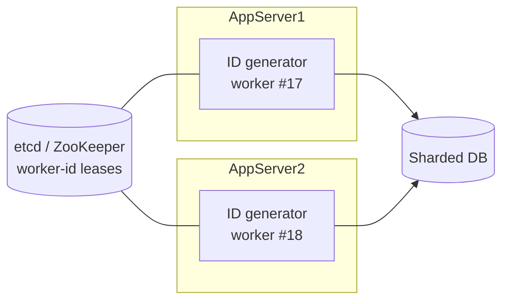

# 🆔 Generating Unique IDs — Interview Pattern (Snowflake and friends)

<!-- nav:start -->
🏷️ **Priority:** Medium · **Difficulty:** Intermediate

⬅️ Previous: [Coordinating Transactions Across Services](12-coordinating-transactions-across-services.md) · 🏠 [Interview Patterns](README.md) · ➡️ Next: [Answering Framework](../06-Interview-Tips/01-answering-framework.md)

> 📚 **Credit:** Chapter selection, ordering and question choice follow the [AlgoMaster.io System Design Interviews course](https://algomaster.io/learn/system-design-interviews/course-roadmap). This write-up was created with Claude for personal interview prep. The premium lesson text was **not** accessed or reproduced. See [CREDITS](../CREDITS.md).
<!-- nav:end -->


> `AUTO_INCREMENT` works until you have a second database. Then you need IDs that are unique across
> machines, roughly time-ordered for index locality, small enough to store cheaply, and generated
> without a network call per ID.

---

## 📑 On this page

1. [Clarifying Requirements](#1-clarifying-requirements) · 2. [Estimation](#2-back-of-the-envelope-estimation) ·
3. [Core APIs](#3-core-apis) · 4. [High-Level Design](#4-high-level-design) · 5. [Database Design](#5-database-design) ·
6. [Deep Dive](#6-design-deep-dive) · 7. [Follow-ups](#7-follow-ups-with-answers)

---

## 1. Clarifying Requirements

| Candidate asks | Interviewer answers | Design impact |
|---|---|---|
| Size of the ID? | Fits a 64-bit integer. | Rules out UUID (128-bit). |
| Sortable by time? | Roughly, yes. | Timestamp in the high bits. |
| Rate? | 10k IDs/s per node, 100k+ overall. | Local generation. |
| Strictly ordered globally? | No, k-sortable is enough. | Avoid a global sequencer. |
| Many datacenters? | Yes. | Worker IDs must not collide. |
| Can IDs be guessable? | Internal use, so yes. | Don't need to scramble. |

**Functional:** unique, 64-bit, time-sortable IDs. **Non-functional:** no single point of failure,
< 1 ms generation, survives restarts and clock hiccups, ~69+ years of headroom.

---

## 2. Back-of-the-Envelope Estimation

| Quantity | Working | Result |
|---|---|---|
| Peak demand | given | ~100k IDs/s cluster-wide |
| Per-worker capacity (12-bit sequence per ms) | 4096 × 1000 | **4.096M IDs/s per worker** |
| Workers needed | 100k ÷ 4M | **1** in theory; run dozens for redundancy |
| Timestamp span (41 bits, ms) | 2^41 ms ≈ 2.2 × 10^12 ms | **~69.7 years** |
| Worker IDs (10 bits) | 2^10 | **1024 workers** |

---

## 3. Core APIs

```text
Library call:      long id = idGen.nextId();                 // local, no network
Service (option):  GET /v1/ids?count=100 -> { "ids": [ ... ] }  // batch fetch
Decode (debug):    parse(id) -> { timestamp_ms, worker_id, sequence }
```

---

## 4. High-Level Design



Each app server embeds a generator. At startup it **leases a unique worker ID** from a coordination
service. After that it generates IDs purely locally, so there is no per-ID network call and no
bottleneck.

**Bit layout (64 bits)**

```text
| 1 sign (0) | 41 timestamp ms since custom epoch | 10 worker id | 12 sequence |
```

---

## 5. Database Design

The generator itself is stateless apart from `last_timestamp` and `sequence` in memory. Persistent
state exists only in the coordination service:

```text
/workers/{worker_id}  -> { host, lease_expiry }     (ephemeral node / lease with TTL)
```

IDs are used as primary keys: time-prefixed IDs append near the right edge of a B-tree (good
locality) and embed creation time, so range queries by time need no extra column.

---

## 6. Design Deep Dive

### 6.1 Options compared

| Option | Size | Sortable | Coordination | Weakness |
|---|---|---|---|---|
| UUID v4 | 128 bit | No | None | Random inserts fragment indexes; big |
| UUID v7 / ULID | 128 bit | Yes | None | Still 128-bit |
| DB auto-increment | 64 | Yes | Central DB | Bottleneck, SPOF, hard to shard |
| Multi-master auto-inc (step N) | 64 | Partly | Config | Painful to add nodes |
| Ticket server (Flickr) | 64 | Yes | Central | SPOF unless paired/batched |
| **Snowflake-style** | 64 | Yes | Startup only | Depends on clocks |

### 6.2 Generation algorithm

```java
synchronized long nextId() {
    long now = currentMillis();
    if (now < lastTs) throw/wait();              // clock moved backwards
    if (now == lastTs) {
        seq = (seq + 1) & 0xFFF;
        if (seq == 0) now = waitNextMillis(lastTs);   // sequence exhausted this ms
    } else seq = 0;
    lastTs = now;
    return ((now - EPOCH) << 22) | (workerId << 12) | seq;
}
```

### 6.3 Worker ID assignment

Lease from etcd/ZooKeeper (ephemeral node, TTL). If a process dies its lease expires and the ID can
be reused **only after the old lease has definitely expired plus a safety margin ≥ the longest
timestamp the dead process could have issued** (otherwise the new process may reuse the same
timestamp+worker). Alternative: derive worker ID from IP + port hash with a collision check.

---

## 7. Follow-ups (with answers)

### 7.1 What if the system clock goes backwards (NTP step)?
Never emit IDs with a timestamp lower than `lastTs`. Options: block until the clock catches up if
the drift is small (few ms), keep using `lastTs` and continue incrementing sequence, or refuse and
alert for large drifts. Use monotonic time deltas from a base, and run NTP in *slew* mode.

### 7.2 What if a worker restarts within the same millisecond it died?
Persist `lastTs` periodically (or refuse to serve for a short warm-up ≥ clock error), so the new
process cannot reuse a `(ts, worker, seq)` combination.

### 7.3 Do I need strict global ordering?
Snowflake IDs are ordered per worker and only approximately across workers (clock skew of a few ms).
If strict order is required (ledger sequence), use a single sequencer per partition or a consensus
log; this caps throughput and adds latency.

### 7.4 How do I generate 100k IDs per millisecond from one node?
Widen the sequence bits (steal from worker bits), or run several logical workers per host, each with
its own worker ID.

### 7.5 IDs leak creation time and volume. Is that a problem?
Yes for public exposure (enumeration, business intelligence). Expose an opaque public ID (encrypted
or random) mapped to the internal one, or apply a reversible scramble.

### 7.6 How can IDs help sharding?
Route by `id % shards` for even spread, or embed a shard number in the ID for O(1) routing without
a lookup (Instagram-style: time + shard + sequence).

---

## 🧪 Practice Round

<details><summary>1. Why not UUIDs for primary keys?</summary>
128 bits double index size, random values cause page splits and cache misses; UUIDv7 fixes ordering
but not size.
</details>

<details><summary>2. Two servers got the same worker ID. What happens?</summary>
Both can emit identical IDs within the same millisecond and sequence, causing collisions. Prevent with
lease-based assignment and fencing.
</details>

---

## 📝 Last-Minute Revision

- Snowflake: **41 bits time | 10 worker | 12 seq**, ~4M IDs/s/worker, ~69 years.
- Uniqueness = unique worker ID + monotonic time + sequence. Guard clocks and worker leases.
- k-sortable, not strictly ordered. Opaque public IDs if enumeration matters.
- Concepts: [sharding](../03-Concept-Deep-Dives/05-Distributed-Systems/02-sharding-partitioning.md) ·
  [consensus/time](../03-Concept-Deep-Dives/05-Distributed-Systems/03-consistency-and-cap.md) ·
  [coordination services](../04-Technology-Deep-Dives/12-zookeeper.md)

---

## 📚 References & Credits

| Resource | Use |
|---|---|
| [Twitter Snowflake announcement (archived)](https://blog.twitter.com/engineering/en_us/a/2010/announcing-snowflake) | Public description of the 64-bit layout |
| [RFC 9562 — UUIDs (v7)](https://www.rfc-editor.org/rfc/rfc9562) | Time-ordered UUID comparison |

Original work; personal learning project, not affiliated with AlgoMaster.io.
