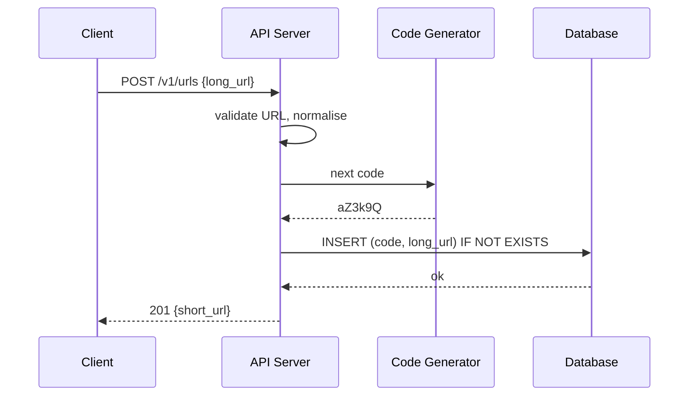
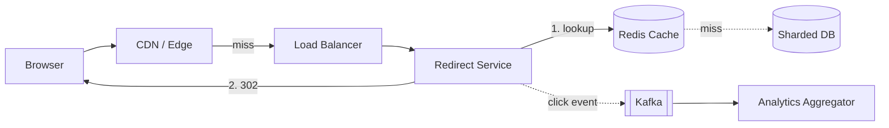
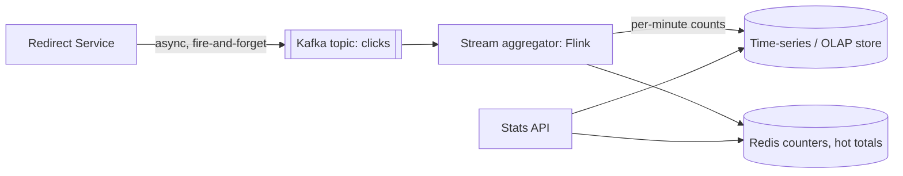

# 🔗 Design a URL Shortener — High Level Design


> A shortener looks like "one table and two endpoints", until someone asks: *how do two servers
> never issue the same code? how does a redirect stay under 10 ms? what if the database is down?
> can a link expire? how do you count clicks without slowing the redirect?* This write-up answers
> each of those in the order you would present them in an interview.

> 📚 **Credit:** Problem and section flow inspired by the public table of contents of
> AlgoMaster's *Design URL Shortener* lesson (premium body **not** accessed). All text, numbers and
> diagrams below are original. See [References & Credits](#-references--credits).

⬅️ Previous: *(start)* · 🏠 [Basics](../README.md) · ➡️ Next: [Rate Limiter](../RateLimiter/README.md)

---

## 📑 On this page

1. [Clarifying Requirements](#1-clarifying-requirements)
2. [Back-of-the-Envelope Estimation](#2-back-of-the-envelope-estimation)
3. [Core APIs](#3-core-apis)
4. [High-Level Design](#4-high-level-design)
   - [4.1 Requirement 1: Creating short links](#41-requirement-1-creating-short-links)
   - [4.2 Requirement 2: Redirecting](#42-requirement-2-redirecting)
5. [Database Design](#5-database-design)
6. [Design Deep Dive](#6-design-deep-dive)
   - [6.1 Generating unique codes](#61-generating-unique-codes)
   - [6.2 Making redirects fast](#62-making-redirects-fast)
   - [6.3 Custom aliases](#63-custom-aliases)
   - [6.4 High availability](#64-high-availability)
7. [Follow-ups (with answers)](#7-follow-ups-with-answers)
8. [Practice Round](#-practice-round)
9. [Last-Minute Revision](#-last-minute-revision)
- [References & Credits](#-references--credits)

---

## 1. Clarifying Requirements

### 🗣️ Sample conversation

| Candidate asks | Interviewer answers | Design impact |
|---|---|---|
| Can users pick their own alias? | Yes, optional. | Uniqueness check on user-supplied codes. |
| Do links expire? | Optional expiry; default never. | `expires_at` column, cleanup job. |
| How long should codes be? | As short as practical. | Base62, ~7 chars, sized by volume. |
| Expected volume? | 100M new links/month, reads ≫ writes. | Read-optimised: cache + replicas. |
| Need click analytics? | Basic counts, not real time. | Async event pipeline, off the hot path. |
| Can a link be edited or deleted? | Deleted yes, edited no. | Cache invalidation on delete. |
| Availability vs consistency? | Redirects must almost never fail. | AP-leaning reads, cache in front. |

### ✅ Functional requirements

1. Given a long URL, return a short URL (optionally with a custom alias and expiry).
2. Opening the short URL redirects to the long URL.
3. Owners can delete their links.
4. (Follow-up) Links can expire; owners can see click counts.

### ⚙️ Non-functional requirements

- **Low latency redirects** (p99 < 50 ms from the origin, faster with cache/CDN).
- **High availability**: a broken link is a broken promise.
- **Unpredictable, collision-free codes** (no guessable sequences, never issue duplicates).
- **Scale**: billions of links over the years, ~100:1 read to write.

Out of scope: user accounts UI, malware scanning (mention as a risk).

---

## 2. Back-of-the-Envelope Estimation

| Quantity | Working | Result |
|---|---|---|
| New links / s | 100M ÷ (30 × 86,400) ≈ 100M ÷ 2.6M | **~40 writes/s** |
| Redirects / s (100:1) | 40 × 100 | **~4,000 reads/s** avg, **~20,000/s** peak (5x) |
| Total links in 5 years | 100M × 12 × 5 | **6 billion** |
| Row size | code 7B + URL ~200B + metadata ~50B | **~300 B** (call it 500 B with overhead) |
| Storage in 5 years | 6B × 500 B | **~3 TB** |
| Code space needed | 62^7 | **3.5 trillion** ≫ 6 billion, so 7 chars is plenty |
| Cache size | 20% of daily reads (hot set): 4,000 × 86,400 × 0.2 × 500 B | **~35 GB** — fits in a few Redis nodes |

**Conclusion to say aloud:** tiny write rate, moderate read rate, small total data. This is a
*latency and availability* problem, not a throughput one. A sharded key-value store plus a cache is
enough.

---

## 3. Core APIs

```http
POST /v1/urls
Authorization: Bearer <token>
{ "long_url": "https://example.com/a/very/long/path?x=1",
  "custom_alias": "my-link",          // optional
  "expires_at": "2027-01-01T00:00:00Z" } // optional
→ 201 Created  { "short_url": "https://sho.rt/aZ3k9Q", "code": "aZ3k9Q" }
→ 409 Conflict (alias taken)   → 400 (invalid URL / alias)

GET /{code}
→ 302 Found     Location: https://example.com/a/very/long/path?x=1
→ 404 Not Found (unknown)      → 410 Gone (expired or deleted)

DELETE /v1/urls/{code}         → 204 No Content
GET    /v1/urls/{code}/stats   → 200 { "clicks": 1234, "by_day": [...] }   (follow-up)
```

**301 vs 302:** 301 lets browsers cache the redirect forever (fewer hits, but you lose click counts
and cannot change or expire the link). Use **302** (or 307) when analytics or expiry matter.

---

## 4. High-Level Design

### 4.1 Requirement 1: Creating short links

**Components needed**

| Component | Job |
|---|---|
| API server (stateless) | Validate URL, call generator, store mapping |
| Code generator | Produce a unique 7-char code (see 6.1) |
| Database | Persist `code → long_url` |
| Cache | Warm the entry right after creation (optional) |



### 4.2 Requirement 2: Redirecting



Flow: check cache → on miss read the DB and fill the cache → return `302`. Redirect servers are
stateless and horizontally scalable. The click event is fired asynchronously so it never delays the
response.

---

## 5. Database Design

### 5.1 SQL vs NoSQL

| Factor | Relational (Postgres/MySQL) | Key-value / wide-column (DynamoDB, Cassandra) |
|---|---|---|
| Access pattern | Single-key lookup, no joins | Single-key lookup, ideal fit |
| Scale (3 TB, 20k reads/s) | Needs sharding + replicas | Native horizontal partitioning |
| Transactions | Rich, mostly unused here | Single-item conditional writes suffice |
| Uniqueness | `UNIQUE` constraint | Conditional put (`IF NOT EXISTS`) |

**Choice:** a key-value store partitioned by `code`. A sharded SQL database is equally defensible
for a smaller scale; say *why* you pick one (no joins, one hot access path, huge fan-out).

### 5.2 Database schema

```
urls
  code         VARCHAR(10)  PRIMARY KEY      -- partition key
  long_url     TEXT         NOT NULL
  owner_id     BIGINT                        -- nullable for anonymous links
  created_at   TIMESTAMP    NOT NULL
  expires_at   TIMESTAMP                     -- nullable
  is_deleted   BOOLEAN      DEFAULT FALSE

user_links (secondary access: "my links")
  owner_id     BIGINT       PARTITION KEY
  created_at   TIMESTAMP    CLUSTERING KEY DESC
  code         VARCHAR(10)
```

Partition by `hash(code)`: codes are random, so load spreads evenly.

---

## 6. Design Deep Dive

### 6.1 Generating unique codes

| Approach | Collisions | Guessable | Coordination | Verdict |
|---|---|---|---|---|
| Hash long URL (MD5/SHA) → first 7 chars | Possible; must check + retry | No | None | OK, but retries at scale and same URL by two users share one code |
| Random 7 chars, insert-if-absent | Rare; retry on conflict | No | DB conditional write | Simple and good |
| Global counter → base62 | Never | **Yes** (sequential) | Central counter bottleneck | Needs scrambling |
| **Pre-allocated ranges + base62 + bijective shuffle** | Never | No | Once per million IDs | **Recommended** |
| Snowflake ID → base62 | Never | Slightly | None | Longer code (~11 chars) |

**Recommended design (ranges):**

1. A tiny *range service* (backed by etcd/ZooKeeper or a DB row with `UPDATE ... RETURNING`) hands
   each app server a block of, say, 1,000,000 numbers.
2. The app server consumes its block locally with an atomic counter: no network call per link.
3. Each number goes through a reversible scramble (multiply by a large odd constant modulo 62^7, or
   a Feistel network), then base62 encodes it → non-sequential 7-char code.
4. Server crash: the unused remainder of its block is lost. That is harmless (3.5 trillion space).

```text
n = next_number_in_block()            # e.g. 48_291_003
s = (n * 0x9E3779B1) mod 62^7         # bijection, since the multiplier is coprime with 62^7
code = base62(s).pad(7)
```

Whichever method you choose, the **database write must still be conditional** (`IF NOT EXISTS`) as
a safety net.

### 6.2 Making redirects fast

1. **Cache-aside in Redis**: key = code, value = long URL (+ expiry). Hot set ≈ 35 GB. LRU + TTL.
2. **Negative caching**: cache "not found" for ~60 s so scanners guessing codes do not hammer the DB.
3. **CDN**: for viral links, edge caches the 302 for a short TTL. Trade-off: fewer hits reach you
   (click counts must come from edge logs) and deletes take a TTL to take effect.
4. **Local in-process cache** (tiny, 1–5 s TTL) for the very hottest codes. Beats a Redis hop.
5. **Connection reuse and keep-alive**, colocated regions: reduce network round trips.
6. **Read replicas** behind the cache for cold misses.

Latency budget: edge hit ≈ 5–20 ms; Redis hit ≈ 1–2 ms + network; DB miss ≈ 5–10 ms.

### 6.3 Custom aliases

- Validate: charset `[A-Za-z0-9_-]`, length 4–30, reserved words blocked (`api`, `admin`, ...).
- Store with a **conditional insert**; on conflict return **409**. No check-then-insert (race).
- Keep custom aliases in the same table; auto-generated 7-char codes cannot clash if reserved-length
  rules differ (e.g. auto codes are exactly 7, custom aliases are 8+ or contain a dash).
- Rate limit alias creation to stop squatting; optionally restrict to signed-in users.

### 6.4 High availability

| Failure | Mitigation |
|---|---|
| App server dies | Stateless; LB health checks route around it |
| Cache node dies | Consistent hashing + replicas; fall through to DB with a rate limit |
| DB shard leader dies | 3 replicas per shard, automatic failover (consensus / managed service) |
| Whole AZ down | Deploy across ≥ 3 AZs |
| Region down | Multi-region reads (replicated data, geo DNS); writes to a home region or globally unique ranges per region |
| Range service down | Servers hold a block of a million numbers = hours of runway; alert when low |
| Thundering herd after cache loss | Single-flight per key, jittered TTLs, warm-up |

**Read path never depends on the write path.** Even if creation is degraded, redirects keep working.

---

## 7. Follow-ups (with answers)

### 7.1 How do I support link expiration?

- Store `expires_at`. On read, **lazily check**: if `now > expires_at`, return **410 Gone** and
  evict the cache entry.
- Cache TTL = `min(default_ttl, expires_at - now)` so the cache never outlives the link.
- A **background sweeper** scans by `expires_at` (secondary index or time-bucketed partition) and
  deletes or archives rows in batches. It is only for reclaiming space; correctness comes from the
  lazy check.
- **Do not reuse expired codes** for a long cool-down (weeks): old links in the wild should not
  suddenly point to someone else's content.
- With a KV store that has native TTL (DynamoDB TTL, Cassandra TTL) you get cleanup for free, but
  deletion is delayed, so keep the lazy check anyway.

### 7.2 How do I count clicks (analytics) without slowing redirects?



- The redirect handler publishes `{code, ts, ip_hash, user_agent, referrer}` to Kafka and returns.
  If Kafka is slow or down, **drop or buffer locally**: analytics must never fail a redirect.
- A stream job aggregates per `(code, minute)`, writes rollups to a column store (ClickHouse /
  Druid / BigQuery). Total clicks = sum of rollups; uniques via HyperLogLog.
- **Never `UPDATE clicks = clicks + 1` on the main row**: it turns each redirect into a write and
  creates a hot row for viral links.
- Accuracy: at-least-once delivery may double count a few events; acceptable for marketing stats.
  Dedupe by event ID if exactness matters.

### 7.3 What if two users shorten the same long URL?

Default: generate a new code each time (independent ownership, stats, expiry, deletion). Dedupe
only if a product requirement says one URL ⇒ one code, keyed by `hash(long_url, owner)`.

### 7.4 How do you prevent abuse (spam, phishing, enumeration)?

Rate limits per user/IP, URL reputation checks (safe-browsing lists) at creation and periodically
after, blocklist of domains, CAPTCHA for anonymous creation, non-sequential codes (this is why we
scramble), interstitial warning page for flagged links, and fast takedown (delete + cache purge).

### 7.5 How do I go multi-region?

Read-mostly data replicates asynchronously to each region; users are routed by geo DNS to the
nearest region. Writes go to the user's home region (or each region owns a disjoint number range so
codes never collide). A new link may take seconds to appear in other regions: fall back to the home
region on a 404 for a code younger than a few seconds.

---

## 🧪 Practice Round

<details><summary>1. Your cache hit ratio drops from 95% to 60% overnight. What do you check?</summary>

Recent deploy changing keys or TTLs, a cache node restart or resharding, traffic shift to long-tail
(campaign, crawler, scanner enumerating codes → add negative caching and rate limits), eviction
pressure from memory shrink or bigger values, and clock/TTL bugs.
</details>

<details><summary>2. Why not use auto-increment IDs and base62-encode them?</summary>

Codes are guessable (competitors enumerate your links), it exposes volume, and one DB sequence is a
bottleneck and single point of failure. Ranges + scrambling fix all three.
</details>

<details><summary>3. A link goes viral: 200k req/s on one code. What breaks and how do you fix it?</summary>

One cache shard and one DB partition get hot. Serve from CDN and a tiny in-process cache, replicate
the hot key across cache nodes (`code#1..N`), and coalesce misses with single-flight.
</details>

---

## 📝 Last-Minute Revision

- Tiny writes (~40/s), moderate reads (~4k/s), ~3 TB in 5 years ⇒ **latency + availability** problem.
- 7-char base62 = 3.5 trillion codes. Use **ranges + bijective scramble**; conditional insert as a safety net.
- Redirect path: **CDN → local cache → Redis → DB**; negative caching; **302** if you need analytics.
- Analytics via **Kafka → stream aggregation**, never a synchronous counter update.
- Expiry: lazy check on read + sweeper; **410 Gone**; don't recycle codes quickly.
- Concepts used: [caching](../../../02-core-concepts/03-caching.md) ·
  [sharding](../../../02-core-concepts/06-sharding-partitioning.md) ·
  [consistent hashing](../../../02-core-concepts/08-consistent-hashing.md) ·
  [replication](../../../02-core-concepts/05-replication.md) ·
  [ID generation](../UniqueIdGenerator/README.md)

---

## 📚 References & Credits

| Resource | How it was used |
|---|---|
| [AlgoMaster.io — Design URL Shortener](https://algomaster.io/learn/system-design-interviews/design-url-shortener) | Inspiration for the **section flow** only (public table of contents). Premium content **not** accessed or reproduced. |
| [RFC 9110 — HTTP Semantics (301/302/307/410)](https://www.rfc-editor.org/rfc/rfc9110) | Public reference for status codes. |
| [Amazon Dynamo paper](https://www.allthingsdistributed.com/2007/10/amazons_dynamo.html) | Public background on key-value partitioning. |
| [Mermaid](https://mermaid.js.org/) | Diagrams rendered by GitHub. |

**Originality statement:** all text, estimates, tables and diagrams were written independently from
publicly known concepts. This repository is a personal learning project, not affiliated with or
endorsed by AlgoMaster.io. Please support the original authors at [algomaster.io](https://algomaster.io).
