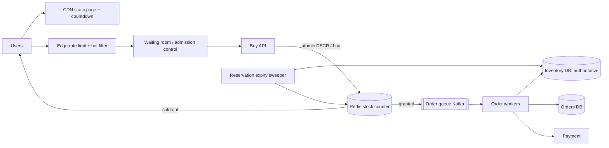

# ⚡ Design a Flash Sale / Inventory System — High Level Design


> 2 million people, 10,000 units, one product, one second. Ninety-nine percent of requests are
> doomed, so the design is a **funnel** that rejects them as early and as cheaply as possible.
> (Object model: LLD repo's *Inventory Management*.)

> 📚 **Credit:** Problem inspired by public course tables of contents (premium bodies **not**
> accessed). Original content. See [References](#-references--credits).

⬅️ Previous: [Ticket Booking](../TicketBooking/README.md) · 🏠 [Commerce and Payments](../README.md) · ➡️ Next: [Payment System](../PaymentSystem/README.md)

---

## 📑 On this page

1. [Clarifying Requirements](#1-clarifying-requirements) · 2. [Estimation](#2-back-of-the-envelope-estimation) ·
3. [Core APIs](#3-core-apis) · 4. [High-Level Design](#4-high-level-design) · 5. [Database Design](#5-database-design) ·
6. [Deep Dive](#6-design-deep-dive) · 7. [Follow-ups](#7-follow-ups-with-answers)

---

## 1. Clarifying Requirements

| Candidate asks | Interviewer answers | Design impact |
|---|---|---|
| Stock size? | 10k units of a hot item. | Small hot counter. |
| Traffic? | 2M users within a minute. | Massive over-demand. |
| Limit per user? | 1 unit. | Unique `(user, product)`. |
| Oversell tolerance? | **Zero**. | DB is the authority. |
| Payment window? | 10 minutes. | Reservations. |
| Fairness? | First come, first served-ish. | Queue/admission. |
| Rest of the site? | Must stay up. | Isolation. |

**Functional:** product page, buy, reserve stock, pay, release on failure, restock on cancel.
**Non-functional:** **never oversell**, absorb 100× spike, low-latency rejection, eventual
consistency for displays.

---

## 2. Back-of-the-Envelope Estimation

| Quantity | Working | Result |
|---|---|---|
| Peak buy requests | 2M users × ~3 tries in 60 s | **~100k req/s** |
| Requests that can succeed | stock | **10k** (≈ 0.5%) |
| Order writes | 10k | trivial |
| Hot key ops | 100k DECR/s on one counter | fine for one Redis shard (~100k ops/s), risky ⇒ bucket it |
| Static page views | CDN | offload nearly 100% |

---

## 3. Core APIs

```http
GET  /v1/products/{id}                 → static details via CDN; stock shown approximately
POST /v1/flash/{sale_id}/enter         → { queue_token, position }   (waiting room)
POST /v1/flash/{sale_id}/buy           { queue_token } Idempotency-Key: ...
                                       → 202 { order_id } | 409 SOLD_OUT | 429
GET  /v1/orders/{id}                   → PENDING_PAYMENT | CONFIRMED | FAILED
POST /v1/orders/{id}/pay               { payment_token }
```

`202` because the order is finalised asynchronously.

---

## 4. High-Level Design



### 4.1 Requirement 1: Get a unit
1. Static page from CDN; countdown so users don't hammer refresh.
2. Edge rate limit and bot checks; waiting room admits a controlled rate.
3. Redis Lua: `if stock > 0 and user not bought then stock-1, mark user; return granted`.
4. Granted requests are enqueued; the DB performs the authoritative conditional decrement and
   creates the order.

### 4.2 Requirement 2: Pay or release
Reservation expires in 10 minutes. Payment success ⇒ `CONFIRMED`. Failure/timeout ⇒ release stock in
DB and increment the Redis counter; the next buyers can succeed.

---

## 5. Database Design

```text
inventory(product_id PK, total, available, version)                    -- authoritative
   UPDATE inventory SET available = available - 1 WHERE product_id=? AND available > 0
reservations(reservation_id PK, product_id, user_id, status, expires_at,
             UNIQUE(product_id, user_id))                              -- one per user
orders(order_id PK, user_id, product_id, status, payment_ref, idempotency_key UNIQUE)
Redis:  stock:{sale} = int      bought:{sale} = SET of user_ids  (or per-user key with TTL)
```

---

## 6. Design Deep Dive

### 6.1 Stock decrement options

| Approach | Throughput | Correct? | Notes |
|---|---|---|---|
| Single DB row `UPDATE ... available>0` | ~1–3k/s per row (lock contention) | Yes | Fine as the *final* step for 10k units |
| **Redis atomic decrement as gate** | 100k+/s | Yes (if DB reconciles) | Rejects losers cheaply |
| Bucketed stock (`stock#0..n`) | n × single | Yes | Spread hot key; handle uneven drain |
| Serialise per product in a queue | bounded | Yes | Simple, ordered |

**Recommended:** Redis gate → queue → DB conditional decrement. The DB is the truth; if a DB write
fails, return the unit to Redis.

### 6.2 Correctness across two systems
- Redis and DB can disagree after failover (lost decrement). Because the **DB check is
  authoritative**, oversell is impossible; at worst a few users are told "sold out" that Redis
  believed had stock (or vice versa, then rejected at the DB).
- Periodic reconciliation: `redis_stock = db_available - active_reservations`.
- Idempotency key per attempt and the `(product,user)` unique constraint stop double purchase.

### 6.3 Staying up
Isolated infrastructure for the sale (own cluster/DB), CDN for everything static, minimal API path
(no joins, no recommendations), timeouts and bulkheads, async order creation, quick "sold out"
responses, client-side backoff with jitter.

### 6.4 Fairness and abuse
Waiting room with randomised admission window, per-account/device/IP limits, CAPTCHA at entry,
signed tokens tied to sessions, delayed shipping-address validation, post-sale audit of suspicious
accounts.

---

## 7. Follow-ups (with answers)

### 7.1 What if Redis fails over and loses a few decrements?
More units may be granted at Redis than truly exist; the DB conditional decrement rejects extras,
which get "sold out" after a short "processing" delay. No oversell. Reduce impact with replicas +
`WAIT` for the counter or by reserving in DB first for premium items.

### 7.2 How do you handle carts holding inventory?
Do not reserve at add-to-cart for flash items (abusable). Reserve at checkout start with a short TTL,
release on expiry, and cap per-user reservations.

### 7.3 Multiple warehouses?
Inventory rows per `(product, warehouse)`; allocation service picks by proximity and stock;
reservation targets a specific warehouse; rebalance asynchronously.

### 7.4 How do you communicate results to 2M users fast?
Pre-render the "sold out" state to the CDN as soon as stock hits zero (flag flips at the edge),
respond to clients with instant 409, and push order status via polling with backoff or SSE.

### 7.5 How do you protect the payment provider from the spike?
Only ~10k orders reach payment (the funnel); throttle payment calls, queue overflow, and retry
idempotently.

### 7.6 Why not just use a pessimistic DB lock on the product row?
100k concurrent lock waiters exhaust connections and create long queues; the Redis gate ensures only
a small stream of viable requests reaches the DB.

---

## 🧪 Practice Round

<details><summary>1. Why is oversell impossible even though Redis can be wrong?</summary>
The final decrement is a conditional update in the DB (`available > 0`); Redis is only an
optimisation filter.
</details>

<details><summary>2. Why return 202 for buy?</summary>
The order is completed asynchronously through the queue; holding 100k connections open is wasteful.
</details>

---

## 📝 Last-Minute Revision

- Funnel: **CDN → rate limit/bot → waiting room → Redis Lua gate → queue → DB conditional update**.
- DB is authoritative; Redis is a fast filter; reconcile.
- Reservation with expiry, unique `(product, user)`, idempotency keys, sale infra isolated.
- Concepts: [caching / hot keys](../../../04-patterns/04-fanout-and-hot-keys.md) ·
  [Redis](../../../03-technologies/01-redis.md) ·
  [rate limiting](../../../02-core-concepts/10-rate-limiting.md) ·
  [resilience](../../../02-core-concepts/11-resilience-and-failure-handling.md)

---

## 📚 References & Credits

| Resource | Use |
|---|---|
| Redis docs — atomic operations and Lua scripting | Public reference |

Original work; personal learning project, not affiliated with AlgoMaster.io.
