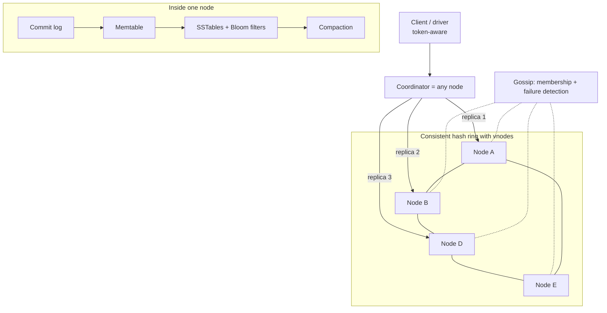

# 🗄️ Design a Distributed Key-Value Store — High Level Design


> This is the "build Dynamo/Cassandra" question. It tests whether you understand *why* each
> mechanism exists: consistent hashing for placement, quorums for tunable consistency, hinted
> handoff for availability, Merkle trees for repair, LSM trees for write speed.

> 📚 **Credit:** Problem inspired by public course tables of contents (premium bodies **not**
> accessed). Original content, based on the public Dynamo paper. See [References](#-references--credits).

⬅️ Previous: [Distributed Cache](../DistributedCache/README.md) · 🏠 [Distributed Infrastructure](../README.md) · ➡️ Next: [Job Scheduler](../JobScheduler/README.md)

---

## 📑 On this page

1. [Clarifying Requirements](#1-clarifying-requirements) · 2. [Estimation](#2-back-of-the-envelope-estimation) ·
3. [Core APIs](#3-core-apis) · 4. [High-Level Design](#4-high-level-design) · 5. [Database Design](#5-database-design) ·
6. [Deep Dive](#6-design-deep-dive) · 7. [Follow-ups](#7-follow-ups-with-answers)

---

## 1. Clarifying Requirements

| Candidate asks | Interviewer answers | Design impact |
|---|---|---|
| Consistency vs availability? | Always writable; tunable consistency. | AP with quorums. |
| Value size? | Up to ~1 MB. | Store blobs elsewhere beyond that. |
| Query model? | Key lookups; range scans nice-to-have. | Hash partitioning; ordered clustering. |
| Durability? | No acknowledged write lost with one node down. | Replication factor 3. |
| Multi-datacenter? | Yes. | Rack/DC-aware placement. |
| Scale? | 100 TB, 500k ops/s. | Hundreds of nodes. |
| Transactions? | Single-key only. | No 2PC. |

**Functional:** `put`, `get`, `delete`, optional TTL and conditional writes.
**Non-functional:** high availability, horizontal scalability, low latency, tunable consistency,
automatic failure recovery.

---

## 2. Back-of-the-Envelope Estimation

| Quantity | Working | Result |
|---|---|---|
| Logical data | given | 100 TB |
| With RF=3 | ×3 | **300 TB physical** |
| Node size | 4 TB usable NVMe (≤ 50% full for compaction headroom ⇒ 2 TB) | **~150 nodes** |
| Ops/node | 500k × 3 (RF) ÷ 150 | ~10k replica-ops/s |
| Recovery | 2 TB node rebuild at ~200 MB/s | ~3 hours ⇒ stream in parallel from many peers |

---

## 3. Core APIs

```text
put(key, value, consistency=QUORUM, ttl?, if_version?) → { version }
get(key, consistency=QUORUM)                            → { value, version } | siblings[]
delete(key, consistency)
scan(partition_key, start, end, limit)                  (within a partition)
Admin: add_node, decommission, repair, snapshot
```

---

## 4. High-Level Design



### 4.1 Requirement 1: Write
Coordinator hashes the key, picks the N=3 replicas clockwise on the ring (skipping same-rack
vnodes), sends the write to all, and acknowledges after **W** replies. Down replicas get **hinted
handoff** entries stored by the coordinator.

### 4.2 Requirement 2: Read
Coordinator asks **R** replicas (one full read, others digests), reconciles versions (timestamp or
vector clock), returns the newest, and triggers **read repair** for stale replicas.

---

## 5. Database Design

Per-node LSM storage:

```text
commit log (sequential, fsync policy)  →  memtable (sorted, in memory)
   flush →  SSTable (immutable, sorted, with index + Bloom filter + checksum)
   compaction merges SSTables; drops overwritten data and expired tombstones
row:  key | version (vector clock or timestamp) | value | ttl | tombstone flag
```

Metadata: ring/token map and schema propagated via gossip; per-range Merkle trees for repair.

---

## 6. Design Deep Dive

### 6.1 Quorums and consistency levels
N=3. `W + R > N` ⇒ overlap: (W=2,R=2) balanced, (W=3,R=1) read-optimised, (W=1,R=3)
write-optimised, (W=1,R=1) fastest but stale reads possible. `LOCAL_QUORUM` avoids cross-DC latency;
`EACH_QUORUM`/`ALL` for rare stricter needs. Overlap alone does not give linearizability (concurrent
writes, sloppy quorums, clock issues).

### 6.2 Conflict handling
- **Last-write-wins** by timestamp: simple, can lose concurrent updates with clock skew.
- **Vector clocks**: detect concurrent writes; return siblings to the application to merge (e.g.
  union of shopping carts).
- **CRDTs** for counters/sets: merge deterministically.

### 6.3 Failure handling
- **Failure detection**: gossip with phi-accrual detector (suspicion level, not a binary timeout).
- **Hinted handoff** + **sloppy quorum**: temporarily write to the next healthy node to stay
  available; replay hints on return.
- **Anti-entropy repair**: compare **Merkle trees** per token range between replicas and sync only
  differing subranges (run regularly).
- **Read repair**: opportunistic fix on reads.

### 6.4 Storage engine details
Writes: append to commit log ⇒ memtable ⇒ flush. Reads: memtable ⇒ SSTables newest-first, using
**Bloom filters** to skip files without the key; block index to seek. **Compaction** (size-tiered vs
leveled) trades write amplification against read amplification and space. Tombstones live for a grace
period so deletes propagate before purge.

### 6.5 Membership changes
New node picks vnodes, streams its ranges from existing replicas, then joins the ring; leaving nodes
stream out first. Throttle streaming/compaction so foreground latency stays healthy.

### 6.6 Multi-datacenter
Replication factor per DC, async cross-DC replication; clients use local DC coordinators;
rack/AZ-aware placement so replicas don't share a failure domain.

---

## 7. Follow-ups (with answers)

### 7.1 What anomaly can happen with N=3, R=1, W=1 during a partition?
Client A writes to replica 1; client B reads from replica 2 (stale) ⇒ stale read; two clients
writing different values to different replicas ⇒ divergent versions resolved later by LWW/vector
clocks. Fine for availability-first data, wrong for balances.

### 7.2 How would you add range scans?
Use a composite key: **partition key** hashed for placement + **clustering key** sorted inside the
partition ⇒ efficient scans within a partition. Global ordered scans would need range partitioning
(different trade-offs: hot spots, but scan-friendly).

### 7.3 How do you add a node with no downtime?
Bootstrap in "joining" state, stream data, gossip readiness, take ownership; existing replicas
continue serving until handoff finishes; cleanup old ranges afterwards.

### 7.4 How do deletes work and why can data "come back"?
A delete writes a **tombstone** that propagates like any write. If a replica was down longer than
the tombstone grace period and the tombstone is purged elsewhere, that replica re-introduces the old
value. Run repair within the grace period.

### 7.5 What if you need linearizable single-key operations (compare-and-set)?
Use a per-key consensus (Paxos/Raft "lightweight transactions") for those operations only: slower
(several round trips) but strongly consistent. Or choose a CP design (Raft-per-shard, as in etcd,
TiKV, Spanner) and accept reduced availability under partitions.

### 7.6 How do you handle large values or hot keys?
Cap value size; chunk large blobs into object storage and keep pointers; for hot keys add caching
in front, key splitting, or read from more replicas.

### 7.7 How do you make backups?
Snapshot immutable SSTables (hard links), ship to object storage; combine with commit-log archiving
for point-in-time recovery; test restores.

---

## 🧪 Practice Round

<details><summary>1. Why are SSTables immutable?</summary>
Sequential writes, lock-free reads, simple caching/backups; changes are handled by newer files and
compaction.
</details>

<details><summary>2. What does hinted handoff give you and what does it not?</summary>
Availability and faster convergence during short outages; it doesn't guarantee consistency for long
outages (hints expire) ⇒ still need anti-entropy repair.
</details>

---

## 📝 Last-Minute Revision

- **Ring + vnodes**, RF=3 across racks/DCs; `W+R>N`; coordinator = any node.
- Conflicts: LWW / vector clocks / CRDTs. Failure: gossip + hinted handoff + read repair + Merkle repair.
- Storage: commit log → memtable → SSTables + Bloom filters, compaction, tombstones.
- Concepts: [consistency & CAP](../../../02-core-concepts/07-consistency-and-cap.md) ·
  [replication](../../../02-core-concepts/05-replication.md) ·
  [NoSQL stores](../../../03-technologies/04-nosql-stores.md) ·
  [consistent hashing](../../../02-core-concepts/08-consistent-hashing.md)

---

## 📚 References & Credits

| Resource | Use |
|---|---|
| [Dynamo: Amazon's Highly Available Key-value Store (SOSP 2007)](https://www.allthingsdistributed.com/2007/10/amazons_dynamo.html) | Public paper: partitioning, quorums, hinted handoff |
| [Cassandra architecture docs](https://cassandra.apache.org/doc/latest/) | Public reference |

Original work; personal learning project, not affiliated with AlgoMaster.io.
