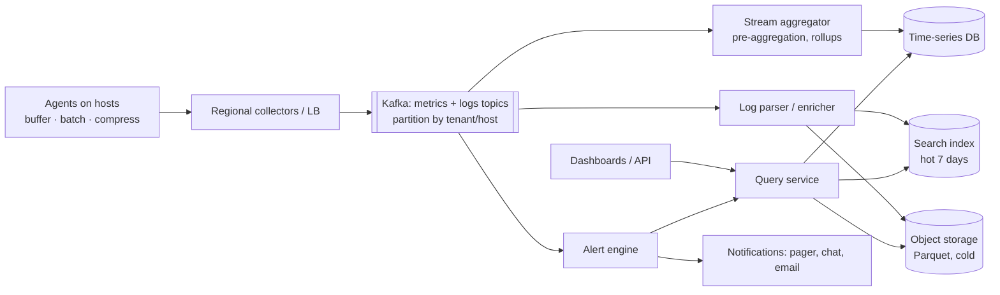

# 📊 Design a Metrics and Logging Pipeline — High Level Design


> Monitoring is the system that must keep working when everything else is broken, and it ingests
> more data than most products. The design fights three things: **volume, cardinality, and cost**.

> 📚 **Credit:** Problem inspired by public course tables of contents (premium bodies **not**
> accessed). Original content. See [References](#-references--credits).

⬅️ Previous: [Job Scheduler](../JobScheduler/README.md) · 🏠 [Distributed Infrastructure](../README.md) · ➡️ Next: *(end of series)* — back to the [HLD index](../../README.md)

---

## 📑 On this page

1. [Clarifying Requirements](#1-clarifying-requirements) · 2. [Estimation](#2-back-of-the-envelope-estimation) ·
3. [Core APIs](#3-core-apis) · 4. [High-Level Design](#4-high-level-design) · 5. [Database Design](#5-database-design) ·
6. [Deep Dive](#6-design-deep-dive) · 7. [Follow-ups](#7-follow-ups-with-answers)

---

## 1. Clarifying Requirements

| Candidate asks | Interviewer answers | Design impact |
|---|---|---|
| Data types? | Metrics and logs (traces later). | Two pipelines, shared ingest. |
| Sources? | 100k servers + services. | Agents + SDKs. |
| Latency to visibility? | Metrics < 30 s; logs < 1 min. | Streaming, not batch. |
| Queries? | Dashboards, ad-hoc search, aggregations. | TSDB + search/columnar. |
| Alerting? | Threshold and anomaly rules. | Rules engine. |
| Retention? | Metrics 13 months (downsampled), logs 30 days hot / 1 year cold. | Tiering. |
| Loss tolerance? | Metrics: little; logs: some sampling OK. | Priorities. |
| Multi-tenant? | Yes. | Quotas + isolation. |

**Functional:** ingest, store, query, dashboard, alert, retain.
**Non-functional:** very high write throughput, near-real-time, highly available (even during
incidents), cost efficient, bounded query impact.

---

## 2. Back-of-the-Envelope Estimation

| Quantity | Working | Result |
|---|---|---|
| Metric points | 100k hosts × 200 series ÷ 10 s | **2M points/s** |
| Metric storage raw | 2M × 16 B × 86,400 | **~2.8 TB/day**; TSDB compression ~10× ⇒ ~300 GB/day |
| Log volume | 100k hosts × 50 lines/s × 200 B | **1 GB/s ≈ 86 TB/day** |
| Log storage 30 d hot | 86 TB × 30 ÷ compression (~5×) | **~500 TB** ⇒ sample/filter/tier aggressively |
| Query load | 10k dashboards refreshing every 30 s | ~300 queries/s |

**Insight:** logs dominate cost; metrics dominate cardinality problems.

---

## 3. Core APIs

```http
POST /v1/metrics   (agent → collector, batched, compressed)
  [{ "name":"http.requests", "tags":{"svc":"cart","status":"200"}, "ts":..., "value":12 }, ...]
POST /v1/logs      [{ "ts":..., "host":..., "svc":..., "level":"ERROR", "message":"...", "fields":{...} }]

GET  /v1/query?expr=rate(http.requests{svc="cart"}[5m])&from=..&to=..&step=60
GET  /v1/logs/search?q=level:ERROR AND svc:cart&from=..&to=..&limit=100
PUT  /v1/alerts/{id}  { "expr": "p99(latency) > 500ms for 5m", "notify": ["pagerduty:team-x"] }
```

---

## 4. High-Level Design



### 4.1 Requirement 1: Ingest and store
Agents batch and compress locally, with disk buffering during outages. Collectors validate and write
to Kafka (absorbs bursts, decouples ingest from storage, replayable). Consumers write metrics to a
TSDB and logs to a search index plus cheap object storage.

### 4.2 Requirement 2: Query and alert
Query service fans out by time range and shard, merges results, enforces limits and caches
dashboard queries. Alert engine evaluates rules on a schedule (or on the stream), dedupes, groups and
routes notifications.

---

## 5. Database Design

```text
TSDB series identity: metric_name + sorted tag set  → series_id  (inverted index tag→series_ids)
TSDB blocks (per 2h): [series_id] → compressed timestamps (delta-of-delta) + values (XOR/Gorilla)
       WAL + in-memory head block → flushed immutable blocks → compacted → object storage
Rollups: 10s raw (15 d) → 1m (90 d) → 1h (13 mo)
Logs hot:  inverted index on message tokens + fields, time-partitioned indices (daily)
Logs cold: Parquet in object storage, partitioned by tenant/date, min/max + bloom metadata
Rules DB: alert rules, silences, routing, on-call schedules
```

---

## 6. Design Deep Dive

### 6.1 Push vs pull collection
**Pull** (Prometheus): central scraper discovers targets, knows health by scrape success, backpressure
is natural; needs network reach and doesn't suit short-lived jobs. **Push** (agents/SDK): works
through firewalls and for ephemeral jobs; needs client buffering and auth. Many systems use both.

### 6.2 Time-series storage
Recent data in memory with a WAL; flushed to immutable time-partitioned blocks; **Gorilla-style
compression** (delta-of-delta timestamps, XOR floats) yields ~1.4 bytes/point. Queries touch only the
blocks covering the time range; downsampling jobs create rollups for long ranges.

### 6.3 Cardinality control
Series count = product of tag values. Tags like `user_id` or `request_id` explode memory. Enforce
limits per tenant/metric, drop or hash offending labels, and provide cardinality dashboards
("top offenders"). Use logs/traces for high-cardinality data.

### 6.4 Logs: index cost vs query power
Full-text indexing every field is expensive. Tiering: recent 7 days in a search index; older logs in
object storage with lightweight indexes (labels/time) and scan-on-query (Loki/ClickHouse style).
Sample debug logs, drop noisy patterns, compress, set per-service retention.

### 6.5 Alerting
Evaluate every 15–60 s against recent data; use `for: 5m` windows to avoid flapping; group/dedupe
alerts; silence during maintenance; route by ownership; alert on **SLO burn rate**. The alert
pipeline needs an independent heartbeat ("dead man's switch") so pipeline failure isn't silent.

### 6.6 Multi-tenancy and protection
Per-tenant quotas (series, ingest rate, query cost), fair scheduling, query timeouts and result
limits, separate hot paths for critical tenants; shed low-priority data first under overload.

### 6.7 Percentiles across hosts
Averaging percentiles is wrong. Store **mergeable histograms/sketches** (t-digest, DDSketch,
fixed-bucket histograms) and aggregate those.

---

## 7. Follow-ups (with answers)

### 7.1 How do you keep alerts firing if the pipeline itself is lagging?
Monitor consumer lag and pipeline heartbeat with a small, independent, simpler system (or
out-of-band probes). Alert on **data absence** (`no data for N min`) and on ingest lag; run alert
evaluation close to the source for the most critical rules.

### 7.2 How would you add distributed tracing?
Propagate trace context (W3C `traceparent`) across services; spans are shipped to Kafka; store in a
trace store keyed by trace_id; sampling: **head-based** (cheap, may miss rare errors) vs
**tail-based** (keep all errors/slow traces, needs buffering to decide after the trace completes).

### 7.3 What if a customer suddenly sends 100× more data?
Per-tenant quotas throttle at collectors (429 with backoff); Kafka absorbs short bursts; overflow
policy: sample or drop lowest-priority data, never other tenants' data; alert the customer.

### 7.4 How do you reduce storage cost 50%?
Drop unused metrics/labels, lower resolution for old data, sample logs, stronger compression,
move older data to cold tiers, shorter retention for debug logs, dedupe repeated messages.

### 7.5 How do you make queries fast on huge ranges?
Precomputed rollups, block-level min/max/sum metadata, query result caching, sharding by time and
tenant, limiting series returned, and pushing aggregation down to storage nodes.

### 7.6 Exactly-once metrics?
Not required for most metrics; use idempotent writes keyed by `(series, timestamp)` so replays
overwrite the same point. Counters are cumulative so missed samples are recoverable via rate().

### 7.7 How do you secure it?
Agent auth (mTLS/API keys per tenant), encryption in transit/at rest, PII scrubbing at the agent,
RBAC on queries, audit access to logs, and retention/deletion for compliance.

---

## 🧪 Practice Round

<details><summary>1. Why put Kafka between agents and storage?</summary>
Absorbs bursts and downstream outages, decouples ingest from write speed, allows replay and multiple
independent consumers.
</details>

<details><summary>2. What is the danger of `user_id` as a metric tag?</summary>
Millions of unique series ⇒ memory blow-up and slow queries; use logs/traces for that dimension.
</details>

---

## 📝 Last-Minute Revision

- Metrics ≈ 2M pts/s (~300 GB/day compressed); logs ≈ 86 TB/day ⇒ **tier, sample, drop**.
- Agents → collectors → **Kafka** → TSDB / log index + object storage; query service; alert engine.
- Guard **cardinality**; rollups for retention; mergeable histograms for percentiles.
- Monitor the monitor: dead-man's switch, lag alerts.
- Concepts: [messaging](../../../02-core-concepts/09-messaging-and-streaming.md) ·
  [Kafka](../../../03-technologies/02-kafka.md) ·
  [Elasticsearch](../../../03-technologies/05-elasticsearch.md) ·
  [observability](../../../02-core-concepts/11-resilience-and-failure-handling.md)

---

## 📚 References & Credits

| Resource | Use |
|---|---|
| [Gorilla: A Fast, Scalable, In-Memory Time Series Database (VLDB 2015)](https://www.vldb.org/pvldb/vol8/p1816-teller.pdf) | Public paper on compression |
| [Prometheus docs](https://prometheus.io/docs/) | Public pull-model reference |
| [OpenTelemetry specification](https://opentelemetry.io/docs/specs/) | Public tracing/metrics standard |

Original work; personal learning project, not affiliated with AlgoMaster.io.
