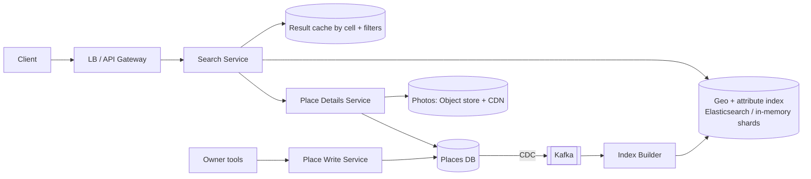

# 📍 Design a Nearby Places Service — High Level Design


> "Restaurants within 2 km" is a 2-D range query, which ordinary B-tree indexes handle poorly. The
> whole design is about turning a map into something an index can search.

> 📚 **Credit:** Problem inspired by public course tables of contents (premium bodies **not**
> accessed). Original content. See [References](#-references--credits).

⬅️ Previous: [Ride Hailing](../RideHailing/README.md) · 🏠 [Location-Based Services](../README.md) · ➡️ Next: [Typeahead](../../Search-and-Discovery/Typeahead/README.md)

---

## 📑 On this page

1. [Clarifying Requirements](#1-clarifying-requirements) · 2. [Estimation](#2-back-of-the-envelope-estimation) ·
3. [Core APIs](#3-core-apis) · 4. [High-Level Design](#4-high-level-design) · 5. [Database Design](#5-database-design) ·
6. [Deep Dive](#6-design-deep-dive) · 7. [Follow-ups](#7-follow-ups-with-answers)

---

## 1. Clarifying Requirements

| Candidate asks | Interviewer answers | Design impact |
|---|---|---|
| Static places or moving? | Static businesses. | Index can be read-optimised. |
| Filters? | Category, rating, open now, price. | Combine geo + attributes. |
| Radius? | Up to 50 km, default 5 km. | Multi-cell coverage. |
| Ranking? | Distance, rating, popularity. | Scoring step. |
| Updates? | Owners edit; changes visible in minutes. | CDC pipeline. |
| Scale? | 200M places, 100M DAU. | Sharding by region. |

**Functional:** search nearby with filters, place details, add/update/delete places.
**Non-functional:** p99 < 200 ms, read heavy (~1000:1), eventual consistency for edits.

---

## 2. Back-of-the-Envelope Estimation

| Quantity | Working | Result |
|---|---|---|
| Search QPS | 100M × 5 ÷ 86,400 | **~6k/s**, peak ~20k/s |
| Place data | 200M × 1 KB | **~200 GB** (fits in memory across a few nodes) |
| Index size | 200M × (id 8 B + cell 8 B + attrs ~50 B) | **~15 GB** |
| Photos | separate object store + CDN | not in the search path |
| Writes | 1M edits/day | ~12/s (negligible) |

---

## 3. Core APIs

```http
GET /v1/places/search?lat=12.97&lng=77.59&radius_m=2000&category=cafe&min_rating=4&open_now=true&limit=20&cursor=..
→ { items: [ {id, name, lat, lng, distance_m, rating, ...} ], next_cursor }

GET    /v1/places/{id}
POST   /v1/places        PUT /v1/places/{id}     DELETE /v1/places/{id}   (owners/admins)
```

---

## 4. High-Level Design



### 4.1 Requirement 1: Search nearby
1. Convert (lat, lng, radius) to covering **cells**.
2. Query the index for places in those cells matching filters.
3. Compute exact distance, rank, paginate, return; details hydrated from cache.

### 4.2 Requirement 2: Keep the index fresh
Writes go to the source-of-truth DB, then CDC streams changes to an index builder. The index is a
**derived, rebuildable view**.

---

## 5. Database Design

```text
places (source of truth, SQL/NoSQL)
  place_id PK, name, category, lat, lng, geo_cell(level 12), address, hours_json, rating_avg, rating_count, attrs

geo index document (Elasticsearch)
  { id, location: geo_point, category (keyword), rating, price_level, open_hours..., popularity }

cell_index (alternative KV): cell_id -> [place_id...]     (S2/H3/geohash)
```

---

## 6. Design Deep Dive

### 6.1 Geo indexing choices

| Option | How | Pros | Cons |
|---|---|---|---|
| **Geohash prefix** | Encode lat/lng as a string; nearby ⇒ shared prefix | Works in any sorted store | Edge effects: neighbours across boundaries differ |
| **Quadtree** | Split a cell into 4 until ≤ N places | Adapts to density | In-memory structure, rebalancing |
| **S2 / H3** | Hierarchical cells, cover a circle with cells | Uniform, well tested | Learning curve |
| **Elasticsearch `geo_distance`** | Built-in BKD tree | Geo + text + filters + scoring | More infrastructure |

**Pick:** Elasticsearch/OpenSearch (or PostGIS at smaller scale) for combined filters; cell → ids in
KV for ultra-fast simple lookups.

### 6.2 Radius query details
Choose cell size ≈ radius. Search the centre cell **plus its 8 neighbours** (avoids boundary misses),
then filter by haversine distance. If fewer than K results, expand ring by ring (dense city → few
rings; rural → many).

### 6.3 Density skew
Manhattan has 50k places per cell; a desert has none. Adaptive structures (quadtree splitting until
≤ N per node) or cap results per cell and rank before exceeding limits.

### 6.4 Sharding
Shard by **geographic region** (cell prefix), not by place_id, so a query touches one or a few
shards. Split very large cities; replicate hot shards for read scale.

### 6.5 Ranking and caching
Score = f(distance, rating, popularity, open-now, personalisation, sponsored). Cache results keyed
by `(cell, filters)` for short TTL; hot tourist areas benefit massively.

---

## 7. Follow-ups (with answers)

### 7.1 How would this change for moving objects (drivers)?
Positions change every few seconds, so a disk-based index and CDC are wrong. Use an in-memory grid
with TTL updated directly; see [Ride Hailing](../RideHailing/README.md).

### 7.2 How do you implement "open now"?
Store hours per weekday in local time plus time zone; compute openness at query time (filter) or
precompute `open_windows` for the next 24 h in the index and refresh hourly.

### 7.3 A place is deleted or moved. How does the index stay correct?
The change flows through CDC; index updates are idempotent by `place_id` + version. Until then,
details service returns 404/redirect and the result item is dropped at hydration time.

### 7.4 How do you handle a search near the international date line or poles?
Use a library (S2/H3) that handles spherical geometry; avoid naive lat/lng boxes.

### 7.5 How do you support text plus location ("pizza near me")?
Search engine query: text match on name/category boosted by BM25, filter by geo distance, combine
score with distance decay.

### 7.6 How do you keep p99 under 200 ms during peak?
Regional caches, precomputed popular areas, timeouts + partial results, replicas, and limiting
radius/filters cost.

---

## 🧪 Practice Round

<details><summary>1. Why check neighbouring cells?</summary>
A point just across a cell boundary can be closer than points inside your own cell, and geohash
prefixes do not share across those boundaries.
</details>

<details><summary>2. Why shard by region instead of hashing place_id?</summary>
Hash sharding scatters a radius query over every shard; region sharding keeps it local.
</details>

---

## 📝 Last-Minute Revision

- Read-heavy, ~200 GB total ⇒ few shards + replicas + cache.
- Cells (geohash/S2/H3) or ES geo index; **query centre + neighbours, then exact distance**.
- Shard by geography; CDC keeps a derived index fresh; ranking mixes distance/rating/popularity.
- Concepts: [search & geospatial](../../../02-core-concepts/15-search-and-geospatial.md) ·
  [Elasticsearch](../../../03-technologies/05-elasticsearch.md) ·
  [caching](../../../02-core-concepts/03-caching.md)

---

## 📚 References & Credits

| Resource | Use |
|---|---|
| [Geohash — Wikipedia](https://en.wikipedia.org/wiki/Geohash) | Public background |
| [Elasticsearch geo queries docs](https://www.elastic.co/guide/en/elasticsearch/reference/current/geo-queries.html) | Public reference |

Original work; personal learning project, not affiliated with AlgoMaster.io.
