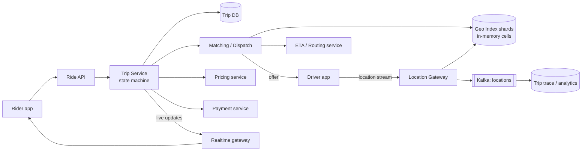

# 🚕 Design a Ride-Hailing Service — High Level Design


> Two very different data streams meet here: a firehose of **ephemeral driver locations** that can
> be lossy and in-memory, and a small number of **trips and payments** that must be correct and
> durable. Good answers keep them apart. (Object model: LLD repo's *Ride-Sharing*.)

> 📚 **Credit:** Problem inspired by public course tables of contents (premium bodies **not**
> accessed). Original content. See [References](#-references--credits).

⬅️ Previous: [File Storage and Sync](../../Media-and-Storage/FileStorageSync/README.md) · 🏠 [Location-Based Services](../README.md) · ➡️ Next: [Nearby Places](../NearbyPlaces/README.md)

---

## 📑 On this page

1. [Clarifying Requirements](#1-clarifying-requirements) · 2. [Estimation](#2-back-of-the-envelope-estimation) ·
3. [Core APIs](#3-core-apis) · 4. [High-Level Design](#4-high-level-design) · 5. [Database Design](#5-database-design) ·
6. [Deep Dive](#6-design-deep-dive) · 7. [Follow-ups](#7-follow-ups-with-answers)

---

## 1. Clarifying Requirements

| Candidate asks | Interviewer answers | Design impact |
|---|---|---|
| Rider flow? | Request pickup→drop, see fare, get matched, track. | Trip state machine. |
| Driver flow? | Go online, receive offers, accept/decline. | Offer protocol with timeouts. |
| Matching goal? | Minimise pickup time. | ETA-based ranking. |
| Pricing? | Upfront fare with surge. | Pricing service + demand aggregation. |
| Payments? | Card on file, charged at trip end. | Idempotent payment saga. |
| Scale? | 1M concurrent drivers, multiple cities. | Regional sharding. |
| Ride pooling? | Out of scope. | — |

**Functional:** location updates, request ride, find/offer/accept, live tracking, fare, payment.
**Non-functional:** match in seconds; one driver ↔ one active trip; tolerate lossy locations;
regional fault isolation.

---

## 2. Back-of-the-Envelope Estimation

| Quantity | Working | Result |
|---|---|---|
| Driver location writes | 1M drivers ÷ 4 s | **250k updates/s** |
| Location memory | 1M × 100 B latest position | **~100 MB** (trivial in RAM) |
| Location history | 250k/s × 50 B × 86,400 | **~1 TB/day** for analytics (cold store) |
| Ride requests | ~20M rides/day | **~230/s**, peak ~2k/s |
| Nearby queries | 1 per request + retries | ~5k/s |

**Insight:** the hot path is location ingest, and it needs no database at all: memory + TTL.

---

## 3. Core APIs

```http
# Driver (persistent connection)
WS  /driver/stream          → {type:"location", lat, lng, heading, ts}  every 4 s
                            ← {type:"offer", trip_id, pickup, est_fare, expires_in:12}
POST /v1/trips/{id}/accept  | /decline | /arrived | /start | /end

# Rider
POST /v1/rides              { pickup, dropoff, product } → 202 { trip_id }   (+ Idempotency-Key)
GET  /v1/rides/{trip_id}    → state, driver, eta, location (or subscribe via WebSocket)
POST /v1/rides/{id}/cancel
GET  /v1/fare-estimate?pickup=..&dropoff=..
```

---

## 4. High-Level Design



### 4.1 Requirement 1: Track drivers
Location gateway updates the **geo index**: the world is divided into cells (S2/H3/geohash prefix).
Each shard owns a set of cells and stores `driver_id → (lat, lng, status, ts)` in memory; moving
across a boundary updates two cells. Entries expire (TTL ~15 s) so vanished drivers disappear.

### 4.2 Requirement 2: Match a ride
```mermaid
sequenceDiagram
    participant R as Rider
    participant T as Trip Service
    participant M as Matcher
    participant G as Geo Index
    participant D as Driver
    R->>T: request ride
    T->>M: find driver for pickup
    M->>G: available drivers in cells around pickup
    M->>M: rank by ETA / rating / heading
    M->>D: offer (12s) — driver marked OFFERED atomically
    alt accepts
        D-->>T: accept → DRIVER_ASSIGNED
    else declines / timeout
        M->>D: release; try next candidate
    end
```

---

## 5. Database Design

| Data | Store | Why |
|---|---|---|
| Live driver positions | In-memory grid / Redis GEO with TTL | Extreme write rate, ephemeral |
| Trips | Sharded relational/KV (by city/region + trip_id) | Durable, transactional state changes |
| Location history | Kafka → object store/columnar | Analytics, disputes |
| Driver/rider profiles | SQL + cache | Standard |
| Payments/ledger | Relational, ACID | See payment system |

```text
trips(trip_id PK, rider_id, driver_id, status, pickup, dropoff, fare_est, fare_final,
      requested_at, accepted_at, started_at, ended_at, version)
trip_events(trip_id, seq, type, payload, ts)      -- append-only audit trail
```

---

## 6. Design Deep Dive

### 6.1 Geo index and nearby search
Pick a cell size ≈ typical search radius (e.g. H3 resolution ~1 km). Query = the pickup cell plus
neighbouring ring(s); expand rings until enough candidates. Filter by status/vehicle type; rank by
**road-network ETA** (routing service), not straight-line distance. Shard by cell ranges; dense
cities split cells finer or replicate hot shards.

### 6.2 Matching and offer locking
- Baseline: nearest available driver by ETA. Better: batch requests in a 2–5 s window and solve an
  assignment problem across nearby riders/drivers to minimise total wait.
- A driver must not receive two offers at once: atomic transition `AVAILABLE → OFFERED(trip, expiry)`
  (conditional write / Lua). Timeout returns the driver to `AVAILABLE`.
- Offers escalate: sequentially (simple) or top-N in parallel with first-accept wins (faster, more
  declines to manage).

### 6.3 Trip state machine
`REQUESTED → MATCHING → DRIVER_ASSIGNED → ARRIVED → IN_PROGRESS → COMPLETED` (or `CANCELLED`).
Transitions use optimistic `version` checks and append to `trip_events`. Events go to Kafka for
notifications, pricing and analytics.

### 6.4 Pricing and surge
Stream job counts open requests vs available drivers per cell every ~30 s → multiplier, smoothed
across neighbouring cells and time to avoid flapping. Fare shown upfront and locked for the request.

### 6.5 Live tracking
Rider subscribes to the trip channel; the realtime gateway pushes the assigned driver's location
(possibly downsampled to 1–2 s and map-matched).

### 6.6 Regional isolation
Deploy per city/region cluster (index, matcher, trip DB). Outage in one city does not affect others;
drivers/riders are pinned by location.

---

## 7. Follow-ups (with answers)

### 7.1 How do you handle a driver's app crashing mid-offer?
The offer has a server-side expiry. No accept ⇒ state returns to `AVAILABLE` and the matcher tries
the next driver. Stale positions vanish through the TTL.

### 7.2 How do you support ride pooling?
Treat a trip as a route with stops. When a new request arrives, evaluate inserting its pickup/drop
into existing routes of nearby in-progress trips (constraint: detour and delay limits per rider) and
pick the best insertion, otherwise dispatch a new car.

### 7.3 How do you reduce location traffic?
Adaptive frequency (fast during trips or in busy zones, slow when idle or stationary), send deltas,
batch and compress, use one persistent connection, and drop updates when accuracy is poor.

### 7.4 How do you compute ETAs?
Road graph with speed data per segment (live + historical); precompute with contraction hierarchies
for fast shortest paths; cache popular OD pairs; ML model corrects bias by time/weather.

### 7.5 What if the geo-index shard dies?
Drivers re-announce within seconds (updates every 4 s), rebuilding the shard from fresh pings.
Trips are safe in the durable DB. Run replicas in standby to shorten recovery.

### 7.6 How do you prevent fraud (GPS spoofing, fake trips)?
Speed/teleport sanity checks, device attestation, correlation with cell/Wi-Fi signals, anomaly
models on trip patterns, and payment risk scoring.

### 7.7 How do you make payment reliable?
Authorise at request, capture at trip end using idempotency keys; retry via saga; reconcile later.
See [Payment System](../../Commerce-and-Payments/PaymentSystem/README.md).

---

## 🧪 Practice Round

<details><summary>1. Why not store driver locations in the main database?</summary>
250k writes/s of data that is obsolete in seconds; memory with TTL is cheaper and faster, and
history goes to a stream/cold store.
</details>

<details><summary>2. Straight-line distance vs ETA for ranking?</summary>
Rivers, one-way streets and traffic make straight-line misleading; ETA reflects real pickup time.
</details>

---

## 📝 Last-Minute Revision

- **Two planes**: ephemeral locations (memory grid + TTL) vs durable trips (DB + state machine).
- Cells (S2/H3/geohash) → candidates → rank by ETA → **atomic offer lock** with expiry.
- Batch matching, surge per cell, regional clusters for isolation.
- Concepts: [search & geospatial](../../../02-core-concepts/15-search-and-geospatial.md) ·
  [sharding](../../../02-core-concepts/06-sharding-partitioning.md) ·
  [saga](../../../04-patterns/02-saga.md)

---

## 📚 References & Credits

| Resource | Use |
|---|---|
| [H3 — Uber's hexagonal grid](https://h3geo.org/) | Public geo-indexing docs |
| [S2 Geometry](http://s2geometry.io/) | Public geo-indexing docs |

Original work; personal learning project, not affiliated with AlgoMaster.io.
