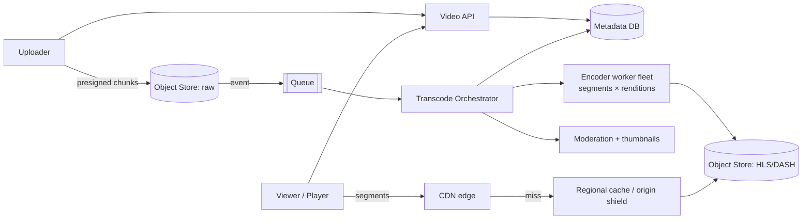

# 🎬 Design a Video Streaming Platform — High Level Design


> Video is the one workload where **bandwidth and storage cost** decide the architecture. Uploads
> become many renditions, playback becomes thousands of tiny cacheable files, and the CDN, not your
> servers, does the heavy lifting.

> 📚 **Credit:** Problem inspired by public course tables of contents (premium bodies **not**
> accessed). Original content. See [References](#-references--credits).

⬅️ Previous: [Top-K / Trending](../../Social-and-Content/TopKTrending/README.md) · 🏠 [Media and Storage](../README.md) · ➡️ Next: [File Storage and Sync](../FileStorageSync/README.md)

---

## 📑 On this page

1. [Clarifying Requirements](#1-clarifying-requirements) · 2. [Estimation](#2-back-of-the-envelope-estimation) ·
3. [Core APIs](#3-core-apis) · 4. [High-Level Design](#4-high-level-design) · 5. [Database Design](#5-database-design) ·
6. [Deep Dive](#6-design-deep-dive) · 7. [Follow-ups](#7-follow-ups-with-answers)

---

## 1. Clarifying Requirements

| Candidate asks | Interviewer answers | Design impact |
|---|---|---|
| Upload or licensed catalogue? | User uploads (YouTube-like). | Upload + transcode pipeline. |
| Devices? | Phones, TVs, browsers, varying networks. | Adaptive bitrate. |
| Live streaming? | Out of scope (follow-up). | Batch pipeline only. |
| Video length/size? | Up to a few hours, ~5 GB. | Resumable chunked upload. |
| Start-up time target? | < 2 s. | Small first segment, CDN. |
| Recommendations? | Mention only. | Separate service. |
| Content safety? | Yes, moderation. | Pipeline stage. |

**Functional:** upload, process, stream with quality switching, search/browse, resume position.
**Non-functional:** smooth playback, global reach, high availability of playback, cost control.

---

## 2. Back-of-the-Envelope Estimation

| Quantity | Working | Result |
|---|---|---|
| Concurrent viewers (peak) | 100M DAU × 20% online at peak | **~20M streams** |
| Egress | 20M × ~3 Mbps | **~60 Tbps** ⇒ CDN mandatory |
| Uploads | 500k videos/day × 500 MB | **~250 TB/day raw** |
| Stored renditions | ~2.5× raw | **~600 TB/day**; ~220 PB/year ⇒ tiering |
| Metadata | 500k/day × 2 KB | 1 GB/day (small) |
| View events | 100M × ~5 events | 500M/day ⇒ stream aggregation |

---

## 3. Core APIs

```http
POST /v1/videos                       { title, description, size, content_type } → { video_id, upload_id, part_urls[] }
PUT  <presigned part url>             (client uploads chunk directly to object storage)
POST /v1/videos/{id}/complete-upload  { etags[] }                                → 202 (processing)
GET  /v1/videos/{id}                  → { status, manifest_url (signed), thumbnails, ... }
GET  <CDN>/videos/{id}/master.m3u8    → playlist listing renditions; segments *.ts / *.m4s
POST /v1/videos/{id}/progress         { position_seconds }     (debounced by the client)
GET  /v1/search?q=..
```

---

## 4. High-Level Design



### 4.1 Requirement 1: Upload and process
1. Client requests an upload; API creates a metadata row `UPLOADING` and returns presigned
   multipart URLs.
2. Client uploads chunks in parallel and retries failed parts only.
3. Object-created event triggers the **orchestrator**, which builds a DAG: probe → split into
   segments → encode each segment in parallel into all renditions → package HLS/DASH → thumbnails →
   moderation → mark `READY`.

### 4.2 Requirement 2: Playback
Player fetches the signed manifest, then video **segments** (2–6 s each) over plain HTTP from the
CDN. Segments are immutable objects ⇒ long TTLs, excellent hit rate.

---

## 5. Database Design

```text
videos       (SQL or KV)   video_id PK, owner_id, title, status, duration, created_at, renditions_json
renditions   (KV)          (video_id, profile) -> manifest path, bitrate, codec
watch_state  (KV)          (user_id, video_id) -> position, updated_at         (write-debounced)
view_events  (Kafka → OLAP) (video_id, user_id_hash, ts, quality, buffer_stats)
search index (ES)          fed by CDC from videos
```

Bytes live only in object storage; databases hold metadata and pointers.

---

## 6. Design Deep Dive

### 6.1 Transcoding pipeline
- **Segment-parallel encoding**: split at keyframes (GOPs), encode segments independently on many
  workers, stitch manifests. A 2-hour film that takes 2 hours on one machine finishes in minutes.
- Ladder: 240p → 4K at multiple bitrates; codecs H.264 (compat), VP9/AV1 (efficiency).
- Workers are stateless, tasks idempotent with retries; autoscale on queue age; priority lane for
  trending creators; spot instances for cost.
- Per-title encoding: choose the ladder by content complexity (animation needs fewer bits).

### 6.2 Adaptive bitrate (ABR)
Manifest lists renditions; the player measures throughput and buffer and switches per segment.
Start on a low rung for fast start, step up. Keep segment size short enough to react, long enough to
keep request overhead low.

### 6.3 Delivery and CDN
Three tiers: edge → regional/shield → origin. Popular titles pre-positioned; long tail pulled on
demand. Signed, expiring URLs protect content; DRM (Widevine/FairPlay) for premium. Large services
place cache boxes inside ISPs to cut backbone costs.

### 6.4 Storage tiering
Hot: recent/popular renditions on standard object storage; cold: infrequently watched originals on
archive tiers; delete unused renditions (regenerate on demand). Lifecycle rules automate moves.

### 6.5 Metrics without slowing playback
Players batch QoE beacons (startup time, rebuffering) to Kafka; aggregated for dashboards and ABR
tuning. View counts are streamed, not row updates.

---

## 7. Follow-ups (with answers)

### 7.1 How would you add live streaming?
Ingest via RTMP/SRT/WebRTC to an ingest edge → real-time transcoder → **short segments (1–2 s)** or
LL-HLS/CMAF chunks → CDN. Latency vs stability trade: smaller segments lower latency but raise
request rate and rebuffer risk. No pre-processing DAG; a DVR window stores segments for rewind.

### 7.2 A video suddenly goes viral. What protects the origin?
CDN request coalescing (collapsed forwarding), origin shield, pre-warming to edges when trend is
detected, long TTLs for immutable segments, and autoscaling origin read capacity.

### 7.3 How do you resume playback across devices?
Player posts position every ~10–30 s and on pause/exit; store latest per `(user, video)` in a KV
with last-write-wins; read on open. Debounce to avoid write storms.

### 7.4 How do you reduce cost?
Encode fewer renditions for low-view videos, better codecs for popular ones, tiered storage,
peer/ISP caches, tune segment size and bitrate ladders, and aggressive CDN hit ratio.

### 7.5 How do you protect content (piracy)?
Signed short-lived URLs, token auth at the edge, DRM with license servers, watermarking, geo rules,
rate limiting scrapers.

### 7.6 How do you handle a failed transcode?
Per-segment retries with backoff; poison tasks go to DLQ; the video stays `PROCESSING` and alerts
fire; the creator sees status; re-run from last completed DAG stage (persisted).

### 7.7 How do you support subtitles and multiple audio tracks?
Package them as separate tracks in the manifest; players choose at runtime; store as small text/audio
segments in object storage.

---

## 🧪 Practice Round

<details><summary>1. Why chop video into segments rather than serving one file?</summary>
Enables parallel encoding, adaptive switching per segment, and CDN caching of small immutable
objects; seeking is trivial.
</details>

<details><summary>2. Where does 60 Tbps of egress come from, and who serves it?</summary>
20M streams × 3 Mbps; the CDN edge/ISP caches serve nearly all of it; origin sees only misses.
</details>

---

## 📝 Last-Minute Revision

- **Upload:** presigned multipart → object store → event → DAG transcode (segment-parallel).
- **Play:** manifest + segments via **CDN**; ABR on the client; signed URLs/DRM.
- Storage/egress dominate cost: tier, per-title encoding, hit ratio.
- Metadata small; bytes in object storage; view stats via Kafka.
- Concepts: [CDN & storage](../../../02-core-concepts/12-cdn-and-storage.md) ·
  [messaging](../../../02-core-concepts/09-messaging-and-streaming.md) ·
  [networking](../../../01-foundations/03-networking-basics.md)

---

## 📚 References & Credits

| Resource | Use |
|---|---|
| [RFC 8216 — HTTP Live Streaming](https://www.rfc-editor.org/rfc/rfc8216) | Public HLS spec |
| [MPEG-DASH overview (DASH-IF)](https://dashif.org/) | Public DASH background |

Original work; personal learning project, not affiliated with AlgoMaster.io.
