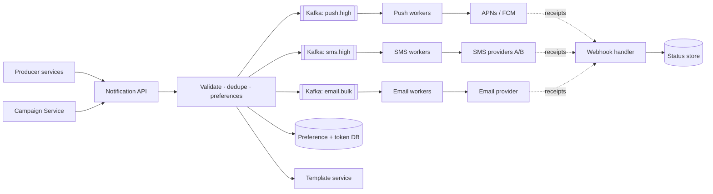

# 🔔 Design a Notification Service — High Level Design


> Sending one push is a single API call. A platform serving hundreds of internal teams must send
> OTPs in 3 seconds *while* a 10M-user marketing campaign is running, respect opt-outs and quiet
> hours, survive provider outages, and never spam anyone twice. (Object model: LLD repo's
> *Notification System*.)

> 📚 **Credit:** Problem inspired by public course tables of contents (premium bodies **not**
> accessed). Original content. See [References](#-references--credits).

⬅️ Previous: [Chat System](../ChatSystem/README.md) · 🏠 [Real-Time Communication](../README.md) · ➡️ Next: [News Feed](../../Social-and-Content/NewsFeed/README.md)

---

## 📑 On this page

1. [Clarifying Requirements](#1-clarifying-requirements) · 2. [Estimation](#2-back-of-the-envelope-estimation) ·
3. [Core APIs](#3-core-apis) · 4. [High-Level Design](#4-high-level-design) · 5. [Database Design](#5-database-design) ·
6. [Deep Dive](#6-design-deep-dive) · 7. [Follow-ups](#7-follow-ups-with-answers)

---

## 1. Clarifying Requirements

| Candidate asks | Interviewer answers | Design impact |
|---|---|---|
| Channels? | Push, SMS, email, in-app. | Channel adapters. |
| Who calls us? | Internal services + campaign tool. | Single ingestion API. |
| Priorities? | OTP/security critical, marketing bulk. | Isolated queues. |
| User control? | Opt-outs, channel prefs, quiet hours. | Preference service. |
| Scheduling? | Yes, send at a time. | Delayed queue. |
| Guarantee? | Critical: at-least-once; marketing: best effort. | Retries + dedupe. |
| Tracking? | Sent, delivered, opened, failed. | Status pipeline. |

**Functional:** send templated notifications on chosen channels, per-user preferences, scheduling,
delivery tracking.
**Non-functional:** OTP end-to-end < 5 s, campaign burst of millions, no duplicates in practice,
tolerate provider outages, horizontally scalable.

---

## 2. Back-of-the-Envelope Estimation

| Quantity | Working | Result |
|---|---|---|
| Daily volume | 10M users × 5 | **50M/day**, ~600/s average |
| Campaign burst | 10M pushes in 10 min | **~17k/s** sustained burst |
| Device tokens | 10M users × ~2 devices | 20M rows × 200 B ≈ **4 GB** |
| Status events | 50M × 4 states × 200 B | **~40 GB/day** (TTL 30 days) |
| Provider limits | APNs/FCM allow thousands/s per connection | Need connection pooling |

---

## 3. Core APIs

```http
POST /v1/notifications
Idempotency-Key: order-981-shipped
{ "user_id": 42, "template": "order_shipped", "params": {"order_id": 981},
  "channels": ["push","email"], "priority": "high", "send_at": null }
→ 202 Accepted { "notification_id": "n_7f3a" }

GET  /v1/notifications/{id}                → status per channel
PUT  /v1/users/{id}/preferences            { "email": true, "sms": false, "quiet_hours": "22:00-07:00" }
POST /v1/campaigns   { "segment_id": 5, "template": "sale", "send_at": "...", "rate_per_sec": 5000 }
POST /webhooks/provider/{name}             (delivery receipts, bounces, unsubscribes)
```

`202` because delivery is asynchronous.

---

## 4. High-Level Design



### 4.1 Requirement 1: Send a single notification

1. API checks the **idempotency key** (Redis / DB unique constraint).
2. Loads preferences: opt-out? quiet hours (delay or drop by priority)? frequency cap?
3. Resolves channels and device tokens; renders template (localised).
4. Enqueues one message per channel on the **priority-specific topic**.
5. Channel worker calls the provider with a timeout, records status, retries on transient errors.

### 4.2 Requirement 2: Campaigns and scheduling

The campaign service pages through the segment (e.g. 10k users per batch), enqueues onto the *bulk*
topics at a throttled rate, and supports pause/cancel. Scheduled sends use a delay queue: a
`due_at` sorted structure polled by a scheduler that moves items to the live topic.

---

## 5. Database Design

```text
notifications(id PK, user_id, type, idempotency_key UNIQUE, priority, created_at, send_at)
deliveries(notification_id, channel, status, provider_msg_id, attempts, updated_at)  -- state machine
preferences(user_id PK, channel_flags, quiet_hours, timezone, unsubscribed_at)
device_tokens(user_id, device_id, platform, token, last_seen)         -- KV, partition by user_id
suppression_list(address_hash PK, reason)                             -- bounces, complaints
templates(id, version, locale, body)
```

Delivery/status data is high-volume append + update by key: Cassandra/DynamoDB with TTL. Preferences
and tokens: KV with a cache in front (read on every send).

---

## 6. Design Deep Dive

### 6.1 Priority isolation
Separate topics **and worker pools** per (channel, priority). A 10M marketing blast must not delay
OTPs: reserve capacity for the high-priority pool and rate limit bulk.

### 6.2 Retries and provider failures
- Classify errors: **transient** (5xx, timeout → retry with exponential backoff + jitter, max N),
  **permanent** (invalid token, unsubscribed → drop and mark token invalid), **throttled**
  (respect provider `Retry-After`).
- Retries go to a **retry topic with delay**, then a **DLQ** after N attempts.
- Per-provider **circuit breaker**; automatic failover to a secondary SMS/email provider.

### 6.3 Idempotency and dedupe
Key = `(user, event_id, channel)`. Store before sending. Providers with their own dedupe keys get our
ID passed through. Accept rare duplicates over lost OTPs.

### 6.4 User experience controls
Frequency caps (Redis counters per user/type/day), quiet hours per time zone (delay non-urgent),
collapse keys for push, digesting many events into one, legal unsubscribe (must be honoured within
days; one-click for email).

### 6.5 Tracking
Provider callbacks (delivered, bounce, complaint) → status store; opens/clicks via tracking pixel
and redirect links, aggregated by a stream job.

---

## 7. Follow-ups (with answers)

### 7.1 How do you guarantee an OTP arrives within 5 seconds during a campaign?
Dedicated high-priority topic and worker fleet with reserved provider capacity; bulk traffic
throttled and on separate provider connections; autoscale on queue age (not just depth); pick the
SMS route with best real-time delivery rate.

### 7.2 How do you avoid sending the same alert on push and email at once?
A **channel policy** per notification type: try push; if not delivered/opened within T minutes,
escalate to email (a delayed job cancelled by the delivered/opened event).

### 7.3 How do you notify millions of users about a breaking event quickly?
Use provider **topic broadcast** (FCM topics) for segments, or shard the audience across many
parallel workers with high concurrency; expect provider rate limits, so pre-negotiate limits and
stagger by region.

### 7.4 What if the preference service is down?
Cache preferences locally with a short TTL. For critical (security) notifications default to
*send*; for marketing default to *skip*.

### 7.5 How do you keep templates safe and consistent?
Versioned templates, schema-validated params, preview/test send, canary rollout, and escape all
user-supplied values.

### 7.6 How do you handle invalid device tokens?
Providers return "unregistered/invalid" errors: delete the token immediately; refresh on app open.

---

## 🧪 Practice Round

<details><summary>1. Why 202 instead of 200?</summary>
Delivery is async; the request only guarantees acceptance and enqueue.
</details>

<details><summary>2. Queue depth is low but OTP latency is high. Why?</summary>
Depth hides *age*; check oldest-message age, worker saturation, provider latency and throttling.
</details>

---

## 📝 Last-Minute Revision

- API → validate/dedupe/prefs → **queues per channel and priority** → workers → providers → receipts.
- Isolation is the #1 idea. Retry with backoff+jitter, DLQ, circuit breaker, provider failover.
- 202 + idempotency key; status via webhooks; frequency caps and quiet hours.
- Concepts: [messaging](../../../02-core-concepts/09-messaging-and-streaming.md) ·
  [idempotency](../../../04-patterns/01-idempotency.md) ·
  [resilience](../../../02-core-concepts/11-resilience-and-failure-handling.md)

---

## 📚 References & Credits

| Resource | Use |
|---|---|
| [Firebase Cloud Messaging docs](https://firebase.google.com/docs/cloud-messaging) | Public provider behaviour |
| [Apple Push Notification service docs](https://developer.apple.com/documentation/usernotifications) | Public provider behaviour |

Original work; personal learning project, not affiliated with AlgoMaster.io.
