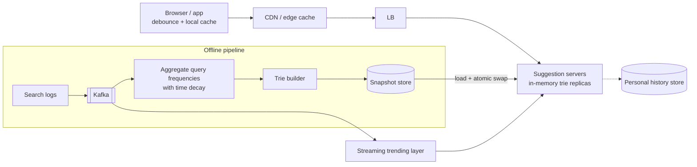

# ⌨️ Design Typeahead / Search Autocomplete — High Level Design


> Autocomplete must answer before the next keystroke, so nothing expensive can happen at request
> time. The design pushes all the work *offline* and serves precomputed answers from memory.
> (Single-machine data structure version: LLD repo's *Search Autocomplete*.)

> 📚 **Credit:** Problem inspired by public course tables of contents (premium bodies **not**
> accessed). Original content. See [References](#-references--credits).

⬅️ Previous: [Nearby Places](../../Location-Based-Services/NearbyPlaces/README.md) · 🏠 [Search and Discovery](../README.md) · ➡️ Next: [Web Crawler](../WebCrawler/README.md)

---

## 📑 On this page

1. [Clarifying Requirements](#1-clarifying-requirements) · 2. [Estimation](#2-back-of-the-envelope-estimation) ·
3. [Core APIs](#3-core-apis) · 4. [High-Level Design](#4-high-level-design) · 5. [Database Design](#5-database-design) ·
6. [Deep Dive](#6-design-deep-dive) · 7. [Follow-ups](#7-follow-ups-with-answers)

---

## 1. Clarifying Requirements

| Candidate asks | Interviewer answers | Design impact |
|---|---|---|
| How many suggestions? | Top 5–10. | Top-k per prefix. |
| Ranking? | Popularity, with recency. | Frequency + decay. |
| Personalised? | Nice-to-have. | Merge with user history. |
| Freshness? | New trends within an hour (or minutes). | Offline build + fast layer. |
| Languages? | Multiple. | Per-language indexes/tokenisation. |
| Typos? | Basic tolerance later. | Follow-up. |
| Latency? | < 100 ms end to end. | In-memory + edge cache. |

**Functional:** return ranked completions for a prefix.
**Non-functional:** very low latency, very high read QPS, high availability, updates can lag.

---

## 2. Back-of-the-Envelope Estimation

| Quantity | Working | Result |
|---|---|---|
| Searches | 500M/day | ~5.8k/s |
| Suggestion requests | 500M × ~10 keystrokes | **5B/day ⇒ ~58k/s**, peak ~150k/s (client debounce cuts this 2–3×) |
| Unique queries retained | 200M × 30 B | **~6 GB** raw strings |
| Trie with top-k lists | prune to queries with ≥ N hits: ~20M queries × ~100 B | **~2–4 GB** ⇒ fits per server |

---

## 3. Core APIs

```http
GET /v1/suggest?q=how t&limit=8&lang=en&loc=IN
→ 200 { "prefix":"how t", "suggestions":["how to tie a tie","how tall is ...", ...] }
Cache-Control: public, max-age=60
```

Client: debounce ~150 ms, cancel superseded requests, cache prefix responses locally.

---

## 4. High-Level Design



### 4.1 Requirement 1: Serve suggestions
Suggestion server walks the trie to the prefix node (O(len)) and returns the **precomputed top-k**
stored there. No subtree scans at query time.

### 4.2 Requirement 2: Learn from new searches
Logs → aggregation → new snapshot (hourly/daily) built offline and swapped atomically. A small
real-time layer captures breaking trends and is merged at serve time.

---

## 5. Database Design

```text
Trie node (in memory, radix-compressed):
  children: map<char/substring -> node>
  top_k: [(query_id, score)] × 10           -- precomputed
Query table (offline):  query_id, text, count_7d, count_1d, decayed_score, lang, blocked
Snapshot: serialized trie / sorted prefix→top-k files in object storage, versioned
```

Alternative: key-value `prefix → top-k` (Redis/DynamoDB); bigger but simple and shardable.

---

## 6. Design Deep Dive

### 6.1 Trie with precomputed top-k
Storing top-k at every node trades memory for O(prefix) lookups. Compress single-child chains
(radix), skip nodes for rare prefixes, store `query_id`s instead of strings, cap prefix depth (e.g.
first 20 chars).

### 6.2 Building and rotating snapshots
Batch job computes decayed frequency: `score = Σ count_day × 0.9^age_days`. Builder writes a new
versioned snapshot; servers load it, then **atomically swap** the pointer (serve old until the new
is warm). Roll out gradually; keep the previous version for rollback.

### 6.3 Freshness layer
A stream job counts queries in the last N minutes; queries spiking above baseline enter a small
"fresh" index. At request time, merge fresh suggestions above the base list (bounded by k).

### 6.4 Scaling and caching
Replicate full snapshots to many identical servers (no sharding needed at ~4 GB); shard by prefix
only for much larger corpora. Cache short prefixes at the CDN (the top few hundred 1–3-char
prefixes cover a large share of traffic).

### 6.5 Personalisation and safety
Merge a user's recent searches (from a small per-user store) with global suggestions. Apply a
blocklist (offensive, legal takedowns) at serve time and at build time; suppress rare queries that
could leak personal data (k-anonymity threshold).

---

## 7. Follow-ups (with answers)

### 7.1 How do you handle typos?
Generate candidates within edit distance 1–2 using a BK-tree/symmetric-delete index or phonetic keys,
rank by popularity and edit distance; only invoke when the exact prefix returns too few results to
save latency.

### 7.2 How do you support multiple languages and scripts?
Separate tries per language/locale; normalise (Unicode NFKC, case folding); tokenise CJK by
character or n-gram; route by `Accept-Language` or explicit `lang`.

### 7.3 How do you update suggestions in near real time?
Fast path streaming layer (above) plus low-latency snapshot deltas; don't mutate the live trie
in place; apply changes to a copy and swap.

### 7.4 How do you measure quality?
Acceptance rate (clicked suggestion), keystrokes saved, zero-suggestion rate, latency percentiles,
and A/B tests on ranking formulas.

### 7.5 What if a server holds a stale snapshot?
Versions are reported to a coordinator; lagging servers are drained or forced to reload; small
staleness is acceptable by design.

### 7.6 Why not query Elasticsearch prefix queries directly?
It works at small scale, but ES prefix queries are heavier than a trie lookup and lack precomputed
top-k; latency and cost at 100k+ QPS favour in-memory structures.

---

## 🧪 Practice Round

<details><summary>1. What is stored at each trie node and why?</summary>
The top-k completions for that prefix, so a lookup never traverses the subtree.
</details>

<details><summary>2. Why not update the trie on every search?</summary>
It adds write contention to a read-critical structure; counts change slowly relative to lookups, so
periodic rebuilds are enough.
</details>

---

## 📝 Last-Minute Revision

- ~58k QPS avg, tiny answers ⇒ **precompute** top-k per prefix; serve from memory + edge cache.
- Offline: logs → decayed counts → trie snapshot → **atomic swap**; streaming layer for trends.
- Client debounce and caching; blocklists; personalisation merge.
- Concepts: [search structures](../../../02-core-concepts/15-search-and-geospatial.md) ·
  [caching](../../../02-core-concepts/03-caching.md) ·
  [stream processing](../../../03-technologies/06-coordination-and-misc.md)

---

## 📚 References & Credits

| Resource | Use |
|---|---|
| [Trie — Wikipedia](https://en.wikipedia.org/wiki/Trie) | Public background |
| [BK-tree — Wikipedia](https://en.wikipedia.org/wiki/BK-tree) | Fuzzy matching background |

Original work; personal learning project, not affiliated with AlgoMaster.io.
