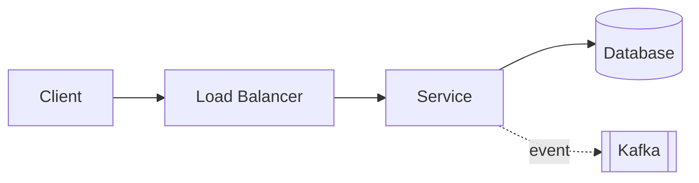

# Diagramming Tips

<!-- nav:start -->
🏷️ **Priority:** High · **Difficulty:** Beginner

⬅️ Previous: [Estimation Cheatsheet](02-estimation-cheatsheet.md) · 🏠 [Interview Tips](README.md) · ➡️ Next: [Choosing the Right Database](04-choosing-the-right-database.md)

> 📚 **Credit:** Chapter selection, ordering and question choice follow the [AlgoMaster.io System Design Interviews course](https://algomaster.io/learn/system-design-interviews/course-roadmap). This write-up was created with Claude for personal interview prep. The premium lesson text was **not** accessed or reproduced. See [CREDITS](../CREDITS.md).
<!-- nav:end -->

A diagram is your shared workspace with the interviewer. A clear one shows structure, makes trade-offs
discussable, and keeps you on track. A messy one hides gaps.

## Principles

1. **Left-to-right (or top-to-bottom) flow**: clients on the left, storage on the right.
2. **Start minimal**, then evolve: client → LB → service → DB. Add components as requirements demand.
3. **Label everything**: boxes with names, arrows with the protocol or what flows ("POST /urls", "click event", "WebSocket").
4. **Distinguish sync from async**: solid arrows for request/response, dashed for events/queues.
5. **Number the steps** of a key flow (① write path, ② read path) and walk through them aloud.
6. **One level of abstraction per diagram.** Zoom into a component on a separate area of the board for deep dives.
7. **Group related boxes** (a dotted box for "regional cluster", "AZ", or "data pipeline").
8. **Show data stores with a cylinder** and say the technology and why.
9. **Leave room.** Boards fill fast; reserve a corner for estimates and another for open issues.

## A reusable shape vocabulary

| Shape | Meaning |
|---|---|
| Rectangle | Service/process |
| Cylinder | Database / storage |
| Rounded box / cloud | External system or client |
| Parallelogram or `[[ ]]` | Queue / log / topic |
| Dashed arrow | Asynchronous flow |
| Dotted container | Boundary (region, VPC, cluster) |
| Circle with number | Step in a flow |

## Standard layers to draw (in order)

```
Clients → CDN/DNS → Load balancer / API gateway → Stateless services
      → Cache → Primary store (+ replicas) → Async: queue/log → Workers → Derived stores (search, analytics, object storage)
```

## Building a diagram live: example (URL shortener)

1. Draw `Client → LB → App servers → DB`.
2. Annotate estimates: "40 writes/s, 4k reads/s".
3. Add `Cache` between app and DB on the read path (reads dominate).
4. Add `Key generator` beside the write path.
5. Add dashed `Kafka → Analytics` from the redirect service.
6. Walk both flows with numbered arrows.

## Sequence and state diagrams

- Use a **sequence diagram** for multi-step protocols (payment, booking, saga): participants across the top, messages down.
- Use a **state machine** for entities with lifecycles (order, trip, payment).
- Use an **ER sketch** (tables with keys) for data models; mark partition/shard keys.

## Text-based diagrams (this repo uses Mermaid)

````

````

Mermaid renders natively on GitHub, so diagrams stay in Markdown and versioned with the notes.

## Common mistakes

| Mistake | Fix |
|---|---|
| Boxes without arrows or labels | Every arrow says what flows and why |
| Everything in one giant diagram | Overview first, then zoom into deep dives |
| Ignoring the read/write split | Draw both paths separately |
| No failure story | Mark replicas, standby, retries, DLQ |
| Crossing lines everywhere | Reorder components; use layers |
| Diagram never referenced again | Point at it while explaining every decision |
| Adding technology logos over reasoning | Write the reason next to the box |

## Whiteboard hygiene

- Print large; use one colour for the base design and another for changes during deep dives.
- Write estimates in a corner where you can reuse them.
- Keep a running "open issues / trade-offs" list to close in the wrap-up.
- Erase or mark obsolete parts instead of leaving contradictions.

## Practice drills

1. Draw the read and write paths for a news feed in under 3 minutes.
2. Draw a sequence diagram for "book a seat with payment, including payment timeout".
3. Take any case study in this repo, hide the diagram, and redraw it from the description.

## Last-minute revision

Simple → evolve; label arrows; number the flow; sync vs async; layers; one abstraction level; walk
through it out loud.
