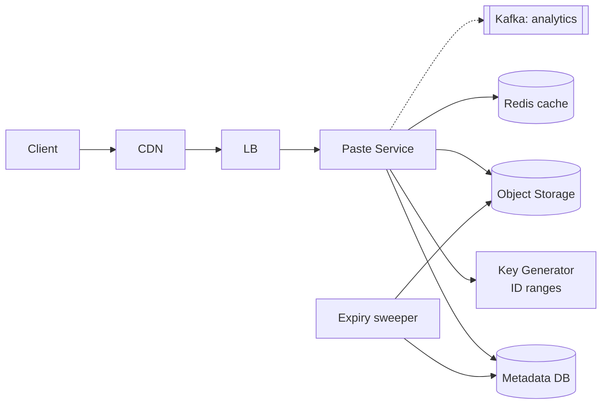

# 📋 Design Pastebin — High Level Design

<!-- nav:start -->
🏷️ **Priority:** Medium · **Difficulty:** Beginner

⬅️ Previous: [Design URL Shortener](../URL-Shortener/README.md) · 🏠 [Basic Questions](../README.md) · ➡️ Next: [Design WhatsApp](../../08-Real-Time-Communication/WhatsApp/README.md)

> 📚 **Credit:** Chapter selection, ordering and question choice follow the [AlgoMaster.io System Design Interviews course](https://algomaster.io/learn/system-design-interviews/course-roadmap). This write-up was created with Claude for personal interview prep. The premium lesson text was **not** accessed or reproduced. See [CREDITS](../../CREDITS.md).
<!-- nav:end -->

> Users paste text (code, logs, notes) and share a short link. It looks like a URL shortener, but the
> stored object is a **large blob**, which changes storage, caching and abuse handling.

## 1. Clarifying Requirements

| Candidate asks | Interviewer answers | Design impact |
|---|---|---|
| Max paste size? | 10 MB text. | Blob storage, not a DB column. |
| Expiry? | Optional (10 min … never); default 1 year. | TTL + cleanup. |
| Private/public/unlisted? | All three; unlisted = link only. | Access control, unguessable IDs. |
| Editing? | Immutable; "fork" creates new paste. | Simplifies caching. |
| Accounts? | Optional. | Anonymous paths need abuse controls. |
| Syntax highlighting, raw view? | Yes, client-side. | Serve raw text. |
| Scale? | 5M new pastes/day, 10× reads. | See estimates. |

**Functional:** create paste (title, content, language, expiry, visibility), read by URL, raw view, delete, list "my pastes".
**Non-functional:** read latency < 100 ms, high availability, durable until expiry, abuse resistance.

## 2. Back-of-the-Envelope Estimation

| Quantity | Working | Result |
|---|---|---|
| Writes | 5M/day ÷ 86,400 | **~58/s**, peak ~200/s |
| Reads | 10× writes | **~580/s**, peak ~2k/s |
| Avg paste size | 10 KB (median small, long tail) | 5M × 10 KB = **50 GB/day** |
| Storage (1 yr, before expiry) | 50 GB × 365 | **~18 TB** (less with expiry + compression 3–5×) |
| Metadata row | ~200 B | 1 GB/day |
| Egress | 2k/s × 10 KB | ~20 MB/s |

Conclusion: modest QPS, storage-dominated → **object storage for content + KV/SQL for metadata + cache + CDN**.

## 3. Core APIs

```http
POST /v1/pastes   { "content": "...", "title": "opt", "language": "python",
                    "expires_in": "1d", "visibility": "unlisted" }
→ 201 { "id": "aZ3k9QxT", "url": "https://paste.example/aZ3k9QxT" }

GET  /{id}        → HTML view       GET /raw/{id} → text/plain
DELETE /v1/pastes/{id}   → 204      GET /v1/users/me/pastes?cursor=..
```

## 4. High-Level Design



### 4.1 Create paste
1. Validate size, content type, rate limit (per IP/user).
2. Get a unique ID from the ID generator (ranges, base62 8 chars, or Snowflake → base62).
3. Upload content to object storage under `pastes/{id}` (gzip-compressed).
4. Insert metadata `(id, owner, created_at, expires_at, visibility, size, s3_key)`.
5. Return URL. Write order: blob first, then metadata (metadata never points to a missing blob).

### 4.2 Read paste
CDN → app → Redis (metadata + small content ≤ 64 KB) → on miss metadata DB + object store. Check
`expires_at`/visibility; return 404/410. Large pastes stream from object storage via presigned URL.

## 5. Database Design

```text
pastes(id PK, owner_id, title, language, visibility, size_bytes, content_hash,
       blob_key, created_at, expires_at, deleted)      -- KV/SQL partitioned by id
user_pastes(owner_id, created_at DESC, id)             -- "my pastes" index
```
Object store key: `pastes/{id[0:2]}/{id}.gz`. Small pastes (<4 KB) may inline in the DB to save a hop.
SQL vs NoSQL: single-key access ⇒ DynamoDB/Cassandra or sharded MySQL; either is defensible.

## 6. Design Deep Dive

### 6.1 ID generation
7–8 char base62 ⇒ 62^8 ≈ 218 trillion. Use pre-allocated ranges + scrambling so IDs are unguessable
(unlisted pastes rely on this). Or random IDs with conditional insert. See [URL Shortener](../URL-Shortener/README.md).

### 6.2 Storage and caching
- Metadata tiny, content large: object storage is cheap and durable; DB stays small and fast.
- Cache small hot pastes in Redis; CDN caches immutable public pastes (long TTL; purge on delete).
- Deduplicate by `content_hash` optionally (store once, reference many): saves space, adds ref-counting.

### 6.3 Expiration and deletion
Lazy check on read (`now > expires_at ⇒ 410`) + sweeper by `expires_at` index to delete blobs and rows in
batches; object-store lifecycle rules as a backstop. Recycling IDs is unnecessary (huge space).

### 6.4 Abuse and security
Rate limits, size caps, CAPTCHA for anonymous, malware/phishing scanning, secret detection (API keys),
`X-Content-Type-Options: nosniff`, serve raw text as `text/plain`, sandboxed domain for rendered content,
report/takedown workflow, robots noindex for unlisted.

## 7. Follow-ups (with answers)

**7.1 How do you support private pastes with sharing?** Store `visibility=private` and an ACL/owner; require auth on every read; for shared links use signed tokens with expiry; never rely on obscurity for private.

**7.2 How do you support editing/versioning?** Keep pastes immutable; an edit creates a new paste with `parent_id` (revision chain). Cache stays valid; history is a linked list.

**7.3 How would you add search over pastes?** Async pipeline: metadata/content events → Elasticsearch index restricted to public pastes; respect deletion/expiry via tombstones; cap content indexed.

**7.4 How do you handle a paste that goes viral?** CDN absorbs reads; origin shield, request coalescing; local cache for the hot ID; object storage handles high read throughput.

**7.5 How do you reduce storage cost?** Compression (gzip/zstd), dedupe by hash, expiry defaults, lifecycle to cold tiers for old pastes, cap sizes.

**7.6 What if the object store is down?** Reads served from cache/CDN where possible, else 503 with retry; writes fail fast or queue to a durable buffer if the product allows async publish.

## 🧪 Practice Round

<details><summary>Why write the blob before the metadata?</summary>
So a metadata row never points to a blob that doesn't exist; a crash leaves only an orphan blob that a cleanup job reclaims.
</details>

<details><summary>Why not store 10 MB in the database row?</summary>
It bloats the DB, hurts caching/backups and replication; object storage is cheaper and built for blobs.
</details>

## 📝 Last-Minute Revision

Blob in object storage + metadata in KV/SQL; unguessable ID; cache + CDN; lazy + swept expiry; abuse controls; immutable pastes.

Related: [URL Shortener](../URL-Shortener/README.md) · [S3](../../04-Technology-Deep-Dives/11-s3.md) · [Uploading and Serving Large Files](../../05-Interview-Patterns/07-uploading-and-serving-large-files.md)
