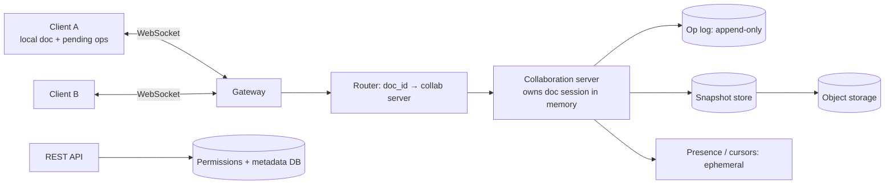

# 📝 Design Google Docs — High Level Design

<!-- nav:start -->
🏷️ **Priority:** High · **Difficulty:** Advanced

⬅️ Previous: [Design Live Comments](../Live-Comments/README.md) · 🏠 [Real-Time Communication](../README.md) · ➡️ Next: [Design Zoom](../Zoom/README.md)

> 📚 **Credit:** Chapter selection, ordering and question choice follow the [AlgoMaster.io System Design Interviews course](https://algomaster.io/learn/system-design-interviews/course-roadmap). This write-up was created with Claude for personal interview prep. The premium lesson text was **not** accessed or reproduced. See [CREDITS](../../CREDITS.md).
<!-- nav:end -->

> The hard problem is not storing documents; it is letting many people edit the **same text at the same time**
> and converging to identical content, even when edits cross paths or people go offline.

## 1. Clarifying Requirements

| Candidate asks | Interviewer answers | Design impact |
|---|---|---|
| Concurrent editors? | Up to 100 per doc, typically 2–10. | Per-doc real-time session. |
| Content types? | Rich text (start with plain text + formatting). | Operation model. |
| Conflicts? | Must converge, preserve intent. | OT or CRDT. |
| Latency? | Local edits instant; remote < 200 ms. | Optimistic local apply. |
| Offline? | Edit offline and merge later. | CRDT-friendly / op queue. |
| History? | Version history, restore. | Op log + snapshots. |
| Sharing/permissions? | Owner/editor/commenter/viewer. | ACL checks. |
| Scale? | 100M docs, 10M DAU, 1M concurrent editors. | Session routing. |

**Functional:** create/open/edit docs, real-time collaboration, cursors/presence, comments, version history, sharing.
**Non-functional:** convergence (all replicas identical), low latency, durability of every acknowledged edit, availability.

## 2. Back-of-the-Envelope Estimation

| Quantity | Working | Result |
|---|---|---|
| Concurrent editors | given | 1M sessions |
| Ops per active editor | ~2 ops/s (keystroke batches) | **~2M ops/s** cluster-wide |
| Op size | ~50 B | 100 MB/s ingest |
| Storage | 100M docs × 100 KB snapshot | ~10 TB snapshots; op logs compacted |
| Open docs | 1M editors / ~3 per doc | ~300k active doc sessions |

## 3. Core APIs

```http
GET  /v1/docs/{id}                → snapshot + version
WS   /v1/docs/{id}/collab         → → {op, base_version, client_id}
                                    ← {op, server_version} · cursors · presence · ack
GET  /v1/docs/{id}/revisions      POST /v1/docs/{id}/restore {revision}
POST /v1/docs/{id}/share {user, role}     POST /v1/docs/{id}/comments
```

## 4. High-Level Design



### 4.1 Editing flow
1. Client applies its edit locally (instant), sends `op` with the base version it saw.
2. **Collaboration server** for that doc (single owner per doc) orders ops, resolves concurrency, appends to the
   op log, broadcasts the transformed op to other clients, acks the sender.
3. Clients apply remote ops; the doc converges.

### 4.2 Loading a doc
Load latest snapshot + replay ops after the snapshot version; join the session; receive live ops.

## 5. Database Design

```text
docs      doc_id PK, owner, title, created_at, latest_snapshot_ver, acl_id
ops       (doc_id, version) → op payload, author, ts          -- append-only (wide-column / log)
snapshots (doc_id, version) → object storage pointer          -- periodic (every N ops / minutes)
acl       (doc_id, principal) → role
comments  (doc_id, anchor, thread) …
```
Ops partitioned by `doc_id`: all edits for a doc live together (locality and ordering).

## 6. Design Deep Dive

### 6.1 Concurrency control: OT vs CRDT
| | Operational Transformation (Google Docs) | CRDT (Yjs, Automerge, RGA/Logoot) |
|---|---|---|
| Idea | Server transforms concurrent ops against each other so they commute | Data structure with unique element ids; merge is commutative/idempotent |
| Central server | Needed to order ops | Optional (peer-to-peer/offline friendly) |
| Complexity | Transformation functions are tricky | Simpler merge, larger metadata (tombstones) |
| Fit | Central-server products | Offline-first, decentralised |

**OT example:** doc "abc". A inserts "X" at 1, B deletes index 2 concurrently. Server transforms B's op against A's
so both replicas end as "aXb". **CRDT example:** each character has a unique id and position between neighbours,
so inserts commute regardless of arrival order.

### 6.2 Server-side session ownership
Route all editors of a doc to one collaboration server (consistent hashing by `doc_id`, sticky WebSocket routing)
so ordering is trivial and in-memory state avoids DB round trips. Failure: another server loads snapshot + ops,
clients reconnect and resend un-acked ops (idempotent by op id).

### 6.3 Durability and snapshots
Ack after the op is durably logged. Snapshot every N ops/time to bound replay; compact old ops (keep for history
per policy). Version history = snapshots + op ranges; "restore" writes a new revision (never rewrites history).

### 6.4 Presence and cursors
Ephemeral, unpersisted messages relayed via the session (throttled); colours per user; cursor positions
transformed with ops.

### 6.5 Offline editing
Client stores pending ops locally; on reconnect sends them with base version; OT server transforms against
intervening ops (or CRDT merges). Large divergences show a "merged changes" indicator.

### 6.6 Permissions and comments
ACL checked at connect and on every op; comments anchored to ranges that move with edits (anchors transformed
like cursors).

## 7. Follow-ups (with answers)

**7.1 How do you guarantee all clients converge?** Ops are ordered by the server (OT) or commutative (CRDT); every client applies the same set of operations, transformed consistently, yielding identical state.

**7.2 What if the collaboration server crashes mid-session?** Ops are in a durable log; a new server loads the snapshot + log; clients resend un-acked ops with ids; duplicates are discarded.

**7.3 How do you scale to a doc with 1,000 simultaneous editors?** Coalesce/batch ops, throttle presence, use read-only broadcast for viewers, and shard sections (e.g. per-block sub-documents in Notion-style designs).

**7.4 How to implement undo?** Per-user undo stack generates inverse operations transformed against later concurrent ops; sent as new ops (selective undo).

**7.5 How do you make search across docs work?** Async pipeline from snapshots/ops to a search index with per-user ACL filtering.

**7.6 Why not lock paragraphs instead?** Locking blocks collaboration and creates deadlocks/latency; OT/CRDT allow non-blocking concurrent edits.

## 🧪 Practice Round

<details><summary>Why apply edits locally before the server acknowledges?</summary>
Latency: typing must feel instant; the server's ordering is applied afterwards via transformation or merge.
</details>

<details><summary>What is the trade-off of CRDTs?</summary>
Metadata growth (tombstones, ids) and garbage collection complexity, in exchange for coordination-free merging and offline support.
</details>

## 📝 Last-Minute Revision

WebSocket collab session per doc on one server; **OT** (transform vs concurrent ops) or **CRDT** (commutative ids); append-only op log + snapshots; local-first apply; presence ephemeral; ACL on every op; reconnect resends un-acked ops.

Related: [Pushing Real-time Updates](../../05-Interview-Patterns/05-pushing-realtime-updates.md) · [Consistent hashing](../../03-Concept-Deep-Dives/05-Distributed-Systems/04-consistent-hashing.md) · [Google Drive](../../10-Media-Streaming-and-Delivery/Google-Drive/README.md)
