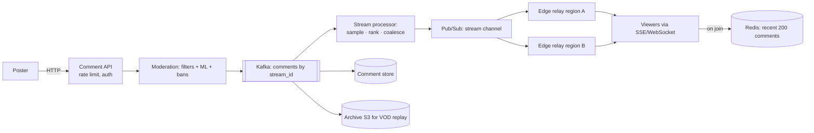

# 💬 Design Live Comments — High Level Design

<!-- nav:start -->
🏷️ **Priority:** Medium · **Difficulty:** Intermediate

⬅️ Previous: [Design Slack](../Slack/README.md) · 🏠 [Real-Time Communication](../README.md) · ➡️ Next: [Design Google Docs](../Google-Docs/README.md)

> 📚 **Credit:** Chapter selection, ordering and question choice follow the [AlgoMaster.io System Design Interviews course](https://algomaster.io/learn/system-design-interviews/course-roadmap). This write-up was created with Claude for personal interview prep. The premium lesson text was **not** accessed or reproduced. See [CREDITS](../../CREDITS.md).
<!-- nav:end -->

> Millions watch a live stream or match while comments scroll by. Writes are modest, but **reads fan out
> to every viewer**, and a single stream can be the hottest key in the system.

## 1. Clarifying Requirements

| Candidate asks | Interviewer answers | Design impact |
|---|---|---|
| Context? | Live video/events (Twitch/YouTube Live/sports). | Bursty, event-driven load. |
| Viewers per stream? | Up to 5M concurrent on the biggest. | Massive fan-out. |
| Comment rate? | Up to 50k/s on a hot stream. | Cannot show all to everyone. |
| Ordering? | Approximately chronological. | Relaxed ordering. |
| History? | Recent (last ~200) on join; full replay for VOD. | Bounded store + archive. |
| Moderation? | Spam/abuse filtering, bans, slow mode. | Pipeline before fan-out. |
| Delivery guarantee? | Best effort is fine. | Sampling/coalescing allowed. |

**Functional:** post comment, receive live comments, load recent comments on join, moderation, replies/likes (optional).
**Non-functional:** <2 s from post to viewers, tolerate drops, cost-efficient at millions of viewers, isolation from the video path.

## 2. Back-of-the-Envelope Estimation

| Quantity | Working | Result |
|---|---|---|
| Viewers on hot stream | given | 5M connections |
| Naive fan-out | 50k comments/s × 5M viewers | **250 billion deliveries/s** (impossible) |
| Sampled to readable rate | ~10 comments/s per viewer × 5M | **50M deliveries/s** |
| Gateways | 5M ÷ 100k | ~50 gateways for one stream |
| Storage | 50k/s × 200 B | 10 MB/s ⇒ ~36 GB/hour on the hottest stream |

**Insight:** humans can read ~5–10 comments/s. Deliver a **sampled/curated** stream, not everything.

## 3. Core APIs

```http
POST /v1/streams/{id}/comments   { text }            → 202 (accepted/filtered)
SSE  GET /v1/streams/{id}/comments/live               ← event: comment {id, user, text, ts}   (or WebSocket)
GET  /v1/streams/{id}/comments?after=cursor&limit=50  (initial backfill)
POST /v1/streams/{id}/moderation/ban {user}           (mods)
```
Viewers mostly only read: **SSE** (server→client) is a good fit; posting via plain HTTP.

## 4. High-Level Design



### 4.1 Post path
Authenticate → rate limit (per user, slow-mode per stream) → moderation → publish to Kafka partitioned by
`stream_id` (with sub-partitions for huge streams). Persisted asynchronously.

### 4.2 Delivery path
A processor selects what to broadcast (sampling by rate cap, prioritising mods/subscribers/verified, dedup
of spam like "LOL"), batches into ~250–500 ms frames, publishes to the stream channel. **Regional edge
relays** subscribe once per stream and fan out to local viewers' connections.

## 5. Database Design

```text
Redis   recent:{stream_id} = capped list of last 200 comments (LPUSH + LTRIM)
Cassandra/DynamoDB  comments PK (stream_id, bucket) CLUSTER ts, comment_id, user_id, text, flags
S3      full archive (Parquet) for VOD/analytics, moderation audit
Bans    (stream_id, user_id) with TTL; slow-mode settings per stream
```

## 6. Design Deep Dive

### 6.1 Hierarchical fan-out
Origin publishes once ⇒ regional brokers ⇒ edge relays ⇒ gateways ⇒ connections. Each tier multiplies
fan-out (e.g. 1 → 10 regions → 50 relays → 100k connections each). Avoid a single pub/sub channel handling
5M subscribers.

### 6.2 Sampling and coalescing
Cap outbound at N comments/s per viewer (e.g. 10). Selection: priority classes (moderators, channel
subscribers), recency, dedupe near-duplicates, random sampling for the rest. Same sample to all viewers
(computed once) ⇒ cheap; personalise minimal.

### 6.3 Hot key: stream_id
The Kafka partition and Redis list for a hot stream become hot keys. Split comment ingestion across sub-keys
(`stream_id#0..k`), merge in the processor; write recent-list updates in batches.

### 6.4 Join and reconnect
On join: read `recent:{stream}` (200 items) then subscribe; use `after=cursor` to close the gap; clients
dedupe by comment id. SSE `Last-Event-ID` gives automatic resume.

### 6.5 Moderation
Pre-publish filters (blocklists, regex), ML toxicity scoring with a latency budget (fail-open for low risk),
user reputation, slow mode/followers-only, shadow-banning, human mod tools; post-hoc deletion propagates as
a delete event.

### 6.6 Overload and cost
Shed low-priority comments first; degrade to fewer updates per second; separate infrastructure from the video path; connection admission control.

## 7. Follow-ups (with answers)

**7.1 Why not send every comment to every viewer?** It's unreadable and computationally impossible at scale; sampling preserves the experience and cuts cost ~1000×.

**7.2 How do you keep comment order consistent for viewers?** Approximate by ingestion timestamp/partition sequence; small reordering is acceptable; the same processed stream goes to all viewers.

**7.3 How do you support replay with VOD comments?** Archive comments with a video-relative timestamp; the player fetches comments in time windows (e.g. 10 s buckets) synchronised to the playhead.

**7.4 How do you scale connections for a sudden 5M-viewer event?** Pre-scale gateway fleet, autoscale on connection count, admission control on reconnect storms, jittered backoff, regional relays.

**7.5 How do you stop spam raids?** Per-user and per-IP rate limits, account age/reputation gates, slow mode, duplicate suppression, CAPTCHA/verification, automated raid detection then follower-only mode.

**7.6 How do likes/reactions on comments work?** Aggregate in memory/stream per comment with sharded counters and periodic broadcast of counts; not per-like fan-out.

## 🧪 Practice Round

<details><summary>Why SSE over WebSocket here?</summary>
Viewers primarily receive; SSE is simpler, HTTP-friendly with auto-reconnect and resume; posting is a normal request.
</details>

<details><summary>What is the main scaling problem?</summary>
Fan-out: (comments/s) × (viewers). Solve with sampling, batching and hierarchical relays.
</details>

## 📝 Last-Minute Revision

Post via HTTP → moderation → Kafka by stream → **sample/coalesce** → hierarchical pub/sub → edge relays → SSE; recent-200 in Redis for join; archive for VOD; hot-stream sub-partitioning.

Related: [Pushing Real-time Updates](../../05-Interview-Patterns/05-pushing-realtime-updates.md) · [Fanning Out Updates](../../05-Interview-Patterns/06-fanning-out-updates.md) · [Twitch](../../10-Media-Streaming-and-Delivery/Twitch/README.md)
