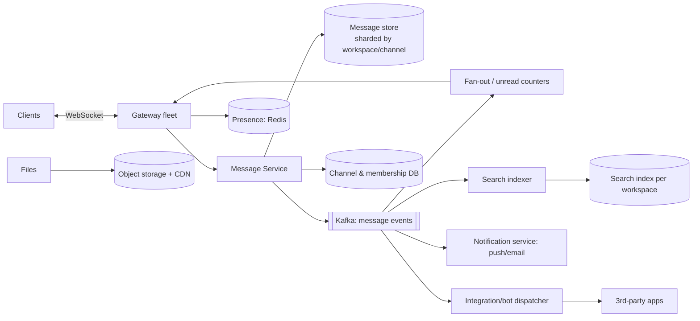

# 💼 Design Slack — High Level Design

<!-- nav:start -->
🏷️ **Priority:** Medium · **Difficulty:** Intermediate

⬅️ Previous: [Design WhatsApp](../WhatsApp/README.md) · 🏠 [Real-Time Communication](../README.md) · ➡️ Next: [Design Live Comments](../Live-Comments/README.md)

> 📚 **Credit:** Chapter selection, ordering and question choice follow the [AlgoMaster.io System Design Interviews course](https://algomaster.io/learn/system-design-interviews/course-roadmap). This write-up was created with Claude for personal interview prep. The premium lesson text was **not** accessed or reproduced. See [CREDITS](../../CREDITS.md).
<!-- nav:end -->

> Slack is chat with **workspaces, channels, threads, search, integrations and presence**. Compared with
> [WhatsApp](../WhatsApp/README.md), the new problems are multi-tenancy, huge channels, history + search, and
> app integrations.

## 1. Clarifying Requirements

| Candidate asks | Interviewer answers | Design impact |
|---|---|---|
| Structure? | Workspaces → channels (public/private) + DMs + threads. | Channel-centric data model. |
| Channel size? | Up to 100k members. | Large fan-out; pull for big channels. |
| History/search? | Full history, searchable, per workspace. | Message store + search index with ACLs. |
| Real time? | Messages, typing, presence, reactions. | WebSocket gateways. |
| Integrations? | Bots, webhooks, slash commands. | API platform, rate limits, events. |
| Files? | Yes. | Object storage + previews. |
| Scale? | 20M DAU, 50 msgs/user/day. | ~1B msgs/day. |
| Enterprise? | Retention, audit, e-discovery. | Compliance features. |

**Functional:** send/receive in channels/DMs/threads, reactions, mentions, unread counts, search, files, presence, notifications, bots.
**Non-functional:** <300 ms delivery, per-channel ordering, durable history, tenant isolation, high availability.

## 2. Back-of-the-Envelope Estimation

| Quantity | Working | Result |
|---|---|---|
| Messages | 20M × 50 | **1B/day ≈ 11.6k/s**, peak ~50k/s |
| Storage | 1B × 500 B | **~500 GB/day** (~180 TB/yr, before replication) |
| Connections | ~10M concurrent | ~100–200 gateways at 100k each |
| Delivery fan-out | avg channel 50 online members | ~600k deliveries/s peak-ish |
| Search index | text of 1B msgs/day | ~300 GB/day index ⇒ tiered |

## 3. Core APIs

```http
WS  events:  → {type:"message", channel, text, client_msg_id, thread_ts?}
             ← {type:"message", channel, ts, user, text} · typing · presence · reaction
POST /v1/channels/{id}/messages     GET /v1/channels/{id}/history?before=ts&limit=50
POST /v1/reactions   POST /v1/files.upload   GET /v1/search?q=..&in=channel&from=user
POST /v1/apps/webhooks/{token}      (incoming webhooks)   POST /v1/commands (slash)
```

## 4. High-Level Design



### 4.1 Send a message
Client → gateway → message service: authorise (member of channel), assign `ts` (per-channel monotonic
sequence), persist, ack, publish `message.created`. Fan-out consumers push to online members' gateways,
update unread counts, push notifications for mentions/DMs, index for search, dispatch to bots.

### 4.2 Read history and unread
History from the message store by `(channel, ts DESC)` with cursor pagination. Each user has
`last_read_ts` per channel; unread = messages after it (count maintained incrementally, capped display "99+").

## 5. Database Design

```text
messages   PK (workspace_id, channel_id, ts)  -- wide-column/Vitess-MySQL; thread replies: (channel_id, thread_ts, ts)
channels   channel_id, workspace_id, type, name, is_private
members    (channel_id, user_id) role, last_read_ts, notif_pref          -- sharded by channel; reverse index by user
reactions  (message_id, emoji) -> user set / count
files      file_id, workspace_id, s3_key, size, owner, acl
```
Shard key **workspace_id** (tenant isolation, locality) with large workspaces split by channel.

## 6. Design Deep Dive

### 6.1 Ordering and ids
Per-channel monotonic `ts` (e.g. `seconds.microseq`) assigned by the channel's owning shard; clients sort by it; `client_msg_id` dedupes retries.

### 6.2 Big channels (100k members)
Don't write per-member inbox rows. Store once; deliver live to online members via topic subscription
(gateways subscribe per channel); offline users compute unread from `last_read_ts`. Throttle typing/presence
in large channels. See [Fanning Out Updates](../../05-Interview-Patterns/06-fanning-out-updates.md).

### 6.3 Presence
Heartbeat with TTL in Redis; publish changes only to users who have the person visible (DM list, current channel);
debounce; coarse "active/away".

### 6.4 Search with permissions
Index per workspace (or filter by workspace). Enforce ACLs: private channel messages only visible to members
(filter by channel ids the user can access, precomputed and cached). Handle edits/deletes as index updates.
Retention/e-discovery: legal hold flags stop deletion.

### 6.5 Threads, reactions, edits
Threads: replies keyed by `thread_ts`, parent stores reply count/last reply. Reactions: counters + user set
per emoji (sharded for hot messages). Edits/deletes: events with tombstones; propagate to clients and index.

### 6.6 Integrations platform
Incoming webhooks post as bots (rate-limited, authenticated tokens). Outgoing events (Events API) delivered via
a dispatcher with retries, signatures and dead-letter handling; slash commands are HTTP callbacks with 3 s timeout.

### 6.7 Multi-tenancy and reliability
Per-workspace quotas and rate limits; noisy-neighbour isolation (dedicated shards for huge customers);
regional data residency; enterprise key management and retention.

## 7. Follow-ups (with answers)

**7.1 How do you compute unread counts cheaply?** Maintain `last_read_ts` per (user, channel) and a per-channel latest `ts`; unread exists if latest > last_read; exact counts computed lazily or via incremental counters with caps.

**7.2 How do you handle @channel in a 100k-member channel?** Rate limit/permission-gate it; notifications processed asynchronously through the notification service with batching and per-user preferences (do-not-disturb, mute).

**7.3 How would you support message retention and legal hold?** Per-workspace retention policy jobs delete beyond N days unless a hold applies; deletions propagate to search index, caches, backups on schedule; audit log of actions.

**7.4 How do you scale WebSocket connections during a company-wide meeting?** Pre-scale gateways, admission control on reconnect storms, jittered reconnect, coalesce typing/presence, degrade non-essential events.

**7.5 How do you make search fast at 1B messages/day?** Time-partitioned indices, workspace routing keys, hot/warm tiers, filters before scoring, query result caching, limit result windows.

**7.6 How do you avoid message loss on gateway failure?** Persist before ack; clients resync by channel cursor on reconnect; server retries pushes; duplicates dropped by id.

## 🧪 Practice Round

<details><summary>Why shard by workspace?</summary>
Most queries are within one workspace, tenant isolation is natural, and per-tenant limits and residency are easier; giant workspaces can be split by channel.
</details>

<details><summary>How does Slack differ from WhatsApp architecturally?</summary>
Channels with many members (pull/topic delivery), searchable persistent history with ACLs, multi-tenant isolation, and an integrations platform.
</details>

## 📝 Last-Minute Revision

Workspace-sharded message store; per-channel ts ordering; gateways + Kafka fan-out; big channels via topics/pull with `last_read_ts`; permission-aware search; presence via TTL; app platform with retries/signatures.

Related: [WhatsApp](../WhatsApp/README.md) · [Pushing Real-time Updates](../../05-Interview-Patterns/05-pushing-realtime-updates.md) · [Search and Typeahead](../../05-Interview-Patterns/17-search-and-typeahead.md)
