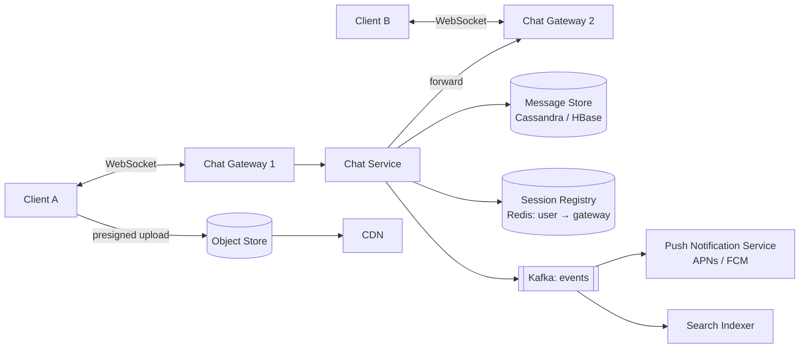
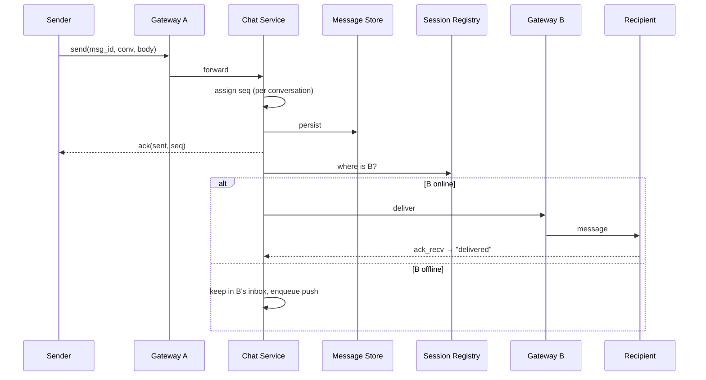

# 💬 Design WhatsApp (Chat System) — High Level Design

<!-- nav:start -->
🏷️ **Priority:** High · **Difficulty:** Intermediate

⬅️ Previous: [Design URL Shortener](../../07-Basic-Questions/URL-Shortener/README.md) · 🏠 [Real-Time Communication](../README.md) · ➡️ Next: [Design FB News Feed](../../09-Social-Media-Systems/FB-News-Feed/README.md)

> 📚 **Credit:** Chapter selection, ordering and question choice follow the [AlgoMaster.io System Design Interviews course](https://algomaster.io/learn/system-design-interviews/course-roadmap). This write-up was created with Claude for personal interview prep. The premium lesson text was **not** accessed or reproduced. See [CREDITS](../../CREDITS.md).
<!-- nav:end -->


> Sending one message is easy. Sending 700k per second to people whose phones drop off networks,
> keeping each conversation in order, never losing a message, and doing it for millions of open
> connections is the actual problem. (Object model of a chat app: see the LLD repo's *Chat Application*.)

---

## 📑 On this page

1. [Clarifying Requirements](#1-clarifying-requirements) · 2. [Estimation](#2-back-of-the-envelope-estimation) ·
3. [Core APIs](#3-core-apis) · 4. [High-Level Design](#4-high-level-design) · 5. [Database Design](#5-database-design) ·
6. [Deep Dive](#6-design-deep-dive) · 7. [Follow-ups](#7-follow-ups-with-answers)

---

## 1. Clarifying Requirements

| Candidate asks | Interviewer answers | Design impact |
|---|---|---|
| 1:1 only or groups? | Both; groups up to ~500. | Fan-out per group. |
| Delivery status? | Sent / delivered / read ticks. | Ack events flow back. |
| Offline users? | Must receive messages on return. | Durable inbox + push. |
| Multiple devices? | Yes, up to 4. | Per-device cursors. |
| Media? | Images, video, files. | Object storage + CDN. |
| History and search? | History yes; search nice-to-have. | Message store; index optional. |
| Scale? | 500M DAU, 40 msgs/day each. | See estimates. |
| End-to-end encrypted? | Mention it, don't design it. | Server stores ciphertext. |

**Functional:** send/receive 1:1 and group text and media; delivery/read receipts; presence;
offline delivery; history.
**Non-functional:** latency < 200 ms when online; **no lost messages**; **ordering per conversation**;
high availability; horizontally scalable connection layer.

---

## 2. Back-of-the-Envelope Estimation

| Quantity | Working | Result |
|---|---|---|
| Messages / day | 500M × 40 | **20 B** |
| Avg msgs / s | 20B ÷ 86,400 | **~230k/s**, peak ~3× ⇒ **~700k/s** |
| Text storage / day | 20B × 100 B | **~2 TB/day**, ~730 TB/year (before replication) |
| Concurrent connections | ~25–40% of DAU online | **~150M** |
| Gateways | 150M ÷ 100k conns/host | **~1,500 hosts** (+ headroom) |
| Media | 10% of msgs × 200 KB | ~400 TB/day → object store + CDN |

---

## 3. Core APIs

Real-time channel (WebSocket, JSON or protobuf frames):

```text
→ send      { msg_id (client UUID), conv_id, type, body, client_ts }
← ack       { msg_id, server_seq, status: "sent" }
← message   { msg_id, conv_id, seq, sender, body, ts }
→ ack_recv  { conv_id, up_to_seq }            // delivered watermark
→ ack_read  { conv_id, up_to_seq }            // read watermark
→ presence  { status: "online" }              // + heartbeat every ~5s
```

REST for the non-real-time parts:

```http
GET  /v1/conversations/{id}/messages?before_seq=1200&limit=50
POST /v1/media/upload-url              -> { upload_url, media_id }   (presigned)
POST /v1/conversations                 { members: [...] }
GET  /v1/sync?device_id=..&cursor=..   -> messages since cursor       (reconnect)
```

---

## 4. High-Level Design



### 4.1 Requirement 1: Sending a message (1:1)



**Order matters:** persist *before* acknowledging "sent". A crash after ack must not lose the message.

### 4.2 Requirement 2: Groups, offline delivery, presence

- **Group message:** store one copy per conversation; deliver to every member's connection/inbox.
- **Offline:** message waits durably; a push notification wakes the device; on reconnect the client
  calls `sync(cursor)` to fetch the gap.
- **Presence:** heartbeat writes `user:presence` with TTL in Redis; changes are pushed only to
  contacts currently viewing that user.

---

## 5. Database Design

Access patterns: *append message to conversation*, *read latest N messages of a conversation*,
*fetch everything for a device since a cursor*. Massive write volume, no joins ⇒ **wide-column store**.

```text
messages  (Cassandra)
  PARTITION KEY: (conv_id, bucket)      -- bucket = e.g. month, bounds partition size
  CLUSTERING:    seq DESC
  columns: msg_id, sender_id, type, body/ciphertext, media_id, created_at, deleted

conversations   (relational / KV)   conv_id, type(1:1|group), created_at, last_seq
members         (KV)                conv_id, user_id, role, joined_seq, last_read_seq
devices         (KV)                user_id, device_id, push_token, last_synced_cursor
inbox           (KV, TTL)           (user_id, device_id) -> undelivered message refs
```

Media: bytes in object storage, message stores only `media_id` and a thumbnail.

---

## 6. Design Deep Dive

### 6.1 Ordering and idempotency
- Each conversation has a **monotonic sequence** assigned by whichever service instance owns that
  conversation (shard by `conv_id`; owner increments in memory or via conditional write).
- Clients render by `seq`, not by timestamp (clocks lie).
- Client-generated `msg_id` makes retries idempotent: the server dedupes on `(conv_id, msg_id)`.

### 6.2 Connection layer at scale
- Gateways are dumb and stateless except for open sockets; use **least-connections** balancing.
- ~100k sockets per host needs tuned file descriptors, kernel buffers and async I/O.
- **Session registry**: `user_id → {device_id: gateway_id}` with a TTL refreshed by heartbeat.
- Cross-gateway delivery: chat service looks up the registry and calls the target gateway
  (internal gRPC) or publishes to a per-gateway pub/sub channel.
- Gateway crash: clients reconnect with **jittered backoff**, then run `sync`. No message loss
  because the truth is the message store.

### 6.3 Delivery guarantees
At-least-once on the wire (server retries until ack) + dedupe by `msg_id` on the client ⇒ users see
each message once. States: `sent` (persisted) → `delivered` (recipient device acked) → `read`
(watermark). Use **watermarks** (`up_to_seq`) instead of per-message receipts to cut traffic.

### 6.4 Group chat fan-out
- Small groups (≤ 500): write to each member's inbox/cursor; deliver to online ones.
- Very large channels: don't write per member. Store once; members pull from their
  `last_read_seq`, with pub/sub for live members.

### 6.5 Media
Presigned upload, async thumbnailing/virus scan, CDN for downloads; the message carries
`media_id` + thumbnail + size. Retries are per-chunk.

---

## 7. Follow-ups (with answers)

### 7.1 How do you sync a user who was offline for a week?
Client sends `last_synced_cursor` per conversation/device. Server returns messages after it in pages,
oldest first. For very long gaps, return a **summary** (latest N per conversation) and lazily load
older history when the user scrolls.

### 7.2 How do you support multiple devices?
Every device has its own connection, push token and cursor. A message fans out to all of a user's
devices; read receipts from one device advance the shared read watermark so the others clear
notifications. Sent messages from device 1 are also delivered to device 2 (self-fan-out).

### 7.3 How would you add end-to-end encryption?
Clients hold keys (Signal-style double ratchet, prekey bundles uploaded to the server). The server
routes opaque ciphertext and cannot read or index it; group chats use sender keys. Consequences:
no server-side search, and multi-device key management is the hard part.

### 7.4 What happens if the recipient's gateway crashes mid-delivery?
Delivery was not acked, so the message stays in the inbox/unacked list. The client reconnects to
another gateway, syncs from cursor, and the duplicate (if any) is dropped by `msg_id`.

### 7.5 How do you scale presence for users with 5,000 contacts?
Don't broadcast every flip. Subscribe-on-view (only notify contacts with the chat list open),
debounce flapping (mark offline after 30 s without heartbeat), sample for large contact lists, and
store `last_seen` lazily.

### 7.6 How do you handle message edits and deletions?
Edits and deletes are **events** referencing `msg_id` with a new seq. Deletes leave a tombstone;
"delete for everyone" pushes a delete event to online devices and applies on sync for others.
Enforce time limits server-side.

### 7.7 How do you search messages?
Non-E2EE: index asynchronously into Elasticsearch, partitioned by user. E2EE: on-device index.

---

## 🧪 Practice Round

<details><summary>1. Why persist before acking "sent"?</summary>
Otherwise a crash after the ack silently loses a message the sender believes was accepted.
</details>

<details><summary>2. Two people send at once in one group. How is order decided?</summary>
The conversation's owner assigns the next `seq` on arrival; everyone renders that order.
</details>

<details><summary>3. Why WebSocket rather than polling?</summary>
Persistent bi-directional channel, low latency and far fewer requests; cost is stateful connections.
</details>

---

## 📝 Last-Minute Revision

- ~700k msgs/s peak, ~150M sockets ⇒ ~1,500 gateways. Messages in **Cassandra** by `(conv, bucket)`.
- **Per-conversation seq**, client `msg_id` for dedupe, **persist then ack**.
- Registry (Redis, TTL) maps user → gateway; reconnect + `sync(cursor)` is the recovery story.
- Watermark receipts, presence via heartbeat TTL, big groups = pull model.
- Concepts: [networking / WebSocket](../../03-Concept-Deep-Dives/01-networking.md) ·
  [messaging](../../_Reference/messaging-and-streaming.md) ·
  [real-time patterns](../../_Reference/realtime-and-sync-patterns.md) ·
  [NoSQL stores](../../_Reference/nosql-stores-overview.md)

---

## 📚 References & Credits

| Resource | Use |
|---|---|
| [Signal Protocol docs](https://signal.org/docs/) | Public E2EE background |
| [RFC 6455 — WebSocket](https://www.rfc-editor.org/rfc/rfc6455) | Protocol reference |

Original work; personal learning project, not affiliated with AlgoMaster.io.
