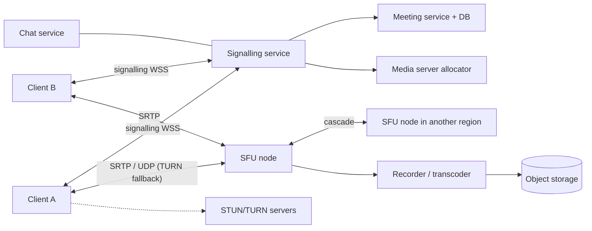

# 🎥 Design Zoom — High Level Design

<!-- nav:start -->
🏷️ **Priority:** Medium · **Difficulty:** Advanced

⬅️ Previous: [Design Google Docs](../Google-Docs/README.md) · 🏠 [Real-Time Communication](../README.md) · ➡️ Next: [Design FB News Feed](../../09-Social-Media-Systems/FB-News-Feed/README.md)

> 📚 **Credit:** Chapter selection, ordering and question choice follow the [AlgoMaster.io System Design Interviews course](https://algomaster.io/learn/system-design-interviews/course-roadmap). This write-up was created with Claude for personal interview prep. The premium lesson text was **not** accessed or reproduced. See [CREDITS](../../CREDITS.md).
<!-- nav:end -->

> Video calls invert normal web design: **latency beats reliability** (a late frame is useless), traffic is
> real-time UDP-like media, and the server's job is to route packets, not to store them.

## 1. Clarifying Requirements

| Candidate asks | Interviewer answers | Design impact |
|---|---|---|
| Meeting size? | Up to 1,000 participants, 25 visible video tiles. | SFU cascading, layouts. |
| Features? | Audio/video, screen share, chat, recording, breakout rooms. | Multiple media streams. |
| Devices/networks? | Web, mobile, desktop; poor Wi-Fi. | Adaptive quality, resilience. |
| Latency? | < 200 ms glass-to-glass. | WebRTC/UDP. |
| Scale? | 300M daily participants; 10M concurrent. | Global media edge network. |
| Recording? | Cloud recording optional. | Recorder joins as participant. |
| Security? | E2EE optional, waiting rooms, passcodes. | Key exchange, auth. |

**Functional:** schedule/join meetings, audio/video, screen share, chat, mute controls, recording, breakout rooms.
**Non-functional:** very low latency, graceful degradation, global availability, cost-efficient media routing.

## 2. Back-of-the-Envelope Estimation

| Quantity | Working | Result |
|---|---|---|
| Concurrent participants | given | 10M |
| Bitrate per video stream | 0.5–2.5 Mbps (720p typical ~1.2 Mbps), audio ~50 kbps | avg ~1 Mbps up per active sender |
| Ingest | 10M × ~0.6 (senders) × 1 Mbps | **~6 Tbps** ingest |
| Egress | 10-person meeting: each receives up to 9 streams | 10–50 Tbps egress ⇒ SFU + simulcast essential |
| Signalling | Join events, small | Low volume compared to media |
| Recording | 1080p ~4 Mbps per recorded meeting | Storage heavy, async |

## 3. Core APIs

```http
POST /v1/meetings {topic,start,passcode} → {meeting_id, join_url}
POST /v1/meetings/{id}/join {display_name} → {token, signalling_url, ice_servers[], sfu_endpoint}
WS   signalling: offer/answer/ICE candidates, join/leave, mute, layout, raise-hand, chat
Media: WebRTC (SRTP over UDP; TCP/TLS fallback) client ⇄ SFU
POST /v1/meetings/{id}/recording/start|stop
```

## 4. High-Level Design



### 4.1 Join flow
Authenticate, get a meeting token, signalling service picks the nearest healthy **SFU** (by RTT/load), returns ICE
servers. Client and SFU exchange SDP offer/answer and ICE candidates, then media flows over UDP (or TURN/TCP).

### 4.2 Media routing
Each sender publishes **simulcast** layers (e.g. 180p/360p/720p). The SFU forwards to each receiver the best layer
it can handle (active speaker high quality, thumbnails low) without decoding/re-encoding.

## 5. Database Design

```text
meetings(meeting_id PK, host_id, topic, start_time, passcode_hash, settings, status)
participants(meeting_id, user_id, join_ts, leave_ts, role)        -- history/analytics (Cassandra)
recordings(recording_id, meeting_id, s3_key, duration, status)
Live state (in memory / Redis): room → SFU assignment, roster, mute/host state, layout
```
Media is never stored except for recordings.

## 6. Design Deep Dive

### 6.1 Topology: mesh vs MCU vs SFU
| | P2P mesh | MCU | **SFU** |
|---|---|---|---|
| Uplink per client | N−1 streams | 1 | 1 (simulcast: 2–3 layers) |
| Server CPU | None | Very high (decode/mix/encode) | Low (forwarding) |
| Client CPU | Decode N−1 | Decode 1 | Decode a few |
| Scales to | ~4 | Small rooms/legacy | Hundreds (with cascading) |
Choose SFU for most; MCU for legacy/SIP composites; P2P for 1:1.

### 6.2 Network traversal
NAT/firewalls: **STUN** discovers public address; **ICE** tries candidate pairs; **TURN** relays when direct
fails (costly, deployed regionally). Fallback to TCP/443 for locked-down networks.

### 6.3 Adaptation and quality
Bandwidth estimation (transport-wide congestion control), simulcast/SVC layer switching, adaptive audio codec
(Opus), forward error correction and NACK retransmits, jitter buffers, prioritise audio, drop frames instead of
delaying, dominant-speaker detection for layout.

### 6.4 Large meetings and webinars
Cascade SFUs across regions (participants connect to nearest, SFUs interconnect); only forward speakers'
video; audience receives via a broadcast path (HLS/LL-HLS or WebRTC fan-out) with higher latency.

### 6.5 Recording and transcripts
Recorder joins as a hidden participant, composites/records tracks, writes segments to object storage;
post-processing (transcode, transcription) via queue.

### 6.6 Reliability and placement
Health checks, migrate meetings on SFU failure (clients re-negotiate to another SFU via signalling);
regional capacity planning; place meetings near the majority of participants; ICE restarts for network changes.

### 6.7 Security
TLS for signalling, SRTP/DTLS for media; meeting tokens, waiting rooms, host controls; E2EE (insertable
streams) limits server features like cloud recording and transcription.

## 7. Follow-ups (with answers)

**7.1 Why UDP rather than TCP for media?** TCP retransmits and head-of-line blocks, adding latency; for real-time media a late packet is worthless, so UDP with selective recovery (NACK/FEC) keeps latency low.

**7.2 How do you scale to a 10,000-person webinar?** Few speakers via SFU; audience gets a one-way stream through a CDN-based low-latency protocol; Q&A/chat use the real-time messaging system.

**7.3 A participant has bad bandwidth. What happens?** Their downlink estimator selects lower simulcast layers; uplink drops resolution/frame rate; audio is prioritised; UI shows quality indicator.

**7.4 How do you pick which SFU to use?** Lowest RTT and available capacity; keep a meeting's participants on the same or cascaded nearby SFUs; consider cost and residency rules.

**7.5 How do you support breakout rooms?** Each breakout is a sub-room with its own media session/SFU allocation; the host moves participants by signalling messages (re-join under the new room token).

**7.6 What is the impact of E2EE?** Server cannot mix, record or transcribe; SFU forwards encrypted frames; key management for join/leave (rotate keys) becomes essential.

## 🧪 Practice Round

<details><summary>Why is an SFU cheaper than an MCU?</summary>
It forwards packets without decoding/re-encoding, so CPU cost is small; an MCU must decode every stream and encode mixed output.
</details>

<details><summary>What does simulcast buy you?</summary>
Senders upload several quality layers so the SFU can serve each receiver an appropriate one without transcoding.
</details>

## 📝 Last-Minute Revision

Signalling (WSS) + media (WebRTC/UDP) separated; **SFU** with simulcast; STUN/ICE/TURN; congestion control, audio priority; cascade SFUs; recorder as participant; webinars via CDN broadcast.

Related: [Streaming Video and Audio](../../05-Interview-Patterns/08-streaming-video-and-audio.md) · [Networking](../../03-Concept-Deep-Dives/01-networking.md) · [Twitch](../../10-Media-Streaming-and-Delivery/Twitch/README.md)
