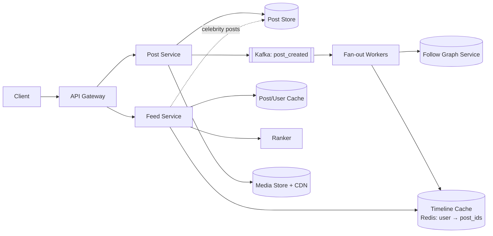

# 📰 Design a News Feed — High Level Design

<!-- nav:start -->
🏷️ **Priority:** High · **Difficulty:** Intermediate

⬅️ Previous: [Design WhatsApp](../../08-Real-Time-Communication/WhatsApp/README.md) · 🏠 [Social Media Systems](../README.md) · ➡️ Next: [Design YouTube](../../10-Media-Streaming-and-Delivery/YouTube/README.md)

> 📚 **Credit:** Chapter selection, ordering and question choice follow the [AlgoMaster.io System Design Interviews course](https://algomaster.io/learn/system-design-interviews/course-roadmap). This write-up was created with Claude for personal interview prep. The premium lesson text was **not** accessed or reproduced. See [CREDITS](../../CREDITS.md).
<!-- nav:end -->


> The feed is a read-dominated view built from a write-time decision: *do we do the work when
> someone posts, or when someone reads?* Every hard question (celebrities, cold caches, inactive
> users) comes back to that choice.

---

## 📑 On this page

1. [Clarifying Requirements](#1-clarifying-requirements) · 2. [Estimation](#2-back-of-the-envelope-estimation) ·
3. [Core APIs](#3-core-apis) · 4. [High-Level Design](#4-high-level-design) · 5. [Database Design](#5-database-design) ·
6. [Deep Dive](#6-design-deep-dive) · 7. [Follow-ups](#7-follow-ups-with-answers)

---

## 1. Clarifying Requirements

| Candidate asks | Interviewer answers | Design impact |
|---|---|---|
| What content? | Text + images/video. | Media via object store/CDN. |
| Follow model? | Asymmetric follow (Twitter-style). | Follower lists can be huge. |
| Feed order? | Start reverse-chronological; ranking later. | Design must allow a ranker. |
| Freshness? | A post may appear seconds late. | Eventual consistency, async fan-out. |
| Celebrities? | Yes, up to 50M followers. | Hybrid fan-out. |
| Interactions? | Likes and comments (brief). | Counters. |

**Functional:** create post, follow/unfollow, home timeline, profile timeline, like/comment.
**Non-functional:** feed load < 200 ms, highly available, read-heavy, eventual consistency OK.

---

## 2. Back-of-the-Envelope Estimation

| Quantity | Working | Result |
|---|---|---|
| Feed reads | 300M DAU × 10 opens | 3B/day ⇒ **~35k/s**, peak **~100k/s** |
| Posts | 100M/day | **~1.2k/s** |
| Avg followers | 200 | fan-out inserts **~240k/s** |
| Celebrity post | 50M followers | **50M inserts** for one post (why we need hybrid) |
| Timeline cache | 300M users × 800 ids × 8 B | **~1.9 TB** in Redis (shard; cache only active users ⇒ far less) |
| Post storage | 100M/day × 1 KB | **~100 GB/day** metadata |

---

## 3. Core APIs

```http
POST /v1/posts               { "text": "...", "media_ids": [..] }          → 201 { post_id }
GET  /v1/feed?cursor=..&limit=20                                          → { items:[post...], next_cursor }
GET  /v1/users/{id}/posts?cursor=..
POST /v1/users/{id}/follow   DELETE /v1/users/{id}/follow
POST /v1/posts/{id}/like
```

Cursor-based pagination (last seen post_id/score), never offset, because the feed changes while
scrolling.

---

## 4. High-Level Design



### 4.1 Requirement 1: Publishing a post
Persist the post, return `201`, publish `post_created`. Fan-out workers read the author's followers
and prepend the `post_id` to each follower's timeline list (bounded to ~800).

### 4.2 Requirement 2: Reading the feed
1. Fetch `post_id`s from the user's timeline cache (one Redis call).
2. Merge in recent posts from **celebrities** the user follows (pull).
3. Multi-get posts, authors and counters from caches.
4. Rank/filter (blocked, deleted, seen), return a page with `next_cursor`.

---

## 5. Database Design

```text
posts        (wide-column/KV)  post_id PK, author_id, text, media_ids, created_at, deleted
user_posts   (wide-column)     PARTITION author_id, CLUSTER created_at DESC -> post_id
follows      (KV)              following(user_id -> [followee ids]) and followers(user_id -> [follower ids])
timeline     (Redis ZSET)      user_id -> {post_id : score=timestamp}, trimmed to 800, TTL for inactive users
counters     (Redis / sharded) post_id -> likes, comments  (async persisted)
```

No joins needed. The follow graph is two adjacency lists, not a graph database.

---

## 6. Design Deep Dive

### 6.1 Fan-out strategies

| | Push (on write) | Pull (on read) | **Hybrid** |
|---|---|---|---|
| Read cost | O(1) | O(followees) | O(1) + few celebrities |
| Write cost | O(followers) | O(1) | Bounded |
| Wasted work | Inactive followers | None | Skips inactive |
| Weakness | Celebrity storm | Slow reads | More logic |

**Hybrid:** authors above a follower threshold (say 100k) are *not* fanned out; readers merge them
in at read time. Skip fan-out to users inactive for N days and rebuild lazily on their next login.

### 6.2 Fan-out worker design
Consume `post_created` from Kafka partitioned by author; batch followers (paged) into pipelined
Redis writes; make it **idempotent** (`ZADD` same member is a no-op); retry failures; backpressure
via consumer lag.

### 6.3 Ranking
Candidate generation (timeline ids) → features (affinity, recency, engagement, type) → light model →
diversity/dedupe. Keep the ranker a separate service with precomputed offline features and online
lookups; fall back to chronological if it times out.

### 6.4 Counters
Hot posts overload a single counter row: use sharded counters or buffer in Redis and flush in
batches; display approximate values.

---

## 7. Follow-ups (with answers)

### 7.1 How do you handle a celebrity with 50M followers?
Do not push. Store the post once; tag the author as "pull". A reader's feed service fetches the last
few posts of each celebrity they follow (cached heavily per celebrity, since millions read the same
data) and merges by score. Cache hit rates for celebrity content are extremely high.

### 7.2 What happens when a user unfollows or blocks someone?
Filter at read time (authoritative), remove that author's posts from the timeline cache lazily in a
background job. Correctness never depends on cache cleanup.

### 7.3 What if the timeline cache loses data?
Rebuild from `user_posts` of followees (pull path) and repopulate. Cache is derived, not source of
truth. Rate limit rebuilds to prevent a stampede.

### 7.4 How do you delete a post everywhere?
Mark deleted in the post store (tombstone); readers hydrate posts and drop deleted ones; async job
removes ids from timelines.

### 7.5 How do you add "For You" recommendations?
Add a candidate source: recommended posts from an ML retrieval service merged with the follow
timeline before ranking. Same serving pipeline, extra candidate generator.

### 7.6 How do you keep the feed fresh while scrolling?
Cursor by score/post_id; new posts appear via a "N new posts" banner (client polls or SSE),
not by shifting the list under the user.

### 7.7 How do you pick the celebrity threshold?
Model cost: `followers × posts/day` fan-out writes versus read-time merge cost; choose where write
cost per post exceeds a budget (often 10k–100k followers) and tune with production data.

---

## 🧪 Practice Round

<details><summary>1. Why not compute the feed at read time for everyone?</summary>
Reads are ~30× writes and latency-sensitive; gathering hundreds of followees' posts per open is too
slow at 100k req/s.
</details>

<details><summary>2. Why bound the timeline list to ~800 entries?</summary>
Bounds memory; users rarely scroll further; older content is served from the pull path.
</details>

---

## 📝 Last-Minute Revision

- ~35k feed reads/s vs ~1.2k posts/s ⇒ precompute. **Hybrid fan-out**, threshold for celebrities.
- Timeline = Redis ZSET of ids; hydrate from caches; cursor pagination; ranker is separate.
- Cache is derived; filters at read time handle unfollow/delete; rebuild path exists.
- Concepts: [fan-out & hot keys](../../_Reference/fanout-and-hot-keys.md) ·
  [caching](../../03-Concept-Deep-Dives/02-caching.md) ·
  [CQRS](../../_Reference/cqrs-event-sourcing.md) ·
  [Redis](../../04-Technology-Deep-Dives/03-redis.md)

---

## 📚 References & Credits

| Resource | Use |
|---|---|
| Public engineering talks on timeline architecture (e.g., Twitter "Timelines at Scale") | General background on hybrid fan-out |

Original work; personal learning project, not affiliated with AlgoMaster.io.
