# 📸 Design Instagram — High Level Design

<!-- nav:start -->
🏷️ **Priority:** High · **Difficulty:** Intermediate

⬅️ Previous: [Design Zoom](../../08-Real-Time-Communication/Zoom/README.md) · 🏠 [Social Media Systems](../README.md) · ➡️ Next: [Design FB News Feed](../FB-News-Feed/README.md)

> 📚 **Credit:** Chapter selection, ordering and question choice follow the [AlgoMaster.io System Design Interviews course](https://algomaster.io/learn/system-design-interviews/course-roadmap). This write-up was created with Claude for personal interview prep. The premium lesson text was **not** accessed or reproduced. See [CREDITS](../../CREDITS.md).
<!-- nav:end -->

> A photo/video sharing network = **media pipeline + social graph + feed**. The feed algorithm is covered in
> [FB News Feed](../FB-News-Feed/README.md); this chapter focuses on media upload/serving, the data model and the pieces
> around it (stories, explore, likes).

## 1. Clarifying Requirements

| Candidate asks | Interviewer answers | Design impact |
|---|---|---|
| Core features? | Post photo/video, follow, feed, like/comment, stories. | Scope list. |
| Media? | Photos ≤ 10 MB, short videos ≤ 60 s. | Transcoding + image variants. |
| Feed? | Ranked, fresh within seconds. | Hybrid fan-out. |
| Stories? | 24 h ephemeral. | TTL storage. |
| Scale? | 500M DAU; 100M posts/day. | Big media + read scale. |
| Explore/search? | Mention only. | Separate system. |
| Consistency? | Eventual for feed/likes. | Async fan-out. |

**Functional:** upload media with caption, follow/unfollow, home feed, profile grid, likes/comments, stories, notifications.
**Non-functional:** fast media load worldwide, feed < 300 ms, high availability, cost-aware media storage.

## 2. Back-of-the-Envelope Estimation

| Quantity | Working | Result |
|---|---|---|
| Posts | 100M/day | **~1.2k/s** |
| Media per post | 1 photo, ~2 MB original → variants ~600 KB total | **~60 TB/day** stored |
| Feed reads | 500M × 10 opens | **~58k/s**, peak ~150k/s |
| Media egress | 500M × 30 images × 150 KB | **~2.2 PB/day** ⇒ CDN critical |
| Likes | 4B/day | **~46k/s** ⇒ counters |
| Metadata | 100M × 1 KB | 100 GB/day |

## 3. Core APIs

```http
POST /v1/media/uploads {type,size} → {upload_url(s), media_id}     PUT <upload_url>
POST /v1/posts {media_ids[], caption, location?}                   → 201 {post_id}
GET  /v1/feed?cursor=..            GET /v1/users/{id}/posts?cursor=..
POST /v1/posts/{id}/like   DELETE …/like       POST /v1/posts/{id}/comments
POST /v1/users/{id}/follow         GET /v1/stories/tray
```

## 4. High-Level Design

```mermaid
flowchart LR
    U[Client] -->|presigned upload| OS[(Object store: originals)]
    U --> API[API gateway] --> PS[Post Service] --> PDB[(Posts DB)]
    OS -->|event| Q[[Queue]] --> MP[Media processors:<br/>resize · compress · transcode · moderate] --> VAR[(Object store: variants)] --> CDN[CDN]
    PS --> K[[Kafka: post_created]] --> FO[Fan-out workers] --> TL[(Timeline cache: Redis)]
    API --> FS[Feed Service] --> TL & PDB & RK[Ranker]
    API --> SG[Social Graph Service] --> GDB[(Follow graph)]
    API --> LK[Like/Comment Service] --> LDB[(Likes & comments)]
    K --> NT[Notifications] & IX[Search indexer]
```



### 4.1 Upload and publish
Presigned upload of the original ⇒ storage event ⇒ processors create multiple sizes (thumbnail, 320/640/1080),
formats (WebP/AVIF/JPEG), strip EXIF/location, moderate content. Post becomes visible when processing succeeds
(or immediately with placeholder + low-res while variants finish).

### 4.2 Viewing the feed
Timeline ids (Redis) → hydrate posts/authors/like counts (cache multi-get) → rank/filter → return with CDN
URLs for media. Client picks variant by device/network.

## 5. Database Design

```text
posts        post_id (Snowflake) PK, author_id, caption, media_refs[], created_at, visibility   -- sharded by post_id (or author_id for profile queries)
user_posts   (author_id, created_at DESC) → post_id                                                -- profile grid
follows      following(user_id → ids), followers(user_id → ids)                                     -- KV/wide-column
likes        (post_id, user_id) unique  +  counters post_id → count (sharded/buffered)
comments     (post_id, comment_id) CLUSTER by time; replies via parent_id
timeline     Redis ZSET user_id → post_ids (bounded)
stories      (user_id, story_id) with TTL 24h + viewers set
media        media_id → variants{size,format,url}, moderation status
```
Use time-sortable IDs (Snowflake) so ids sort by creation and shard cleanly. See [Generating Unique IDs](../../05-Interview-Patterns/19-generating-unique-ids.md).

## 6. Design Deep Dive

### 6.1 Media pipeline and delivery
- Direct-to-storage upload; async processing with idempotent, retryable tasks.
- Multiple renditions + modern formats; CDN with long TTL on immutable, hash/ID-based URLs; origin shield.
- Lazy generation of rare sizes on demand (image resizing service) with caching.
- Storage tiering: hot for recent; cold/infrequent for old originals; delete abandoned uploads.
- Video (Reels): transcode to HLS/DASH ladder; see [YouTube](../../10-Media-Streaming-and-Delivery/YouTube/README.md).

### 6.2 Feed generation (hybrid)
Push post ids to followers' timelines for normal users; pull for celebrities; skip inactive users; rank with
engagement/affinity signals. Full treatment: [FB News Feed](../FB-News-Feed/README.md), [Fanning Out Updates](../../05-Interview-Patterns/06-fanning-out-updates.md).

### 6.3 Likes and counters
Idempotent `(post, user)` write (unique key). Displayed count from **sharded counters/stream aggregation**, cached
a few seconds. "Liked by you" from per-user like sets or a Bloom filter. See [Counting at Scale](../../05-Interview-Patterns/20-counting-at-scale.md).

### 6.4 Stories (ephemeral content)
Store with TTL 24 h; tray ordering by recency/affinity computed at read time from followees' active stories
(small set per user); viewers list stored per story with limited retention; prefetch next stories on the client.

### 6.5 Social graph
Two adjacency lists (followers, following) in a sharded KV; counts denormalised; "mutual followers" via set
intersection with caps; large accounts need paginated lists and caching.

### 6.6 Privacy, moderation, safety
Private accounts (follow requests + visibility checks at read time), blocked users filtering, content moderation
(ML + human review), takedown propagation to caches/CDN purges.

## 7. Follow-ups (with answers)

**7.1 How do you keep the feed fast for a user following 5,000 accounts?** Precomputed timeline (push) for most authors, pull only for celebrity authors, bounded candidate set, caching hydrated posts, and limits on merge sources.

**7.2 How do you handle a post going viral?** CDN absorbs media traffic; hot post metadata cached with local caches; sharded counters for likes/comments; rate-limit interactions per user.

**7.3 How would you implement Explore/recommendations?** Offline candidate generation (embeddings, co-engagement), online ranking service with feature store, diversity rules; separate pipeline feeding an Explore feed API.

**7.4 How do you delete a post everywhere?** Mark deleted (tombstone) in the source; readers filter; async jobs remove from timelines/search, purge CDN URLs, delete media variants per retention rules.

**7.5 How do you reduce image storage/bandwidth costs?** Modern formats (AVIF/WebP), quality tuning, lazy variants, dedupe by content hash, tiering old originals, aggressive CDN caching, client-side size selection.

**7.6 How do you shard posts and support profile pages?** Shard by `post_id` for even distribution plus a `user_posts` index (author_id, time) for profile grids; or shard by author with hot-user mitigation.

## 🧪 Practice Round

<details><summary>Why generate multiple image sizes?</summary>
Devices and layouts need different sizes; serving a right-sized variant saves bandwidth and improves load time; originals are too large.
</details>

<details><summary>Where does eventual consistency show up?</summary>
Feed inclusion, like counts, follower counts, and search: seconds of lag are acceptable.
</details>

## 📝 Last-Minute Revision

Presigned upload → async media pipeline → variants on CDN; hybrid fan-out feed; Snowflake ids; idempotent likes + sharded counters; stories with TTL; graph as adjacency lists; ~2 PB/day egress ⇒ CDN.

Related: [FB News Feed](../FB-News-Feed/README.md) · [Uploading and Serving Large Files](../../05-Interview-Patterns/07-uploading-and-serving-large-files.md) · [Likes Counting System](../../16-Counting-and-Ranking-Systems/Likes-Counting-System/README.md)
