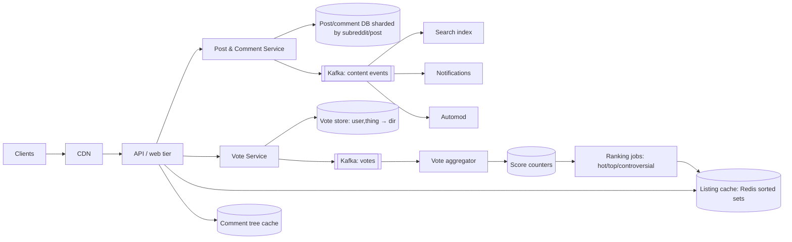

# 👽 Design Reddit — High Level Design

<!-- nav:start -->
🏷️ **Priority:** Medium · **Difficulty:** Intermediate

⬅️ Previous: [Design TikTok](../TikTok/README.md) · 🏠 [Social Media Systems](../README.md) · ➡️ Next: [Design Tinder](../Tinder/README.md)

> 📚 **Credit:** Chapter selection, ordering and question choice follow the [AlgoMaster.io System Design Interviews course](https://algomaster.io/learn/system-design-interviews/course-roadmap). This write-up was created with Claude for personal interview prep. The premium lesson text was **not** accessed or reproduced. See [CREDITS](../../CREDITS.md).
<!-- nav:end -->

> Reddit is community-based content with **votes, nested comments and ranking algorithms**. Interesting problems:
> vote counting at scale, hot/top/new ranking, and deeply nested comment trees.

## 1. Clarifying Requirements

| Candidate asks | Interviewer answers | Design impact |
|---|---|---|
| Structure? | Subreddits (communities), posts, nested comments. | Community sharding. |
| Feeds? | Home (subscribed), popular, per-subreddit; sorts: hot/new/top/controversial. | Ranking jobs. |
| Voting? | Up/down on posts and comments; one vote per user. | Idempotent vote store + counters. |
| Comments? | Deep threads, sort by best/top/new, collapse. | Tree storage. |
| Moderation? | Mods, automod rules, removals. | Rules engine, audit. |
| Scale? | 100M DAU, 50M posts+comments/day, 1B votes/day. | Write-heavy votes. |
| Freshness? | Vote counts within seconds, ranks within minutes. | Async aggregation. |

**Functional:** create community/post/comment, vote, subscribe, browse feeds & sorts, search, moderate, notifications.
**Non-functional:** read-heavy (100:1), fast page loads, tolerance for approximate scores, hot-post resilience.

## 2. Back-of-the-Envelope Estimation

| Quantity | Working | Result |
|---|---|---|
| Votes | 1B/day | **~11.6k/s**, peak ~50k/s |
| Content writes | 50M/day | ~580/s |
| Page views | 100M × 40 | ~46k/s, peak 150k/s |
| Post store | 5M posts/day × 2 KB | 10 GB/day |
| Comment store | 45M/day × 500 B | ~22 GB/day |
| Vote store | 1B × 24 B | ~24 GB/day (unique votes) |

## 3. Core APIs

```http
POST /v1/subreddits/{r}/posts {title, body|url}     GET /v1/r/{sub}/posts?sort=hot&cursor=..
POST /v1/posts/{id}/comments {parent_id, body}      GET /v1/posts/{id}/comments?sort=best&depth=5&cursor=
POST /v1/votes {thing_id, dir: 1|0|-1}              POST /v1/subreddits/{r}/subscribe
GET  /v1/feed/home?sort=..                          POST /v1/moderation/remove {thing_id, reason}
```

## 4. High-Level Design



### 4.1 Voting
Write `(user, thing) → direction` idempotently (unique key; change/undo allowed); publish the *delta* event;
aggregator updates counters and periodically recomputes ranks. The client shows an optimistic local count.

### 4.2 Listing (feed) reads
Per subreddit and sort, maintain **precomputed listings** (Redis sorted sets of post ids with rank score) refreshed
by ranking jobs; reads are `ZREVRANGE` + hydrate posts from cache. Home feed merges listings of subscribed
communities (pull merge for most users, cache per user for a short TTL).

## 5. Database Design

```text
posts     post_id PK (Snowflake), subreddit_id, author_id, title, body/url, created_at, score, num_comments, flags
comments  comment_id PK, post_id, parent_id, path (materialized), author_id, body, created_at, score, deleted
          -- partition key post_id so a thread is co-located
votes     (thing_id, user_id) → dir, ts      -- big, sharded by thing_id; reverse (user_id → recent votes) for "liked" UI
subs      (user_id → subreddit ids), (subreddit_id → count)
listing   Redis ZSET  list:{subreddit}:{sort} → post_id : score
```

## 6. Design Deep Dive

### 6.1 Ranking formulas
- **Hot**: combines votes and age; e.g. `order = log10(max(|s|,1)) + sign(s)·(t − t0)/45000` (t = seconds since epoch of posting). Time decays newer posts up over older; recomputed periodically.
- **Top**: sort by score within a time window (hour/day/week/all).
- **Controversial**: high volume of both up- and downvotes (`min(up,down)` relative to total).
- **Comments "best"**: Wilson score lower bound of upvote ratio so small samples don't dominate.
Compute in batch/stream every ~30–60 s for active posts; cold posts age out of hot listings.

### 6.2 Vote counting at scale
Hot posts get thousands of votes/s ⇒ don't `UPDATE score = score + 1`. Buffer per post/thing in Redis or stream
aggregate deltas by key every second, then update DB/counters; dedupe via `(user, thing)` unique key. Vote fuzzing/
delay to deter manipulation. See [Counting at Scale](../../05-Interview-Patterns/20-counting-at-scale.md), [Handling Hot Keys](../../05-Interview-Patterns/03-handling-hot-keys.md).

### 6.3 Nested comments
Store adjacency (`parent_id`) with a **materialised path** or (root,left,right) ordering so a subtree can be fetched
in one query; load top-N comments per level with depth limits, "load more" for collapsed branches; cache
the sorted tree per post with short TTL; write path invalidates/updates incrementally. Very large threads paginate by
branch (`continue thread`).

### 6.4 Sharding and hot communities
Shard posts by `post_id`; comment threads by `post_id`; listing caches by `subreddit`. Massive subreddits hot-spot
listing keys ⇒ replicate listing caches and use CDN/short-TTL caching for anonymous traffic.

### 6.5 Moderation and abuse
Automod rules (regex, karma/account-age thresholds), report queues, mod actions logged/auditable, shadow bans,
vote manipulation detection (graphs, IP/device clustering), rate limits per user/community.

### 6.6 Search and notifications
Search via async index (posts/comments/communities); notifications for replies/mentions via event stream with
per-user preferences and batching.

## 7. Follow-ups (with answers)

**7.1 How do you prevent duplicate votes?** Unique `(user, thing)` record storing direction; change is an update with delta = new − old; idempotent under retries.

**7.2 How do you keep hot listing fresh but cheap?** Recompute ranks for recently active posts on a schedule, update sorted sets; CDN/short TTL for anonymous listing pages; incremental updates only for changed posts.

**7.3 How do you delete a comment with replies?** Soft delete (`deleted` + placeholder "[deleted]") to keep tree structure; purge body and author for privacy.

**7.4 How do you support "Home" for a user with 500 subscriptions?** Merge top K from each subscribed listing (bounded), cache per user for ~1 min, or precompute for active users.

**7.5 How do you detect vote brigading?** Anomaly detection on vote velocity/graphs, account-age/karma weighting, IP/device signals, rate limits, delayed/fuzzed scores, moderator alerts.

**7.6 How would you scale vote storage?** Shard by thing_id; compact old vote rows for archived posts (score frozen after N days); keep user→votes index only for recent items.

## 🧪 Practice Round

<details><summary>Why compute rank asynchronously?</summary>
Recomputing ordering per vote is too expensive; a 30–60 s delay is invisible to users and turns 50k votes/s into periodic batch updates.
</details>

<details><summary>Why Wilson score for comments?</summary>
It accounts for uncertainty: 1 upvote/0 downvotes isn't better than 90/10; the lower bound ranks by confidence.
</details>

## 📝 Last-Minute Revision

Idempotent vote store + streamed delta counters; hot/top/controversial computed in batches into **Redis sorted-set listings**; comments as trees co-located by post with materialised path; Wilson "best"; automod + anti-brigading.

Related: [Counting at Scale](../../05-Interview-Patterns/20-counting-at-scale.md) · [Real Time Leaderboard](../../16-Counting-and-Ranking-Systems/Real-Time-Leaderboard/README.md) · [FB News Feed](../FB-News-Feed/README.md)
