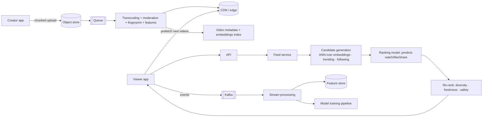

# 🎵 Design TikTok — High Level Design

<!-- nav:start -->
🏷️ **Priority:** Medium · **Difficulty:** Intermediate

⬅️ Previous: [Design FB News Feed](../FB-News-Feed/README.md) · 🏠 [Social Media Systems](../README.md) · ➡️ Next: [Design Reddit](../Reddit/README.md)

> 📚 **Credit:** Chapter selection, ordering and question choice follow the [AlgoMaster.io System Design Interviews course](https://algomaster.io/learn/system-design-interviews/course-roadmap). This write-up was created with Claude for personal interview prep. The premium lesson text was **not** accessed or reproduced. See [CREDITS](../../CREDITS.md).
<!-- nav:end -->

> TikTok's product is the **For You feed**: an endless, personalised stream of short videos from people you
> don't follow. The system problem is *recommendation + video delivery with instant playback*, not a social-graph timeline.

## 1. Clarifying Requirements

| Candidate asks | Interviewer answers | Design impact |
|---|---|---|
| Core flow? | Upload short video, watch endless personalised feed, like/comment/share. | Recommender is the core. |
| Video length? | 15 s – 3 min. | Short, cacheable segments. |
| Feed source? | Mostly non-followed content (For You) + Following tab. | Candidate generation ≠ social graph. |
| Cold start? | New videos/users must get exposure. | Exploration strategy. |
| Playback? | Instant start, swipe with no buffering. | Prefetch, preload. |
| Scale? | 500M DAU, 50M uploads/day, 100 videos watched/user/day. | 50B views/day. |
| Signals? | Watch time, likes, shares, replays, skips. | Event pipeline. |

**Functional:** upload/edit, For You & Following feeds, engagement actions, comments, sounds/hashtags, search, profile.
**Non-functional:** playback start < 300 ms, recommendation latency < 200 ms, freshness for new content, global delivery, cost.

## 2. Back-of-the-Envelope Estimation

| Quantity | Working | Result |
|---|---|---|
| Video views | 500M × 100 | **50B/day ≈ 580k/s** feed video requests |
| Uploads | 50M/day | **~580/s**; 50 MB raw ⇒ 2.5 PB/day raw |
| Stored renditions | ~5 MB avg final set | ~250 TB/day |
| Egress | 50B × ~3 MB | **~150 PB/day** ⇒ CDN & ISP caches dominate cost |
| Engagement events | 50B × ~4 events | ~200B/day ⇒ ~2.3M/s stream |

## 3. Core APIs

```http
POST /v1/videos/uploads → {upload_url, video_id}       POST /v1/videos {video_id, caption, hashtags, sound_id}
GET  /v1/feed/for-you?cursor=&session=..  → { items:[{video_id, manifest_url, author, stats}], next_cursor }
GET  /v1/feed/following
POST /v1/events   [{type: view|like|share|skip|complete, video_id, watch_ms, ts}]   (batched)
POST /v1/videos/{id}/like  |  comments  |  share
```

## 4. High-Level Design



### 4.1 Upload and ingestion
Chunked resumable upload → processing DAG: transcode ladder, thumbnails, audio fingerprinting (copyright), content
moderation (ML + human), extract features/embeddings, publish to index. Fast path to make new videos available to a
small "test" audience for exploration.

### 4.2 For You feed request
Fetch user features (recent watches, interests) → generate hundreds of candidates from multiple sources (nearest
neighbours of user embedding, trending by region/interest, fresh videos, followees) → rank with a model → re-rank
(diversity, remove watched, safety, creator fairness) → return ~10 items with CDN URLs; client prefetches next.

## 5. Database Design

```text
videos       video_id PK, author_id, caption, sound_id, duration, status, created_at, moderation_state     (sharded KV)
renditions   (video_id, profile) → manifest/segment paths
embeddings   video_id → vector (ANN index: HNSW/ScaNN/Faiss shards)
user_state   user_id → interest embedding, recent watch history (bounded), seen-video Bloom filter    (KV + cache)
events       Kafka → warehouse (Parquet) for training; counters per video (windowed)
social       follows, likes(video_id,user_id), comments                                             (see Instagram)
```

## 6. Design Deep Dive

### 6.1 Recommendation pipeline (two-stage)
1. **Candidate generation** (recall): cheap, broad. Multiple retrievers: ANN on user/video embeddings, collaborative signals, popular-in-cohort, fresh uploads, creators followed. ~500–2000 candidates.
2. **Ranking**: heavier model (deep network) scoring P(watch-through), P(like), P(share), P(follow) with features from a feature store; combine into one utility score.
3. **Re-ranking**: enforce diversity (creators, topics), freshness quotas, policy/safety filters, remove already seen (Bloom filter).
Latency budget ~150–200 ms; cache user features; precompute video features; batch inference on GPUs/CPUs.

### 6.2 Cold start and exploration
New video: show to a small random/seeded audience, measure completion/like rates, and expand exposure in stages if
performance beats a threshold (multi-armed-bandit style). New user: onboarding interests, location/language, popular
content, quick adaptation from first swipes.

### 6.3 Instant playback
Prefetch the next 2–3 videos' first segments while the current plays; short segments; adaptive bitrate; edge caching
by popularity and region; ISP-embedded caches; HTTP/2/3; client caching of watched-again videos.

### 6.4 Event pipeline and freshness
Client batches events (watch time, skip, replay) → Kafka → stream aggregation for near-real-time features (recent
interests, video velocity) and offline training; online learning loops update models periodically (hours) with
real-time features covering the gap.

### 6.5 Trust & safety
Multi-stage moderation before/after publish, hash matching for known bad content, rate limits, age-appropriate
filters, region compliance; creator-facing appeals; propagate takedowns to caches and indexes.

### 6.6 Cost
Egress dominates: better codecs, lower bitrate for low-engagement videos, edge/ISP caches, tiered storage, deleting
unpopular renditions, regional pre-positioning of trending content.

## 7. Follow-ups (with answers)

**7.1 How is For You different from a follower-based feed?** Candidates come from content similarity and engagement patterns, not from an explicit follow graph, so there is no fan-out-on-write; instead retrieval + ranking at request time.

**7.2 How do you avoid showing repeated videos?** Maintain a per-user seen set (Bloom filter or capped recent-history list) and filter during re-ranking; bounded memory with false positives acceptable.

**7.3 How do you prevent filter bubbles?** Reserve slots for exploration and diverse topics/creators, penalise repetition, and use long-term satisfaction signals.

**7.4 How do you handle a trending video?** Detect velocity via streaming counters, promote in candidate sources by region, pre-position at edge caches, and protect origin with shield/coalescing.

**7.5 How do you update models without downtime?** Versioned models, shadow evaluation, gradual canary rollout with metric guardrails, instant rollback.

**7.6 What if the ranking service is slow?** Fall back to cached recommendations or a lightweight model; timeouts with degraded lists; never block the feed.

## 🧪 Practice Round

<details><summary>Why two stages (retrieve then rank)?</summary>
Scoring the entire catalogue with a heavy model is impossible; cheap retrieval narrows to hundreds, the expensive model ranks only those.
</details>

<details><summary>What dominates cost?</summary>
Video egress and storage, followed by ML inference; hence CDN/ISP caching, codecs, tiering.
</details>

## 📝 Last-Minute Revision

Upload → transcode/moderate/embed; For You = **retrieve (ANN) → rank (model) → re-rank**; events → Kafka → feature store/training; prefetch for instant playback; exploration for cold start; egress dominates cost.

Related: [YouTube](../../10-Media-Streaming-and-Delivery/YouTube/README.md) · [Streaming Video and Audio](../../05-Interview-Patterns/08-streaming-video-and-audio.md) · [Instagram](../Instagram/README.md)
