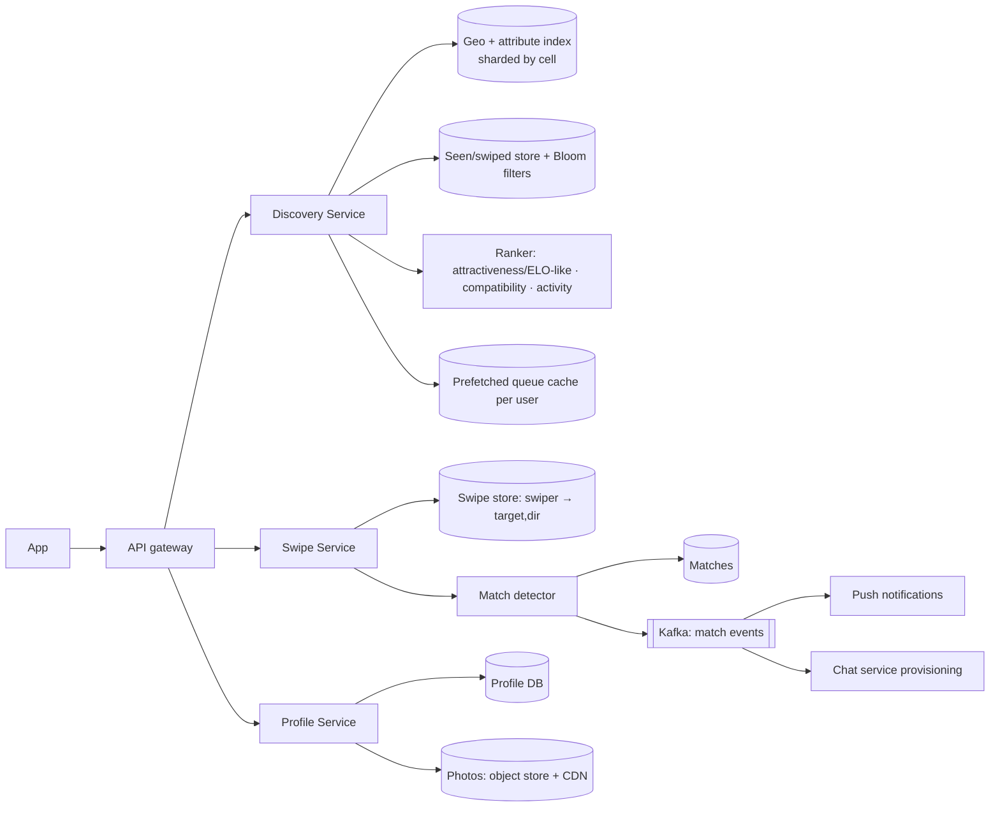

# 🔥 Design Tinder — High Level Design

<!-- nav:start -->
🏷️ **Priority:** Medium · **Difficulty:** Intermediate

⬅️ Previous: [Design Reddit](../Reddit/README.md) · 🏠 [Social Media Systems](../README.md) · ➡️ Next: [Design Spotify](../../10-Media-Streaming-and-Delivery/Spotify/README.md)

> 📚 **Credit:** Chapter selection, ordering and question choice follow the [AlgoMaster.io System Design Interviews course](https://algomaster.io/learn/system-design-interviews/course-roadmap). This write-up was created with Claude for personal interview prep. The premium lesson text was **not** accessed or reproduced. See [CREDITS](../../CREDITS.md).
<!-- nav:end -->

> A dating app is **geo-search + a recommendation queue + a matching state machine**. The distinctive problems: serving
> a stack of nearby candidates fast, never re-showing swiped profiles, and detecting mutual likes reliably.

## 1. Clarifying Requirements

| Candidate asks | Interviewer answers | Design impact |
|---|---|---|
| Core flow? | Swipe right/left on profiles; mutual right = match; then chat. | Swipe + match pipeline. |
| Candidates? | Nearby, matching preferences (age, gender, distance). | Geo + filter index. |
| Repeats? | Never show a swiped profile again. | Seen-set at huge scale. |
| Scale? | 50M DAU, 100 swipes/user/day. | 5B swipes/day. |
| Freshness? | Location updates as users move; new profiles appear. | Periodic index updates. |
| Match notification? | Instant push. | Real-time delivery. |
| Extras? | Boost, super-like, premium limits. | Quotas and ranking tweaks. |
| Safety? | Reports, blocks, photo verification. | Moderation pipeline. |

**Functional:** profiles/photos, discovery queue, swipe, match detection, chat, block/report, premium features.
**Non-functional:** stack loads < 300 ms, swipes never lost, match detection correct and fast, privacy-aware location handling.

## 2. Back-of-the-Envelope Estimation

| Quantity | Working | Result |
|---|---|---|
| Swipes | 50M × 100 | **5B/day ≈ 58k/s**, peak ~150k/s |
| Right swipes | ~30% | ~1.5B/day |
| Swipe record | 32 B | 160 GB/day ⇒ 58 TB/yr |
| Profiles | 500M × 5 KB + photos 5 × 300 KB | metadata 2.5 TB; photos ~750 TB on object storage/CDN |
| Recommendation requests | 1 batch of 20 per 20 swipes | ~3k/s |
| Location updates | on app open + periodic | ~10k/s |

## 3. Core APIs

```http
GET  /v1/discovery?limit=20                    → [{profile_id, name, age, photos[], distance_km, bio}]
POST /v1/swipes {target_id, dir: like|pass|superlike}   → {matched: bool, match_id?}
GET  /v1/matches?cursor=..                     POST /v1/matches/{id}/unmatch
PUT  /v1/me/location {lat,lng}                 PUT /v1/me/preferences {age_range, distance, gender}
POST /v1/reports {target_id, reason}           POST /v1/blocks {target_id}
```

## 4. High-Level Design



### 4.1 Swipe and match
Persist swipe `(swiper, target, dir)` (idempotent). If `dir = like`, check whether `(target, swiper) = like` exists
(point read); if yes ⇒ create match (unique on ordered pair), emit event ⇒ push both users, create chat thread.

### 4.2 Discovery queue
Generate candidates from nearby cells filtered by preferences, drop seen/blocked, rank, and **prefetch a batch**
into a per-user queue cache so opening the app is instant; refill in background when below a threshold.

## 5. Database Design

```text
profiles  user_id PK, name, dob, gender, bio, photos[], last_active, location(lat,lng,geocell), settings   (sharded KV/SQL)
swipes    PK (swiper_id, target_id) → dir, ts            -- wide-column; TTL/compaction for old passes
          reverse lookup for match check: (target_id, swiper_id) → same table point read
matches   PK (min(uid1,uid2), max(uid1,uid2)), created_at, status                   -- unique pair
geo index cell_id → [(user_id, attrs)] in memory/ES; updated on location change / periodically
seen      per user Bloom filter (or swipes table check) to exclude already-swiped ids
```

## 6. Design Deep Dive

### 6.1 Candidate retrieval
Use geo cells (S2/H3/geohash) covering the user's radius; filter by gender/age/mutual preferences and recent
activity; the index stores only compact attributes. Shard by region; big cities split finer. See
[Finding and Tracking Locations](../../05-Interview-Patterns/18-finding-and-tracking-locations.md).

### 6.2 Excluding already-swiped profiles
A user may swipe tens of thousands of profiles. Options:
- Query the swipes table for candidate ids (batch multi-get) and drop hits.
- **Per-user Bloom filter** of swiped ids (small, fast; false positives just hide a few unseen profiles).
- Anti-join at candidate-generation time using the index (store per-user exclusion as compressed bitmaps).
Combine Bloom (fast path) + table check for exactness where it matters.

### 6.3 Ranking
Score = f(mutual-interest likelihood, profile quality/response rate, recency of activity, distance, preference
fit, fairness/exposure for new users, premium boosts). Early systems used ELO-style desirability; modern ones use
learned models with two-sided (reciprocal) prediction: P(A likes B) × P(B likes A).

### 6.4 Match detection reliability
The like check-and-create must be race-safe when A and B swipe simultaneously: write swipe first, then read the reverse;
both sides may detect the match ⇒ create with a unique constraint on the normalised pair (insert-if-absent) so exactly one match row exists;
emit exactly one notification via idempotent event handling.

### 6.5 Location freshness and privacy
Update location on app open and significant movement; store coarse geocell for search and fuzz distance display
("5 km away"); avoid triangulation attacks (round distances, randomise, don't expose exact coordinates); retention limits.

### 6.6 Premium features and quotas
Daily like limits (counter with TTL per user), boosts (temporarily increase ranking weight in local region), rewind (store last swipe),
"who liked you" (reverse index of likes for premium; hidden for free).

### 6.7 Safety
Photo moderation (ML + human), duplicate/fake profile detection (face embeddings), report/block enforcement in candidate filters,
rate limits against bots and spam messages.

## 7. Follow-ups (with answers)

**7.1 How do you make discovery instant?** Precompute and cache a queue of ~50 candidates per active user in Redis; prefetch images; refill asynchronously.

**7.2 How would you handle 150k swipes/s?** Swipe writes are simple key writes to a partitioned wide-column store; match check is a point read; batch and async everything else (analytics, ranking updates).

**7.3 How do you stop the same profile from showing again?** Exclusion via swipes store + per-user Bloom filter applied during candidate generation and before serving the prefetched queue.

**7.4 What if two users like each other at the same instant?** Unique pair constraint ensures a single match record; idempotent notification keyed by match id.

**7.5 How do you keep the marketplace healthy (fair exposure)?** Rank with reciprocity and exposure caps, boost new users temporarily, avoid concentrating all likes on a few profiles.

**7.6 How do you handle users travelling?** "Passport" mode overrides location; recompute cell membership; invalidate cached queue.

## 🧪 Practice Round

<details><summary>Why is match detection a point lookup and not a join?</summary>
The key is `(target, swiper)`; one indexed read tells whether the reverse swipe exists.
</details>

<details><summary>Why use a Bloom filter for seen profiles?</summary>
Memory-efficient membership test; false positives only hide a small fraction of unseen profiles, which is acceptable.
</details>

## 📝 Last-Minute Revision

Geo-cell candidate retrieval → filter/exclude seen (Bloom) → rank (reciprocal) → prefetch queue; swipes in wide-column store; **unique pair** match creation; push via events; location privacy; premium quotas.

Related: [Finding and Tracking Locations](../../05-Interview-Patterns/18-finding-and-tracking-locations.md) · [Data Structures](../../02-Must-Know-Topics/04-data-structures.md) · [WhatsApp](../../08-Real-Time-Communication/WhatsApp/README.md)
