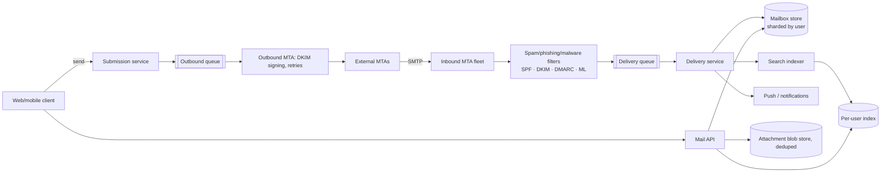

# ✉️ Design Gmail — High Level Design

<!-- nav:start -->
🏷️ **Priority:** Low · **Difficulty:** Advanced

⬅️ Previous: [Design Google Drive](../Google-Drive/README.md) · 🏠 [Media Streaming & Delivery](../README.md) · ➡️ Next: [Design Twitch](../Twitch/README.md)

> 📚 **Credit:** Chapter selection, ordering and question choice follow the [AlgoMaster.io System Design Interviews course](https://algomaster.io/learn/system-design-interviews/course-roadmap). This write-up was created with Claude for personal interview prep. The premium lesson text was **not** accessed or reproduced. See [CREDITS](../../CREDITS.md).
<!-- nav:end -->

> Email is one of the oldest distributed systems: **SMTP in, SMTP out, IMAP/web for reading**, with a modern layer of
> spam filtering, huge per-user storage, search and labels. Each mailbox is small and private; the challenge is
> the number of them and the hostile internet.

## 1. Clarifying Requirements

| Candidate asks | Interviewer answers | Design impact |
|---|---|---|
| Scope? | Send/receive mail, inbox/labels, search, attachments, spam filtering. | Core mail flow. |
| Protocols? | SMTP for transfer, web/mobile API (skip IMAP details). | MTA + API. |
| Scale? | 1.5B users, 300B emails/day (most spam). | Filtering dominates volume. |
| Storage? | 15 GB/user, attachments up to 25 MB. | Exabyte scale. |
| Search? | Fast full-text within own mailbox. | Per-user index. |
| Delivery guarantee? | Never lose accepted mail; delays OK (minutes). | Durable queues, retries. |
| Security? | TLS, SPF/DKIM/DMARC, phishing/malware detection. | Auth + filtering pipeline. |

**Functional:** compose/send, receive, threads, labels/folders, search, attachments, spam/phishing filtering, drafts, contacts.
**Non-functional:** durability above all, availability, per-user isolation, low-latency mailbox reads and search.

## 2. Back-of-the-Envelope Estimation

| Quantity | Working | Result |
|---|---|---|
| Inbound mail | 300B/day (≈90% spam) | **3.5M/s** at the edge; ~30B legit/day ≈ 350k/s |
| Avg message | 75 KB incl. attachments | 30B × 75 KB = **2.25 PB/day** legit |
| Storage | 1.5B users × ~10 GB used | **~15 EB** ⇒ tiered, dedup, compress |
| Reads | 1.5B users × 30 opens/day | ~500k/s metadata reads |
| Search | ~10% of sessions | ~50k/s |
| Attachments | ~20% of mail | dedupe by hash saves heavily |

## 3. Core APIs

```http
POST /v1/messages/send {to[],cc[],bcc[],subject,body,attachments[]}  → {message_id}
GET  /v1/messages?label=INBOX&q=..&cursor=..          GET /v1/messages/{id}    GET /v1/threads/{id}
POST /v1/messages/{id}/modify {addLabels, removeLabels, read}
POST /v1/attachments (resumable)        GET /v1/attachments/{id}
Mail transfer: SMTP (port 25 MTA↔MTA, 587 submission), IMAP/POP for legacy clients
```

## 4. High-Level Design



### 4.1 Receiving mail
Inbound MTA accepts via SMTP ⇒ connection-level checks (IP reputation, rate limits, TLS) ⇒ content pipeline (SPF/DKIM/DMARC
validation, malware scan, spam/phishing ML, classification) ⇒ durable queue ⇒ delivery service resolves the recipient's
mailbox shard, writes the message (metadata + body), applies labels/filters, updates index and notifies clients.
Acknowledge SMTP `250 OK` only after durable enqueue.

### 4.2 Sending mail
Client submits to the submission service (auth, rate limits, outbound spam checks) ⇒ outbound queue ⇒ MTA does MX lookup,
TLS delivery, DKIM signing, exponential-backoff retries (days), bounce handling (DSNs) ⇒ sender's Sent folder updated.

## 5. Database Design

```text
mailbox shard (per user) — Bigtable/Spanner-like:  row key = (user_id, message_id or thread_id)
  message: headers, labels[], flags(read,starred), size, snippet, blob_ref(body), attachment_refs, internal_date
  thread:  thread_id → message_ids
labels     (user_id, label) → counts (unread totals maintained)
blobs      body/attachments in distributed blob store; content-hash dedupe (same PDF sent to millions)
search     per-user inverted index (or shared index with user-scoped routing/security)
queues     inbound/outbound/retry queues (durable, replicated)
```
Shard by **user_id**: a mailbox lives together, giving locality and easy isolation, migration and backup per user.

## 6. Design Deep Dive

### 6.1 Reliability: never lose accepted mail
Persist to replicated storage (multi-datacenter) before acknowledging SMTP; retries with backoff for temp failures;
idempotent delivery by `Message-ID` + recipient (dedupe); dead-letter queue and bounce generation for permanent failures.
Backups and point-in-time restore for user error; per-user replicas across regions.

### 6.2 Spam and abuse (the bulk of traffic)
Layers: connection reputation and rate limiting (cheap, first), authentication checks (SPF/DKIM/DMARC), content heuristics,
ML classifiers, URL/attachment sandboxing, user feedback loops ("report spam") retraining models, per-sender reputation.
Design for ~90% rejection cheaply early; heavier analysis only for uncertain mail. False positives are worse than false negatives
for legit senders: quarantine/Spam folder rather than reject when unsure.

### 6.3 Search
Per-user index (mail arrives ⇒ tokenise/index asynchronously): fields (from, to, subject, body, labels, dates, has:attachment).
Small per-user indices are cache-friendly; tiering for cold mailboxes; ACL trivial (owner only). Index freshness within seconds.

### 6.4 Storage efficiency
Dedupe attachments and identical bodies by content hash (careful with privacy: dedupe only within a domain or via encrypted references),
compress bodies, store large attachments in blob store with pointer, tier old mail to cheaper storage, quotas.

### 6.5 Threading and labels
Thread by `References`/`In-Reply-To` headers + subject heuristics; labels are many-to-many tags (a message can be in several) implemented
as a label list per message plus per-label indexes for listing; unread counts maintained incrementally.

### 6.6 Sync and clients
Push (long-lived connections / mobile push) for new mail; incremental sync via history IDs (`historyId` cursor);
IMAP compatibility layer translating folder semantics on top of labels.

### 6.7 Security and privacy
TLS everywhere (opportunistic between MTAs, MTA-STS), DKIM signing, phishing warnings, 2FA, encryption at rest, per-user data
access audit, compliance/e-discovery for enterprise, data residency by region.

## 7. Follow-ups (with answers)

**7.1 How do you handle a 25 MB attachment sent to 10,000 recipients?** Store the blob once (hash-dedupe); each recipient's message references the blob; deliveries are queued and paced; large-file links via cloud storage for oversized attachments.

**7.2 What if a recipient's mailbox shard is temporarily down?** The message waits in the durable delivery queue and is retried; SMTP has already been acknowledged, so nothing is lost; alerts if delay exceeds thresholds.

**7.3 How do you make search fast across 15 GB mailboxes?** Per-user inverted index with hot/cold tiers, filters on labels/dates first, and caching of recent queries; index in the background from the delivery event stream.

**7.4 How do you stop your own users from sending spam?** Outbound rate limits and reputation, content scanning, new-account restrictions, monitoring bounce/complaint rates, automatic suspension and CAPTCHA/verification.

**7.5 How do you support undo send?** Delay outbound release by a short window (e.g. 10–30 s) in the outbound queue; cancel before dispatch.

**7.6 How do you do migrations or resharding of mailboxes?** Per-user mailbox moves: copy snapshot + tail changes, briefly quiesce writes, atomically flip the shard mapping, verify checksums, then delete the old copy.

## 🧪 Practice Round

<details><summary>Why acknowledge SMTP only after durable enqueue?</summary>
Once you reply 250 OK the sender considers delivery complete; if you crash before persisting, the mail is lost forever.
</details>

<details><summary>Why shard by user?</summary>
Almost every operation (read, search, label) is within one mailbox, so co-locating data gives locality, isolation and easy moves.
</details>

## 📝 Last-Minute Revision

SMTP in → cheap early spam filtering → **durable queue** → per-user shard write → async per-user index; outbound queue with DKIM + retries + bounces; blob dedupe for attachments; sync via history cursors; durability > latency.

Related: [Messaging and streaming](../../_Reference/messaging-and-streaming.md) · [Search and Typeahead](../../05-Interview-Patterns/17-search-and-typeahead.md) · [Google Drive](../Google-Drive/README.md)
