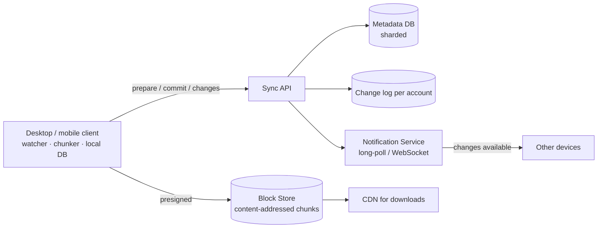

# 🗂️ Design Google Drive (File Storage and Sync) — High Level Design

<!-- nav:start -->
🏷️ **Priority:** High · **Difficulty:** Intermediate

⬅️ Previous: [Design YouTube](../YouTube/README.md) · 🏠 [Media Streaming & Delivery](../README.md) · ➡️ Next: [Design Uber](../../11-Location-Based-Services/Uber/README.md)

> 📚 **Credit:** Chapter selection, ordering and question choice follow the [AlgoMaster.io System Design Interviews course](https://algomaster.io/learn/system-design-interviews/course-roadmap). This write-up was created with Claude for personal interview prep. The premium lesson text was **not** accessed or reproduced. See [CREDITS](../../CREDITS.md).
<!-- nav:end -->


> A sync product is a **distributed system with unreliable clients**: laptops sleep, phones go
> offline mid-upload, two devices edit the same file. The design is about tiny diffs, safe commits and
> honest conflict handling.

---

## 📑 On this page

1. [Clarifying Requirements](#1-clarifying-requirements) · 2. [Estimation](#2-back-of-the-envelope-estimation) ·
3. [Core APIs](#3-core-apis) · 4. [High-Level Design](#4-high-level-design) · 5. [Database Design](#5-database-design) ·
6. [Deep Dive](#6-design-deep-dive) · 7. [Follow-ups](#7-follow-ups-with-answers)

---

## 1. Clarifying Requirements

| Candidate asks | Interviewer answers | Design impact |
|---|---|---|
| Automatic sync across devices? | Yes, near real time. | Change notifications + cursors. |
| File size? | Up to 50 GB. | Chunked, resumable. |
| Sharing? | Users and links, view/edit. | ACLs, signed URLs. |
| Versioning? | 30-day history. | Version table, GC. |
| Offline edits? | Yes. | Conflict handling. |
| Real-time co-editing of docs? | Out of scope (mention OT/CRDT). | — |
| Scale? | 500M users, 50M DAU. | Metadata sharding. |

**Functional:** upload/download, sync, sharing, versions.
**Non-functional:** **never lose data**, bandwidth efficient, eventually consistent across devices,
strong consistency for metadata operations.

---

## 2. Back-of-the-Envelope Estimation

| Quantity | Working | Result |
|---|---|---|
| Sync operations | 50M DAU × 2 changes | 100M/day ⇒ **~1.2k/s**, peak ~5k/s |
| Storage | 500M users × 5 GB avg | **~2.5 EB logical** (dedupe + tiering reduce it) |
| Chunk count | 2.5 EB ÷ 4 MB | ~600 B chunks; index by hash |
| Metadata rows | ~200 files/user × 500M users | **~100B rows × ~1 KB ≈ 100 TB** ⇒ sharded DB |
| Notification connections | ~20M online devices | long-poll/WebSocket fleet |

---

## 3. Core APIs

```http
POST /v1/files/prepare      { path, size, chunk_hashes[] }  → { missing_chunks[], upload_urls[] }
PUT  <presigned url>        (upload only the missing chunks)
POST /v1/files/commit       { path, base_version, chunk_hashes[] } → { version } | 409 conflict
GET  /v1/changes?cursor=c123&limit=500     → { changes[], next_cursor }
GET  /v1/files/{id}/download-urls?version=  → signed chunk URLs
POST /v1/shares             { path, principal|link, role, expires }
```

---

## 4. High-Level Design



### 4.1 Requirement 1: Upload / edit a file
1. Client chunks the file (e.g. 4 MB), hashes each chunk (SHA-256).
2. `prepare` returns which hashes the server lacks. Client uploads only those (dedupe + delta).
3. `commit` creates a new file version pointing to the ordered chunk list; append to the account's
   change log; notify other devices. **Blocks first, metadata last** — a crash never leaves a
   version referencing missing blocks.

### 4.2 Requirement 2: Sync to other devices
Notification says "changes available". Device calls `changes(cursor)`, downloads missing chunks,
applies to disk, advances its cursor. Missed notifications are harmless: devices also poll on
start-up and periodically.

---

## 5. Database Design

```text
files      (SQL sharded by account/namespace)
  file_id PK, namespace_id, parent_id, name, latest_version, is_dir, deleted
versions   file_id, version, chunk_hashes[] (ordered), size, modified_by, created_at
chunks     (KV, content-addressed)  sha256 -> storage_location, refcount, size
change_log namespace_id, seq (monotonic), file_id, op(create|update|move|delete), version
shares     resource_id, principal, role, expires_at
devices    device_id, account_id, cursor
```

Metadata needs transactions (rename/move, commit) ⇒ relational; chunks are immutable blobs in
object storage.

---

## 6. Design Deep Dive

### 6.1 Chunking and dedupe
Fixed-size chunks are simple; **content-defined chunking** (rolling hash) keeps chunk boundaries
stable after insertions so an edit near the top changes only a couple of chunks. Identical chunks
across files/versions/users are stored once (refcounted). Cross-user dedupe leaks "someone has this
file"; scope dedupe per account or use protections.

### 6.2 Consistency of commits
`commit(base_version)` succeeds only if `latest_version == base_version` (optimistic concurrency);
otherwise 409 ⇒ conflict path. Metadata commit and change-log append happen in one transaction.

### 6.3 Change log and cursors
Per-namespace monotonic `seq`; every mutation appends. Clients track the last seq applied ⇒ resumable,
idempotent syncing; pagination trivial. Compact old log entries beyond retention with a snapshot.

### 6.4 Notifications
Long-poll or WebSocket per device on a notification service; payload is just "namespace X has new
seq". Fan-out for shared folders goes to every member's devices.

### 6.5 Durability
Erasure-coded or 3× replicated object storage across zones, checksums verified on read, periodic
scrubbing; versions retained; soft-delete with trash period; garbage collection of unreferenced
chunks after a grace delay.

---

## 7. Follow-ups (with answers)

### 7.1 Two devices edit the same file offline. What happens?
The second commit carries a stale `base_version` → **409**. Do not overwrite. Keep the winner as the
latest version and save the loser as a **"conflicted copy"** (or merge for mergeable formats). For
structured docs, use OT/CRDT so edits merge automatically.

### 7.2 How do you upload a 50 GB file over a flaky network?
Resumable chunked upload: the client asks `prepare` again and only missing chunks upload; parallel
chunk uploads; each chunk retried independently; commit only when all present.

### 7.3 How do you implement sharing and permissions?
ACL per file/folder with inheritance; permission check on every metadata call and when minting
signed download URLs (short expiry). Link sharing uses unguessable tokens with optional
password/expiry. Revocation = delete ACL + token; already-issued signed URLs expire soon.

### 7.4 How do you delete data that must be gone (GDPR)?
Delete metadata, decrement chunk refcounts; a GC purges chunks at zero after the recovery window;
purge from backups on their rotation schedule; log the deletion for audit.

### 7.5 How would client-side encryption affect the design?
Chunks are encrypted before upload: server-side dedupe across users breaks (unless convergent
encryption, with its own leak risks); server can't generate previews or search; key sharing for
shared folders becomes the hard problem.

### 7.6 How do you sync a directory with a million files?
Scan once, then rely on OS file-watch events; hash-tree (Merkle-style) per folder to find diffs
cheaply; batch metadata calls; pagination via cursors.

---

## 🧪 Practice Round

<details><summary>1. Why upload blocks before committing metadata?</summary>
So metadata never points at data that does not exist; crashed uploads leave only orphan chunks that
GC reclaims.
</details>

<details><summary>2. Why content-defined chunking?</summary>
An insertion shifts fixed-size boundaries and changes every following chunk; rolling-hash boundaries
resynchronise after the edit.
</details>

---

## 📝 Last-Minute Revision

- Client chunks + hashes → `prepare` (which are missing) → upload → `commit(base_version)`.
- Metadata in sharded SQL, chunks content-addressed in object storage, per-account **change log** + cursors.
- Conflicts: 409 → conflicted copy or CRDT/OT. Notify via long-poll; devices also poll.
- Durability: replicate/erasure code, checksums, versions, GC with grace period.
- Concepts: [CDN & storage](../../_Reference/cdn-and-storage.md) ·
  [replication](../../03-Concept-Deep-Dives/05-Distributed-Systems/01-replication.md) ·
  [real-time/sync patterns](../../_Reference/realtime-and-sync-patterns.md)

---

## 📚 References & Credits

| Resource | Use |
|---|---|
| [rsync algorithm paper (Tridgell & Mackerras)](https://rsync.samba.org/tech_report/) | Public delta-sync background |
| Public engineering blogs on sync engines | General background |

Original work; personal learning project, not affiliated with AlgoMaster.io.
