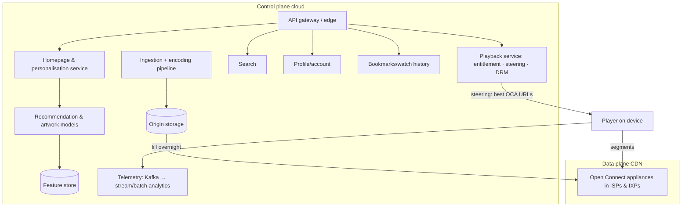

# 🍿 Design Netflix — High Level Design

<!-- nav:start -->
🏷️ **Priority:** High · **Difficulty:** Intermediate

⬅️ Previous: [Design YouTube](../YouTube/README.md) · 🏠 [Media Streaming & Delivery](../README.md) · ➡️ Next: [Design Google Drive](../Google-Drive/README.md)

> 📚 **Credit:** Chapter selection, ordering and question choice follow the [AlgoMaster.io System Design Interviews course](https://algomaster.io/learn/system-design-interviews/course-roadmap). This write-up was created with Claude for personal interview prep. The premium lesson text was **not** accessed or reproduced. See [CREDITS](../../CREDITS.md).
<!-- nav:end -->

> Netflix is a **licensed-catalogue, subscription video service** where nearly all traffic is playback of a limited
> catalogue. That property (small catalogue, predictable popularity) enables a signature design: **pre-position content
> inside ISP networks** and split the system into a control plane (cloud) and a data plane (CDN).

## 1. Clarifying Requirements

| Candidate asks | Interviewer answers | Design impact |
|---|---|---|
| Content source? | Licensed/original catalogue (~20k titles), uploaded by studios/ops. | Controlled ingestion, not UGC. |
| Devices? | TVs, phones, browsers, consoles (thousands of device types). | Per-device encodes and players. |
| Playback? | Start < 2 s, adaptive bitrate, resume, multi-profile. | ABR + prefetch. |
| Scale? | 250M subscribers, 100M concurrent at peak (evening). | ~100+ Tbps. |
| Personalisation? | Rows/artwork/ranking tailored per profile. | Recommendation service. |
| DRM? | Yes. | Licence servers. |
| Regions? | 190 countries, regional catalogues. | Licensing rules. |

**Functional:** browse personalised catalogue, search, play with adaptive quality, resume/continue watching, profiles, downloads, ratings/my list.
**Non-functional:** fast reliable playback, global availability, cost-efficient delivery, graceful degradation.

## 2. Back-of-the-Envelope Estimation

| Quantity | Working | Result |
|---|---|---|
| Peak concurrent streams | given | 100M |
| Peak egress | 100M × ~5 Mbps avg | **~500 Tbps** (order of magnitude; efficiency via ISP caches) |
| Catalogue | 20k titles × ~1,200 encodes (bitrate/resolution/codec/audio/subtitles) × ~1–5 GB avg | **~10–100 PB** origin |
| Popular subset | Top ~10% of titles ≈ 90% of plays | Cache only hot set at edge (~100s of TB per site) |
| Playback API | 250M × ~10 requests/session | small vs media bytes |
| Watch events | 100M × 1/min | ~1.7M/s heartbeat/telemetry ⇒ aggregated |

## 3. Core APIs

```http
GET  /v1/home?profile=..           → rows [{title, items:[{id, artwork_url, ...}]}]  (personalised)
GET  /v1/titles/{id}               GET /v1/search?q=
POST /v1/playback/{title_id}/start {device, capabilities} → {manifest_url, cdn_urls[], drm_license, bookmark}
POST /v1/playback/heartbeat {position, bitrate, rebuffer_stats}     POST /v1/my-list/{id}
```

## 4. High-Level Design



### 4.1 Browse
Homepage service composes rows from personalised recommendation models (offline batch + online re-rank), artwork
selection per profile, and ranks per device; results cached per profile with short TTL; precomputed for active users.

### 4.2 Play
Playback service verifies subscription/region/concurrent-stream limits, picks the best cache nodes (health, proximity,
content presence), returns manifest + URLs + DRM licence. The player pulls segments **directly from ISP-embedded
caches**; the cloud is out of the media path.

## 5. Database Design

```text
title/season/episode metadata   graph-like but stored as documents in Cassandra/EVCache-backed services
member/profile/subscription     relational/KV with strong consistency for billing/entitlement
viewing history & bookmarks     Cassandra (user_id, title_id) → position, updated_at; TTL/archive
encodes                         (title_id, profile) → files + manifests in object storage
recommendation features         feature store + precomputed candidate lists per profile (KV)
telemetry                       Kafka → Iceberg/Parquet lake; metrics (Atlas-like TSDB)
```

## 6. Design Deep Dive

### 6.1 Content delivery network (data plane)
Own CDN: appliances placed inside ISPs and internet exchanges. **Proactive fill**: during off-peak hours, popular titles
are pushed to caches based on predicted regional popularity; peak-time traffic then never touches origin. Consistent
hashing of title→appliance within a site; health steering. This reduces transit cost and improves quality.

### 6.2 Encoding pipeline
Ingest studio masters → QC → **chunked parallel encoding** into per-title/shot-based bitrate ladders (higher efficiency than fixed ladders),
multiple codecs (H.264, HEVC, VP9, AV1), HDR/Dolby Vision, audio languages and subtitles; content-aware encoding; distributed workers
via a workflow orchestrator with retry; output validated by automated quality metrics (VMAF).

### 6.3 Adaptive streaming and playback experience
Player: ABR algorithm using throughput + buffer; start with conservative rung; switch between CDN nodes on errors;
prefetch next episode; skip intro markers; resume from bookmark; telemetry on rebuffer/startup used to tune ladders.

### 6.4 Personalisation
Candidate generation (collaborative filtering, embeddings, trending), ranking models per row and per position, artwork
personalisation via bandits/contextual experimentation, A/B testing everywhere. Precompute for active profiles in batch;
online layer handles context (time, device) and recency; cache results in EVCache.

### 6.5 Resilience engineering
Multi-region active-active control plane; **chaos engineering** (killing instances/regions); bulkheads and circuit breakers
(Hystrix-style), fallbacks (generic homepage if personalisation fails), request hedging; regional failover with traffic
shifting; degrade features before playback. Playback is protected as the top priority path.

### 6.6 Data consistency choices
Billing/entitlement: strong (relational). Watch history/bookmarks: eventual, last-write-wins by timestamp OK. Catalogue:
replicated caches with invalidation. Multi-region writes via Cassandra multi-DC.

### 6.7 Licensing and geography
Catalogue availability by territory and time windows; enforce at playback service and filter in browse/search; propagate
changes with events and cache invalidations.

## 7. Follow-ups (with answers)

**7.1 What makes Netflix's delivery different from YouTube's?** Small, predictable catalogue allows proactive pre-positioning in ISP caches; YouTube has a huge, unpredictable long tail with UGC, needing reactive caching and heavier origin traffic.

**7.2 How do you handle a new season release that everyone watches at once?** Predictive fill of caches before launch, staggered regional release windows, origin shield, and capacity planning with headroom; playback steering avoids overloaded nodes.

**7.3 What happens if the recommendation service is down?** Fallback to cached rows or generic popular content; homepage still loads; playback unaffected.

**7.4 How do you enforce "4 concurrent streams per plan"?** Playback start/heartbeat updates a per-account active-session set with TTL; start denied if the limit is exceeded; heartbeat expiry frees slots.

**7.5 How do you measure and improve quality of experience?** Player telemetry (startup time, rebuffer ratio, bitrate) aggregated by device/ISP/CDN node; used for steering, ladder tuning and detecting regional problems; alert on regressions.

**7.6 How would you support downloads?** Encrypted downloads with device-bound licences, expiry windows, per-title limits, smart downloads of next episodes.

## 🧪 Practice Round

<details><summary>Why keep the cloud out of the media path?</summary>
Media is 95%+ of bytes; serving from ISP caches cuts latency and cost, and the cloud only handles small control requests.
</details>

<details><summary>Why per-title encoding?</summary>
Different content needs different bitrates for the same perceived quality; tailored ladders save bandwidth and storage.
</details>

## 📝 Last-Minute Revision

Control plane (cloud) vs data plane (**Open Connect** ISP caches); proactive nightly fill; per-title/shot-based encoding with many renditions; steering at playback start; personalised rows/artwork; chaos engineering; strong consistency only for billing/entitlement.

Related: [YouTube](../YouTube/README.md) · [Streaming Video and Audio](../../05-Interview-Patterns/08-streaming-video-and-audio.md) · [Design CDN](../../15-Distributed-Infrastructure/CDN/README.md)
