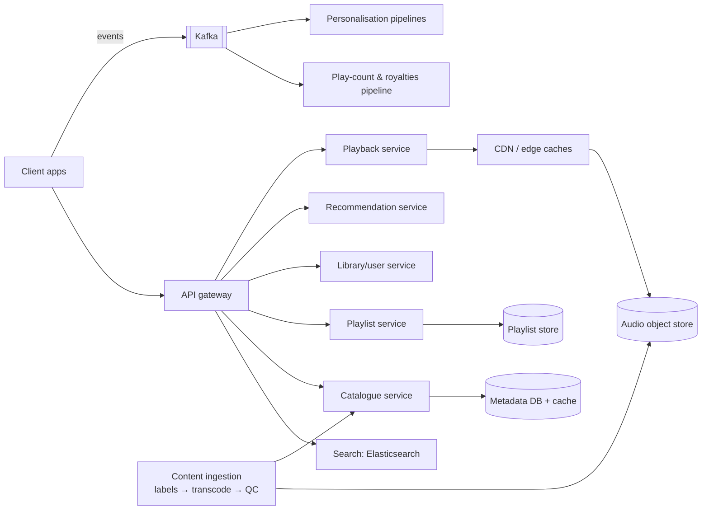

# 🎧 Design Spotify — High Level Design

<!-- nav:start -->
🏷️ **Priority:** Medium · **Difficulty:** Intermediate

⬅️ Previous: [Design Tinder](../../09-Social-Media-Systems/Tinder/README.md) · 🏠 [Media Streaming & Delivery](../README.md) · ➡️ Next: [Design YouTube](../YouTube/README.md)

> 📚 **Credit:** Chapter selection, ordering and question choice follow the [AlgoMaster.io System Design Interviews course](https://algomaster.io/learn/system-design-interviews/course-roadmap). This write-up was created with Claude for personal interview prep. The premium lesson text was **not** accessed or reproduced. See [CREDITS](../../CREDITS.md).
<!-- nav:end -->

> Audio streaming is *lighter* than video (a 4-minute track is ~4 MB), so the hard parts move from bandwidth to
> **catalogue scale, playlist consistency, offline mode, recommendations and royalty-grade play counting**.

## 1. Clarifying Requirements

| Candidate asks | Interviewer answers | Design impact |
|---|---|---|
| Core features? | Search/browse, stream, playlists, library, offline download, recommendations. | Broad but shallow scope. |
| Content? | Licensed catalogue (100M tracks) + podcasts. | Ingestion pipeline from labels. |
| Playback? | Gapless, fast start (<300 ms), any network. | Prefetch + caching. |
| Offline? | Premium users download playlists. | DRM + local storage. |
| Play counts? | Must be accurate for royalties. | Reliable event pipeline. |
| Scale? | 500M MAU, 200M DAU, 30 tracks/user/day. | 6B plays/day. |
| Collaboration? | Collaborative playlists, sharing. | Concurrency in playlists. |

**Functional:** search, play, queue, playlists (create/edit/collaborate), like/save, follow artists, offline, recommendations (Discover Weekly), social.
**Non-functional:** low start latency, high availability of playback, accurate play events, licensing/regional restrictions.

## 2. Back-of-the-Envelope Estimation

| Quantity | Working | Result |
|---|---|---|
| Plays | 200M × 30 | **6B/day ≈ 70k/s**, peak ~200k/s |
| Audio egress | 6B × ~4 MB (mix of 96–320 kbps) | **~24 PB/day** ⇒ CDN |
| Catalogue storage | 100M tracks × ~5 encodings × 5 MB | **~2.5 PB** (small vs video) |
| Metadata | 100M tracks × 5 KB | 500 GB |
| Playlists | 4B playlists × avg 50 tracks × 16 B | ~3.2 TB |
| Play events | 6B × 200 B | 1.2 TB/day |

## 3. Core APIs

```http
GET  /v1/search?q=..&types=track,artist,album,playlist
GET  /v1/tracks/{id}/stream-info → {cdn_url(s) signed, codec, bitrate, drm_license_url}
POST /v1/me/player/play {context_uri, position}      POST /v1/events/play {track_id, ms_played, ts, ctx}
POST /v1/playlists   PUT /v1/playlists/{id}/tracks {add|remove|move, snapshot_id}
GET  /v1/me/recommendations         POST /v1/me/downloads {playlist_id}
```

## 4. High-Level Design



### 4.1 Playing a track
Client asks playback service for stream info: entitlement check (subscription tier, country licensing), returns signed
CDN URL(s) for the chosen bitrate; client streams progressive/segmented audio, prefetching next track(s) and caching
locally. Playback events (start, 30 s mark, end, skips) are batched to Kafka.

### 4.2 Content ingestion
Labels/distributors deliver audio + metadata ⇒ validation ⇒ transcode to several codecs/bitrates (Ogg Vorbis/AAC),
loudness normalisation, fingerprinting, artwork ⇒ store files, publish catalogue metadata, invalidate caches, update
search index.

## 5. Database Design

```text
tracks     track_id PK, album_id, artist_ids[], duration, isrc, territories[], files{bitrate→object_key}    (KV/Cassandra, heavy cache)
albums/artists/podcasts  similar entities, relations denormalised for read paths
playlists  playlist_id PK, owner, name, snapshot_id/version, collaborative, created_at
playlist_items (playlist_id, position or fractional index) → track_id, added_by, ts    -- ordered
user_library (user_id, type, item_id, saved_at)   -- liked songs, followed artists
play_events Kafka → warehouse; counters per track/day for charts; royalty ledger (exactly-once reconciled)
search index  denormalised docs per entity with popularity and locale
```

## 6. Design Deep Dive

### 6.1 Fast, reliable playback
- Small files: cache aggressively at CDN and on device (LRU); **prefetch** next 1–2 tracks and start of shuffled candidates.
- Multiple bitrates with auto-adaptation; gapless via crossfade/prebuffer; resume position sync across devices.
- Popular tracks pre-positioned in edge caches; the long tail served from regional/origin; peer-assisted delivery historically reduced origin load.

### 6.2 Playlists at scale
Playlists are ordered lists edited concurrently (collaborative). Use **versioned snapshots** (`snapshot_id`) with
optimistic concurrency: edits carry the base snapshot; conflicts resolved by rebasing operations (add/remove/move) or
CRDT-like fractional indexing for positions. Store items as rows keyed by playlist with a position key; hot popular
playlists cached and read-mostly.

### 6.3 Search and discovery
Elasticsearch index over tracks/artists/albums/playlists with typo tolerance, language analysis, popularity signals,
personalisation and locale boosts; typeahead via prefix index. Browse pages assembled by a home service combining
shelves (recently played, made-for-you, new releases).

### 6.4 Recommendations
Offline pipelines: collaborative filtering / embeddings from listening histories, audio features/NLP on metadata;
generate weekly personalised playlists (batch, stored per user); online layer re-ranks with context (time, device, recent
plays). Cold start: editorial playlists and popularity by market.

### 6.5 Play counting and royalties
Events must be reliable but not on the playback critical path: client batches ⇒ Kafka ⇒ stream dedupe by event id ⇒ counts;
a stricter **reconciliation** job produces royalty-grade totals from immutable logs (defines "a stream" as ≥30 s). Tolerate
duplicates via idempotent aggregation; audit trails retained.

### 6.6 Offline mode and DRM
Downloads are encrypted, bound to device and account; licence checks periodically (e.g. every 30 days online); local database
of downloaded items; sync deletions. Storage limits and re-download on expiry.

### 6.7 Regional licensing
Track availability per territory in catalogue; playback service enforces by user country (IP + account); search/recs filter
unavailable items; changes propagate via events and cache invalidation.

## 7. Follow-ups (with answers)

**7.1 How do you prevent a hot new album release from overloading the system?** Pre-position new-release audio and metadata in edge caches before release time, CDN request coalescing, cache warm-up of catalogue pages, rate limit non-critical calls, autoscale.

**7.2 How do you keep shuffle random but not repetitive?** Server or client permutes queue with constraints (avoid repeating artists/recent plays); stores seed/position so resume is consistent across devices.

**7.3 How do you sync "now playing" across devices (Spotify Connect)?** Session/state service with a WebSocket per device; the controlling device sends commands routed to the target device; state (track, position, queue) held server-side with versioning.

**7.4 How would you design the "Recently played" list?** Append play events to a per-user capped list (Redis/Cassandra with TTL/limit); dedupe consecutive plays; read via cache.

**7.5 How do you handle podcasts differently?** Larger files, RSS ingestion, progress tracking per episode, ad insertion (server-side), chapters, lower recommendation churn; CDN + resumable downloads.

**7.6 How do you count 30-second plays accurately with flaky mobile connections?** Client accumulates events locally with unique ids and retries; server dedupes; missing end events are inferred from heartbeats; reconciliation adjusts.

## 🧪 Practice Round

<details><summary>Why is audio delivery easier than video?</summary>
Files are ~10–50× smaller, so bandwidth and storage are modest; catalogue, personalisation and correctness of usage data become the challenges.
</details>

<details><summary>Why keep royalty counting off the playback path?</summary>
Playback must never fail because analytics are slow; events are async and reconciled for accuracy later.
</details>

## 📝 Last-Minute Revision

Metadata + search + playlists (versioned, ordered) + CDN audio; prefetch and local cache; play events → Kafka → deduped counts + royalty reconciliation; offline via encrypted downloads; territory licensing at entitlement check; batch recs (Discover Weekly).

Related: [Streaming Video and Audio](../../05-Interview-Patterns/08-streaming-video-and-audio.md) · [Search and Typeahead](../../05-Interview-Patterns/17-search-and-typeahead.md) · [YouTube](../YouTube/README.md)
