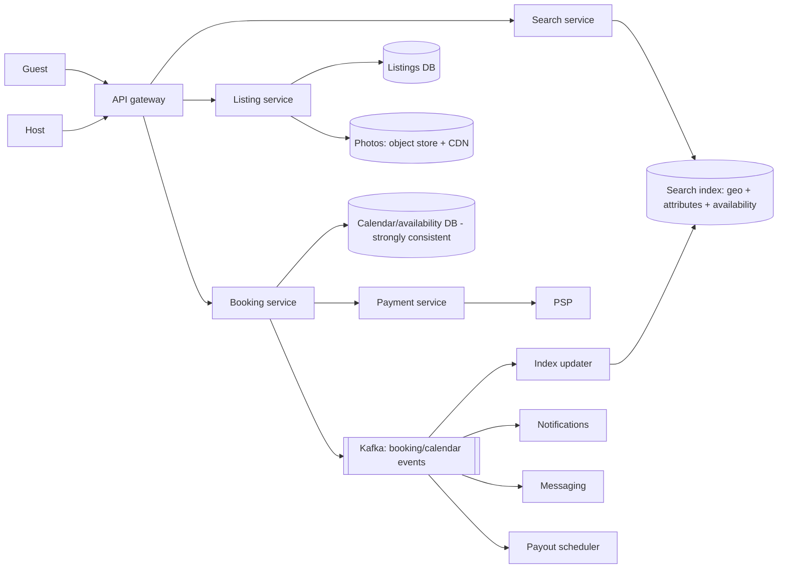

# 🏠 Design Airbnb — High Level Design

<!-- nav:start -->
🏷️ **Priority:** Medium · **Difficulty:** Intermediate

⬅️ Previous: [Design Twitch](../../10-Media-Streaming-and-Delivery/Twitch/README.md) · 🏠 [Location-Based Services](../README.md) · ➡️ Next: [Design Food Delivery Service](../Food-Delivery-Service/README.md)

> 📚 **Credit:** Chapter selection, ordering and question choice follow the [AlgoMaster.io System Design Interviews course](https://algomaster.io/learn/system-design-interviews/course-roadmap). This write-up was created with Claude for personal interview prep. The premium lesson text was **not** accessed or reproduced. See [CREDITS](../../CREDITS.md).
<!-- nav:end -->

> Airbnb is a **two-sided marketplace over unique, date-based inventory**. Search must combine location, dates, price and
> filters; booking must never double-book a night; payments split between guest, host and platform.

## 1. Clarifying Requirements

| Candidate asks | Interviewer answers | Design impact |
|---|---|---|
| Core flows? | Host lists property + calendar; guest searches, views, books, pays; reviews. | Search + booking + payments. |
| Search? | By location, dates, guests, price, amenities; map view. | Geo + availability filter. |
| Booking? | Instant book or host approval. | State machine. |
| Concurrency? | Two guests must not book overlapping dates. | Strong consistency for calendar. |
| Scale? | 7M listings, 150M users, 2M bookings/month(~1/s), 100M searches/day. | Search-heavy. |
| Payments? | Charge guest, pay host after check-in, refunds/cancellations. | Escrow-like flow. |
| Trust? | Reviews, identity, fraud. | Additional services. |

**Functional:** listing management, availability calendar and pricing, search/filter/map, booking + payment, messaging, reviews, cancellation policies.
**Non-functional:** search p99 < 500 ms, no double bookings, high availability of browse, eventual consistency OK for search index freshness (seconds–minutes).

## 2. Back-of-the-Envelope Estimation

| Quantity | Working | Result |
|---|---|---|
| Searches | 100M/day | **~1.2k/s**, peak ~4k/s |
| Bookings | 2M/month | **<1/s** avg (tiny) |
| Listings | 7M × ~20 KB (with photos refs) | ~140 GB metadata |
| Calendar rows | 7M listings × 365 days | **2.5B rows** (1–2 years) × ~50 B ≈ 125 GB |
| Photos | 7M × 20 × 500 KB | ~70 TB (CDN) |
| Search index | 7M docs + availability bitmaps | a few hundred GB |

Search and browse dominate; booking is low-volume but correctness-critical.

## 3. Core APIs

```http
GET  /v1/search?lat=..&lng=..&radius=..&checkin=2026-12-20&checkout=2026-12-25&guests=2&price_max=200&amenities=wifi,pool&cursor=
GET  /v1/listings/{id}?checkin=&checkout=         → details, price quote, availability
POST /v1/bookings {listing_id, checkin, checkout, guests, payment_method}  Idempotency-Key → 201 | 409 unavailable
POST /v1/bookings/{id}/cancel     POST /v1/reviews     PUT /v1/hosts/listings/{id}/calendar {dates, price, blocked}
```

## 4. High-Level Design



### 4.1 Search
Search service builds a query (geo box/polygon, guest count, price, amenities, dates); the index holds listing attributes and
availability; results ranked by relevance/quality/price, personalised; map clusters/pins returned by viewport. Detail page fetches
authoritative price/availability from listing + calendar services.

### 4.2 Booking
1. Quote: price = nightly rates + fees + taxes − discounts, computed server-side.
2. Reserve dates: atomic write to calendar (conditional update on all nights) creating a `PENDING` booking/hold.
3. Charge (authorise) via payment service (idempotent).
4. Confirm booking (instant) or wait for host acceptance (timeout ⇒ release + void auth).
5. Emit events: update index, notify, schedule payout after check-in.

## 5. Database Design

```text
listings   listing_id PK, host_id, geo(lat,lng,cell), type, capacity, amenities[], base_price, policy_id, status     (SQL/KV + cache)
calendar   PK (listing_id, date) → status(AVAILABLE|BOOKED|BLOCKED|HELD), price, booking_id, min_stay, version       -- strongly consistent, partitioned by listing_id
bookings   booking_id PK, listing_id, guest_id, checkin, checkout, total, status, payment_ref, idempotency_key UNIQUE, created_at
reviews    (listing_id, created_at) → rating, text ; two-sided review windows
search doc {listing_id, geo_point, price_range, amenities, rating, capacity, availability_bitmap (next 365 days), ...}
payouts    booking_id → schedule, status
```
Calendar keyed by `(listing_id, date)`: one row per night makes conflict detection a simple unique/conditional write.

## 6. Design Deep Dive

### 6.1 No double booking
Book multiple nights atomically in one transaction on the listing's partition:
```sql
UPDATE calendar SET status='HELD', booking_id=:b
WHERE listing_id=:l AND date BETWEEN :in AND :out - 1 AND status='AVAILABLE';
-- rows_affected must equal nights, else ROLLBACK
```
All rows share `listing_id` ⇒ same shard ⇒ single-node transaction. Alternatives: Postgres exclusion constraint on date ranges.
Holds expire (checked in SQL). See [Preventing Double Booking](../../05-Interview-Patterns/14-preventing-double-booking.md).

### 6.2 Searching with availability
Availability is date-range dependent, so precomputing per query is impossible. Techniques:
- Keep an **availability bitmap** (365 bits) per listing in the search index; filter with bitwise AND against the requested date-range mask.
- Search index updated asynchronously from calendar events (seconds lag); the booking service is the authority, so a stale "available" result may fail at booking time — surface gracefully.
- Combine geo (geohash/S2 cells or ES geo queries), guest capacity, price bounds, amenities; shard by region.

### 6.3 Ranking and map
Two-stage: retrieve candidates by filters, rank with a model (conversion probability, host quality, price competitiveness, personalisation, diversity); map search returns pins for the viewport with clustering at low zoom; cache popular searches (destination × date × guests) briefly.

### 6.4 Pricing
Hosts set base prices, weekend/season rules, discounts; smart-pricing suggestions from demand models; the quote service assembles fees/taxes by jurisdiction; price locked in the booking at confirmation.

### 6.5 Payments and payouts
Charge guest at booking (or auth/capture), hold funds, release payout to host after check-in (24 h), handle cancellations with policy-based refunds, currency conversion, and disputes. Use idempotent payment operations and a saga for booking ⇄ payment. See [Payment System](../../14-Payment-and-Financial-Systems/Payment-System/README.md).

### 6.6 Trust, reviews, messaging
Identity verification, fraud scoring on bookings, double-blind reviews revealed after both submit (or after N days), host/guest messaging via chat service with moderation and contact-info masking.

## 7. Follow-ups (with answers)

**7.1 How do you keep search results consistent with bookings?** Eventually: index updates on calendar events; final availability check at booking; if a listing was just booked, show an "no longer available" message and re-run suggestions.

**7.2 How do you handle host approval flows?** State `REQUESTED` holds the dates until the host accepts (e.g. 24 h) then confirm/charge; timeouts auto-release and notify.

**7.3 How do you model flexible dates ("anytime in December for 5 nights")?** Query availability bitmaps for windows; precompute per listing "available windows"; limit combinatorics via caching and by returning best-matching windows.

**7.4 How do you scale calendar storage?** Partition by listing_id; keep rolling windows (past dates archived); store as ranges instead of per-night rows for long stretches if needed (with more complex updates).

**7.5 What if payment succeeds but confirmation fails?** Saga compensation: refund/void authorisation and release held dates; reconciliation job finds orphaned payments.

**7.6 How do you prevent hosts from cancelling abusively?** Policies with penalties, calendar blocks, ranking impact, and rebooking assistance for guests.

## 🧪 Practice Round

<details><summary>Why one calendar row per night?</summary>
Conflict detection becomes a simple conditional update/unique key, and availability queries map to date ranges.
</details>

<details><summary>Why is search eventually consistent but booking strongly consistent?</summary>
Search is read-heavy and tolerant of seconds of staleness; booking must be authoritative to prevent overlapping stays.
</details>

## 📝 Last-Minute Revision

Search index (geo + attributes + **availability bitmap**) fed by events; authoritative calendar `(listing, date)` with atomic multi-night hold; booking saga with idempotent payment; payouts after check-in; two-stage ranking; map pins via viewport queries.

Related: [Preventing Double Booking](../../05-Interview-Patterns/14-preventing-double-booking.md) · [Finding and Tracking Locations](../../05-Interview-Patterns/18-finding-and-tracking-locations.md) · [Payment System](../../14-Payment-and-Financial-Systems/Payment-System/README.md)
