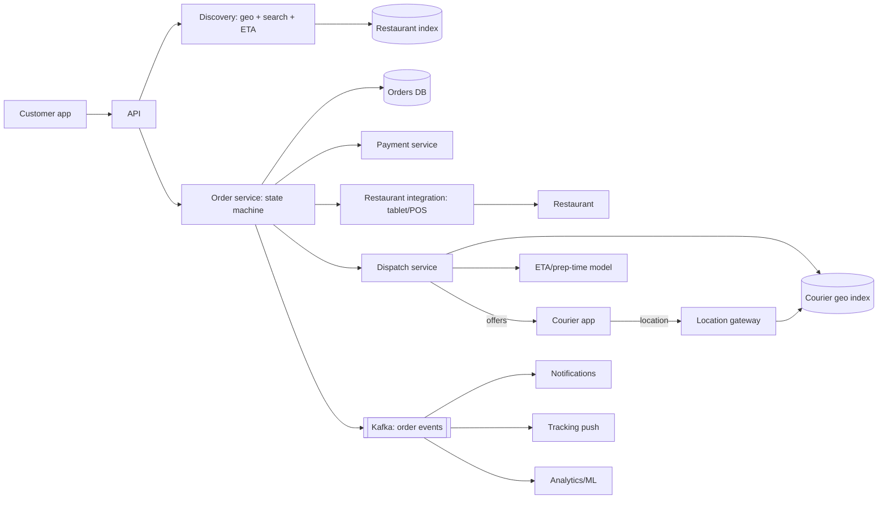

# 🍔 Design a Food Delivery Service — High Level Design

<!-- nav:start -->
🏷️ **Priority:** Medium · **Difficulty:** Intermediate

⬅️ Previous: [Design Airbnb](../Airbnb/README.md) · 🏠 [Location-Based Services](../README.md) · ➡️ Next: [Design Uber](../Uber/README.md)

> 📚 **Credit:** Chapter selection, ordering and question choice follow the [AlgoMaster.io System Design Interviews course](https://algomaster.io/learn/system-design-interviews/course-roadmap). This write-up was created with Claude for personal interview prep. The premium lesson text was **not** accessed or reproduced. See [CREDITS](../../CREDITS.md).
<!-- nav:end -->

> Three parties (customers, restaurants, couriers) and a real-world logistics loop. Compared with [Uber](../Uber/README.md)
> there is an **order lifecycle with the restaurant** and **batching/multi-stop dispatch**. (Object model: LLD repo's *Food Delivery*.)

## 1. Clarifying Requirements

| Candidate asks | Interviewer answers | Design impact |
|---|---|---|
| Flow? | Browse restaurants → order → restaurant accepts/prepares → courier delivers → pay. | Order state machine. |
| Discovery? | Nearby open restaurants, search dishes, filters, ETA. | Geo + search + ETA. |
| Dispatch? | Assign courier, possibly batched (2 orders). | Matching optimisation. |
| Tracking? | Live courier map, ETA updates. | Location streaming. |
| Menu? | Items, modifiers, availability, prices. | Catalogue + inventory. |
| Scale? | 20M orders/day, 10M couriers/day, peak dinner hour. | Peaks 3–5×. |
| Payments/tips? | Yes, promos and refunds. | Payment saga. |

**Functional:** search/browse, cart & checkout, order lifecycle, dispatch, tracking, ratings, promotions, refunds.
**Non-functional:** accurate ETAs, robust to restaurant delays, peak handling, reliable notifications, cost-efficient dispatch.

## 2. Back-of-the-Envelope Estimation

| Quantity | Working | Result |
|---|---|---|
| Orders | 20M/day, 40% in 2 peak hours | 8M/2h ≈ **1.1k orders/s** peak |
| Browse/search | 10× orders per session ×… | ~20k/s peak |
| Courier locations | 2M active × every 5 s | **400k updates/s** |
| Order events | ~15 state changes each | ~17k events/s peak |
| Menu data | 1M restaurants × 200 items × 1 KB | 200 GB |

## 3. Core APIs

```http
GET  /v1/restaurants?lat=..&lng=..&cuisine=..&open_now=true&sort=eta        GET /v1/restaurants/{id}/menu
POST /v1/cart/checkout {items[], address, payment, tip}  Idempotency-Key → 201 {order_id, eta}
GET  /v1/orders/{id} (or WS/SSE for updates)      POST /v1/orders/{id}/cancel
Restaurant: POST /v1/orders/{id}/accept|reject|ready {prep_time}    PUT /v1/menu/items/{id}/availability
Courier:    WS location stream; POST /v1/deliveries/{id}/accept|pickup|dropoff
```

## 4. High-Level Design



### 4.1 Placing an order
Validate cart (menu availability, prices), create order `PLACED` with idempotency key, authorise payment, send to restaurant
(tablet/POS integration with retries); restaurant `ACCEPTS` with prep time (timeout ⇒ auto-cancel/refund); dispatch begins timed
so the courier arrives near food-ready time.

### 4.2 Dispatch and delivery
Dispatcher finds couriers near the restaurant considering current tasks (batching), evaluates ETA = time to restaurant + wait for
food + delivery time; offers to best courier(s); courier accepts ⇒ pickup ⇒ dropoff ⇒ order `DELIVERED`, payment captured, tip
processed, courier paid.

## 5. Database Design

```text
restaurants  id PK, geo, cuisines[], hours, status(open/paused), prep_time_model, rating
menu_items   (restaurant_id, item_id) → name, price, modifiers, available, stock?      -- cached heavily
orders       order_id PK, customer_id, restaurant_id, courier_id, status, items, totals, timestamps, version
order_events (order_id, seq) append-only audit/state transitions
deliveries   delivery_id, courier_id, orders[] (batch), route, status
courier_state courier_id → {location, status, current_tasks} (in-memory geo index + Redis TTL)
search index restaurants + dishes (Elasticsearch) with geo and open-now availability
```

## 6. Design Deep Dive

### 6.1 Discovery with ETA
Candidate restaurants by geo cells in delivery radius; filter open/available; ETA per restaurant = prep-time estimate (ML, current load) +
courier availability + travel time; rank by relevance + ETA + rating; cache per cell for short TTL. Demand shaping: hide/gray out
restaurants that are overloaded.

### 6.2 Dispatch optimisation
Simple: nearest idle courier. Better: **batching windows** (10–30 s) solving an assignment problem over orders and couriers to minimise
total delivery time/cost, allowing stacked orders (same restaurant or route). Constraints: food temperature (max detour), capacity,
courier shift rules. Time dispatch to arrive at ready time (avoid couriers idling at restaurants). Offer with timeouts; reassign on decline.
Locking a courier with an atomic status transition as in [Uber](../Uber/README.md).

### 6.3 Order state machine
`PLACED → ACCEPTED → PREPARING → READY → PICKED_UP → DELIVERED` plus `CANCELLED/REJECTED/FAILED`. Persisted transitions with optimistic
versions; events to Kafka; timeouts via scheduler (restaurant no-response ⇒ cancel); compensation via saga (refund/void). See
[Coordinating Transactions](../../05-Interview-Patterns/12-coordinating-transactions-across-services.md).

### 6.4 Restaurant integration and menu accuracy
Tablet app, POS integrations, printer fallbacks, phone calls for failures; real-time menu/inventory availability (86'd items) via push
to menu service; cache invalidation on change; auto-pause restaurants that miss confirmations.

### 6.5 Tracking and ETAs
Courier location stream to a geo index and per-order channels; ETA recalculated with live traffic/prep status; push notifications at milestones;
map updates via SSE/WebSocket (downsampled).

### 6.6 Peak handling
Demand spikes at dinner: pre-scale, surge/fee incentives to attract couriers, throttle order intake per restaurant capacity (prep queue),
degrade non-critical features (recommendations), queue-based integration calls.

### 6.7 Payments, promos, refunds
Authorise at order, capture on delivery, partial refunds for missing items, promo/wallet credits via ledger entries; idempotent operations and reconciliation.

## 7. Follow-ups (with answers)

**7.1 What if the restaurant doesn't respond?** Timer per order; retry notification channels (tablet → call); auto-cancel with refund after threshold; reduce restaurant's ranking/pause it after repeated misses.

**7.2 How do you estimate preparation time?** ML model using restaurant history, current open orders, item complexity, time of day; refined by "ready" signals; feeds ETA and dispatch timing.

**7.3 How do you handle a courier who disappears?** Heartbeat/location TTL detects; auto-reassign the order to another courier, notify customer, compensate if late; flag account for review.

**7.4 How to support scheduled orders?** Store `deliver_at`; scheduler triggers the order to the restaurant at `deliver_at − prep − travel`; dispatch closer to time.

**7.5 How would you prevent fraud (fake orders, promo abuse)?** Risk scoring at checkout, device/payment fingerprinting, per-user promo limits, courier GPS/anomaly checks.

**7.6 Why are batching windows better than greedy dispatch?** Greedy assignment locks in locally best matches; a short window allows a global assignment with better utilisation and lower average wait, at the cost of a few seconds' delay.

## 🧪 Practice Round

<details><summary>How does this differ from ride-hailing?</summary>
A third actor (restaurant) with preparation uncertainty, the order lifecycle before pickup, food-quality constraints, and multi-order batching.
</details>

<details><summary>Why time courier dispatch to food-ready time?</summary>
Early arrival wastes courier time; late arrival cools the food. Predicted prep time drives assignment timing.
</details>

## 📝 Last-Minute Revision

Restaurant discovery = geo + open + ETA; order state machine with timeouts; **batched dispatch** with ETA (travel + prep); courier locations in memory; restaurant integrations with fallbacks; payment saga; peak shaping with incentives and throttles.

Related: [Uber](../Uber/README.md) · [Finding and Tracking Locations](../../05-Interview-Patterns/18-finding-and-tracking-locations.md) · [Job Scheduler](../../17-Asynchronous-Systems/Job-Scheduler/README.md)
