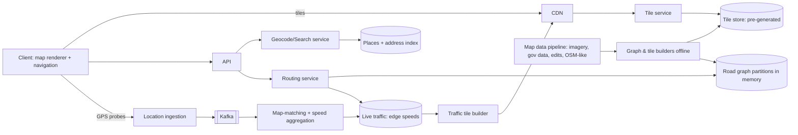

# 🗺️ Design Google Maps — High Level Design

<!-- nav:start -->
🏷️ **Priority:** Medium · **Difficulty:** Advanced

⬅️ Previous: [Design Uber](../Uber/README.md) · 🏠 [Location-Based Services](../README.md) · ➡️ Next: [Design Nearby Places / Yelp (bonus)](../Nearby-Places-Bonus/README.md)

> 📚 **Credit:** Chapter selection, ordering and question choice follow the [AlgoMaster.io System Design Interviews course](https://algomaster.io/learn/system-design-interviews/course-roadmap). This write-up was created with Claude for personal interview prep. The premium lesson text was **not** accessed or reproduced. See [CREDITS](../../CREDITS.md).
<!-- nav:end -->

> Maps are a graph problem (routing), a rendering problem (tiles), and a data problem (keeping the world current).
> The interview usually centres on **tile serving, shortest-path routing at continental scale, and ETA with live traffic**.

## 1. Clarifying Requirements

| Candidate asks | Interviewer answers | Design impact |
|---|---|---|
| Scope? | Map display, search places, routing & ETA, live traffic, turn-by-turn. | Four subsystems. |
| Platforms? | Mobile + web. | Vector tiles + client rendering. |
| Scale? | 1B MAU, 100M concurrent navigation sessions at peak (order of magnitude 10M). | Streaming updates. |
| Latency? | Route in < 1 s; tiles instant. | Precomputation. |
| Freshness? | Traffic in ~1 min; map edits in hours. | Two pipelines. |
| Offline? | Download regions. | Tile packaging. |
| Modes? | Driving, walking, transit, biking. | Different graphs/costs. |

**Functional:** render map, geocode/search, route between points with alternatives, ETA with traffic, turn-by-turn, live traffic layer, offline maps.
**Non-functional:** fast tile delivery, sub-second routing, high availability, global coverage, cost-efficient storage/bandwidth.

## 2. Back-of-the-Envelope Estimation

| Quantity | Working | Result |
|---|---|---|
| Map data | Road graph ~ 1B nodes, 2B edges, ~100 B each | **~200 GB** graph (fits in memory across a cluster) |
| Tiles | 22 zoom levels: total tiles ~ 4^z; vector tiles for z0–z16 ≈ 10^9–10^10 | Tens of TB precomputed vector; raster larger |
| Tile requests | 100M active × 30 tiles per view | ~30–100k/s, ~99% CDN hits |
| Location updates | 10M navigating × 1 per 5 s | **2M/s** ingestion for traffic |
| Route requests | 100M/day | ~1.2k/s (×5 peak) |
| Traffic state | 2B edges × few bytes | Small, but updated every minute |

## 3. Core APIs

```http
GET /tiles/{z}/{x}/{y}.pbf                         (vector tile; CDN-cached)
GET /v1/geocode?q=..        GET /v1/places/search?q=..&near=..       GET /v1/reverse?lat=..&lng=..
GET /v1/route?from=..&to=..&mode=driving&depart_at=..&avoid=tolls    → {routes:[{polyline, distance, eta, steps[]}]}
POST /v1/locations/batch [{lat,lng,speed,heading,ts,session}]        (probe data, anonymised)
GET /v1/traffic/tiles/{z}/{x}/{y}                                    (traffic overlay)
```

## 4. High-Level Design



### 4.1 Rendering
World is pre-cut into a **tile pyramid** (z/x/y). Clients request only visible tiles; **vector tiles** (compact geometry + labels) are styled and
rendered on the device, so one tile serves many styles/zoom-smoothly; raster tiles for legacy. Tiles are immutable per version ⇒ CDN cacheable.

### 4.2 Routing
Client sends origin/destination; routing service finds candidate routes on the road graph using precomputed hierarchies, applies live edge speeds,
returns polylines, ETA and instructions; re-routes on deviation or traffic change.

## 5. Database Design

```text
tiles       key (layer, z, x, y, version) → blob (vector tile)          object storage / KV; hot tiles in CDN
road graph  nodes(id, lat, lng), edges(id, from, to, length, class, speed_limit, restrictions, geometry)   partitioned by region/cell, in-memory adjacency arrays
contraction/hierarchy data  shortcut edges for fast queries (offline-built)
traffic     edge_id → (current_speed, confidence, ts)   plus historical speed profiles by (edge, weekday, time bucket)
places      place_id → name, category, address, geo, hours, rating   (search index: Elasticsearch/custom)
addresses   geocoding index (address components → lat/lng), reverse geocode via spatial index
probes      Kafka → anonymised, aggregated; raw retained briefly
```

## 6. Design Deep Dive

### 6.1 Tile system
Quadtree-style pyramid: zoom z has 2^z × 2^z tiles (Web Mercator). Precompute for lower zooms (world overview) and generate/higher zooms
on demand or per-region. Tile content per layer (roads, buildings, labels, POIs), simplified per zoom. Versioning + CDN with long TTL; incremental
updates rebuild only changed tiles. Client caches tiles and prefetches neighbours/along the route.

### 6.2 Routing algorithms
Plain Dijkstra on 2B edges is too slow. Techniques:
- **A\*** with geographic heuristic (bidirectional search).
- **Contraction Hierarchies (CH)**: preprocess by contracting less important nodes and adding shortcut edges; queries expand only "upward" ⇒ milliseconds.
- **Partitioned graph** (multi-level partitions, e.g. CRP/transit nodes): road network split into cells with precomputed boundary-to-boundary distances; supports **dynamic weights** (live traffic) better than static CH.
- Multiple alternatives via penalty/plateau methods; mode-specific graphs (car, bike, walk, transit timetables).
Serving: graph shards in memory; long routes traverse shards through boundary nodes.

### 6.3 Live traffic and ETA
Aggregate anonymised GPS probes: **map-match** points to edges, compute median speed per edge per time window, smooth/fuse with history and incident feeds.
ETA = Σ edge_length / predicted_speed (blend live now with historical/ML forecast for future portions); update every ~1–2 minutes; long routes weigh
historical patterns for far segments. Traffic layer tiles color roads by speed ratio.

### 6.4 Geocoding, search, places
Address parsing and normalisation → hierarchical index (country → city → street → number) + fuzzy matching; interpolation for house numbers; POI search combines text (BM25),
geo bias by viewport/location, popularity; typeahead via prefix index. See [Search and Typeahead](../../05-Interview-Patterns/17-search-and-typeahead.md).

### 6.5 Navigation session
Client holds route and progress; sends probes periodically; rerouting when off-route (server or on-device for offline); voice instructions generated from step metadata;
server pushes traffic-based re-route suggestions (SSE/push).

### 6.6 Offline maps
Package tiles + routing graph slice + search index for a region; compress; incremental updates by version diffs; on-device routing engine with static weights.

### 6.7 Data freshness pipeline
Ingest imagery, government data, partners, user edits/reports; ML extraction (roads, addresses from imagery); conflict resolution and QA; nightly/weekly rebuilds of graph and tiles; canary and rollback.

## 7. Follow-ups (with answers)

**7.1 Why is Contraction Hierarchies hard with live traffic?** CH shortcuts assume fixed weights; traffic changes require re-customising (customisable CH/partition-based methods recompute only overlay weights quickly).

**7.2 How would you compute an ETA for a trip starting in 2 hours?** Blend current conditions for the near portion with historical time-of-day speeds and forecast models for segments reached later.

**7.3 How do you store and serve 10^9 tiles?** Pre-generate coarse zooms; generate finer tiles lazily per region with caching; store in object storage keyed by z/x/y; serve via CDN; use vector tiles to cut size 10×.

**7.4 How do you detect a road closure?** Sudden speed drop to zero + probe absence on an edge, user reports, official feeds; mark edge restricted in the live layer and re-route; confirm before permanent edit.

**7.5 How do you protect user privacy in probe data?** Anonymise/rotate identifiers, aggregate before storage, drop start/end segments near homes, thresholds (k-anonymity), short retention.

**7.6 How do you scale routing to 1k queries/s?** Stateless routing servers each holding graph partitions in memory; shard by region; cache popular OD pairs; two-level approach for long distances; autoscale on CPU.

## 🧪 Practice Round

<details><summary>Why vector tiles?</summary>
Smaller payloads, style flexibility on device, smooth zoom/rotation, and one tile set serves multiple visual styles.
</details>

<details><summary>What makes routing fast at scale?</summary>
Preprocessed hierarchical graph structures (CH/partitioned overlays) instead of raw Dijkstra, with live speeds applied to edge weights.
</details>

## 📝 Last-Minute Revision

Tile pyramid (z/x/y) + vector tiles + CDN; routing on in-memory partitioned graph with **hierarchies + A\***; probes → map-match → edge speeds → traffic + ETA; geocoding via hierarchical index; offline packages; freshness via offline rebuild pipelines.

Related: [Finding and Tracking Locations](../../05-Interview-Patterns/18-finding-and-tracking-locations.md) · [Uber](../Uber/README.md) · [CDN](../../15-Distributed-Infrastructure/CDN/README.md)
