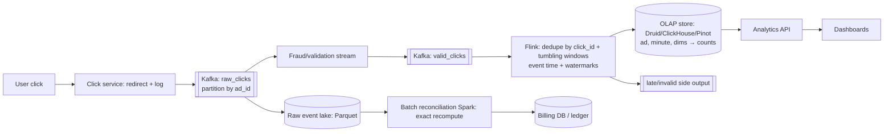

# 📊 Design an Ad Click Aggregator — High Level Design

<!-- nav:start -->
🏷️ **Priority:** Medium · **Difficulty:** Advanced

⬅️ Previous: [Design Google Search](../Google-Search/README.md) · 🏠 [Search & Aggregation Systems](../README.md) · ➡️ Next: [Design Amazon](../../13-E-commerce-and-Marketplace/Amazon/README.md)

> 📚 **Credit:** Chapter selection, ordering and question choice follow the [AlgoMaster.io System Design Interviews course](https://algomaster.io/learn/system-design-interviews/course-roadmap). This write-up was created with Claude for personal interview prep. The premium lesson text was **not** accessed or reproduced. See [CREDITS](../../CREDITS.md).
<!-- nav:end -->

> Advertisers are billed per click, so this pipeline must be **accurate, deduplicated, auditable and near real time**. It is the
> canonical "streaming aggregation with exactly-once *effects*" problem.

## 1. Clarifying Requirements

| Candidate asks | Interviewer answers | Design impact |
|---|---|---|
| What is counted? | Clicks (and impressions) per ad/campaign/advertiser. | Event pipeline. |
| Queries? | Clicks per ad per minute/hour/day; by country/device; last-N-minutes dashboards. | Time-bucketed OLAP. |
| Accuracy? | Billing-grade: no double counting, no loss. | Dedup + reconciliation. |
| Latency? | Dashboards < 1 min behind; billing can be batch-verified. | Lambda-style. |
| Scale? | 10B clicks/day, 100B impressions/day; peaks ×5. | ~115k clicks/s avg. |
| Fraud? | Filter bots/invalid traffic. | Fraud detection stage. |
| Retention? | Raw 30–90 days, aggregates for years. | Tiered storage. |

**Functional:** ingest click events (redirect via tracking URL), aggregate by dimensions/time windows, query analytics, dedupe, fraud filter, billing-grade totals.
**Non-functional:** exactly-once effect, high throughput, replay/backfill, late-data tolerance, horizontal scalability, auditable.

## 2. Back-of-the-Envelope Estimation

| Quantity | Working | Result |
|---|---|---|
| Clicks | 10B/day | **~115k/s**, peak ~600k/s |
| Event size | 300 B (ids, ts, ip hash, ua, geo, campaign) | 3 TB/day raw clicks |
| Impressions | 100B/day × 150 B | 15 TB/day (or sampled/aggregated at edge) |
| Aggregates | (ad × minute) rows: 10M active ads × 1440 | ~14B rows/day if dense; sparse in practice ≈ 1B |
| Query load | Dashboards ~5k QPS | OLAP with rollups |

## 3. Core APIs

```http
GET  /click?ad_id=..&impression_id=..&sig=..     → 302 to advertiser landing page (records click; validate signature)
POST /v1/events/batch [{type, ad_id, campaign_id, impression_id, user_hash, ts, ip, ua, ...}]
GET  /v1/analytics/ads/{ad_id}/clicks?from=..&to=..&granularity=minute&group_by=country,device
GET  /v1/billing/campaigns/{id}/usage?date=..
```

## 4. High-Level Design



### 4.1 Ingest path
Click endpoint validates the signed tracking URL, records event (id, ts, ad, impression, user hash, IP/UA), writes to Kafka (`acks=all`), and redirects immediately.
Never block the redirect on downstream processing.

### 4.2 Aggregation path
Stream job: validate/enrich → dedupe (keyed state of recent click_ids) → event-time windowing (1 min tumbling) per `(ad_id, dims)` → write partial aggregates to OLAP
(upserts idempotent by `(ad, window, dims)`); raw events archived for audit and batch recompute.

## 5. Database Design

```text
Kafka raw_clicks       key=ad_id (co-locate); retention 7 days
Event lake (S3)        Parquet partitioned by date/hour — source of truth for replay and audits
OLAP fact table        (ad_id, campaign_id, minute_ts, country, device, clicks, impressions, invalid_clicks)   -- pre-aggregated rollups (minute → hour → day)
dedupe state           Flink keyed state (click_id, TTL ~ 1–24 h) or Redis/RocksDB
Billing ledger         (advertiser_id, campaign_id, day) → billable_clicks, amount, version; immutable entries + adjustments
Reference data         ad → campaign → advertiser dimensions (broadcast / lookup)
```

## 6. Design Deep Dive

### 6.1 Exactly-once effect
Delivery is at-least-once (retries, redeliveries) so make counting **idempotent**:
1. Each click has a unique `click_id` (server-generated with signature).
2. Deduplicate in the stream by `click_id` using keyed state with TTL.
3. Use Flink checkpoints (state + offsets) for consistent recovery; sink with idempotent upserts or transactional writes.
4. Batch job recomputes from raw events and reconciles differences into billing. **Lambda-style**: fast approximate stream + authoritative batch.

### 6.2 Windows, late and out-of-order events
Aggregate on **event time**; watermarks (e.g. 1–2 min lag); allowed lateness for stragglers with updates to already-emitted windows
(upserts). Very late events go to a side output and are absorbed by the nightly batch. Billing uses finalised daily totals.

### 6.3 Hot ads and skew
A viral ad concentrates clicks on a key. Pre-aggregate locally per partition per second (combiner), **two-stage aggregation** with salted keys then merge,
or split ad_id into sub-keys. See [Handling Hot Keys](../../05-Interview-Patterns/03-handling-hot-keys.md).

### 6.4 Fraud and invalid traffic
Rules and models: IP/device velocity, known bot ranges, impossible click-to-impression timing, repeated clicks from one user, geo/UA anomalies.
Classify as invalid ⇒ exclude from billable counts but keep for analysis. Retroactive invalidation via batch corrections to ledger.

### 6.5 OLAP serving
Column stores (Druid/Pinot/ClickHouse) ingest from Kafka, roll up by time and dimensions, serve group-by queries in ms; tiered retention (minute for 7 days, hour for
90 days, day forever); pre-computed rollups for top queries; cache dashboard queries.

### 6.6 Reliability and scale
Multi-AZ Kafka (RF=3, `min.insync.replicas=2`), click service stateless and highly available, back-pressure/backoff, DLQs, replay from Kafka/S3 for reprocessing bugs,
monitoring lag and reconciliation deltas (stream vs batch within 0.1%).

### 6.7 Privacy and compliance
Hash/anonymise user identifiers, respect consent/opt-out, retention limits on raw data, regional processing, audit trail for billing disputes.

## 7. Follow-ups (with answers)

**7.1 How do you guarantee no double billing?** Unique click ids + idempotent dedupe, transactional/idempotent sinks, and batch reconciliation from immutable raw logs; the billing ledger uses append-only entries with versioned adjustments.

**7.2 How do you handle a Flink job failure?** Restore the last checkpoint and replay from stored Kafka offsets; idempotent writes make replays safe; the batch layer is the safety net.

**7.3 How do you support real-time "last 5 minutes" dashboards?** Stream aggregates land in OLAP with ~seconds latency; queries read recent minute buckets; approximate until windows finalise.

**7.4 What if the OLAP store is down?** Kafka retains events; the sink pauses and catches up (idempotent upserts); dashboards show stale data; billing is unaffected because it uses the lake/batch.

**7.5 How do you count unique users per ad?** HyperLogLog sketches per window (mergeable across time and dimensions) with known error; exact uniques only for billing-critical cases with heavier dedupe.

**7.6 How would you backfill after a bug fix?** Replay raw events from the lake through the corrected pipeline into a shadow table, compare with existing aggregates, swap or apply adjustment entries with audit.

## 🧪 Practice Round

<details><summary>Why redirect before processing?</summary>
User experience: the click must land quickly; recording is asynchronous through a durable log so nothing is lost.
</details>

<details><summary>Why keep both stream and batch?</summary>
Stream gives freshness; batch from immutable raw data gives exactness and correction of late/dirty data for billing.
</details>

## 📝 Last-Minute Revision

Click service → Kafka (by ad) → fraud filter → Flink (**dedupe by click_id, event-time windows, watermarks**) → OLAP rollups; raw to S3 for **batch reconciliation**; idempotent sinks; hot-key two-stage aggregation; HLL for uniques; immutable billing ledger.

Related: [Counting at Scale](../../05-Interview-Patterns/20-counting-at-scale.md) · [Flink](../../04-Technology-Deep-Dives/10-flink.md) · [Kafka](../../04-Technology-Deep-Dives/07-kafka.md)
