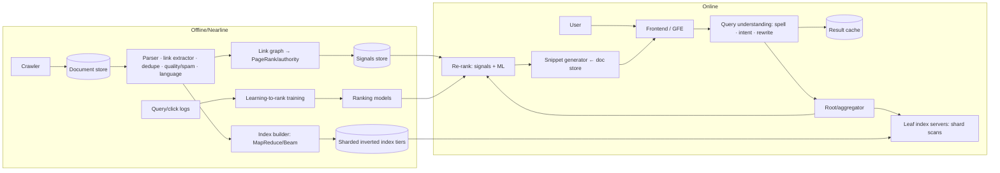

# 🔍 Design Google Search — High Level Design

<!-- nav:start -->
🏷️ **Priority:** Medium · **Difficulty:** Advanced

⬅️ Previous: [Design Web Crawler](../Web-Crawler/README.md) · 🏠 [Search & Aggregation Systems](../README.md) · ➡️ Next: [Design Ad Click Aggregator](../Ad-Click-Aggregator/README.md)

> 📚 **Credit:** Chapter selection, ordering and question choice follow the [AlgoMaster.io System Design Interviews course](https://algomaster.io/learn/system-design-interviews/course-roadmap). This write-up was created with Claude for personal interview prep. The premium lesson text was **not** accessed or reproduced. See [CREDITS](../../CREDITS.md).
<!-- nav:end -->

> Web search = **crawl → index → serve**. Crawling was covered in [Web Crawler](../Web-Crawler/README.md); this chapter is about
> the *index* (inverted, sharded, tiered) and the *serving path* (scatter-gather, ranking, caching) that returns results in ~200 ms.

## 1. Clarifying Requirements

| Candidate asks | Interviewer answers | Design impact |
|---|---|---|
| Scope? | Web search: query → ranked results with snippets. | Index + ranking + serving. |
| Corpus? | 100B+ pages, continuously updated. | Massive sharded index. |
| Latency? | p99 < 300 ms. | Tiered index, caching, early termination. |
| Traffic? | 100k queries/s peak (8B/day). | Replicated serving. |
| Freshness? | News in minutes, others days. | Multi-tier index. |
| Features? | Spelling, autocomplete, snippets, ads (mention), personalisation. | Query understanding pipeline. |
| Quality? | Relevance, spam resistance. | Link analysis + ML ranking. |

**Functional:** web search, snippets, spell correction, related/suggested queries, filters (time, language), freshness for news.
**Non-functional:** very low latency, high availability, relevance, scalability to trillions of index entries.

## 2. Back-of-the-Envelope Estimation

| Quantity | Working | Result |
|---|---|---|
| Documents | 100B pages | — |
| Index size | ~100 KB inverted-index data per page (compressed postings ≈ 10–30 KB) | **~3–10 PB** index |
| Shards | 100 GB per shard × … ⇒ ~100k shards ×replicas | massive fleet |
| Queries | 8B/day | **~92k/s avg**, peak ~200k/s |
| Per-query work | Fan out to all serving shards (or tiered) | 10^5+ shard-requests per query ⇒ tiering/early termination essential |
| Query cache | Top queries repeat heavily (~30–50% cacheable) | Large cache tier |

## 3. Core APIs

```http
GET /search?q=best+running+shoes&page=1&lang=en&safe=on&tbs=qdr:d
→ { results:[{url,title,snippet,rank_features?}], related_searches[], spell_suggestion?, ads?, total_est }
GET /suggest?q=best+run           (typeahead, see Search Autocomplete)
```

## 4. High-Level Design



### 4.1 Indexing
Documents are parsed into terms/positions; index builders create **inverted indexes**: term → compressed posting lists (doc ids, positions, field info),
partitioned into shards. Documents are partitioned (**document-sharded** index): each shard indexes a subset of docs fully; alternatives (term-sharded) cost more network at query time.

### 4.2 Serving a query
Frontend normalises/spell-corrects/expands the query, checks cache; root server broadcasts to a set of shards (per tier); each leaf finds matching docs
(posting-list intersection, top-k by lightweight score); root merges top candidates, applies richer ranking (hundreds of signals, ML), fetches snippets
from the doc store, and returns.

## 5. Database Design

```text
Document store   url_hash → {content, fetch_time, metadata, outlinks}    (Bigtable/wide-column; petabytes)
Inverted index   shard s: term → posting list [(docid, tf, positions, field flags)…], skip pointers, delta+varint/bitpacked compression
Forward index    docid → {length, title, url, static rank, language, spam score, snippet source pointers}
Link graph       url → outlinks / inlinks (for PageRank), anchor text
Signals          docid → PageRank, quality, freshness, click-through aggregates
Query logs       Kafka/warehouse for training and analytics
```

## 6. Design Deep Dive

### 6.1 Inverted index structure and query processing
Posting lists sorted by docid enable fast **AND** intersection with skip pointers; compress with delta encoding + variable-byte/PFOR. For each query term
fetch lists, intersect (AND), score with BM25-like function + static rank, keep a top-k heap. **Early termination** and **impact-ordered postings** stop
scanning once remaining docs cannot enter top-k.

### 6.2 Tiered index
- **Tier 1**: high-quality, frequently clicked pages (small, in RAM/SSD, searched first).
- **Tier 2/3**: long tail (disk, searched only if tier 1 yields insufficient results).
- Separate **real-time index** for fresh content (news), merged at query time.
This bounds the work per query while still covering the whole web.

### 6.3 Scatter-gather serving and tail latency
Root queries all shards in a tier in parallel; latency = slowest shard. Mitigate with replicas and **hedged requests** (send to a second replica after a small delay),
timeouts with partial results, load-aware replica selection, and caching of hot queries/posting lists. See [Surviving Component Failures](../../05-Interview-Patterns/09-surviving-component-failures.md).

### 6.4 Ranking
- **Signals**: term match (BM25, proximity, field weights), **PageRank/link authority**, content quality, freshness, user location/language, click data, page speed/mobile-friendliness.
- **Learning-to-rank** (gradient-boosted trees/neural) trained on human ratings and clicks; multi-stage: cheap first-pass → richer second-pass on top-N → final blending/diversification.
- **Spam and quality**: link-spam detection, content farms, cloaking; manual actions.
- Semantic understanding: embeddings for query–document similarity (dense retrieval) alongside keyword retrieval (hybrid).

### 6.5 Query understanding
Tokenisation, spelling correction (noisy channel using query logs), synonyms/stemming, entity recognition, intent classification (navigational, informational, local, shopping),
query rewriting; personalised/context signals (location, language, history if enabled).

### 6.6 Snippets and caching
Snippet generation picks query-relevant passages from the stored document, bolds terms; caches: result cache by normalised query (with TTL/invalidations for fresh topics),
posting-list cache, snippet cache. Long-tail queries miss caches, so leaf capacity must handle them.

### 6.7 Keeping the index fresh
Continuous crawl prioritised by importance/change rate; incremental index updates via small in-memory/real-time indexes merged periodically into base shards (LSM-like);
deletion via tombstones; rebuild pipelines for full reindex.

## 7. Follow-ups (with answers)

**7.1 Document-sharded vs term-sharded index?** Document sharding: each shard is self-contained; a query hits all shards but only results are exchanged; simple, robust. Term sharding: query hits fewer shards but must ship large posting lists over the network; load skew for popular terms. Document sharding wins in practice.

**7.2 How do you handle the "long tail" queries without scanning everything?** Tiered index, early termination, impact-ordered lists, and dense retrieval (ANN) for semantic matches; results from tier 1 usually suffice.

**7.3 How does PageRank work at scale?** Iterative computation over the link graph (MapReduce/Pregel-style): each page distributes rank to outlinks with damping; repeat until convergence; run offline, store as a static signal.

**7.4 How do you reduce tail latency in scatter-gather?** Replicas + hedged requests, aggressive timeouts returning partial top-k, tiering, in-memory hot postings, and avoiding synchronous slow dependencies (snippets from cached forward index).

**7.5 How do you keep search results fresh for breaking news?** Real-time index fed by a fast crawl of news sources, merged with base results and boosted by freshness for time-sensitive queries.

**7.6 How would you add personalisation safely?** Use privacy-preserving signals (language, location, opted-in history), bounded ranking influence, clear opt-out, and A/B testing to avoid filter bubbles.

## 🧪 Practice Round

<details><summary>Why is there a "root" and "leaf" architecture?</summary>
The index is too big for one machine; leaves each search a shard and return top-k; the root merges and re-ranks.
</details>

<details><summary>Why compress posting lists?</summary>
Index size dominates cost and I/O; compression (delta + bit packing) shrinks memory/disk and speeds scanning.
</details>

## 📝 Last-Minute Revision

Crawl → parse/dedupe/spam → **document-sharded inverted index (tiered)** + link graph/PageRank; serve: query understanding → cache → root scatter-gather to leaves → multi-stage rank (BM25 → LTR) → snippets; hedged requests for tail latency; fresh via real-time index.

Related: [Web Crawler](../Web-Crawler/README.md) · [Search and Typeahead](../../05-Interview-Patterns/17-search-and-typeahead.md) · [Elasticsearch](../../04-Technology-Deep-Dives/06-elasticsearch.md)
