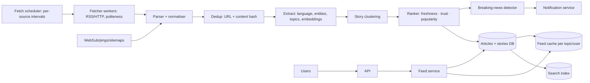

# 📰 Design a News Aggregator — High Level Design

<!-- nav:start -->
🏷️ **Priority:** Low · **Difficulty:** Intermediate

⬅️ Previous: [Design Search Autocomplete System](../Search-Autocomplete/README.md) · 🏠 [Search & Aggregation Systems](../README.md) · ➡️ Next: [Design Web Crawler](../Web-Crawler/README.md)

> 📚 **Credit:** Chapter selection, ordering and question choice follow the [AlgoMaster.io System Design Interviews course](https://algomaster.io/learn/system-design-interviews/course-roadmap). This write-up was created with Claude for personal interview prep. The premium lesson text was **not** accessed or reproduced. See [CREDITS](../../CREDITS.md).
<!-- nav:end -->

> Google News/Feedly-style: **pull articles from thousands of publishers, deduplicate and cluster them by story,
> rank, and serve fast personalised feeds**. It is a crawler + text pipeline + feed system.

## 1. Clarifying Requirements

| Candidate asks | Interviewer answers | Design impact |
|---|---|---|
| Sources? | 100k publishers via RSS/Atom/APIs/sitemaps, some crawl. | Ingestion adapters. |
| Freshness? | Breaking news within ~1–2 minutes. | Adaptive polling. |
| Features? | Home feed, topics, story clusters, search, save/follow sources. | Clustering + search. |
| Personalisation? | Basic (followed topics/sources) + ranking. | Feed service. |
| Content? | Headline, snippet, link; don't host full text. | Light storage, licensing. |
| Scale? | 10M DAU, 5M new articles/day. | Moderate. |
| Quality? | Avoid duplicates and spam. | Dedup + trust scoring. |

**Functional:** ingest articles, dedupe/cluster, categorise, rank, feeds by topic/source/personalised, search, notifications for breaking news.
**Non-functional:** freshness, high read scale, politeness to publishers, robust to malformed feeds, cost efficiency.

## 2. Back-of-the-Envelope Estimation

| Quantity | Working | Result |
|---|---|---|
| Articles | 5M/day | **~58/s** avg, bursts ×10 |
| Article metadata | 5M × 2 KB | 10 GB/day, 3.6 TB/yr |
| Feed polls | 100k sources; hot ones every 1–5 min, others 30–60 min | ~2k fetches/s worst case |
| Reads | 10M DAU × 10 feed loads | ~1.2k/s, peak 5k/s |
| Text for NLP | 5M × 5 KB | 25 GB/day processed |

## 3. Core APIs

```http
GET /v1/feed?topic=tech&cursor=..&lang=en          → clusters [{story_id, headline, sources[], top_article, updated_at}]
GET /v1/stories/{id}                                → articles in cluster, timeline
GET /v1/search?q=..&from=..                         POST /v1/follow {source|topic}
Admin: POST /v1/sources {feed_url, category, trust}   GET /v1/ingest/stats
```

## 4. High-Level Design



### 4.1 Ingestion
Scheduler polls sources at adaptive intervals (more often for high-velocity publishers, conditional GET with ETag/If-Modified-Since),
supports push (WebSub) where available; workers fetch respecting politeness and robots; parser normalises fields, canonicalises URLs, handles bad XML.

### 4.2 Processing and serving
Deduplicate (exact and near-duplicate), enrich (language, entities, category, embedding), assign to a **story cluster** (same event, different outlets),
score and store; feeds are assembled from clusters by topic/personal follows and cached.

## 5. Database Design

```text
sources     source_id PK, feed_url, homepage, category, language, trust_score, poll_interval, last_etag, last_fetched
articles    article_id PK, source_id, url_canonical UNIQUE, title, snippet, published_at, ingested_at, lang, entities[], topic[], content_hash, simhash, embedding
stories     story_id PK, representative_article_id, article_ids[], first_seen, updated_at, score, topics[]
user_prefs  user_id → followed sources/topics, muted, language
feed cache  Redis: feed:{topic|user} → ZSET story_id : rank score
search idx  Elasticsearch docs for articles and stories
```

## 6. Design Deep Dive

### 6.1 Adaptive polling
Estimate each source's publish rate (moving average of new items per poll); set interval ∝ 1/rate with bounds; back off on errors; prioritise
important sources; use HTTP conditional requests to save bandwidth; respect `ttl`/`Cache-Control`. Spread polls evenly (jitter) to avoid bursts.

### 6.2 Deduplication and clustering
- **URL canonicalisation** (strip tracking params, resolve redirects, `rel=canonical`).
- **Exact dup**: hash of normalised text. **Near-dup**: SimHash/MinHash LSH.
- **Story clustering**: embed title+lead with a text model; nearest-neighbour search over recent (e.g. 48 h) articles; join a cluster above a similarity threshold
  and entity overlap, else start a new one; incremental online clustering with periodic re-clustering. Keep clusters time-bounded to bound index size.

### 6.3 Ranking
Score = f(recency decay, source trust/authority, cluster size (how many outlets), engagement, topic relevance, diversity of sources, locality).
Breaking detection: sudden growth in cluster size/velocity. Anti-spam: domain reputation, low-quality/clickbait classifiers, duplicates from content farms.

### 6.3b Personalisation
Blend followed sources/topics with implicit signals (clicks, dwell); candidates from clusters in preferred topics; rank with a lightweight model;
fallback to popular in region/language; cold start via onboarding choices.

### 6.4 Storage and retention
Keep metadata and snippet, link out for full text (licensing); retain recent articles hot, archive older for search; dedupe images/thumbnails via hash;
respect takedown requests (delete/hide by source/URL and purge caches/index).

### 6.5 Freshness and delivery
Ingestion → indexing pipeline via Kafka with per-stage latency budgets (target < 60–120 s); breaking news bypasses batches; push notifications for followed
topics with frequency caps. Feed cache updated on new cluster events; pagination cursor by score/time.

### 6.6 Reliability
Fetchers idempotent; DLQ for unparseable feeds; per-source circuit breaker (temporarily disable failing feeds); monitoring of ingestion lag and per-source health;
handle publisher outages and duplicate republishing.

## 7. Follow-ups (with answers)

**7.1 How do you detect that two articles are the same story?** Compare embeddings/entities/time; near-duplicate hashes for copies; threshold + human-tuned rules; cluster incrementally within a time window.

**7.2 How do you make breaking news appear within a minute?** Prioritised fast-lane fetch for top sources (push/WebSub or 30–60 s polling), streaming pipeline instead of batch, immediate cache update and notification for high-velocity clusters.

**7.3 How do you avoid overloading small publishers?** Respect robots/crawl-delay, conditional GET, adaptive intervals with a minimum spacing, and a shared per-host rate limiter across fetch workers.

**7.4 How do you handle paywalled/licensed content?** Store only headline/snippet/metadata allowed by license, link out, honour publisher preferences and takedowns, label paywalls.

**7.5 How do you scale to 1M sources?** Partition the scheduler by source hash across workers, hierarchical intervals, priority queues, sharded storage, and stream partitions by source.

**7.6 How do you detect misinformation or low-quality sources?** Source trust scores from human ratings + signals, cross-source corroboration, classifier for clickbait/fake patterns, downrank or label; keep audit and appeals.

## 🧪 Practice Round

<details><summary>Why conditional GET?</summary>
Saves bandwidth and load for both sides: `304 Not Modified` when nothing changed since the last poll.
</details>

<details><summary>Cluster vs dedupe?</summary>
Dedupe removes copies of the same article; clustering groups different articles about the same event from different outlets.
</details>

## 📝 Last-Minute Revision

Adaptive polling + push; normalise + canonical URL; exact/near-dup (SimHash); embedding-based **story clustering**; rank by freshness/trust/velocity; Redis feed caches; search index; notifications for breaking; politeness and per-source circuit breakers.

Related: [Web Crawler](../Web-Crawler/README.md) · [Search and Typeahead](../../05-Interview-Patterns/17-search-and-typeahead.md) · [Notification Service](../../17-Asynchronous-Systems/Notification-Service/README.md)
