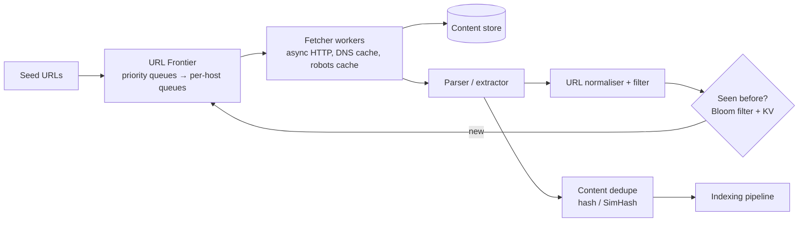

# 🕷️ Design a Web Crawler — High Level Design

<!-- nav:start -->
🏷️ **Priority:** High · **Difficulty:** Intermediate

⬅️ Previous: [Design Search Autocomplete System](../Search-Autocomplete/README.md) · 🏠 [Search & Aggregation Systems](../README.md) · ➡️ Next: [Design Flash Sale](../../13-E-commerce-and-Marketplace/Flash-Sale/README.md)

> 📚 **Credit:** Chapter selection, ordering and question choice follow the [AlgoMaster.io System Design Interviews course](https://algomaster.io/learn/system-design-interviews/course-roadmap). This write-up was created with Claude for personal interview prep. The premium lesson text was **not** accessed or reproduced. See [CREDITS](../../CREDITS.md).
<!-- nav:end -->


> A crawler is a giant graph traversal where every edge is a slow network call to somebody else's
> server. The interesting parts are **not hammering those servers**, **not visiting the same page
> twice**, and **deciding what to fetch next**.

---

## 📑 On this page

1. [Clarifying Requirements](#1-clarifying-requirements) · 2. [Estimation](#2-back-of-the-envelope-estimation) ·
3. [Core APIs](#3-core-apis) · 4. [High-Level Design](#4-high-level-design) · 5. [Database Design](#5-database-design) ·
6. [Deep Dive](#6-design-deep-dive) · 7. [Follow-ups](#7-follow-ups-with-answers)

---

## 1. Clarifying Requirements

| Candidate asks | Interviewer answers | Design impact |
|---|---|---|
| Purpose? | Feed a search index. | Store text + metadata. |
| Scale? | 1B pages/month. | Distributed crawl. |
| Content types? | HTML; extensible to PDFs/images. | Pluggable parsers. |
| JavaScript pages? | Some. | Selective headless rendering. |
| Freshness? | Re-crawl by change rate. | Adaptive scheduling. |
| Politeness? | Respect robots.txt, rate limits. | Per-host queues. |
| Duplicates? | Skip duplicates and mirrors. | URL + content dedupe. |

**Functional:** crawl from seeds, extract links, store content, re-crawl.
**Non-functional:** scalable, polite, robust against traps/malformed HTML, extensible, fault tolerant.

---

## 2. Back-of-the-Envelope Estimation

| Quantity | Working | Result |
|---|---|---|
| Fetch rate | 1B ÷ 2.6M s | **~400 pages/s** (plan 1–2k/s for retries + re-crawl) |
| Bandwidth | 1k/s × 100 KB | **~100 MB/s** ≈ 800 Mbps |
| Storage | 1B × 100 KB compressed | **~100 TB/month** ⇒ object storage |
| Seen-URL set | 10B URLs × 8 B hash | ~80 GB ⇒ Bloom filter ~12 GB at 1% FP |
| Fetcher workers | ~50 pages/s per node with async I/O | **~20–40 nodes** |

---

## 3. Core APIs

Internal service, but define contracts:

```text
frontier.push(url, priority, depth, discovered_from)
frontier.pop(worker_id) -> (url, host_lease)         # host-lease enforces politeness
fetcher.fetch(url) -> { status, headers, body, fetched_at, latency }
store.put(url_hash, content, meta)
parser.extract(content) -> { text, links[], canonical, lang }
Admin: POST /crawl/seeds  |  GET /crawl/stats  |  POST /crawl/pause?host=...
```

---

## 4. High-Level Design



### 4.1 Requirement 1: Crawl loop
Pop URL (respecting host lease) → check robots.txt (cached) → fetch with timeout → store → parse →
normalise links → skip seen → push new URLs into the frontier.

### 4.2 Requirement 2: Refresh
Every page has `last_crawled`, `checksum`, `change_rate`. A scheduler re-enqueues by next-due time
with priority for high-value or frequently changing pages.

---

## 5. Database Design

```text
url_meta (wide-column, key = hash(normalised_url))
  url, host, last_crawled, status, checksum, etag, last_modified, change_rate, depth, priority
frontier queues:   host_queue:{host} (ordered by priority), ready_hosts (min-heap by next_allowed_time)
robots_cache:      host -> rules, fetched_at (TTL 24h)
seen set:          Bloom filter (memory) backed by url_meta existence check
content:           object storage /{hash[0:2]}/{hash}.html.gz
```

---

## 6. Design Deep Dive

### 6.1 URL frontier (the heart)
Two levels: **front queues** by priority (importance, freshness need) and **back queues**, one per
host, so a host is fetched by one worker at a time with a minimum delay (`Crawl-delay` or adaptive
from response time). A min-heap of `(next_allowed_time, host)` decides which host to serve next.

### 6.2 URL dedupe
Normalise (lowercase host, remove fragments/default ports, sort query params, resolve relative
paths, canonical link). Check a **Bloom filter** (fast, memory-cheap; false positives drop a few new
URLs, acceptable) then confirm against the store when needed.

### 6.3 Content dedupe
Exact: SHA-256 of normalised text. Near-duplicate: SimHash/MinHash with locality-sensitive lookup,
so mirrors and boilerplate variants are recognised.

### 6.4 Traps and quality
Spider traps (infinite calendars, session IDs, faceted URLs): max depth, max URLs per host,
URL-pattern detection, repeated-path heuristics, block query parameters with unbounded values.

### 6.5 Distribution
Partition hosts across crawler nodes with consistent hashing (host → node): each node owns a set of
hosts, so politeness is local and DNS/robots caches are hot. Nodes exchange discovered URLs of
foreign hosts via a queue. On node failure, its hosts are reassigned.

### 6.6 Efficiency
Async I/O, connection reuse, DNS caching, conditional GET (`If-None-Match`, `If-Modified-Since`),
gzip, timeouts + retry with backoff, skip huge or non-text files by `Content-Length`/type.

---

## 7. Follow-ups (with answers)

### 7.1 How do you crawl 10× faster without hurting sites?
Scale **across hosts**, never per host: add fetcher nodes and more concurrent hosts; per-host delay
stays fixed. Prioritise unseen hosts; use CDNs' own APIs/sitemaps where available.

### 7.2 How do you prioritise fresh news?
A separate high-priority frontier fed by RSS/sitemaps and known news domains, re-crawled every few
minutes; adapt intervals from observed change rates.

### 7.3 How do you crawl JavaScript-rendered pages?
Detect pages with little static content and send them to a headless-browser pool (expensive,
rate-limited, sandboxed); cache rendered output; prefer discovering the JSON API the page calls.

### 7.4 How do you recover from a crawler crash?
Fetchers are stateless; frontier and metadata are durable (checkpointed queues); URLs in flight have
leases that expire and get re-queued; processing is idempotent by URL hash.

### 7.5 How do you respect robots.txt and legal constraints?
Fetch and cache robots.txt per host (TTL ~24 h), honour disallow and crawl-delay, identify with a
clear User-Agent, offer opt-out contact, obey noindex/nofollow semantics as your policy defines.

### 7.6 How do you detect that a page changed?
Conditional requests; compare content hash after normalisation; track a per-page change rate and
adjust the next crawl time (higher for volatile pages, back off for static ones).

---

## 🧪 Practice Round

<details><summary>1. Why one queue per host?</summary>
It makes politeness trivial: only one request in flight per host and a minimum delay between them.
</details>

<details><summary>2. What's the cost of a Bloom-filter false positive here?</summary>
A genuinely new URL is wrongly treated as seen and skipped; at 1% FP that's a small, acceptable
coverage loss versus huge memory savings.
</details>

---

## 📝 Last-Minute Revision

- ~400 pages/s, ~100 TB/month. **Frontier = priority queues + per-host politeness queues.**
- Dedupe: normalised URL + **Bloom filter**; content: hash/SimHash.
- Partition by host (consistent hashing). Handle traps, robots.txt, conditional GET, adaptive re-crawl.
- Concepts: [consistent hashing](../../03-Concept-Deep-Dives/05-Distributed-Systems/04-consistent-hashing.md) ·
  [probabilistic structures](../../04-Technology-Deep-Dives/12-zookeeper.md) ·
  [messaging](../../_Reference/messaging-and-streaming.md)

---

## 📚 References & Credits

| Resource | Use |
|---|---|
| [RFC 9309 — Robots Exclusion Protocol](https://www.rfc-editor.org/rfc/rfc9309) | Public robots.txt spec |
| Manku et al., "Detecting Near-Duplicates for Web Crawling" | Public SimHash background |

Original work; personal learning project, not affiliated with AlgoMaster.io.
