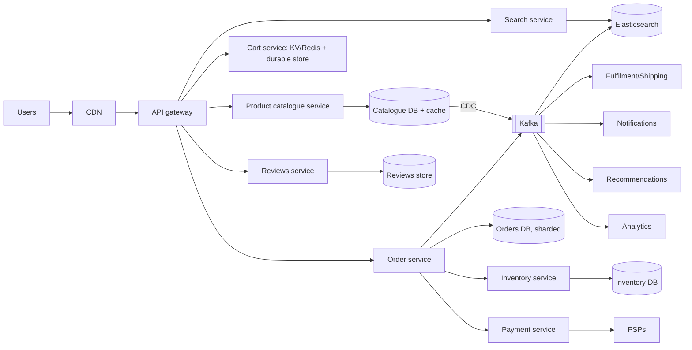

# 🛒 Design Amazon (E-commerce) — High Level Design

<!-- nav:start -->
🏷️ **Priority:** Medium · **Difficulty:** Intermediate

⬅️ Previous: [Design Ad Click Aggregator](../../12-Search-and-Aggregation-Systems/Ad-Click-Aggregator/README.md) · 🏠 [E-commerce & Marketplace](../README.md) · ➡️ Next: [Design Shopify](../Shopify/README.md)

> 📚 **Credit:** Chapter selection, ordering and question choice follow the [AlgoMaster.io System Design Interviews course](https://algomaster.io/learn/system-design-interviews/course-roadmap). This write-up was created with Claude for personal interview prep. The premium lesson text was **not** accessed or reproduced. See [CREDITS](../../CREDITS.md).
<!-- nav:end -->

> E-commerce mixes **read-heavy browsing/search** with **strictly correct ordering, inventory and payments**. The
> interview strategy is to split the system by consistency needs: eventually consistent catalogue vs strongly consistent checkout.

## 1. Clarifying Requirements

| Candidate asks | Interviewer answers | Design impact |
|---|---|---|
| Scope? | Catalogue, search, cart, checkout, orders, inventory, reviews; skip seller tooling/logistics depth. | Focus areas. |
| Scale? | 300M users, 50M orders/day peak season, 1B product views/day. | Read ≫ write. |
| Catalogue? | 500M products, many sellers. | Big search index. |
| Inventory? | Multi-warehouse, must not oversell. | Reservation model. |
| Payment? | Multiple methods; retries safe. | Idempotent orders. |
| Consistency? | Browse eventual; checkout strong. | Split paths. |
| Peaks? | Prime Day 10× normal. | Autoscale + shed. |

**Functional:** browse/search products, product details, cart, checkout, payment, order tracking, reviews/ratings, recommendations.
**Non-functional:** availability > consistency for browsing; correctness for checkout; latency (search < 300 ms); resilience during peaks.

## 2. Back-of-the-Envelope Estimation

| Quantity | Working | Result |
|---|---|---|
| Product views | 1B/day | **~12k/s**, peak ×5 ≈ 60k/s |
| Orders | 50M/day peak | **~580/s** avg, peak ~5k/s |
| Cart ops | ~10× orders | ~6k/s avg |
| Catalogue | 500M × 10 KB | 5 TB (+ images 500M × 5 × 200 KB = 500 TB) |
| Search | 300M/day | ~3.5k/s, peak 15k/s |
| Inventory updates | orders × items (~3) | ~15k/s peak |

## 3. Core APIs

```http
GET  /v1/search?q=..&filters=..&sort=..&cursor=       GET /v1/products/{id}
PUT  /v1/cart/items {sku, qty}     GET /v1/cart
POST /v1/checkout {cart_id, address, payment_method, shipping_option}  Idempotency-Key → 202 {order_id}
GET  /v1/orders/{id}   POST /v1/orders/{id}/cancel     POST /v1/reviews
```

## 4. High-Level Design



### 4.1 Browse and search (AP, cached)
Product pages assembled from catalogue (cache/CDN), pricing, inventory *availability estimate*, reviews summary, recommendations. Search via Elasticsearch fed by CDC;
faceted filters, relevance + sales-rank + availability boosts.

### 4.2 Checkout (CP, transactional)
Order service orchestrates a **saga**: validate cart & price → reserve inventory → authorise payment → confirm order → emit events for fulfilment. Failures compensate
(release stock, void auth). Return `202` with order id; status via polling/push.

## 5. Database Design

```text
products      sku PK, seller_id, title, attributes(json), category, images[], price, status               (KV/document; heavily cached)
inventory     PK (sku, warehouse_id) → on_hand, reserved, version                                         -- SQL/strongly consistent shard by sku
reservations  reservation_id PK, order_id, sku, qty, expires_at, status
carts         user_id → items[] (Redis/DynamoDB with TTL for anonymous carts)
orders        order_id PK, user_id, status, items[], totals, address, payment_ref, idempotency_key UNIQUE, created_at, version   (shard by user_id or order_id)
order_events  append-only state history
reviews       (sku, created_at) → rating, text, verified_purchase ; aggregates (avg, count, histogram) maintained async
search index  denormalised docs: title, brand, attrs, price, rating, availability flag, sales rank
```

## 6. Design Deep Dive

### 6.1 Split by consistency requirements
- **Catalogue/search/reviews/recommendations**: eventual consistency, aggressive caching, CDN; prices may be a few seconds stale but are **re-validated at checkout**.
- **Inventory/orders/payments**: strong consistency with transactions or conditional writes.
- Polyglot storage: KV/document for catalogue, SQL for orders/inventory, ES for search, Redis for cart/session. See [Choosing the Right Database](../../06-Interview-Tips/04-choosing-the-right-database.md).

### 6.2 Inventory and reservations
Available = on_hand − reserved. Reserve at checkout with atomic conditional update (`UPDATE ... SET reserved = reserved + q WHERE on_hand - reserved >= q`), TTL expiry
(sweeper + check at use), commit on payment success, release on failure. Multi-warehouse allocation service picks fulfilment source by proximity/stock/cost. Hot SKUs:
bucketed stock counters, Redis gating; see [Flash Sale](../Flash-Sale/README.md).

### 6.3 Order pipeline (saga)
State machine: `CREATED → INVENTORY_RESERVED → PAYMENT_AUTHORISED → CONFIRMED → PACKED → SHIPPED → DELIVERED` (+ `CANCELLED`, `RETURNED`). Orchestrated by the order
service (or workflow engine) with idempotent steps and compensations; events to Kafka for downstream (fulfilment, notification, analytics). See
[Coordinating Transactions](../../05-Interview-Patterns/12-coordinating-transactions-across-services.md).

### 6.4 Cart design
Store carts in a fast KV with TTL; merge anonymous cart on login; do not reserve stock in the cart (only at checkout); prices displayed in cart are indicative and refreshed.
Cart is high write, low value: availability over consistency (Dynamo origins).

### 6.5 Search relevance
Index attributes, category taxonomy, synonyms; ranking mixes text relevance, sales velocity, ratings, price competitiveness, availability, personalisation, sponsored placements;
facets via aggregations; index updates within seconds of catalogue changes (CDC).

### 6.6 Reviews and ratings
Write path validates verified purchase, moderates, stores; aggregates (avg rating, histogram) updated asynchronously with counters to avoid hot rows on popular products; helpfulness voting.

### 6.7 Peak season resilience
Pre-scale, cache/CDN the product pages, shed non-critical features (recommendations, reviews) under load, queue-based order intake, rate limit bots, isolate checkout from browse
infrastructure (bulkheads), run game days.

## 7. Follow-ups (with answers)

**7.1 What if the price changes between adding to cart and checkout?** Re-price at checkout from the authoritative catalogue; show a "price changed" notice requiring confirmation if it increased.

**7.2 How do you prevent overselling during Prime Day?** Atomic reservation on the inventory record, a fast Redis gate for hot items, reservation expiry, and a final DB conditional decrement.

**7.3 How would you handle order splitting across warehouses/sellers?** Order contains multiple shipments (fulfilment groups) with independent state; the parent order aggregates status; payment is captured per shipment or once with partial refunds.

**7.4 How do you implement "customers also bought"?** Offline co-purchase/co-view analysis (item-item similarity, embeddings) produce candidate lists stored per SKU; served from cache; online layer personalises.

**7.5 How do you make search results consistent with stock?** Index a coarse availability flag updated by events; exact stock checked at checkout; hide clearly out-of-stock items.

**7.6 How do you handle payment failures at scale?** Idempotent payment calls, retries with backoff for transient errors, alternative payment method prompts, release reservations after timeout, reconcile via PSP status queries.

## 🧪 Practice Round

<details><summary>Why not reserve stock when items are added to the cart?</summary>
Carts are abandoned frequently and can be abused to hoard inventory; reserve only at checkout with a short TTL.
</details>

<details><summary>Where can you accept staleness and where not?</summary>
Stale: product details, reviews, recommendations, search availability. Not stale: inventory decrement, payment, order state.
</details>

## 📝 Last-Minute Revision

Browse/search = cached, eventually consistent (CDC → ES); cart = KV; checkout = **saga** (reserve → pay → confirm) with idempotency; inventory atomic reservations with expiry; async review aggregates; isolate checkout; shed non-critical under peak.

Related: [Flash Sale](../Flash-Sale/README.md) · [Payment System](../../14-Payment-and-Financial-Systems/Payment-System/README.md) · [Preventing Double Booking](../../05-Interview-Patterns/14-preventing-double-booking.md)
