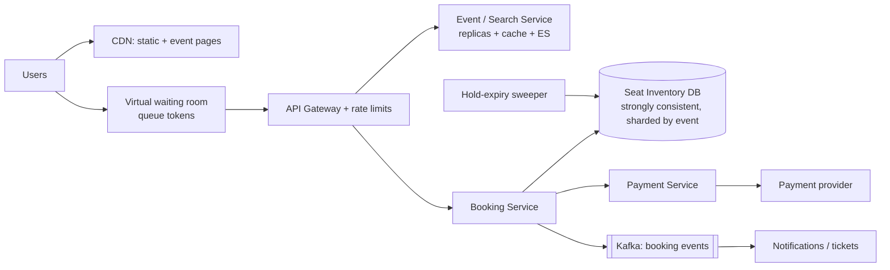
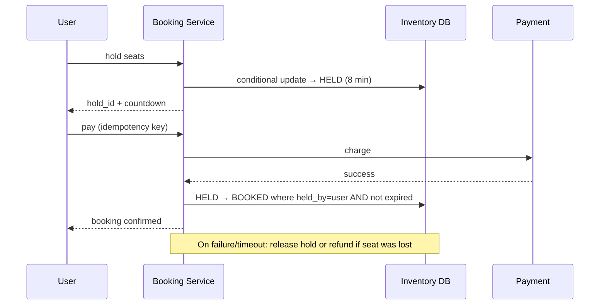

# 🎟️ Design a Movie Booking System — High Level Design

<!-- nav:start -->
🏷️ **Priority:** Medium · **Difficulty:** Advanced

⬅️ Previous: [Design Online Auction System](../Online-Auction-System/README.md) · 🏠 [E-commerce & Marketplace](../README.md) · ➡️ Next: [Design Payment System](../../14-Payment-and-Financial-Systems/Payment-System/README.md)

> 📚 **Credit:** Chapter selection, ordering and question choice follow the [AlgoMaster.io System Design Interviews course](https://algomaster.io/learn/system-design-interviews/course-roadmap). This write-up was created with Claude for personal interview prep. The premium lesson text was **not** accessed or reproduced. See [CREDITS](../../CREDITS.md).
<!-- nav:end -->


> Everyone wants the same 5,000 seats at 10:00:00. The system must never sell a seat twice, must
> stay up under a 100× spike, and must feel fair. Browsing can be sloppy; booking cannot.
> (Object model: LLD repo's *Movie Booking*.)

---

## 📑 On this page

1. [Clarifying Requirements](#1-clarifying-requirements) · 2. [Estimation](#2-back-of-the-envelope-estimation) ·
3. [Core APIs](#3-core-apis) · 4. [High-Level Design](#4-high-level-design) · 5. [Database Design](#5-database-design) ·
6. [Deep Dive](#6-design-deep-dive) · 7. [Follow-ups](#7-follow-ups-with-answers)

---

## 1. Clarifying Requirements

| Candidate asks | Interviewer answers | Design impact |
|---|---|---|
| Seat selection or general admission? | Reserved seats. | Per-seat inventory. |
| Hold time? | ~8 minutes to pay. | Hold with expiry. |
| Concurrency? | Big events: 500k users, 5k seats. | Waiting room + contention control. |
| Payments? | Third-party gateway. | Async saga. |
| Cancellation/refunds? | Yes, policy-based. | Release + refund flow. |
| Search? | Browse events by city/date. | Eventually consistent read path. |

**Functional:** browse events, view seat map, hold seats, pay, confirm, cancel.
**Non-functional:** **no double booking (strong consistency for inventory)**, high availability for
browsing, graceful under spikes, fairness, sub-second seat availability updates.

---

## 2. Back-of-the-Envelope Estimation

| Quantity | Working | Result |
|---|---|---|
| Normal traffic | 10M DAU × 20 page views | ~2.3k/s reads |
| On-sale spike | 500k users in first minute | **~8k requests/s** to one event |
| Successful bookings | 5,000 seats | tiny: ~5k writes total |
| Seat rows | 20k events/day × 3k seats | 60M rows/day active ⇒ archive old |
| Hold traffic | 5k seats × retries by 500k users | tens of thousands of conditional updates on ≤ 5k rows |

**Insight:** throughput is small; **contention** on few rows is the problem.

---

## 3. Core APIs

```http
GET  /v1/events?city=&date=&q=
GET  /v1/events/{id}/seats                  → seat map + status (cached, approximate)
POST /v1/events/{id}/holds   { seat_ids[] } → 201 { hold_id, expires_at } | 409 { unavailable[] }
POST /v1/bookings            { hold_id, payment_token }   Idempotency-Key: ...
                             → 201 { booking_id, tickets[] } | 402 | 410 (hold expired)
DELETE /v1/holds/{id}        (release)
DELETE /v1/bookings/{id}     (cancel/refund)
```

---

## 4. High-Level Design



### 4.1 Requirement 1: Hold seats
Atomic conditional update flips seats `AVAILABLE → HELD(user, expiry)`; all-or-nothing for the
requested set.

### 4.2 Requirement 2: Pay and confirm


---

## 5. Database Design

Inventory needs transactions and row-level contention control ⇒ relational (or a strongly
consistent KV with conditional writes), **partitioned by `event_id`**.

```text
events(event_id PK, venue_id, starts_at, status, ...)
seats(event_id, seat_id, section, price_tier,
      status ENUM(AVAILABLE,HELD,BOOKED), held_by, hold_expires_at, booking_id, version,
      PRIMARY KEY(event_id, seat_id))
bookings(booking_id PK, user_id, event_id, seat_ids, amount, status, payment_ref, idempotency_key UNIQUE, created_at)
holds(hold_id PK, user_id, event_id, seat_ids, expires_at)     -- or derived from seats
```

Search/browse data (events, venues) lives separately in a read-optimised store (ES + cache).

---

## 6. Design Deep Dive

### 6.1 Preventing double booking
```sql
-- succeeds only if the seat is free, or its previous hold has expired
UPDATE seats
   SET status='HELD', held_by=:user, hold_expires_at = now() + interval '8 minutes', version = version+1
 WHERE event_id=:e AND seat_id = ANY(:seats)
   AND (status='AVAILABLE' OR (status='HELD' AND hold_expires_at < now()));
-- require rows_affected == number of seats requested, else ROLLBACK (all or nothing)
```
Alternatives: `SELECT ... FOR UPDATE` in seat-ID order (avoid deadlocks), optimistic `version`
checks, or Redis `SET NX` for holds with the DB as the final authority. Pick one and explain why
partitioning by `event_id` keeps one event's contention on one shard.

### 6.2 Payment race handling
Confirm with `UPDATE ... WHERE held_by=:user AND status='HELD' AND hold_expires_at > now()`. If
payment succeeds *after* expiry and the seat is gone ⇒ **automatic refund** (saga compensation) and
apologise. Payment idempotency key prevents double charges on retries.

### 6.3 Surviving the spike
- **Virtual waiting room**: admit N users per second with signed queue tokens; fairness via random
  or FIFO admission; protects DB and gives users honest progress.
- Serve seat maps from cache with 1–2 s TTL (approximate); the hold call is authoritative.
- Bot defence: CAPTCHA, per-account/device limits, purchase quotas.
- Pre-scale before the on-sale; separate booking cluster from browse.

### 6.3b Expiry of holds
Correctness uses the timestamp comparison in queries (never trust background jobs). A sweeper only
tidies rows and emits "seat released" events for the UI.

### 6.4 Consistency choices
Inventory: strong (single leader per shard, transactions). Browse: eventual. Booking history: durable,
replicated.

---

## 7. Follow-ups (with answers)

### 7.1 How would you implement a waitlist for sold-out events?
`waitlist(event_id, user_id, party_size, joined_at)`. On seat release (expiry/cancel), publish an
event; a worker offers the seats to the first eligible waiter as a new timed hold, then moves down
the list if declined. Idempotent processing avoids double-offering.

### 7.2 How do you seat a group of 4 together?
Model rows/sections so contiguous ranges can be queried (`row, seat_no`); the "best available" search
finds runs of 4 in the requested tier, then attempts an atomic hold on that exact set; on conflict,
retry with the next candidate.

### 7.3 What if the payment provider is slow and holds pile up?
Show clear countdowns, cap concurrent holds per user, time-box payment calls, release holds on
failure, and consider extending a hold once while a payment is *in-flight*.

### 7.4 What about dynamic pricing?
Pricing is a separate service; price is locked into the hold at hold time so it cannot change during
checkout; rules based on demand tiers.

### 7.5 How do you handle a venue-wide change (event cancelled)?
Batch job flips bookings to `CANCELLED`, triggers refunds via the payment saga at controlled rate,
and notifies users; idempotent per booking.

### 7.6 How do you make the waiting room robust?
Stateless signed tokens (position + expiry), a queue in Redis or a managed service, admission rate
tied to inventory service health (auto-throttle), and CDN-hosted page so the queue itself is cheap.

---

## 🧪 Practice Round

<details><summary>1. Why not cache seat availability and trust it for booking?</summary>
Caches are stale by definition. Two users could see the same seat as free; only the conditional DB
write decides who gets it.
</details>

<details><summary>2. Why lock seats in sorted order?</summary>
Two users locking overlapping seat sets in different orders can deadlock; consistent ordering
prevents it.
</details>

---

## 📝 Last-Minute Revision

- Low throughput, **high contention** ⇒ conditional update on `(event_id, seat_id)`; all-or-nothing.
- States AVAILABLE → HELD(expiry) → BOOKED; expiry checked in SQL, not by cron alone.
- Waiting room + cache for seat map + bot controls; refund saga for late payments.
- Concepts: [DB transactions](../../03-Concept-Deep-Dives/04-database-design.md) ·
  [saga](../../05-Interview-Patterns/12-coordinating-transactions-across-services.md) ·
  [idempotency](../../05-Interview-Patterns/10-preventing-duplicate-processing.md) ·
  [rate limiting](../../_Reference/rate-limiting.md)

---

## 📚 References & Credits

| Resource | Use |
|---|---|
| PostgreSQL docs — explicit locking (`FOR UPDATE`, `SKIP LOCKED`) | Public reference |

Original work; personal learning project, not affiliated with AlgoMaster.io.
