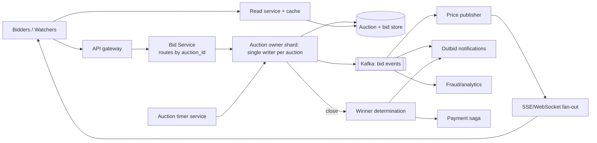

# 🔨 Design an Online Auction System — High Level Design

<!-- nav:start -->
🏷️ **Priority:** Low · **Difficulty:** Advanced

⬅️ Previous: [Design Flash Sale](../Flash-Sale/README.md) · 🏠 [E-commerce & Marketplace](../README.md) · ➡️ Next: [Design Movie Booking System](../Movie-Booking/README.md)

> 📚 **Credit:** Chapter selection, ordering and question choice follow the [AlgoMaster.io System Design Interviews course](https://algomaster.io/learn/system-design-interviews/course-roadmap). This write-up was created with Claude for personal interview prep. The premium lesson text was **not** accessed or reproduced. See [CREDITS](../../CREDITS.md).
<!-- nav:end -->

> An auction is **contention on one item's highest bid**, with a hard deadline and real money. The design has to serialise bids
> per item, handle last-second surges ("sniping"), and close auctions exactly once.

## 1. Clarifying Requirements

| Candidate asks | Interviewer answers | Design impact |
|---|---|---|
| Auction type? | English (ascending) auctions with a reserve and end time. | Bid ordering rules. |
| Bidding? | Minimum increment; proxy (auto) bidding optional. | Validation + proxy engine. |
| Deadline? | Fixed end time; soft-close extension if bid in last 2 min. | Timer logic. |
| Scale? | 10M active auctions, 1M concurrent viewers per hot item, 5k bids/s peak. | Hot item handling. |
| Fairness? | First valid bid wins ties; no lost bids. | Deterministic ordering. |
| Payments? | Winner charged on close (or pre-authorised). | Payment saga. |
| Real-time? | Watchers see the current price live. | Push updates. |

**Functional:** list item, place bid, view auction (current bid, time left), auto-bid, watchlist, close & determine winner, payments, notifications.
**Non-functional:** strong consistency per auction, low bid latency, exactly-once close, high read fan-out, auditability.

## 2. Back-of-the-Envelope Estimation

| Quantity | Working | Result |
|---|---|---|
| Active auctions | 10M | Most idle |
| Bids | 50M/day | **~580/s** avg; last-minute peaks 5–10k/s across the system |
| Hot item | 100k bidders, 20 bids/s in last seconds | Serialised per item, trivial for one node |
| Viewers | 1M on a hot item | Fan-out of price updates |
| Bid record | 100 B | 5 GB/day |

## 3. Core APIs

```http
POST /v1/auctions {item, start_price, reserve, increment, end_time}
GET  /v1/auctions/{id}                  → {current_price, high_bidder(masked), bids_count, ends_at, server_time}
POST /v1/auctions/{id}/bids {amount, max_amount?}  Idempotency-Key → 201 {bid_id, status: ACCEPTED|OUTBID|REJECTED}
SSE  /v1/auctions/{id}/stream           ← price updates, outbid notices, extension events
POST /v1/auctions/{id}/watch
```

## 4. High-Level Design



### 4.1 Placing a bid
Gateway routes to the shard owning `auction_id` (consistent hashing). The **auction owner** processes bids sequentially: validates state (open, not ended, bidder eligible),
compares with current high bid + increment, applies proxy bidding, persists the bid + new state in one transaction, emits events; response returns accepted/outbid.

### 4.2 Closing
A timer service (or scheduled job) fires at `end_time` (or extended end): the owner marks the auction `CLOSING`, rejects further bids, determines the winner (reserve met?),
persists, and triggers payment/notification saga. Close is idempotent (state transitions guarded by version).

## 5. Database Design

```text
auctions  auction_id PK, seller_id, item_id, start_price, reserve, increment, current_price, high_bid_id, high_bidder_id,
          starts_at, ends_at, status(SCHEDULED|OPEN|CLOSING|SOLD|UNSOLD|CANCELLED), version
bids      (auction_id, bid_seq) PK → bid_id, bidder_id, amount, max_amount(proxy), ts, status
          -- append-only; UNIQUE(auction_id, bid_seq); bid_seq gives total order
proxy     (auction_id, bidder_id) → max_amount (kept private)
watchers  (user_id, auction_id) ; reverse index for notifications
payments  order/payment records via payment service
```
Partition by `auction_id`: all state and bids for an auction live together, so a single-node transaction suffices.

## 6. Design Deep Dive

### 6.1 Serialising bids (correctness)
Total order per auction is required. Options:
1. **Single writer per auction** (owner shard/actor) processing a queue: natural serialisation, no locks; failover via leases/fencing.
2. **DB row lock/optimistic version**: `UPDATE auctions SET current_price=:p, version=version+1 WHERE id=:id AND version=:v AND :p >= current_price + increment`; retry on conflict. Fine at moderate contention.
Hot auctions favour single-writer + batching (few thousand bids/s per auction is easily handled in memory, then persisted in batches with an append-only log).

### 6.2 Proxy (automatic) bidding
Bidder sets a max; system bids the minimum needed to stay ahead: when a new bid arrives compare with existing proxy maximum(s) and compute the resulting price (second-highest
max + increment). Max amounts are secret; the engine runs inside the owner shard to keep ordering consistent.

### 6.3 Sniping and soft close
To discourage last-second bids, extend the end time by N minutes if a bid arrives in the last M minutes. Timer must be recomputed atomically with the bid. Use server time only (clients display server-provided countdown with offset correction); reject client clocks.

### 6.4 Timers and exactly-once close
Store `ends_at`; a scheduler picks up auctions due (index on `ends_at`), sends a close command to the owner. The owner re-checks `now >= ends_at` and status; if extended, ignore.
State transition `OPEN → CLOSING → SOLD` guarded by version; payment triggered via outbox event keyed by auction id ⇒ idempotent. See
[Scheduling Delayed and Recurring Jobs](../../05-Interview-Patterns/16-scheduling-delayed-and-recurring-jobs.md).

### 6.5 Real-time updates to watchers
Publish price changes via pub/sub; SSE gateways fan out; coalesce updates (e.g. ≤ 5/s per viewer) for hot auctions; late joiners fetch current state then subscribe. See
[Pushing Real-time Updates](../../05-Interview-Patterns/05-pushing-realtime-updates.md).

### 6.6 Payments and trust
Pre-authorise or require verified payment method; on win, charge with idempotency; non-payment handling (second-chance offer); anti-shill-bidding detection (bidder-seller relationships,
IP/device links); bid retraction rules; audit log of all bids (immutable) for disputes.

### 6.7 Availability
Replicate each auction's state (sync to a follower) to survive owner failure; on failover the follower resumes from the last committed bid sequence; clients retry with
idempotency keys so bids aren't duplicated.

## 7. Follow-ups (with answers)

**7.1 Two bids for the same amount arrive simultaneously. Who wins?** The one assigned the lower sequence number by the auction owner (arrival order at the serialisation point); the second is rejected (must exceed by the increment).

**7.2 How do you make sure a bid isn't lost or double-counted on retry?** Idempotency key per bid attempt stored with the bid; duplicates return the original result.

**7.3 How do you handle clock skew between clients?** Trust only server time; send `server_time` and `ends_at`; clients compute remaining time from the offset.

**7.4 What if the auction owner crashes right before close?** The scheduler retries the close command to the new owner (via lease takeover); close is idempotent and re-validates state.

**7.5 How do you scale to millions of auctions?** Shard by auction_id; only ~small fraction hot; owners are lightweight and can be multiplexed on shared workers.

**7.6 How would you support sealed-bid or Dutch auctions?** Sealed-bid: collect encrypted bids until close, reveal and pick the winner; Dutch: price decreases over time, first acceptance wins (atomic "accept at current price" operation).

## 🧪 Practice Round

<details><summary>Why a single writer per auction?</summary>
Bids for one item must be totally ordered; a single owner gives that order without distributed locks and handles high contention efficiently.
</details>

<details><summary>Why keep proxy max amounts secret and server-side?</summary>
Revealing them changes bidding behaviour and would let others exploit; the server computes minimal winning increments.
</details>

## 📝 Last-Minute Revision

Shard by `auction_id`; **single writer** sequences bids (or optimistic version); append-only bid log with `bid_seq`; proxy bidding in owner; soft-close extension; timer-driven **idempotent close**; SSE fan-out with coalescing; payment saga; server-time only.

Related: [Preventing Double Booking](../../05-Interview-Patterns/14-preventing-double-booking.md) · [Pushing Real-time Updates](../../05-Interview-Patterns/05-pushing-realtime-updates.md) · [Payment System](../../14-Payment-and-Financial-Systems/Payment-System/README.md)
