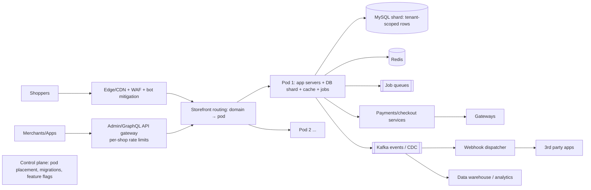

# 🛍️ Design Shopify (Multi-tenant Commerce Platform) — High Level Design

<!-- nav:start -->
🏷️ **Priority:** Low · **Difficulty:** Intermediate

⬅️ Previous: [Design Amazon](../Amazon/README.md) · 🏠 [E-commerce & Marketplace](../README.md) · ➡️ Next: [Design Flash Sale](../Flash-Sale/README.md)

> 📚 **Credit:** Chapter selection, ordering and question choice follow the [AlgoMaster.io System Design Interviews course](https://algomaster.io/learn/system-design-interviews/course-roadmap). This write-up was created with Claude for personal interview prep. The premium lesson text was **not** accessed or reproduced. See [CREDITS](../../CREDITS.md).
<!-- nav:end -->

> Shopify hosts **millions of independent stores** on shared infrastructure. The defining challenge is **multi-tenancy**: isolating noisy
> neighbours, surviving flash sales of a single merchant, and letting merchants customise storefronts without harming others.

## 1. Clarifying Requirements

| Candidate asks | Interviewer answers | Design impact |
|---|---|---|
| Who are users? | Merchants (admin) and their shoppers (storefront). | Two traffic profiles. |
| Scale? | 2M merchants; a few huge ones; BFCM spikes 10×+. | Tenant skew. |
| Storefront? | Themes, custom domains, apps/plugins. | Rendering platform. |
| Checkout? | Hosted checkout with taxes/shipping/payments. | Reliability critical. |
| Extensibility? | Third-party apps via APIs/webhooks. | Platform APIs, rate limits. |
| Isolation? | One store's traffic must not take down others. | Pods/cells, quotas. |
| Data? | Products, inventory, orders, customers per store. | Tenant-sharded data. |

**Functional:** store creation, product/inventory mgmt, storefront rendering, cart/checkout, orders, payments, apps/webhooks, custom domains.
**Non-functional:** high availability of storefront and checkout, tenant isolation, elastic peaks, security, low-latency global storefronts.

## 2. Back-of-the-Envelope Estimation

| Quantity | Working | Result |
|---|---|---|
| Stores | 2M | Most tiny (<1 req/s) |
| Storefront traffic | Global peak (BFCM) 1M req/s | mostly cacheable |
| Checkouts | Peak 10k/s | Correctness critical |
| Orders | 10M/day avg (peaks ×5) | 115/s avg, 600/s peak |
| Data | 2M stores × (avg 1k products) × 5 KB | 10 TB catalogue; orders/customers larger |
| Webhooks | ~10 per order | 100k+/s peak deliveries |

## 3. Core APIs

```http
Storefront:  GET https://{shop-domain}/products/{handle}     POST /cart/add.js     GET /checkout/{token}
Admin API:   GET|POST /admin/api/products.json | orders.json | inventory_levels/set.json (per-shop tokens, rate-limited)
GraphQL Admin API with cost-based throttling (leaky bucket points)
Webhooks:    POST {app_url}  X-Signature: hmac  topic: orders/create
Platform:    OAuth app install; App Bridge; extension points
```

## 4. High-Level Design



### 4.1 Pods (cells) architecture
The fleet is divided into **pods**: each pod is a self-contained stack (app tier, MySQL shard, Redis, job workers) hosting a set of shops. A routing layer maps
`shop/domain → pod`. Failures and load spikes stay inside a pod; a big merchant can be moved to its own pod.

### 4.2 Storefront and checkout
Storefront pages render from theme templates with cached data at edge; carts are lightweight; checkout is a critical, isolated path with strong consistency for inventory
and orders, payment integrations, tax and shipping calculation.

## 5. Database Design

```text
Sharding: tenant key = shop_id present on every row; each pod hosts a MySQL shard containing multiple shops.
shops        shop_id PK, domain(s), plan, pod_id, settings, status
products     (shop_id, product_id) PK, title, handle, description, vendor, tags, status …    variants(shop_id, variant_id, sku, price, ...)
inventory    (shop_id, variant_id, location_id) → available, committed, version
orders       (shop_id, order_id) PK, customer, line_items, totals, financial_status, fulfilment_status, created_at
customers    (shop_id, customer_id) …
checkouts    (shop_id, token) → cart snapshot, addresses, shipping/tax, expires_at
event/outbox (shop_id, event_id) → topic, payload    (transactional outbox → Kafka)
```
Every query includes `shop_id`; composite keys start with `shop_id` for locality; enforced in the data access layer to prevent cross-tenant leaks.

## 6. Design Deep Dive

### 6.1 Multi-tenancy and isolation
- **Pod isolation** contains blast radius; **per-shop quotas** (requests/s, DB time, job concurrency) prevent noisy neighbours; fair-share job queues.
- Rate limits at API gateway: REST leaky bucket per app/shop; GraphQL query cost analysis.
- Merchant migration between pods: online migration by shop (dual-write/tail replication, cutover, verify), enabling rebalancing and dedicated pods for whales.
- Security: strict tenant scoping, per-shop encryption keys/secrets, audit logs, PCI scope isolation for payments.

### 6.2 Surviving flash sales (BFCM)
Storefront pages/assets heavily cached at CDN; cart/checkout endpoints protected by queueing ("checkout throttle"/waiting room per shop) to protect DB; inventory
decrement via atomic conditional updates with per-SKU contention control; pre-scale pods, load test with replayed traffic, freeze risky deploys, feature flags to degrade
non-essential features (recommendations, apps). See [Absorbing Traffic Spikes](../../05-Interview-Patterns/04-absorbing-traffic-spikes.md), [Flash Sale](../Flash-Sale/README.md).

### 6.3 Storefront rendering
Themes (Liquid-like templates) rendered server-side with sandboxed execution and resource limits; fragment/page caching keyed by shop + template + data version; edge
compute for personalization; image CDN with on-the-fly resizing; custom domains with automated TLS certificates and edge routing.

### 6.4 Checkout reliability
Idempotent order creation (checkout token); saga of inventory hold → payment authorisation → order creation; retries and reconciliation; payment provider failover;
outbox pattern to emit `orders/create` exactly once *effect*. Session/token-based checkout URL independent of theme so it survives storefront outages.

### 6.5 Apps and webhooks platform
OAuth-installed apps get scoped tokens; **webhook dispatcher** consumes events, signs payloads (HMAC), delivers with retries/backoff, per-endpoint circuit breakers and
rate limits, and dead-letter/replay; apps must respond fast and be idempotent (event ids). GraphQL/REST APIs with cost-based throttling protect the platform.

### 6.6 Data consistency and analytics
OLTP in MySQL shards; CDC to Kafka for search indexing, analytics, and merchant reports (warehouse). Reports are eventually consistent.

### 6.7 Inventory across channels/locations
Inventory levels per location; orders commit stock; sync with external channels/warehouses via events with idempotent adjustments and periodic reconciliation.

## 7. Follow-ups (with answers)

**7.1 How do you stop one merchant's traffic spike from hurting others?** Pod isolation, per-shop quotas and queues, dedicated pods for large merchants, CDN for reads, and shedding at the edge.

**7.2 How do you move a store between shards without downtime?** Copy snapshot + stream changes (CDC), briefly lock writes for that shop, flip routing atomically, verify counts/checksums, then clean up.

**7.3 How do you prevent tenant data leaks?** Mandatory `shop_id` scoping in the data layer/ORM, row-level tests, separate keys/secrets, audits, and code review/linters for unscoped queries.

**7.4 How do you handle custom domains at scale?** Domain → shop mapping in an edge-replicated store; automated certificate issuance/renewal (ACME) with SNI; health-checked routing to the pod.

**7.5 What if a third-party app slows down checkout?** Apps run outside the critical path (webhooks/async); extension points have strict timeouts and sandboxing; degrade gracefully; ranking of apps by reliability.

**7.6 How would you design the GraphQL rate limit?** Cost-based: each query's cost estimated from requested fields/connection sizes; a leaky bucket per shop/app refills over time; throttle when depleted, return cost headers.

## 🧪 Practice Round

<details><summary>Why pods instead of one global database?</summary>
Bounded blast radius, independent scaling and migration, and lower contention; a global DB is a single failure/scale domain.
</details>

<details><summary>Why must checkout be isolated from theme/storefront?</summary>
Storefront customisation and traffic spikes are risky; checkout is revenue-critical and must remain simple, fast and available.
</details>

## 📝 Last-Minute Revision

**Pods (cells)** with shop-scoped shards; routing by domain; per-shop quotas/rate limits; CDN-cached storefronts; isolated, idempotent checkout saga; outbox → Kafka → webhooks with retries; online shop migration; degrade non-essential features on peak.

Related: [Amazon](../Amazon/README.md) · [Absorbing Traffic Spikes](../../05-Interview-Patterns/04-absorbing-traffic-spikes.md) · [Rate Limiter](../../15-Distributed-Infrastructure/Rate-Limiter/README.md)
