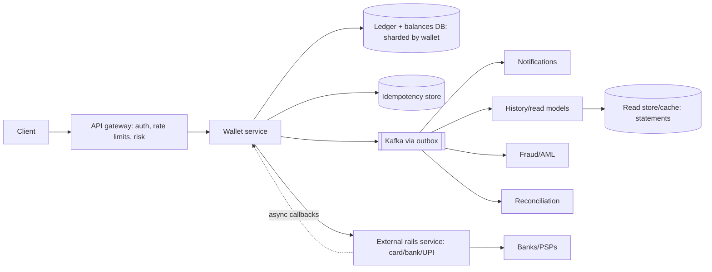

# 👛 Design a Digital Wallet — High Level Design

<!-- nav:start -->
🏷️ **Priority:** Medium · **Difficulty:** Advanced

⬅️ Previous: [Design Payment System](../Payment-System/README.md) · 🏠 [Payment & Financial Systems](../README.md) · ➡️ Next: [Design Stock Exchange](../Stock-Exchange/README.md)

> 📚 **Credit:** Chapter selection, ordering and question choice follow the [AlgoMaster.io System Design Interviews course](https://algomaster.io/learn/system-design-interviews/course-roadmap). This write-up was created with Claude for personal interview prep. The premium lesson text was **not** accessed or reproduced. See [CREDITS](../../CREDITS.md).
<!-- nav:end -->

> A wallet stores a balance and moves money between users instantly. The essence is **correct, atomic balance changes** under
> concurrency, with an immutable ledger and safe retries. Speed matters, but never at the cost of wrong balances.

## 1. Clarifying Requirements

| Candidate asks | Interviewer answers | Design impact |
|---|---|---|
| Features? | Top-up from bank/card, P2P transfer, pay merchants, withdraw, history. | Ledger + integrations. |
| Balance rules? | No negative balances; multi-currency later. | Conditional updates. |
| Guarantees? | Never lose/duplicate money; exact history. | Idempotency + double-entry. |
| Scale? | 100M users, 5B transfers/yr peak 3k TPS. | Sharded ledger. |
| Latency? | Transfer confirmation < 500 ms. | Single-shard transactions. |
| Compliance? | KYC, AML limits, audit. | Limits, reporting. |
| Availability? | 99.99%. | Sync replication. |

**Functional:** wallet accounts, top-up, transfer, pay, withdraw, refunds, transaction history, limits, notifications.
**Non-functional:** strong consistency, exactly-once effect, auditability, security, high availability, regulatory compliance.

## 2. Back-of-the-Envelope Estimation

| Quantity | Working | Result |
|---|---|---|
| Transfers | 5B/yr | **~160/s avg**, peak ~3k/s |
| Ledger entries | 2 per transfer (double-entry) + fees | ~10B entries/yr × 100 B = **1 TB/yr** |
| Accounts | 100M × 200 B | 20 GB |
| Reads (history/balance) | 10× writes | ~30k/s peak, cache-friendly |
| Hot accounts | Merchant/platform accounts | Contention concern |

## 3. Core APIs

```http
POST /v1/wallets/{id}/transfers {to_wallet, amount, currency, note}  Idempotency-Key → 201 {txn_id, status}
POST /v1/wallets/{id}/topups {source_token, amount}     POST /v1/wallets/{id}/withdrawals {bank_account, amount}
GET  /v1/wallets/{id}/balance          GET /v1/wallets/{id}/transactions?cursor=..
POST /v1/transactions/{id}/refund
```
Amounts in minor units (integers).

## 4. High-Level Design



### 4.1 P2P transfer within the wallet system
Idempotency check → risk/limits check → **single ACID transaction**: debit A (conditional `balance >= amount`), credit B, insert two ledger entries + transfer record + outbox event → commit → respond.
If A and B are on the same shard, this is one local transaction; otherwise use the cross-shard strategy in 6.2.

### 4.2 Top-up and withdrawal (external)
Top-up: create `PENDING` txn, call PSP, on success credit wallet (ledger entries from an external clearing account); unknown result ⇒ status query/webhook reconciliation.
Withdrawal: debit wallet into a `PENDING_PAYOUT` hold, call bank rail, finalise or reverse on failure. Never credit/debit based on an unconfirmed external result.

## 5. Database Design

```text
wallets   wallet_id PK, user_id, currency, balance BIGINT (cached derived), version, status, limits
ledger    entry_id PK, txn_id, wallet_id, direction(DEBIT|CREDIT), amount, balance_after, created_at     -- append-only, immutable
          INDEX (wallet_id, created_at)
transfers txn_id PK, type, from_wallet, to_wallet, amount, status, idempotency_key UNIQUE, created_at, metadata
holds     hold_id, wallet_id, amount, reason, expires_at                                       -- for pending external ops
idempotency (key, request_hash) → response, expires
```
Invariant: `sum(ledger credits) − sum(debits) = wallet balance`; system-wide sum of all wallets + external clearing accounts = 0 (double-entry). Balance column is an optimisation validated by reconciliation.

## 6. Design Deep Dive

### 6.1 Atomic balance updates
```sql
BEGIN;
UPDATE wallets SET balance = balance - :amt, version = version + 1 WHERE wallet_id = :a AND balance >= :amt;   -- fails if insufficient
UPDATE wallets SET balance = balance + :amt, version = version + 1 WHERE wallet_id = :b;
INSERT INTO ledger ...(debit A), ...(credit B); INSERT INTO transfers ...; INSERT INTO outbox ...;
COMMIT;
```
Lock ordering by wallet_id (smallest first) prevents deadlocks. `balance >= amt` inside the UPDATE prevents overdrafts under concurrency without read-then-write races.

### 6.2 Cross-shard transfers
Prefer placing both wallets on one shard when possible (locality by user cohort/region). Otherwise:
- **Saga / two-phase with holds**: debit A into a hold (shard 1) → credit B (shard 2) → finalise/mark complete; compensation returns funds if credit fails. Each step idempotent, keyed by `txn_id`.
- Or route through an **intermediate transit account** per shard (two local transactions: A → transit1; transit1 → transit2 (async) → B), preserving conservation and auditability.
See [Coordinating Transactions](../../05-Interview-Patterns/12-coordinating-transactions-across-services.md).

### 6.3 Idempotency
Client `Idempotency-Key` + request hash stored in the same transaction as the transfer; retries return the stored result; concurrent duplicates blocked by the unique constraint. See
[Preventing Duplicate Processing](../../05-Interview-Patterns/10-preventing-duplicate-processing.md).

### 6.4 Hot accounts
Merchant or platform fee accounts receive thousands of credits/s. Avoid a single hot row: **sub-accounts/sharded balances** (`merchant#0..N`) with periodic consolidation, batch credits via
stream aggregation (ledger entries still written per transaction), or serialise via a per-account queue. Available balance for spending rarely needed for credit-only accounts.

### 6.5 Ledger and reconciliation
Immutable entries; corrections are reversing entries. Nightly reconciliation: (1) wallet balance vs ledger sums, (2) internal transfers vs external PSP/bank statements, (3) global conservation check. Discrepancies open tickets; runbooks and automated repair where safe.

### 6.6 Security, risk and compliance
KYC tiers with limits; velocity checks; device/behaviour anomaly detection; step-up authentication (OTP/biometrics) for risky actions; encryption; HSM-protected keys; audit trail; AML monitoring and reporting; sanctions screening.

### 6.7 Read scaling
Balance read from primary (strong) or cached with invalidation on write; statements/history from a read model built via CDC/events (eventually consistent); paginate by `(created_at, entry_id)` cursor.

### 6.8 Availability
Synchronous replication (or consensus-based DB like Spanner/CockroachDB/Aurora) to avoid acknowledged-write loss on failover; multi-AZ; DR region with defined RPO; degraded mode (read-only) during incidents.

## 7. Follow-ups (with answers)

**7.1 How do you prevent double spending?** Conditional debit in an ACID transaction (`balance >= amount`), row locking, and idempotency keys; concurrent transfers serialise on the wallet row.

**7.2 What happens if the DB fails after debit but before credit?** They are in one transaction (same shard) so both roll back; in cross-shard sagas a recovery process continues or compensates using persisted saga state and holds.

**7.3 How do you support multiple currencies?** Wallet per currency; conversion as two ledger transactions via an FX clearing account with rate/timestamp recorded; rounding rules and FX gain/loss accounts.

**7.4 How do you show a real-time balance while transfers are pending?** Available = balance − active holds; pending incoming shown separately until settled.

**7.5 How do you handle chargebacks/reversals?** Reversal transactions referencing the original (new ledger entries); handle negative balance recovery/limits; immutable history preserved.

**7.6 Why not use an event-sourced ledger only?** It's a valid design (state = fold of events) but requires snapshots and careful concurrency for balance checks; a relational ledger + balance with constraints is simpler and proven.

## 🧪 Practice Round

<details><summary>Why store balance if the ledger is the truth?</summary>
Computing balances by summing millions of entries is slow; a maintained balance enables fast checks, verified by reconciliation against the ledger.
</details>

<details><summary>How do you avoid deadlocks in transfers?</summary>
Always lock/update the two wallet rows in a consistent global order (e.g. by wallet_id).
</details>

## 📝 Last-Minute Revision

Double-entry immutable ledger + balance with **conditional debit**; single-shard ACID transfer (ordered locks); cross-shard via holds/saga; idempotency key in-transaction; external rails async with unknown-outcome handling; hot-account splitting; nightly reconciliation; sync replication.

Related: [Payment System](../Payment-System/README.md) · [Coordinating Transactions](../../05-Interview-Patterns/12-coordinating-transactions-across-services.md) · [Database design](../../03-Concept-Deep-Dives/04-database-design.md)
