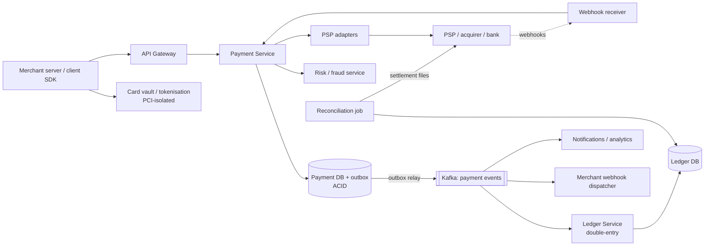
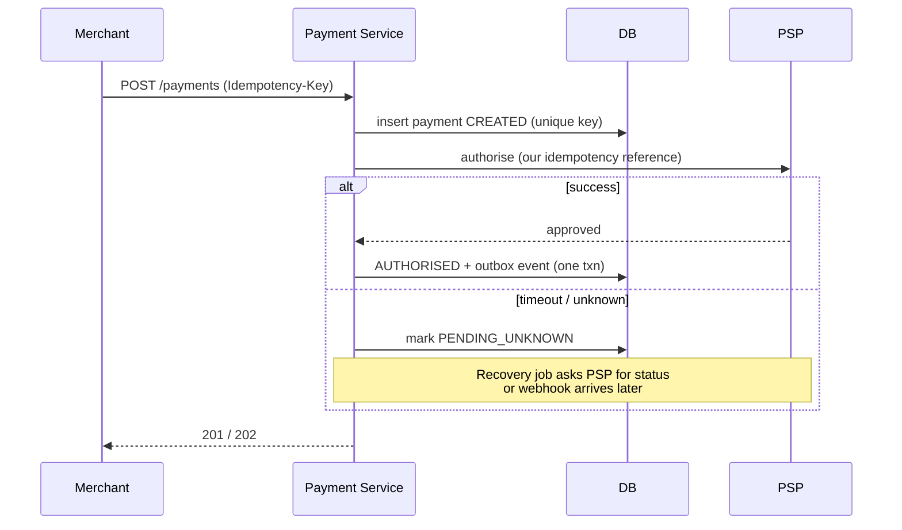

# 💳 Design a Payment System — High Level Design

<!-- nav:start -->
🏷️ **Priority:** High · **Difficulty:** Intermediate

⬅️ Previous: [Design Movie Booking System](../../13-E-commerce-and-Marketplace/Movie-Booking/README.md) · 🏠 [Payment & Financial Systems](../README.md) · ➡️ Next: [Design Digital Wallet](../Digital-Wallet/README.md)

> 📚 **Credit:** Chapter selection, ordering and question choice follow the [AlgoMaster.io System Design Interviews course](https://algomaster.io/learn/system-design-interviews/course-roadmap). This write-up was created with Claude for personal interview prep. The premium lesson text was **not** accessed or reproduced. See [CREDITS](../../CREDITS.md).
<!-- nav:end -->


> Volume is modest (about 1,000 payments/s at peak). What makes this hard is that **every failure
> mode costs real money**: double charges, lost payments, timeouts where you don't know whether the
> bank charged the card. (Object model: LLD repo's *Payment Gateway*.)

---

## 📑 On this page

1. [Clarifying Requirements](#1-clarifying-requirements) · 2. [Estimation](#2-back-of-the-envelope-estimation) ·
3. [Core APIs](#3-core-apis) · 4. [High-Level Design](#4-high-level-design) · 5. [Database Design](#5-database-design) ·
6. [Deep Dive](#6-design-deep-dive) · 7. [Follow-ups](#7-follow-ups-with-answers)

---

## 1. Clarifying Requirements

| Candidate asks | Interviewer answers | Design impact |
|---|---|---|
| Who are we? | A payment platform for merchants, on top of external PSPs/banks. | Adapter layer. |
| Flows? | Authorise, capture, refund. | State machine. |
| Methods? | Cards, wallets, bank transfer. | Pluggable methods. |
| Card data? | Must not touch our servers. | Tokenisation/vault, PCI scope. |
| Guarantees? | Never double charge, never lose a payment. | Idempotency + reconciliation. |
| Async results? | Some methods complete later. | Webhooks/callbacks. |
| Audit? | Full trail, immutable. | Ledger, event history. |
| Scale? | 10M txns/day. | Moderate; correctness first. |

**Functional:** create payment, authorise/capture, refund, status, merchant webhooks, ledger,
settlement and reconciliation.
**Non-functional:** correctness and durability over raw speed, availability, security/compliance,
auditability.

---

## 2. Back-of-the-Envelope Estimation

| Quantity | Working | Result |
|---|---|---|
| Transactions | 10M/day ÷ 86,400 | **~120/s**, peak ~1–2k/s |
| Payment records | 10M × 2 KB | **~20 GB/day**, ~7 TB/year |
| Ledger entries | ~4 per txn × 200 B | ~8 GB/day |
| Webhook deliveries | ≥ 1 per txn + retries | ~30/s |
| PSP latency | 300–2000 ms | Drives timeouts and async design |

---

## 3. Core APIs

```http
POST /v1/payments
Idempotency-Key: 5d1f...   Authorization: Bearer <merchant_key>
{ "amount": 4999, "currency": "USD", "payment_method": "tok_abc", "capture": false,
  "order_ref": "ord_123", "metadata": {...} }
→ 201 { "payment_id": "pay_9", "status": "AUTHORISED" }
→ 202 { "payment_id": "pay_9", "status": "PENDING" }         (result will arrive via webhook)
→ 409 same key, different body

POST /v1/payments/{id}/capture   { "amount": 4999 }
POST /v1/payments/{id}/refunds   { "amount": 1000 }          Idempotency-Key
GET  /v1/payments/{id}
Webhook → merchant: { "type": "payment.captured", "id": "evt_1", "data": {...} }  + signature header
```

Amounts are **integers in minor units** (cents), never floats.

---

## 4. High-Level Design



### 4.1 Requirement 1: Take a payment


### 4.2 Requirement 2: Capture, refund, ledger, reconciliation
Capture and refunds are additional state transitions with their own idempotency keys. Every money
movement is written to the **double-entry ledger** by consuming events. A daily reconciliation
compares our ledger with PSP settlement files and bank statements.

---

## 5. Database Design

Payment + outbox + idempotency need ACID ⇒ relational DB (Postgres/MySQL), sharded by
`merchant_id` or `payment_id` when needed.

```text
payments(payment_id PK, merchant_id, amount_minor BIGINT, currency, status, method_token,
         psp, psp_ref, idempotency_key, request_hash, created_at, updated_at, version,
         UNIQUE(merchant_id, idempotency_key))
payment_events(payment_id, seq, type, payload, ts)          -- immutable history
outbox(id PK, topic, payload, created_at, published_at)
ledger_entries(entry_id, txn_id, account_id, direction ENUM(DEBIT,CREDIT), amount_minor, currency, ts)
accounts(account_id, type[merchant|platform|psp_clearing|fees], currency)
webhook_deliveries(event_id, merchant_id, attempts, next_retry_at, status)
```

Invariant: for every `txn_id`, sum of debits = sum of credits. Entries are append-only.

---

## 6. Design Deep Dive

### 6.1 Idempotency
Unique `(merchant, idempotency_key)`; store `request_hash` and the eventual response. Same key +
same body ⇒ replay stored response. Different body ⇒ 409. Concurrent duplicates: one wins the
insert, the other waits/gets `PENDING`. Forward our reference to the PSP so *their* dedupe also
protects us. See [idempotency](../../05-Interview-Patterns/10-preventing-duplicate-processing.md).

### 6.2 State machine
`CREATED → PENDING → AUTHORISED → CAPTURED → (PARTIALLY_)REFUNDED`, with `FAILED`, `VOIDED`,
`EXPIRED`. Transitions validated server-side with optimistic `version`; each change appends a
`payment_events` row. Never delete or overwrite history.

### 6.3 Unknown outcomes (the hard part)
A timeout after sending to the PSP means **we don't know**. Never assume failure, never blindly
retry a *new* charge. Steps: mark `PENDING_UNKNOWN`; query the PSP by our reference; process late
webhooks; if still unknown after a window, escalate/reconcile. Only retry with the **same**
idempotency reference.

### 6.4 Double-entry ledger
Every payment posts balanced entries, e.g. capture $50: debit `psp_clearing` 50, credit
`merchant_payable` 47.50, credit `platform_fees` 2.50. Balances are derived from entries (or cached
and verified). Corrections are new entries (reversals), never edits. Enables audit and proves money
is conserved.

### 6.5 Reliable events: outbox
State change + outbox row commit atomically; a relay/CDC publishes to Kafka (at-least-once);
consumers (ledger, webhooks) are idempotent by `event_id`. See [saga & outbox](../../05-Interview-Patterns/12-coordinating-transactions-across-services.md).

### 6.6 Webhooks to merchants
At-least-once, signed (HMAC with timestamp), retried with exponential backoff for days, ordered per
payment when feasible, replayable from a dashboard; merchants dedupe by `event_id`.

### 6.7 Security and compliance
Cards go from the browser/SDK straight to a PCI-scoped **vault**, returning a token; our services
handle tokens only. TLS everywhere, HSM/KMS keys, field encryption, least-privilege, audit logs, 3-D
Secure/strong customer authentication, PII minimisation.

### 6.8 Multi-PSP routing
Route by cost, success rate, method, region; fail over only when it's safe (payment provably not
created at the first PSP, or the same idempotency reference is supported).

---

## 7. Follow-ups (with answers)

### 7.1 How do you handle partial and multiple refunds?
Track `captured_amount` and `refunded_amount`; each refund request is idempotent and validated
`refunded + new ≤ captured` in the same transaction that inserts the refund row; ledger posts
reversing entries.

### 7.2 How would you build a digital wallet with transfers between users?
Keep both balances in one shard/DB and transfer in a single ACID transaction with double-entry
rows; avoid negative balances with a conditional update (`balance >= amount`). Cross-shard transfers
use a saga with a `pending` hold entry and compensation, or route both accounts to the same shard.

### 7.3 How do you support subscriptions / recurring billing?
A scheduler creates payments from stored tokens on due dates with deterministic idempotency keys
(`sub_id + period`); handle failures with dunning (retry schedule, notify, suspend); network
tokens/account updater keep cards fresh.

### 7.4 How do you detect and stop fraud?
Synchronous rules (velocity, geo mismatch, BIN checks) and an ML risk score within a strict latency
budget; step-up authentication for medium risk; async review for disputes; chargeback feedback loop.

### 7.5 How does reconciliation work and what do mismatches mean?
Match internal records against PSP settlement reports by reference and amount. Mismatch classes:
missing on our side (lost webhook), missing at PSP (failed charge we thought succeeded), amount/fee
differences, duplicate. Each creates a ticket or auto-correction entry.

### 7.6 How do you handle currency conversion and rounding?
Store amounts as integers plus currency exponent; keep FX rate and timestamp with each conversion;
define rounding rules; book FX gain/loss to its own ledger account.

### 7.7 What if the payment DB fails over mid-request?
Transactions are atomic; the client retries with the same idempotency key and receives the
recorded result; the outbox ensures events still publish; run synchronous replication for the
payments DB to avoid losing acknowledged writes.

---

## 🧪 Practice Round

<details><summary>1. A charge request times out. Retry?</summary>
Only with the same idempotency reference, after checking the PSP status; a fresh charge could double
bill.
</details>

<details><summary>2. Why integers for money?</summary>
Floating point can't represent decimal fractions exactly, causing rounding drift.
</details>

<details><summary>3. Why an immutable ledger?</summary>
Auditability and reconstruction of any historical balance; corrections are additive.
</details>

---

## 📝 Last-Minute Revision

- ~120 TPS: **correctness > scale**. Idempotency key + unique constraint + stored response.
- State machine + immutable events; **unknown outcome** handled by status query/webhook/reconcile.
- Double-entry ledger, outbox → Kafka → idempotent consumers, signed retried webhooks.
- Tokenise cards (PCI), integers for money, daily reconciliation.
- Concepts: [idempotency](../../05-Interview-Patterns/10-preventing-duplicate-processing.md) ·
  [saga & outbox](../../05-Interview-Patterns/12-coordinating-transactions-across-services.md) ·
  [DB transactions](../../03-Concept-Deep-Dives/04-database-design.md) ·
  [security](../../_Reference/security-basics.md)

---

## 📚 References & Credits

| Resource | Use |
|---|---|
| [PCI Security Standards Council — public overview](https://www.pcisecuritystandards.org/) | Compliance background |
| Public API docs of major payment providers (idempotency, webhooks) | Conventions |

Original work; personal learning project, not affiliated with AlgoMaster.io.
