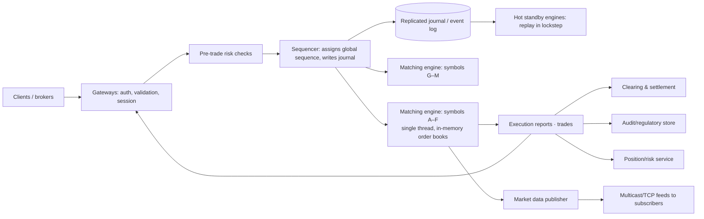

# 📈 Design a Stock Exchange — High Level Design

<!-- nav:start -->
🏷️ **Priority:** Low · **Difficulty:** Advanced

⬅️ Previous: [Design Digital Wallet](../Digital-Wallet/README.md) · 🏠 [Payment & Financial Systems](../README.md) · ➡️ Next: [Design Load Balancer](../../15-Distributed-Infrastructure/Load-Balancer/README.md)

> 📚 **Credit:** Chapter selection, ordering and question choice follow the [AlgoMaster.io System Design Interviews course](https://algomaster.io/learn/system-design-interviews/course-roadmap). This write-up was created with Claude for personal interview prep. The premium lesson text was **not** accessed or reproduced. See [CREDITS](../../CREDITS.md).
<!-- nav:end -->

> An exchange is a **matching engine with microsecond latency, strict fairness and absolute determinism**. It is one of the few
> systems where a **single-threaded, in-memory, sequenced design** beats horizontal scaling. (Object model: LLD repo's *Stock Exchange*.)

## 1. Clarifying Requirements

| Candidate asks | Interviewer answers | Design impact |
|---|---|---|
| Scope? | Order entry, matching, market data, clearing hooks; limit + market orders. | Core matching path. |
| Symbols? | ~5,000 instruments. | Shard by symbol. |
| Throughput? | 1M orders/s aggregate, 100k/s on busiest symbols. | Per-symbol engines. |
| Latency? | Tens of microseconds match, p99 < 1 ms. | In-memory, no DB on hot path. |
| Fairness? | Price-time priority, deterministic. | Sequencer. |
| Reliability? | No lost/duplicated trades; failover in seconds. | Replicated state machine. |
| Regulation? | Full audit trail, market data dissemination. | Immutable journal. |

**Functional:** submit/cancel/modify orders, matching (price-time priority), trade reports, order book/market data feeds, risk checks, clearing/settlement integration, audit.
**Non-functional:** ultra-low latency, determinism, high availability with zero data loss, fairness, throughput per symbol, complete auditability.

## 2. Back-of-the-Envelope Estimation

| Quantity | Working | Result |
|---|---|---|
| Orders | 1M/s aggregate peak | Shard by symbol; busiest symbol 100k/s |
| Message size | ~100 B | 100 MB/s inbound |
| Matching cost | ~1–10 µs/order in memory | One core can do 100k–1M orders/s |
| Market data | Every book update to thousands of subscribers | Multicast/fan-out tier |
| Journal | 1M × 100 B × 6.5 h | ~2.3 TB/day sequential writes |
| Daily trades | ~50M | Clearing batch |

## 3. Core APIs

```text
Order entry (FIX / binary protocol over TCP, low-latency gateways):
  NewOrder {client_order_id, symbol, side, type(LIMIT|MARKET|IOC|FOK), qty, price, tif}
  Cancel {client_order_id} · Replace {client_order_id, qty, price}
Responses: ExecutionReport {order_id, status(NEW|PARTIAL|FILLED|CANCELLED|REJECTED), fills[]}
Market data: multicast/UDP or TCP feeds — L1 (best bid/ask), L2 (depth), trades, snapshots + incremental updates with sequence numbers
```

## 4. High-Level Design



### 4.1 Order flow
Gateway validates and authenticates; pre-trade risk checks (limits, credit, fat-finger); the **sequencer** stamps a strictly increasing sequence number and persists to the journal
(replicated); matching engine for that symbol applies orders in sequence order, matches against the book, emits fills; results go to the client, market data and downstream systems.

### 4.2 Deterministic replicated state machine
Given the same input sequence, engines produce identical outputs. Standby replicas consume the journal and stay in lockstep, so failover is: promote standby, continue from the last sequence number.

## 5. Database Design

Hot path uses **no database**; state is memory + append-only logs.

```text
Order book (per symbol, in memory):
  bids: price levels (descending) → FIFO queue of orders     asks: price levels (ascending) → FIFO queue
  index: order_id → (side, price level, node) for O(1) cancel
Journal (append-only, replicated): seq, timestamp, message (NewOrder/Cancel/Replace/Trade) — source of truth; snapshot every N minutes
Downstream stores (async): trades, orders, positions in relational/columnar DBs; audit archive (WORM); reference data (symbols, tick size, limits)
```

## 6. Design Deep Dive

### 6.1 Order book and matching algorithm
Price-time priority: best price first, then earliest arrival. Data structure: sorted map of price levels (array/red-black tree/price-indexed array) with doubly linked FIFO queues,
hash map for order lookup ⇒ O(log P) insert (O(1) with array by tick), O(1) cancel. Match loop: incoming buy matches lowest asks while `price >= ask` (limit) or until filled (market);
partial fills leave remainder on the book (limit) or cancel (IOC), FOK checks liquidity first.

### 6.2 Why single-threaded per symbol
Matching must be deterministic and fair; locks and concurrency introduce latency and non-determinism. A single thread pinned to a core with a lock-free ring buffer input
(Disruptor pattern) and no allocations/GC pauses in the hot path achieves microsecond latency. Scale by **sharding symbols** across engines (each independently sequenced),
not by parallelising one book.

### 6.3 Sequencer and durability
The sequencer defines the official order of events. Persist to a replicated log **before** the engine acts (or concurrently with synchronous replication acknowledgment) so an acknowledged
order is never lost. Techniques: replicate to standby via low-latency network (kernel-bypass), Raft/chain replication for the journal, batching micro-batches for throughput.

### 6.4 Failover and recovery
Hot standby engines replay the same journal; failure detection via heartbeats; promote with fencing to avoid split brain; clients reconnect and re-sync via sequence numbers
(gap recovery through replay). Cold recovery: load latest snapshot + replay journal tail.

### 6.5 Market data dissemination
Publish incremental updates (book changes, trades) with sequence numbers over multicast for fairness (everyone receives at nearly the same time) plus TCP snapshot/retransmit channels for
gap fill. Tiers: L1 (BBO), L2 (depth), consolidated tape. Throttling for slow consumers; normalisation for retail feeds; rate-limited public APIs/WebSocket for web users.

### 6.6 Fairness and latency engineering
Equal-length cables/co-location fairness, deterministic timestamps, per-participant rate limits, kernel-bypass networking (DPDK/RDMA), NUMA-aware memory, CPU pinning, no GC/allocations
(pre-allocated pools), binary protocols; measure tail latency at p99.99.

### 6.7 Risk, clearing and settlement
Pre-trade checks (position and credit limits, price collars, self-trade prevention, kill switches); post-trade: trade capture → clearing house (novation, netting) → settlement (T+1/T+2)
using batch/async pipelines with reconciliation; circuit breakers (volatility halts) and market-wide halt controls.

### 6.8 Audit and compliance
Every input and output is journaled with nanosecond timestamps; WORM archival; time synchronisation (PTP/GPS); replay tooling for investigations; surveillance for manipulation
(spoofing, wash trading) on downstream streams.

## 7. Follow-ups (with answers)

**7.1 How do you scale to more symbols?** Add matching engine shards partitioned by symbol; each has its own sequencer/journal; cross-symbol products (e.g. spreads) need coordination or a dedicated engine.

**7.2 How do you handle a hot symbol (e.g. a meme stock)?** One symbol = one engine thread; optimise per-order path (µs), batch I/O, dedicated hardware/core, throttle non-essential outputs, pre-trade rate limits; a symbol cannot be parallelised without breaking price-time priority.

**7.3 What if the primary matching engine crashes mid-order?** The order was journaled before processing; standby replays to the same state and continues; clients see either an execution report or resend detection via client_order_id/sequence.

**7.4 How do you cancel orders quickly and correctly?** O(1) by order id lookup; sequenced like other messages; a cancel racing with a fill resolves by sequence: whichever arrived first wins; cancel-reject if already filled.

**7.5 Why not use a database or Kafka for matching?** Too slow and non-deterministic for microsecond matching; logs (Kafka-like) are used *around* the engine for downstream distribution, not on the matching hot path.

**7.6 How do you ensure fairness to all participants?** Single sequence order, symmetric network paths, multicast market data, no privileged access paths, audit of latencies.

## 🧪 Practice Round

<details><summary>Why is price-time priority implemented with FIFO queues per price level?</summary>
Orders at the same price must fill in arrival order; a queue per level preserves that and gives O(1) matching at the head.
</details>

<details><summary>What makes failover safe?</summary>
Determinism plus a replicated, sequenced journal: standbys replay identical inputs to reach identical state; fencing prevents two active primaries.
</details>

## 📝 Last-Minute Revision

Gateways → risk → **sequencer + replicated journal** → **single-threaded in-memory matching engine per symbol** (price-time priority, sorted price levels + FIFO queues, O(1) cancel) → executions + market data (multicast, sequence numbers); hot standby via journal replay; shard by symbol; low-latency engineering; clearing/audit downstream.

Related: [Consensus & replication](../../03-Concept-Deep-Dives/05-Distributed-Systems/03-consistency-and-cap.md) · [Messaging Queue](../../15-Distributed-Infrastructure/Messaging-Queue/README.md) · [Real Time Leaderboard](../../16-Counting-and-Ranking-Systems/Real-Time-Leaderboard/README.md)
