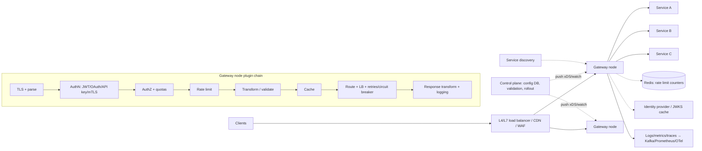

# 🚪 Design an API Gateway — High Level Design

<!-- nav:start -->
🏷️ **Priority:** High · **Difficulty:** Intermediate

⬅️ Previous: [Design Load Balancer](../Load-Balancer/README.md) · 🏠 [Distributed Infrastructure](../README.md) · ➡️ Next: [Design Rate Limiter](../Rate-Limiter/README.md)

> 📚 **Credit:** Chapter selection, ordering and question choice follow the [AlgoMaster.io System Design Interviews course](https://algomaster.io/learn/system-design-interviews/course-roadmap). This write-up was created with Claude for personal interview prep. The premium lesson text was **not** accessed or reproduced. See [CREDITS](../../CREDITS.md).
<!-- nav:end -->

> The API gateway is the **single entry point for clients into a microservice fleet**: authentication, routing, rate limiting,
> request shaping, observability. It must add very little latency and must never become the bottleneck or SPOF.

## 1. Clarifying Requirements

| Candidate asks | Interviewer answers | Design impact |
|---|---|---|
| Consumers? | Web/mobile apps and third-party API clients. | AuthN, quotas, API keys. |
| Features? | Routing, auth, rate limiting, request/response transformation, caching, logging, API versioning. | Plugin chain. |
| Protocols? | REST/HTTP, gRPC, WebSocket. | Multi-protocol proxy. |
| Scale? | 1M req/s, 5k services/routes, p99 overhead < 10 ms. | Stateless, horizontal. |
| Config? | Teams self-serve route/policy changes. | Dynamic config + validation. |
| Multi-tenancy? | Per-client/plan limits. | Keyed quotas. |
| Availability? | 99.99%; degraded modes. | Multi-AZ, fail-open policies. |

**Functional:** route by host/path/method/header; authenticate/authorise; rate limit/quota; transform (headers, body, protocol translation); cache; aggregate responses; observability; canary routing.
**Non-functional:** low overhead, high availability, safe live config updates, extensibility, security.

## 2. Back-of-the-Envelope Estimation

| Quantity | Working | Result |
|---|---|---|
| Traffic | 1M req/s peak | ~20–50 gateway nodes at 30–50k rps each (with plugins) |
| Latency budget | auth check + rate limit + routing | < 5–10 ms total |
| Routes | 5k services × ~20 routes | 100k routes: in-memory trie/radix tree |
| Rate-limit ops | 1M/s | Redis shards ~10–20 or local token buckets |
| Token validation | JWT signature verify ~50 µs | CPU OK; cache JWKS |
| Config changes | ~100/day | push updates |

## 3. Core APIs

```text
Data plane:  https://api.example.com/{service}/{...}  → routed to upstreams
Admin API:
  PUT /v1/routes/{id} {match{host,path,methods,headers}, upstream{service,subset,timeout,retries}, plugins[...], version}
  PUT /v1/consumers/{id} {api_keys, plan, quotas}
  PUT /v1/policies/rate-limits/{id} {key: consumer|ip|header, limit, window}
  GET /v1/status · metrics · POST /v1/routes/{id}/rollback
```

## 4. High-Level Design



### 4.1 Request path
TLS terminate → match route (radix tree by host/path) → run plugin chain: authenticate (validate JWT locally using cached keys / introspect / API key lookup), authorise (scopes/roles), rate limit,
validate/transform request, optional cache lookup → choose upstream instance (LB algorithm from discovery) with timeout, retry (idempotent only), circuit breaker → response transform, add headers, emit telemetry.

### 4.2 Control plane
Teams define routes/policies (GitOps or admin API) → validated (schema, conflicts, dry-run) → versioned → distributed to gateway nodes via push/watch → atomically swapped. Rollback by version.

## 5. Database Design

```text
Config store (etcd/Postgres): routes, upstreams, plugins, consumers, API keys (hashed), plans/quotas, certificates, versions & audit log
Runtime (memory): compiled route tree, plugin chains, JWKS cache, upstream health/endpoints, circuit-breaker state, local token buckets
Redis (optional): distributed rate-limit counters, response cache, idempotency keys
Telemetry: access logs → Kafka → analytics; metrics → TSDB; traces → tracing backend
```

## 6. Design Deep Dive

### 6.1 Statelessness and scale
Gateway nodes hold no per-request state beyond caches, so scale horizontally behind an LB. Config is replicated to each node in memory; no database call on the hot path (auth uses local JWT verification;
API keys cached with TTL).

### 6.2 Authentication and authorisation
- **JWT**: verify signature with cached JWKS, check `exp/aud/iss/scope`; short TTL; revocation via denylist/short tokens or introspection for sensitive routes.
- **OAuth2/OIDC**: gateway can act as resource server; token exchange to propagate identity downstream (internal JWT/headers), avoiding services re-authenticating externally.
- **API keys** for partners (hashed at rest, cached); **mTLS** for service clients.
- Coarse-grained authZ at the edge (scopes, plan); fine-grained in services. Never trust client-supplied identity headers.

### 6.3 Rate limiting and quotas
Per consumer/route limits with token bucket; local limiter plus periodic sync or Redis for global accuracy; different tiers by plan; return 429 with headers. See [Design a Rate Limiter](../Rate-Limiter/README.md).

### 6.4 Resilience patterns
Timeouts per route, retry budgets with jitter (idempotent only), circuit breakers per upstream, outlier ejection, bulkheads (connection/concurrency limits per upstream), fallback responses, load shedding when saturated,
graceful degradation (fail-open for non-critical plugins like analytics; fail-closed for auth).

### 6.5 Protocol and API management
REST↔gRPC translation, WebSocket upgrade proxying, request/response transformation, schema validation (OpenAPI), API versioning (`/v1`, headers), deprecation headers, response aggregation/BFF patterns (compose several
services into one response) with care for latency and partial failures.

### 6.6 Caching and compression
Cache GET responses by key (route + params + selected headers) with TTL/`Cache-Control`, stale-while-revalidate; compress (gzip/br) and HTTP/2/3 support; ETag revalidation.

### 6.7 Observability and traffic management
Correlation/trace IDs injected; RED metrics per route/consumer; canary/weighted routing, header-based routing, shadow traffic mirroring; access logs sampled. Rollout safety: config canaries and validation gates.

### 6.8 Gateway pitfalls and alternatives
A monolithic gateway with business logic becomes a bottleneck and ownership problem: keep it thin. Alternatives/complements: service mesh (east-west traffic), per-team BFF gateways, cloud API gateways (managed) vs
self-hosted Envoy/Kong/NGINX.

## 7. Follow-ups (with answers)

**7.1 How do you keep the gateway from being a single point of failure?** Run many stateless nodes across AZs behind an LB/anycast; nodes operate on last-known-good config if the control plane is down; autoscale; blast-radius split (separate gateways per domain/tenant).

**7.2 How do you validate JWTs without a network call?** Cache the issuer's public keys (JWKS) and verify signatures locally; refresh on `kid` miss/rotation; check claims; use short expirations and a denylist for revocation.

**7.3 How do you roll out a bad route config safely?** Validate against a schema and route-conflict checks, deploy progressively (canary gateways), monitor error rates, automatic rollback to the previous version.

**7.4 Gateway vs service mesh?** Gateway handles north-south (external→internal) with public API concerns; mesh handles east-west (service↔service) mTLS, retries, telemetry via sidecars. They complement each other.

**7.5 How do you do global rate limits without a hot Redis?** Local token buckets with periodic reconciliation, sharded Redis keyed by consumer, and approximate limits; heavy hitters get dedicated shards.

**7.6 How do you handle long-lived connections (WebSocket, streaming)?** Dedicated listeners/nodes tuned for many connections, connection-aware LB, periodic re-auth/token refresh over the connection, graceful drain on deploy.

## 🧪 Practice Round

<details><summary>Why authenticate at the gateway?</summary>
It centralises security, rejects bad traffic early, and lets services trust an authenticated identity header instead of each implementing auth.
</details>

<details><summary>Why must the gateway avoid database calls on the hot path?</summary>
Latency and availability: every request would depend on the DB; cache config and keys in memory and update via push.
</details>

## 📝 Last-Minute Revision

Stateless gateway fleet behind LB; radix-tree routing; plugin chain: TLS → **authN (JWT local verify)** → authZ/quota → **rate limit** → transform → cache → route with timeouts/retries/circuit breakers; control plane pushes versioned config; canary + rollback; thin gateway, no business logic; observability everywhere.

Related: [Rate Limiter](../Rate-Limiter/README.md) · [Load Balancer](../Load-Balancer/README.md) · [Microservices notes](../../_Reference/microservices-and-communication.md)
