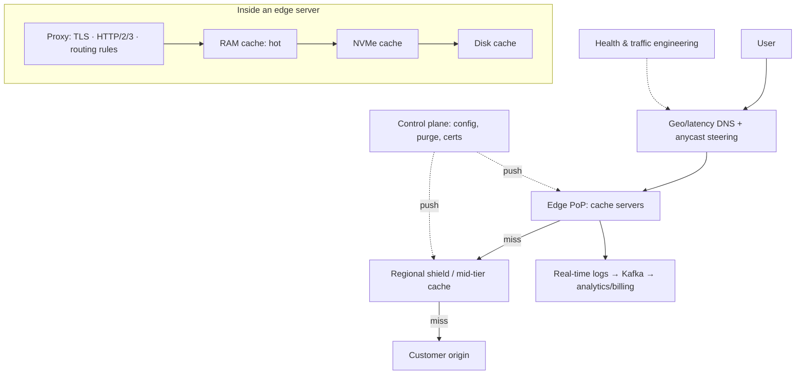

# 🌐 Design a CDN — High Level Design

<!-- nav:start -->
🏷️ **Priority:** Medium · **Difficulty:** Advanced

⬅️ Previous: [Design Distributed Cache](../Distributed-Cache/README.md) · 🏠 [Distributed Infrastructure](../README.md) · ➡️ Next: [Design Object Storage like S3](../Object-Storage-S3/README.md)

> 📚 **Credit:** Chapter selection, ordering and question choice follow the [AlgoMaster.io System Design Interviews course](https://algomaster.io/learn/system-design-interviews/course-roadmap). This write-up was created with Claude for personal interview prep. The premium lesson text was **not** accessed or reproduced. See [CREDITS](../../CREDITS.md).
<!-- nav:end -->

> A CDN moves content close to users. Designing one means answering: **which edge should serve this user, what does the edge cache,
> how does it fill and evict, how does content get invalidated, and how does the whole network survive failures and attacks**.

## 1. Clarifying Requirements

| Candidate asks | Interviewer answers | Design impact |
|---|---|---|
| Content? | Static (images, JS, video segments) and cacheable dynamic responses. | Pull cache model. |
| Customers? | Thousands of websites (multi-tenant). | Per-customer config, isolation. |
| Scale? | 200+ PoPs, 100 Tbps, 10M req/s. | Global edge fleet. |
| Latency? | Serve from edge < 50 ms TTFB for hits. | Proximity routing. |
| Freshness? | Purge within seconds; TTL-based otherwise. | Invalidation system. |
| Security? | TLS, DDoS protection, WAF, signed URLs. | Edge security. |
| Origin protection? | Shield origin from load. | Tiered cache. |
| Video? | Large objects, range requests. | Chunked caching. |

**Functional:** serve cached content, fetch from origin on miss, TTL/cache-control, purge, TLS, signed URLs, compression, range requests, custom rules, analytics.
**Non-functional:** high hit ratio, low latency, massive throughput, high availability, cost efficiency, DDoS resilience.

## 2. Back-of-the-Envelope Estimation

| Quantity | Working | Result |
|---|---|---|
| Traffic | 100 Tbps peak ÷ 8 = 12.5 TB/s; avg object 500 KB | 12.5 TB/s ÷ 500 KB = **~25M req/s** |
| PoPs | 200+ with 10–100 servers each | ~10k servers |
| Server capacity | 40–100 Gbps NIC, NVMe cache 100+ TB | 10k servers ≈ 400+ Tbps nominal |
| Cache size per PoP | Hot working set; e.g. 1–5 PB per large PoP | Tiering RAM/SSD/HDD |
| Hit ratio target | 95–99% (edge), 99.9% with shield | Origin load = (1−hit) × traffic |
| Origin egress | 100 Tbps × 2% | 2 Tbps if edge 98% |

## 3. Core APIs

```text
Data plane:  GET https://cdn.customer.com/assets/app.3fa9c.js
             Cache-Control: max-age=31536000, immutable   Vary: Accept-Encoding
Control API: POST /v1/distributions {domain, origins[], cache_rules[], tls_cert, waf_policy}
             POST /v1/purge {urls[] | tags[] | prefix, soft: bool}
             GET  /v1/analytics?...    PUT /v1/rules {edge logic}
             Signed URL: /video/seg1.m4s?exp=..&sig=..
```

## 4. High-Level Design



### 4.1 Request routing
Users are steered to a nearby healthy PoP by **DNS** (resolver/EDNS client subnet + latency maps) and/or **anycast** (same IP advertised from many PoPs; BGP delivers to nearest). Traffic engineering
shifts load based on capacity, cost and health.

### 4.2 Serving and filling
Edge checks cache (key = host + path + selected query/headers + Vary); hit ⇒ serve; miss ⇒ **request coalescing** (collapse concurrent misses), fetch from regional shield/origin, store per
TTL/cache headers, stream to client while filling.

## 5. Database Design

```text
Per-edge cache index: key hash → {object metadata, size, expiry, etag, disk location, hit count}  (in-memory hash table + on-disk store)
Config store (global, versioned): distributions, origins, cache rules, security policies, certs → replicated to PoPs
Purge log: (id, scope, timestamp) delivered to all PoPs, applied to indexes
Analytics: raw edge logs → Kafka → OLAP (billing by bytes/requests), real-time metrics
Certificate store: KMS-protected keys, ACME automation
```

## 6. Design Deep Dive

### 6.1 Cache architecture in a PoP
Multi-tier storage: RAM (hottest), NVMe SSD (warm), HDD (long tail/large video). Admission policy (TinyLFU / "cache on second hit") avoids polluting cache with one-hit wonders; eviction LRU/LFU/segmented;
object-size-aware policies. **Consistent hashing** among servers in a PoP assigns each object to one/two servers to maximise effective cache size and avoid duplication (with hot-object replication for popular content).

### 6.2 Tiered caching and origin protection
Edge → regional (shield) → origin. Shields collapse misses from many PoPs into one origin fetch. **Request coalescing**, connection reuse, and negative caching (404/5xx short TTL) protect origins; stale-while-revalidate and
stale-if-error keep serving during origin problems.

### 6.3 Cache keys and correctness
Key normalisation (ignore tracking params, sort query, respect `Vary`); honour `Cache-Control`, `Expires`, `ETag/Last-Modified` with conditional revalidation (`304`); avoid caching personalised responses (cookies/Authorization) unless configured; cache byte ranges for large media.

### 6.4 Invalidation (purge)
Options: TTL expiry; **versioned/fingerprinted URLs** (best); explicit purge by URL/prefix/**surrogate keys (tags)**. Propagation: control plane publishes purge events over a reliable broadcast (pub/sub/gossip) to all PoPs (target seconds);
edge marks entries stale (soft purge) or removes them. Track acknowledgements; ensure eventual completeness (replay log for PoPs that were offline).

### 6.5 Video and large-file delivery
Segment-based (HLS/DASH) objects cache well; support Range requests and partial caching; pre-fetch next segments; slice large files into chunks cached independently; prefill popular titles proactively (see [Netflix](../../10-Media-Streaming-and-Delivery/Netflix/README.md)).

### 6.6 Security
DDoS: anycast absorbs volumetric attacks across PoPs, SYN cookies, rate limiting, connection limits, scrubbing centres; WAF rules at the edge; TLS termination with SNI (many certs), automated renewal, HTTP/2/3 (QUIC); signed URLs/cookies for authorised content; origin authentication (mTLS/secret headers/IP allowlists); bot management.

### 6.7 Dynamic content acceleration and edge compute
Persistent optimised connections to origin over backbone (TCP tuning, route optimisation); cache short-TTL API responses; edge functions (JS/WASM) for A/B, auth, redirects, personalisation with strict resource limits and isolation.

### 6.8 Availability and capacity planning
PoP health monitoring; on failure withdraw BGP announcements/adjust DNS; capacity headroom per region (N+1); graceful degradation by shedding low-priority traffic/quality; rolling deploys of edge software with canaries; global config safety (staged rollout).

## 7. Follow-ups (with answers)

**7.1 DNS-based vs anycast routing?** DNS can incorporate rich signals (load, cost, latency) but is limited by TTLs and resolver location accuracy; anycast is fast to failover and simple but less controllable (BGP paths) and awkward for long-lived TCP sessions during route flaps. Many CDNs combine both.

**7.2 How do you handle a thundering herd on a newly popular object?** Request coalescing at edge and shield ensures only one origin fetch; prefill/pre-warm regions; serve stale while revalidating.

**7.3 How do you purge content globally within seconds?** Publish purge messages to a reliable pub/sub reaching all PoPs, each applying to its index; use surrogate-key tags for bulk purges; keep a log for reconciliation; soft-purge marks stale to avoid origin storms.

**7.4 How do you improve cache hit ratio?** Normalise cache keys, longer TTLs with versioned URLs, tiered/shield caches, larger caches with better admission/eviction, consistent hashing across servers, prefetch, and compress.

**7.5 How do you prevent one customer from hurting others?** Per-tenant rate limits, cache quotas, isolation of edge logic (CPU/memory limits), fair scheduling and bandwidth caps.

**7.6 What happens when the origin is down?** Serve stale content (stale-if-error), negative-cache errors briefly, failover to secondary origins, custom error pages, shield retries with backoff.

## 🧪 Practice Round

<details><summary>Why fingerprinted URLs beat purging?</summary>
New content gets a new URL, so no invalidation is needed and old cached objects remain valid; immutable caching with year-long TTL.
</details>

<details><summary>What does a shield tier do?</summary>
Aggregates misses from many edges into one origin request per object, drastically reducing origin load.
</details>

## 📝 Last-Minute Revision

DNS/anycast steering → edge cache (RAM/SSD/HDD, admission + eviction, consistent hashing in PoP) → **shield** → origin; coalesce misses; cache key normalisation and `Vary`; TTL + versioned URLs + purge via pub/sub (surrogate keys); stale-while-revalidate/if-error; DDoS absorption via anycast; edge compute.

Related: [CDN and storage notes](../../_Reference/cdn-and-storage.md) · [Netflix](../../10-Media-Streaming-and-Delivery/Netflix/README.md) · [Caching](../../03-Concept-Deep-Dives/02-caching.md)
