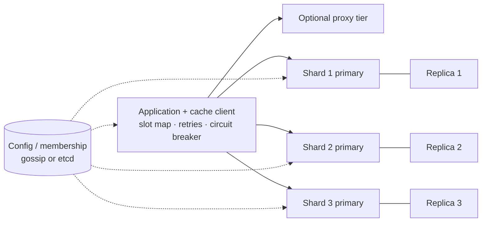

# 🧠 Design a Distributed Cache — High Level Design

<!-- nav:start -->
🏷️ **Priority:** High · **Difficulty:** Advanced

⬅️ Previous: [Design Key-Value Store](../Key-Value-Store/README.md) · 🏠 [Distributed Infrastructure](../README.md) · ➡️ Next: [Design Top K](../../16-Counting-and-Ranking-Systems/Top-K/README.md)

> 📚 **Credit:** Chapter selection, ordering and question choice follow the [AlgoMaster.io System Design Interviews course](https://algomaster.io/learn/system-design-interviews/course-roadmap). This write-up was created with Claude for personal interview prep. The premium lesson text was **not** accessed or reproduced. See [CREDITS](../../CREDITS.md).
<!-- nav:end -->


> Using Redis is easy; *building* something like it means answering: where does each key live, what
> happens when a node dies, how is memory reclaimed, and how do you survive one key getting a
> million hits per second? (Single-node eviction structures: LLD repo's *LRU Cache* and *LFU Cache*.)

---

## 📑 On this page

1. [Clarifying Requirements](#1-clarifying-requirements) · 2. [Estimation](#2-back-of-the-envelope-estimation) ·
3. [Core APIs](#3-core-apis) · 4. [High-Level Design](#4-high-level-design) · 5. [Database Design](#5-database-design) ·
6. [Deep Dive](#6-design-deep-dive) · 7. [Follow-ups](#7-follow-ups-with-answers)

---

## 1. Clarifying Requirements

| Candidate asks | Interviewer answers | Design impact |
|---|---|---|
| Operations? | get, set (TTL), delete; atomic incr. | Simple KV protocol. |
| Data loss OK? | It's a cache: some loss acceptable. | Async replication. |
| Latency? | < 1 ms server-side. | In-memory, single-threaded loop or sharded threads. |
| Scale? | 2 TB working set, 1M ops/s. | Dozens of shards. |
| Consistency? | Best effort; invalidation by clients. | No cross-shard txns. |
| Multi-tenant? | Yes. | Quotas and isolation. |
| Persistence? | Optional. | Snapshots/AOF as option. |

**Functional:** `GET/SET/DEL`, TTL, eviction when full, atomic counters.
**Non-functional:** sub-ms latency, linear scalability, high availability, hot-key resilience.

---

## 2. Back-of-the-Envelope Estimation

| Quantity | Working | Result |
|---|---|---|
| Working set | given | 2 TB |
| Node capacity | 64 GB RAM, ~75% usable ⇒ 48 GB | **~42 primaries** |
| With replicas (×2) | 42 × 2 | **~84 nodes** |
| Ops per node | 1M ÷ 42 | **~24k ops/s** (well below ~100k limit) |
| Key metadata overhead | ~64 B per key | 2 TB of 1 KB values ⇒ ~2B keys ⇒ ~128 GB overhead |
| Network per node | 24k × 1 KB | ~24 MB/s (fine) |

---

## 3. Core APIs

```text
GET key                       → value | nil
SET key value [EX seconds] [NX|XX]   → OK | nil
DEL key                       → count
INCRBY key n                  → new value (atomic)
EXPIRE key seconds | TTL key
Cluster: CLUSTER SLOTS → slot → node map;  MOVED / ASK redirects
```

Clients are **smart** (cache the slot map, talk straight to the owning node) or go via a proxy.

---

## 4. High-Level Design



### 4.1 Requirement 1: Locate a key
`slot = hash(key) mod 16384` (or consistent-hash ring with virtual nodes); slots map to shards. The
client routes directly. Adding a shard moves slots (~1/N of data).

### 4.2 Requirement 2: Survive failures
Each shard has a replica. Failure detector (heartbeats/gossip with majority agreement) promotes a
replica; clients learn the new map from `MOVED` redirects or the config service.

---

## 5. Database Design

Per-node in-memory structures (the "schema"):

```text
dict:      hash table  key -> entry*                      O(1) lookup, incremental rehash
entry:     { key, value ptr, expire_at, lru_clock/lfu_counter, size }
expires:   heap or hashed timing wheel  (or sampled scan)
lru:       approximated LRU (sample N keys) or intrusive doubly linked list
memory:    slab/size-class allocator to limit fragmentation
persist:   optional snapshot (RDB) + append-only log (AOF)
```

---

## 6. Design Deep Dive

### 6.1 Partitioning schemes

| Scheme | Rebalance | Notes |
|---|---|---|
| `hash % N` | Remaps almost everything | Avoid |
| **Consistent hashing + vnodes** | Moves ~1/N | Client-side friendly |
| **Fixed slots (16384)** | Move slots between nodes | Explicit, easy to reason about |
| Proxy-based | Centralised routing | Extra hop, simpler clients |

See [consistent hashing](../../03-Concept-Deep-Dives/05-Distributed-Systems/04-consistent-hashing.md).

### 6.2 Eviction and expiry
- **LRU**: hash map + doubly linked list ⇒ O(1) get/put/evict; production systems use *approximate*
  LRU (sample 5 random keys, evict the oldest) to avoid list maintenance overhead.
- **LFU**: frequency counter with decay handles scan-resistant workloads.
- **TTL expiry**: *lazy* (check on access) plus *active* (periodically sample keys with TTL and
  delete expired) so memory of never-read keys is reclaimed.
- `maxmemory` + policy (`allkeys-lru`, `volatile-ttl`, `noeviction`).

### 6.3 Replication and failover
Async primary → replica streaming (replication buffer); replica promotion by majority of
sentinels/masters; writes acknowledged by the primary alone may be lost on failover: acceptable for
a cache. Optional `WAIT` for stronger guarantees.

### 6.4 Hot keys
Detect (sampling, per-key counters, proxy stats). Mitigate with a **client-side local cache** (tiny
TTL), replicating the key to several shards (`key#1..N`, read a random one), and request coalescing
so one miss refills for all waiters.

### 6.5 Concurrency model
Single-threaded event loop per node: no locks, atomic commands, predictable latency (I/O threads for
network parsing). Scale by running more shards per machine (one per core).

### 6.6 Multi-tenancy and safety
Namespaces/prefixes, per-tenant memory quotas and rate limits, ACLs, TLS, big-key and slow-command
guards (block `KEYS *`), monitoring hit ratio and evictions per tenant.

---

## 7. Follow-ups (with answers)

### 7.1 How do you implement an LRU cache in O(1)?
A hash map from key → node plus a doubly linked list ordered by recency: `get` moves the node to the
head; `put` inserts at head and evicts the tail when over capacity. Both operations are O(1).

### 7.2 What happens when you add a node?
Slots (or ring ranges) move to the new node; keys migrate in the background (`ASK` redirects during
migration). The new node starts cold ⇒ extra misses; throttle DB fallbacks and warm gradually.

### 7.3 How do you prevent a cache stampede after a shard failure?
Replicas take over quickly; clients use single-flight and jittered TTL; the DB has a rate limiter or
circuit breaker; consider stale-while-revalidate for critical keys.

### 7.4 How do you keep cache and DB consistent?
Cache-aside with invalidation on write and TTL as a backstop; for stricter needs, CDC-driven
invalidation or versioned keys. Fully strong consistency requires giving up the cache benefits.

### 7.5 Should the cache be replicated across regions?
Usually no: each region has its own cache and warms from local DB replicas; propagate
*invalidations* (small messages) cross-region instead of data.

### 7.6 How do you support atomic multi-key operations?
Only within one shard/slot: use hash tags (`{user42}:cart`, `{user42}:profile`) so related keys
co-locate. Cross-shard atomicity isn't provided (use application logic or a DB).

### 7.7 How do you choose value sizes and serialisation?
Keep values small (< ~100 KB), use compact binary formats, compress large ones, and store big blobs
in object storage with a pointer in the cache.

---

## 🧪 Practice Round

<details><summary>1. Why approximate LRU?</summary>
Maintaining exact recency on every read costs CPU and memory; sampling a few keys evicts near-oldest
items at a fraction of the cost.
</details>

<details><summary>2. Why not `hash(key) % N` for shard selection?</summary>
Changing N remaps nearly all keys ⇒ a cold-cache storm.
</details>

---

## 📝 Last-Minute Revision

- ~42 primaries for 2 TB; **slots or consistent hashing** with smart clients.
- Eviction: (approx.) LRU/LFU; expiry lazy + active sampling; async replication + failover.
- Hot keys: local cache, replicate key, coalesce. Multi-key ops via hash tags.
- Concepts: [caching](../../03-Concept-Deep-Dives/02-caching.md) ·
  [consistent hashing](../../03-Concept-Deep-Dives/05-Distributed-Systems/04-consistent-hashing.md) ·
  [Redis](../../04-Technology-Deep-Dives/03-redis.md) ·
  [replication](../../03-Concept-Deep-Dives/05-Distributed-Systems/01-replication.md)

---

## 📚 References & Credits

| Resource | Use |
|---|---|
| [Redis documentation — Cluster spec, eviction](https://redis.io/docs/) | Public reference |
| Memcached documentation | Public reference |

Original work; personal learning project, not affiliated with AlgoMaster.io.
