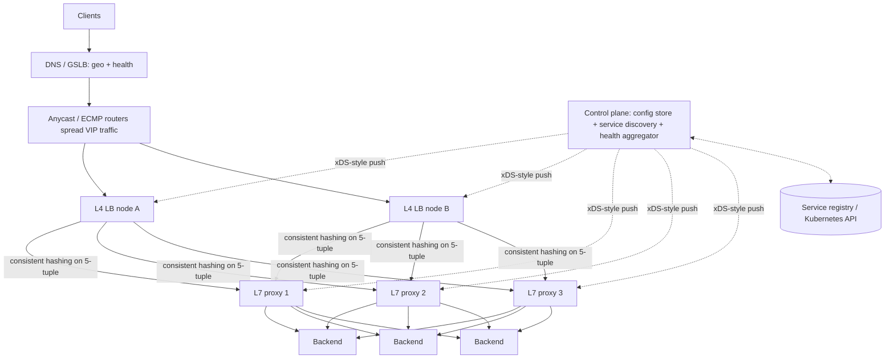

# ⚖️ Design a Load Balancer — High Level Design

<!-- nav:start -->
🏷️ **Priority:** High · **Difficulty:** Intermediate

⬅️ Previous: [Design Stock Exchange](../../14-Payment-and-Financial-Systems/Stock-Exchange/README.md) · 🏠 [Distributed Infrastructure](../README.md) · ➡️ Next: [Design API Gateway](../API-Gateway/README.md)

> 📚 **Credit:** Chapter selection, ordering and question choice follow the [AlgoMaster.io System Design Interviews course](https://algomaster.io/learn/system-design-interviews/course-roadmap). This write-up was created with Claude for personal interview prep. The premium lesson text was **not** accessed or reproduced. See [CREDITS](../../CREDITS.md).
<!-- nav:end -->

> A load balancer (LB) is the front door of nearly every system. Designing one means deciding **what layer it works at, how it picks a
> backend, how it knows backends are healthy, and how the LB itself avoids being the single point of failure**.

## 1. Clarifying Requirements

| Candidate asks | Interviewer answers | Design impact |
|---|---|---|
| Layer? | Both L4 (TCP) and L7 (HTTP). | Two data-path modes. |
| Scale? | 10M requests/s, 100 Gbps, 1M concurrent connections per region. | Horizontally scaled LB tier. |
| Features? | Algorithms, health checks, TLS termination, sticky sessions, draining. | Feature list. |
| Availability? | No single point of failure; 99.99%. | Active-active + anycast/ECMP. |
| Backends? | Dynamic (autoscaling, deploys). | Service discovery. |
| Latency overhead? | < 1 ms (L4), < 5 ms (L7). | Efficient data path. |
| Multi-region? | Global LB above regional LBs. | GSLB. |

**Functional:** distribute traffic across healthy backends, health checks, TLS termination, session persistence, rate limiting/circuit breaking (basic), connection draining, metrics.
**Non-functional:** very high throughput, low latency, high availability, dynamic config without dropping connections, secure.

## 2. Back-of-the-Envelope Estimation

| Quantity | Working | Result |
|---|---|---|
| L7 capacity per node | Nginx/Envoy ~ 50–100k req/s per core-ish; 100k–500k req/s per node (TLS heavy less) | 10M rps ⇒ **~40–100 L7 nodes** |
| L4 capacity per node | Kernel-bypass/eBPF/DPDK: 10–40 Gbps, millions pps | 100 Gbps ⇒ 3–10 L4 nodes |
| Connections | 1M concurrent × ~10 KB kernel state | 10 GB memory across nodes |
| Health checks | 10k backends × 2 probes/s × N LB nodes | must be distributed/aggregated |
| Config updates | Backends change every second at scale | Push-based control plane |

## 3. Core APIs

```text
Data plane:  client ⇄ VIP:443 ⇄ backend (TCP/HTTP proxying)
Control plane (config API):
  POST /v1/pools {name, algorithm, health_check{path,interval,timeout,thresholds}, members[]}
  PUT  /v1/pools/{id}/members {add|remove|drain, backend}
  POST /v1/listeners {port, protocol, tls_cert, routes[{host,path,pool}]}
  GET  /v1/pools/{id}/health · metrics (Prometheus)
```

## 4. High-Level Design



### 4.1 Two-tier design
**Tier 1 (L4)**: stateless (or lightly stateful) packet/connection forwarding at very high pps using **ECMP + consistent hashing** so any L4 node sends a given flow to the same L7 node.
**Tier 2 (L7)**: full HTTP proxies terminating TLS, routing by host/path/header, retrying, and balancing to backends. L4 nodes absorb DDoS floods and scale independently.

### 4.2 Request flow (L7)
Client → VIP → L4 node → chosen L7 proxy → parse request → route to pool → pick backend (algorithm + health) → forward (connection reuse) → stream response back. Metrics/logs recorded.

## 5. Database Design

Mostly configuration and ephemeral state:

```text
config store (etcd/Consul/DB, versioned): listeners, routes, pools, certificates (encrypted), policies
runtime state (in memory per node): backend health, connection counts, EWMA latency, circuit-breaker state, connection table
service registry: service → instances{ip, port, zone, weight, metadata}
metrics/log pipeline: Prometheus/TSDB, access logs → Kafka → analytics
certificate store: KMS-backed secrets, automated renewal (ACME)
```

## 6. Design Deep Dive

### 6.1 Balancing algorithms
| Algorithm | Pros | Cons |
|---|---|---|
| Round robin / weighted RR | Simple | Ignores load differences |
| **Least connections / least request** | Adapts to uneven request cost | Needs connection counters |
| **Power of two choices** (pick 2 random, choose less loaded) | Near-optimal, cheap, avoids herding | Approximate |
| **EWMA latency (peak EWMA)** | Prefers faster backends | Sensitive to noise |
| IP/consistent hash | Affinity (cache locality) | Skew; hot keys |
| Maglev hashing | Consistent, minimal disruption on changes, fast lookups | Table build cost |
Weights adapt for heterogeneous capacity and slow-start for new backends.

### 6.2 Health checking
- **Active**: periodic TCP/HTTP probes with intervals, timeouts, healthy/unhealthy thresholds (avoid flapping).
- **Passive (outlier detection)**: eject backends after consecutive 5xx/timeouts; re-admit gradually.
- Distributed checking: a shared health service reduces N×M probe load; LB nodes subscribe to health state. Distinguish liveness vs readiness. Panic mode: if too many backends
  look unhealthy, ignore health to avoid total blackout.

### 6.3 High availability of the LB tier
Multiple L4/L7 nodes behind anycast/ECMP or DNS; health-checked at the router level; **connection state** kept minimal (consistent hashing makes any node compute the same choice); rolling upgrades with
connection draining; N+1 capacity across AZs. Cloud LBs (ELB/NLB/Maglev/Katran) follow this pattern.

### 6.4 L4 vs L7 trade-offs
L4: sees only IP/port, no TLS termination (or TLS passthrough), very fast, protocol-agnostic. L7: content-aware routing, TLS termination, HTTP/2/3, retries, canary/weighted routing, header manipulation,
WAF hooks; costs more CPU. Use L4 in front for scale and L7 behind for features.

### 6.5 Session persistence and connection management
Sticky by cookie/IP hash when needed (prefer stateless backends). Keep-alive pools to backends; HTTP/2 multiplexing; connection draining on removal (finish in-flight, stop new); timeouts (idle, request);
retry only idempotent requests with budgets; circuit breaker per backend.

### 6.6 Dynamic configuration
Push config via streaming APIs (Envoy xDS-style): incremental updates, versioning, ACK/NACK, atomic swap so in-flight requests are unaffected. Backends join/leave via service discovery; graceful shutdown handshake.

### 6.7 Global load balancing
GeoDNS/latency-based routing/anycast to the nearest healthy region; region failover via health checks and weights; consider DNS TTL and resolver behaviour; regional overload shedding to other regions.

### 6.8 Security and observability
TLS termination with modern ciphers, OCSP stapling, automated cert rotation; DDoS protections (SYN cookies, rate limits, connection caps); mTLS to backends; per-route metrics (RPS, latency percentiles, error rates),
tracing headers, access logs.

## 7. Follow-ups (with answers)

**7.1 How do you avoid the LB being a single point of failure?** Run many LB nodes active-active behind anycast/ECMP or DNS, with health checks at the network layer, stateless/consistent-hash flow steering, and multi-AZ redundancy.

**7.2 Round robin vs least connections?** RR is fine for uniform short requests; least-connections/least-request wins when request durations vary widely (long-polling, uploads) because it balances *active work*, not request counts.

**7.3 What is Maglev hashing and why use it?** A consistent hashing scheme with a lookup table giving near-uniform load and minimal reshuffling when backends change, enabling stateless L4 nodes that agree on backend choice.

**7.4 How do you deploy a new version with a canary?** Weighted routes (e.g. 1% → new pool), monitor error/latency, gradually increase, automatic rollback on SLO breach; header-based routing for internal testers.

**7.5 How do you handle a slow (not dead) backend?** Latency-aware algorithms (EWMA/least request), outlier ejection on timeouts, hedged requests for idempotent calls, per-backend concurrency limits.

**7.6 How do you scale WebSocket connections?** Least-connections balancing, long idle timeouts, connection-count-aware autoscaling, drain slowly during deploys (send reconnect hints), avoid sticky imbalance. See [Pushing Real-time Updates](../../05-Interview-Patterns/05-pushing-realtime-updates.md).

## 🧪 Practice Round

<details><summary>Why two tiers (L4 then L7)?</summary>
L4 handles massive packet rates cheaply and absorbs floods; L7 does expensive content-aware work on a smaller fleet that can scale independently.
</details>

<details><summary>Why use power-of-two-choices?</summary>
Picking the less loaded of two random candidates gives near-least-loaded balance with O(1) work and avoids the herding that "always pick the global minimum" causes across many LB nodes.
</details>

## 📝 Last-Minute Revision

Anycast/ECMP → **L4 (Maglev/consistent hash)** → **L7 proxies** → backends; algorithms: least-request/P2C/EWMA; active + passive health checks with thresholds and panic mode; control plane pushes config (xDS); draining; slow start; GSLB for regions; TLS termination and DDoS defences.

Related: [Load balancing notes](../../_Reference/load-balancing.md) · [API Gateway](../API-Gateway/README.md) · [Networking](../../03-Concept-Deep-Dives/01-networking.md)
