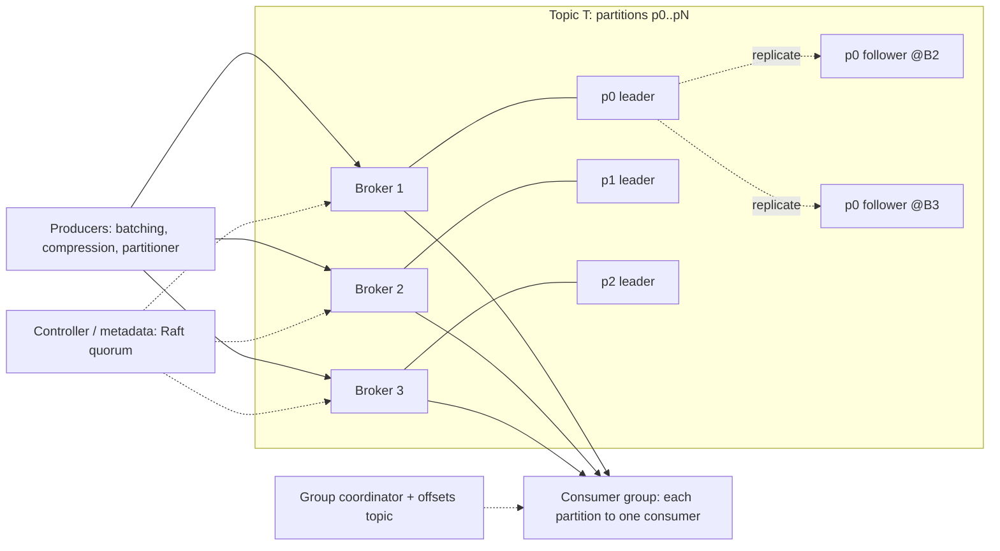

# 📬 Design a Messaging Queue — High Level Design

<!-- nav:start -->
🏷️ **Priority:** Medium · **Difficulty:** Advanced

⬅️ Previous: [Design Object Storage like S3](../Object-Storage-S3/README.md) · 🏠 [Distributed Infrastructure](../README.md) · ➡️ Next: [Design Time Series Database](../Time-Series-Database/README.md)

> 📚 **Credit:** Chapter selection, ordering and question choice follow the [AlgoMaster.io System Design Interviews course](https://algomaster.io/learn/system-design-interviews/course-roadmap). This write-up was created with Claude for personal interview prep. The premium lesson text was **not** accessed or reproduced. See [CREDITS](../../CREDITS.md).
<!-- nav:end -->

> Building "Kafka/SQS/RabbitMQ" from scratch tests whether you understand **logs, partitions, offsets, replication, consumer coordination
> and delivery semantics**. (Single-process LLD version: the LLD repo's *Pub-Sub System*.)

## 1. Clarifying Requirements

| Candidate asks | Interviewer answers | Design impact |
|---|---|---|
| Model? | Topics with multiple producers/consumers; pub/sub and work queues. | Log-based with consumer groups. |
| Throughput? | 1M msgs/s, 1 GB/s aggregate. | Partitioned, batched, sequential I/O. |
| Latency? | p99 < 10 ms end-to-end. | Page cache, batching knobs. |
| Ordering? | Per key/partition. | Partition assignment. |
| Delivery? | At-least-once; exactly-once effects via idempotence. | Offsets + acks. |
| Durability? | No loss of acked messages; survive node failures. | Replication. |
| Retention/replay? | 7 days, replay by offset. | Retained log. |
| Scale-out? | Add brokers without downtime. | Rebalancing. |

**Functional:** create topics/partitions, produce (with key), consume in groups, commit offsets, retention, replay, dead-letter, delay/priority (optional), admin.
**Non-functional:** high throughput, durability, horizontal scalability, ordering per partition, availability, low operational burden.

## 2. Back-of-the-Envelope Estimation

| Quantity | Working | Result |
|---|---|---|
| Ingest | 1M msgs/s × 1 KB | **1 GB/s** in |
| Replication | RF=3 | 3 GB/s written cluster-wide |
| Storage (7 days) | 1 GB/s × 604,800 s × 3 | **~1.8 PB** (compress ~3× ⇒ 600 TB) |
| Brokers | 200 MB/s disk-write each | ~15–30 brokers (incl. headroom) |
| Partitions | 100 MB/s per partition max-ish ⇒ ≥10; choose 100s for consumer parallelism | Thousands overall |
| Consumers | 10 groups × read 1 GB/s | Egress 10 GB/s (page cache serves recent data) |

## 3. Core APIs

```text
Produce(topic, key?, value, headers, acks=all|1|0)      → (partition, offset) | error
Fetch/Poll(topic, group_id, max_bytes, timeout)         → messages[partition, offset, key, value]
Commit(group_id, partition, offset)                      Seek(partition, offset|timestamp)
Admin: CreateTopic(name, partitions, replication_factor, retention), AlterConfig, ListGroups, ReassignPartitions
Client protocol: binary, batched, pipelined over TCP (produce batches, fetch by offset with long-poll)
```

## 4. High-Level Design



### 4.1 Produce path
Producer picks partition (`hash(key) % N` or round robin), batches and compresses messages, sends to the **partition leader**; leader appends to its **log** (sequential write to page cache), followers replicate;
leader acks per `acks` policy (all in-sync replicas for durability). Offsets are assigned monotonically per partition.

### 4.2 Consume path
Consumers in a **group** are assigned disjoint partitions by the group coordinator; each fetches from the partition leader by offset (long poll), processes, and commits offsets. Different groups read independently (fan-out). New members/failures trigger rebalance.

## 5. Database Design

```text
Partition log on disk: directory per (topic, partition) → segment files (e.g. 1 GB): 00000000000000000000.log, .index (sparse offset→position), .timeindex (timestamp→offset)
Record batch: [base offset | length | CRC | attributes | first ts | records... (key, value, headers) — compressed]
Retention: delete whole old segments by time/size; or log compaction (keep latest per key)
Metadata (controller, replicated via Raft): topics, partitions, leader/ISR per partition, broker registry, configs
Offsets: internal compacted topic __consumer_offsets keyed by (group, topic, partition) → offset
Producer state: (producer_id, epoch, sequence) for idempotence/transactions
```

## 6. Design Deep Dive

### 6.1 Why the log is fast
Append-only sequential writes; reads mostly sequential from the **OS page cache** (recent data served from memory); **zero-copy** (`sendfile`) from page cache to socket; batching and compression amortise overhead;
sparse index makes offset lookup O(log n) within a segment. Design principle: let the OS cache do the work; avoid per-message fsync (durability via replication, with periodic flush).

### 6.2 Replication and durability
Each partition has a leader and followers; **ISR (in-sync replica) set** = replicas caught up within a lag threshold. Ack policy: `acks=all` waits for all ISR; `min.insync.replicas=2` ensures ≥2 copies before ack.
Leader failure ⇒ controller elects a new leader from ISR (no acknowledged data lost). Unclean election (out-of-sync replica) trades durability for availability (configurable).
High-water mark: consumers only see messages replicated to all ISR.

### 6.3 Ordering and partitioning
Order guaranteed **within a partition only**. Use keys to route related messages to one partition. Throughput/consumer parallelism scale with partition count (choose ahead; increasing changes key→partition mapping).
Avoid hot partitions with better keys or key salting.

### 6.4 Consumer groups and rebalancing
Coordinator broker tracks group membership via heartbeats; on join/leave/failure, partitions are reassigned (range, round-robin, sticky, cooperative-incremental to reduce stop-the-world). Committed offsets stored durably;
resume from committed offset ⇒ at-least-once if processing happens before commit; at-most-once if commit first. Generation IDs fence zombie consumers (commit rejected).

### 6.5 Delivery semantics and idempotence
- **Idempotent producer**: `(producer_id, epoch, sequence)` lets the broker drop retried duplicates per partition.
- **Transactions**: atomic multi-partition writes + offset commits (read-process-write exactly-once within the system) using a transaction coordinator and two-phase commit markers.
- End-to-end exactly-once *effects* need idempotent consumers/sinks. See [Preventing Duplicate Processing](../../05-Interview-Patterns/10-preventing-duplicate-processing.md).

### 6.6 Queue features on top of a log
Kafka-style logs lack per-message ack/visibility timeouts; to offer SQS/RabbitMQ semantics build: per-message ack with redelivery (visibility timeout tracked in an index), retry topics with delays, **dead-letter topics**,
priority queues (separate topics/queues), delayed delivery (timer wheel/delay topic). Choose model by use: log for streaming/replay, broker-managed queue for task distribution.

### 6.7 Scaling and operations
Add brokers and move partitions (reassignment with throttled replication); rack-aware replica placement; quotas per client; tiered storage (offload old segments to object storage); monitoring: under-replicated partitions, consumer lag,
request latency, disk usage; controller HA (Raft/KRaft). Multi-cluster replication (MirrorMaker) for DR.

### 6.8 Failure scenarios
Broker crash: leaders move within seconds; producers retry with idempotence; consumers rebalance. Network partition: ISR shrinks; `min.insync.replicas` protects durability by rejecting writes when too few replicas are in sync. Disk full: retention/quota
enforcement, backpressure to producers. Poison messages: consumer-side DLQ.

## 7. Follow-ups (with answers)

**7.1 How do you guarantee no message loss?** `acks=all` with `min.insync.replicas ≥ 2`, replication factor ≥ 3, idempotent producer retries, consumers commit after processing, and no unclean leader election.

**7.2 How do you handle a consumer that is slower than the producer?** Consumer lag grows (the log buffers it); scale consumers up to partition count, optimise processing, or add partitions; retention must exceed worst-case lag or data is lost to that consumer.

**7.3 Why can't you have more consumers than partitions in a group?** Each partition is consumed by exactly one member in a group to preserve order; extra consumers idle.

**7.4 How do you implement exactly-once processing?** Idempotent producer + transactions (read-process-write with offsets in the same transaction) inside the system; for external sinks use idempotent writes keyed by message id/offset.

**7.5 How does log compaction work?** A background cleaner keeps only the latest record per key (tombstones delete keys), preserving order of survivors; used for changelogs/state (latest value per key).

**7.6 How would you design delay queues?** Store messages in time-bucketed delay topics/wheels and a scheduler moves due messages to the live topic; or use per-message due time with a min-heap index and a poller.

## 🧪 Practice Round

<details><summary>Why partition a topic?</summary>
To scale write/read throughput and consumer parallelism; order is preserved only within a partition.
</details>

<details><summary>What is the ISR and why does it matter?</summary>
The set of replicas caught up with the leader; acks and leader elections use it to guarantee acknowledged messages are on multiple replicas and never lost on failover.
</details>

## 📝 Last-Minute Revision

Topic → partitions → **append-only segmented logs** (sequential I/O, page cache, zero-copy); leader + ISR replication (`acks=all`, `min.insync.replicas`); consumer groups with committed offsets and rebalancing (generation fencing); idempotent producer + transactions; retention/compaction; controller quorum for metadata; queue features (DLQ/retry/delay) layered on top.

Related: [Kafka](../../04-Technology-Deep-Dives/07-kafka.md) · [Messaging notes](../../_Reference/messaging-and-streaming.md) · [RabbitMQ](../../04-Technology-Deep-Dives/08-rabbitmq.md) · [SQS](../../04-Technology-Deep-Dives/09-sqs.md)
