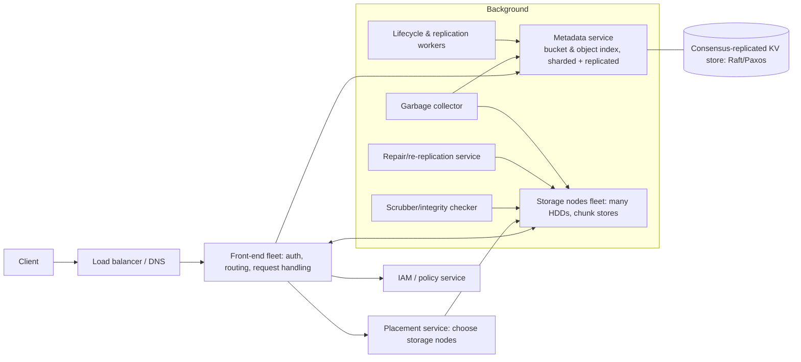

# 🪣 Design Object Storage like S3 — High Level Design

<!-- nav:start -->
🏷️ **Priority:** Medium · **Difficulty:** Advanced

⬅️ Previous: [Design CDN](../CDN/README.md) · 🏠 [Distributed Infrastructure](../README.md) · ➡️ Next: [Design Messaging Queue](../Messaging-Queue/README.md)

> 📚 **Credit:** Chapter selection, ordering and question choice follow the [AlgoMaster.io System Design Interviews course](https://algomaster.io/learn/system-design-interviews/course-roadmap). This write-up was created with Claude for personal interview prep. The premium lesson text was **not** accessed or reproduced. See [CREDITS](../../CREDITS.md).
<!-- nav:end -->

> Object storage looks like `PUT/GET key`, but behind it are **exabytes, eleven nines of durability and millions of requests per second**.
> The design splits cleanly into a **metadata plane** (which bytes belong to which key) and a **data plane** (where the bytes live and how they survive failure).

## 1. Clarifying Requirements

| Candidate asks | Interviewer answers | Design impact |
|---|---|---|
| API? | S3-like: buckets, objects (up to 5 TB), PUT/GET/DELETE/LIST, multipart, versioning. | Flat namespace. |
| Durability? | 11 nines. | Erasure coding + multi-AZ + scrubbing. |
| Availability? | 99.99%. | Replicated metadata + stateless front ends. |
| Scale? | Trillions of objects, exabytes, 10M req/s. | Sharded metadata. |
| Consistency? | Strong read-after-write. | Metadata consensus. |
| Cost? | Cheap per GB, tiers. | Erasure coding, HDD, lifecycle. |
| Other? | Access control, encryption, lifecycle, replication. | Feature services. |

**Functional:** create bucket, PUT/GET (range)/DELETE/LIST object, multipart upload, versioning, ACL/policy, presigned URLs, lifecycle rules, cross-region replication, server-side encryption.
**Non-functional:** extreme durability, scalability, strong consistency for metadata, high throughput for large objects, low cost per byte, availability during failures.

## 2. Back-of-the-Envelope Estimation

| Quantity | Working | Result |
|---|---|---|
| Objects | Target 1 EB logical, avg object 1 MB | **~1 trillion objects** |
| Metadata | 1 T objects × ~500 B | **~500 TB** metadata ⇒ sharded, SSD-backed, replicated |
| Data with EC (e.g. 10+4) | 1 EB × 1.4 | 1.4 EB raw; vs 3× replication = 3 EB |
| Requests | 10M/s | Metadata QPS is the bottleneck for small objects |
| HDD count | 1.4 EB ÷ 20 TB | **~70k drives per EB** ⇒ constant failures (AFR ~1–2% ⇒ ~2–4 disks/hour) |
| Repair bandwidth | Lost 20 TB disk rebuild | Parallel across many nodes |

## 3. Core APIs

```http
PUT    /{bucket}/{key}                 (Content-MD5, x-amz-server-side-encryption)  → 200 ETag
GET    /{bucket}/{key}  [Range: bytes=0-1048575]     HEAD, DELETE
GET    /{bucket}?prefix=photos/&delimiter=/&max-keys=1000&continuation-token=…     (LIST)
POST   /{bucket}/{key}?uploads  → uploadId ; PUT ?partNumber=N&uploadId=… ; POST ?uploadId=… (complete)
PUT    /{bucket}?versioning · lifecycle · replication · policy
Presigned URL: /{bucket}/{key}?X-Sig=..&Expires=..
```

## 4. High-Level Design



### 4.1 PUT path
Front end authenticates/authorises; streams the object into **chunks/stripes**; placement service picks storage nodes across failure domains (AZ/rack); data is **erasure coded** (e.g. 10 data + 4 parity shards)
and written in parallel with checksums; once a quorum of shards is durable, front end **commits metadata** `(bucket,key,version) → shard locations, size, ETag, checksums` atomically; then acks the client.
Strong read-after-write consistency comes from the metadata commit as the linearisation point.

### 4.2 GET path
Look up metadata (location map), fetch data shards in parallel (any k of n needed), verify checksums, reconstruct if some shards missing, stream to client; range reads fetch only needed stripes; presigned URLs verified at front end.

## 5. Database Design

```text
Bucket metadata:  bucket_name PK → owner, region, versioning, policy, lifecycle, encryption
Object metadata:  PK (bucket, key, version_id) → size, etag, content_type, user_metadata, storage_class, created_at,
                  data_ref {chunk/stripe ids → [node, disk, offset, checksum]}, delete_marker, encryption key ref
                  — sorted by key within bucket to support LIST with prefix/delimiter (range scans)
Multipart:        upload_id → parts[(part_no, etag, data_ref)], initiated_at
Storage node:     chunk_id → (disk, offset, length, checksum); local index on SSD; data on HDD (append-only extents)
Placement:        cluster topology (racks/AZs), disk health, capacity, fill levels
```
Metadata store: distributed sorted KV (range-partitioned by (bucket, key)) with each partition replicated via consensus; auto-split hot ranges; caches at front ends.

## 6. Design Deep Dive

### 6.1 Durability engineering
- **Erasure coding (Reed-Solomon)** e.g. 10+4 tolerates any 4 lost shards at 1.4× overhead vs 3× for replication; shards spread over AZs (e.g. across ≥ 3 AZs) so an AZ loss is survivable.
- **Checksums end-to-end** (client MD5/CRC, per-chunk on write/read); background **scrubbing** re-reads data to detect bit rot; corrupted/missing shards are reconstructed by the repair service.
- Prioritise repair by redundancy left (objects with fewest healthy shards first); throttled to avoid impacting foreground traffic.
- Compute durability: with disk AFR, repair time and n-k tolerance, annualised loss probability ≈ 10^-11.
- Small objects: replicate or pack many small objects into larger extents (EC overhead and metadata cost); hot small-object tiering.

### 6.2 Metadata scaling and LIST
Metadata is the scaling bottleneck. Partition by key range with automatic splits; keep keys sorted for prefix/delimiter LIST via range scans; paginate with continuation tokens;
avoid hot partitions from sequential keys (e.g. timestamps): recommend randomised/hashed prefixes or automatically split partitions by load. Strong consistency via Raft per partition.
Caching of bucket policies and hot metadata at front ends with invalidation.

### 6.3 Data placement and storage nodes
Placement spreads shards across racks/AZs and balances capacity/load, considering disk health and future growth; storage nodes use log-structured extents (append-only, large sequential writes), an SSD metadata index,
and periodic compaction/GC for deleted data. Hot-spot mitigation via replicas/caching for extremely popular objects.

### 6.4 Multipart upload and large objects
Client splits into parts (5 MB–5 GB), uploads in parallel (each part stored independently with its ETag), then completes: metadata service atomically assembles the manifest (no data copy). Abort/cleanup of incomplete uploads by lifecycle GC.
Range GET works per part/stripe.

### 6.5 Versioning, deletes and garbage collection
Versioning keeps all versions with `version_id`; delete inserts a **delete marker**. Actual space is reclaimed by **GC**: mark unreferenced chunks (reference tracking) then delete after a safety delay; handle races between
in-flight writes and GC via epochs/leases. Lifecycle rules transition storage classes or expire objects.

### 6.6 Security and access control
IAM identities, bucket policies, ACLs, presigned URLs (HMAC of method/path/expiry with secret), server-side encryption (SSE-S3 with per-object data keys wrapped by master keys; SSE-KMS auditing), TLS in transit, VPC endpoints,
block-public-access controls, access logging, Object Lock (WORM).

### 6.7 Replication and multi-region
Cross-region replication: change stream from metadata (versions) → replication workers copy objects asynchronously with retries and integrity checks; eventual consistency across regions; conflict handling via version IDs/last-writer.

### 6.8 Operations and cost
Storage classes (hot SSD/HDD, infrequent, archive on tape/deep HDD), capacity management (fill levels, rebalancing), hardware failure as routine (automation for replacing disks), rolling software upgrades, per-tenant throttling and request-rate partitioning.

## 7. Follow-ups (with answers)

**7.1 Why erasure coding instead of 3× replication?** ~1.4× storage overhead for similar or better durability, cutting cost ~50%; trade-offs: more CPU, higher read latency for degraded reads, more complex repair, and inefficiency for tiny objects.

**7.2 How do you provide strong read-after-write consistency?** The metadata commit is a linearisable operation (consensus-replicated); reads consult metadata (not stale caches) or use versioned cache invalidation, so a successful PUT is immediately visible.

**7.3 How do you make LIST fast on billions of keys?** Sorted range-partitioned metadata supports prefix/delimiter scans; results paginated; hot prefixes split by load; optional secondary indexes (inventory reports) for analytics-style listing.

**7.4 What happens when a disk or rack fails?** Reads reconstruct from remaining shards; the repair service regenerates missing shards onto healthy nodes, prioritising least-redundant objects; capacity and topology maps update automatically.

**7.5 How do you detect silent data corruption?** Checksums verified on every read and by continuous scrubbing; mismatched shards are treated as lost and repaired from parity.

**7.6 How would you implement object versioning without copying data?** Each version has its own metadata row pointing to immutable chunks; a new PUT writes new chunks and a new version row; old versions retained until deleted by lifecycle; GC frees chunks with zero references.

## 🧪 Practice Round

<details><summary>Where is the linearisation point for a PUT?</summary>
The atomic commit of the object's metadata record; before it the object doesn't exist, after it every reader sees the new version.
</details>

<details><summary>Why is metadata often the scaling limit?</summary>
Every request touches metadata and there are many more small objects than large ones; per-request cost is dominated by index lookups and consensus writes, not data transfer.
</details>

## 📝 Last-Minute Revision

Front ends + **metadata plane** (sorted range-partitioned, consensus-replicated) + **data plane** (storage nodes with append-only extents); PUT = stripe → **erasure code across AZs** → checksum → commit metadata (linearisation point); background scrub/repair/GC; multipart = independent parts + manifest; versioning = delete markers; strong consistency from metadata.

Related: [S3](../../04-Technology-Deep-Dives/11-s3.md) · [Key-Value Store](../Key-Value-Store/README.md) · [Google Drive](../../10-Media-Streaming-and-Delivery/Google-Drive/README.md)
