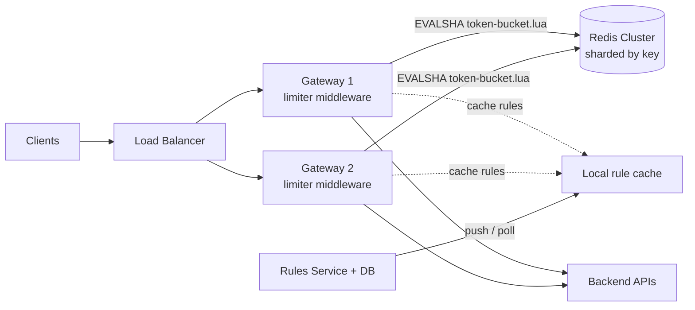

# 🚦 Design a Rate Limiter — High Level Design

<!-- nav:start -->
🏷️ **Priority:** High · **Difficulty:** Intermediate

⬅️ Previous: [Design Payment System](../../14-Payment-and-Financial-Systems/Payment-System/README.md) · 🏠 [Distributed Infrastructure](../README.md) · ➡️ Next: [Design Key-Value Store](../Key-Value-Store/README.md)

> 📚 **Credit:** Chapter selection, ordering and question choice follow the [AlgoMaster.io System Design Interviews course](https://algomaster.io/learn/system-design-interviews/course-roadmap). This write-up was created with Claude for personal interview prep. The premium lesson text was **not** accessed or reproduced. See [CREDITS](../../CREDITS.md).
<!-- nav:end -->


> "Allow 100 requests per minute" is one line of code on one machine. Across 50 gateways, with
> millions of clients, bursts, several rule types and a Redis outage, it becomes a real design
> question. (For the single-process, object-oriented version see the LLD repo's *Rate Limiter*.)

---

## 📑 On this page

1. [Clarifying Requirements](#1-clarifying-requirements)
2. [Back-of-the-Envelope Estimation](#2-back-of-the-envelope-estimation)
3. [Core APIs](#3-core-apis)
4. [High-Level Design](#4-high-level-design)
5. [Database Design](#5-database-design)
6. [Design Deep Dive](#6-design-deep-dive)
7. [Follow-ups (with answers)](#7-follow-ups-with-answers)
8. [Practice Round](#-practice-round) · [Last-Minute Revision](#-last-minute-revision) · [References](#-references--credits)

---

## 1. Clarifying Requirements

| Candidate asks | Interviewer answers | Design impact |
|---|---|---|
| What do we limit by? | User ID, API key, IP, and per endpoint. | Composite limiter key. |
| Where does it run? | In front of all APIs (gateway). | Middleware; must be very fast. |
| Hard or soft limits? | Small overshoot is fine. | Approximate algorithms allowed. |
| Bursts allowed? | Yes, within reason. | Token bucket. |
| Different limits per plan? | Free / Pro / Enterprise. | Rules service, hot reload. |
| If the limiter breaks? | Don't take the API down. | Fail-open policy with fallback. |

**Functional:** configurable rules; reject over-limit with 429 + `Retry-After`; return remaining
quota headers.
**Non-functional:** < 2 ms added latency, highly available, works across many gateways, handles
millions of distinct keys, accurate within a few percent.

---

## 2. Back-of-the-Envelope Estimation

| Quantity | Working | Result |
|---|---|---|
| Gateway traffic | given | **500k req/s** peak |
| Active limiter keys | 10M users × ~1 rule | **~10M keys** |
| State per key (token bucket) | tokens 8B + timestamp 8B + key ~40B + overhead | **~100 B** |
| Memory | 10M × 100 B | **~1 GB** (tiny) |
| Redis ops | 1 atomic script per request | **500k ops/s** ⇒ ~10 shards at ~50k ops/s each |

**Takeaway:** memory is trivial; the challenge is **operation rate and latency**, so shard Redis and
consider local pre-checks.

---

## 3. Core APIs

The limiter is a library/sidecar, not a public API, but two interfaces matter:

```text
check(rule_id, client_id, cost=1) -> { allowed: bool, remaining: int, reset_ms: int }

# HTTP behaviour seen by clients
429 Too Many Requests
Retry-After: 12
X-RateLimit-Limit: 100
X-RateLimit-Remaining: 0
X-RateLimit-Reset: 1735689600

# Admin
PUT /v1/rules/{id}  { "match": {"plan":"free","endpoint":"/search"}, "algo":"token_bucket",
                      "capacity":20, "refill_per_sec":5 }
```

---

## 4. High-Level Design



**Request flow**

1. Middleware derives `key = rule_id:client_id` (client from token, API key or IP).
2. It runs one **atomic Lua script** in Redis: refill by elapsed time, cap, take a token.
3. Allowed → forward. Denied → `429` with headers. Redis timeout → apply the failure policy.

Placing the limiter at the gateway means backends need not implement it and rejected traffic never
reaches them.

---

## 5. Database Design

| Data | Store | Why |
|---|---|---|
| Counters / buckets | Redis (in memory, TTL = 2 × window) | Atomic ops, sub-ms |
| Rules | Relational DB (rare writes) + local cache | Audit, versioning, hot reload |

```text
Redis:  rl:{rule}:{client}  ->  HASH { tokens: 17.4, ts: 1735689600123 }   TTL 120s
Rules:  rules(id, match_json, algo, capacity, refill_rate, window_s, updated_at, version)
```

---

## 6. Design Deep Dive

### 6.1 Algorithm choice

| Algorithm | State | Pros | Cons |
|---|---|---|---|
| Fixed window counter | 1 int | Trivial | Up to **2× burst** at window edge |
| Sliding window log | list of timestamps | Exact | O(limit) memory per key |
| Sliding window counter | 2 ints | Cheap, ~99% accurate | Approximate |
| **Token bucket** | tokens + ts | Allows bursts, tiny, intuitive | Two params to tune |
| Leaky bucket | queue/level | Smooth output | Delays or drops bursts |

Recommendation: **token bucket** for API protection; leaky bucket when shaping outgoing traffic.

```lua
-- KEYS[1]=key  ARGV: capacity, refill_per_ms, now_ms, cost
local d = redis.call('HMGET', KEYS[1], 'tokens', 'ts')
local tokens = tonumber(d[1]) or tonumber(ARGV[1]); local ts = tonumber(d[2]) or tonumber(ARGV[3])
tokens = math.min(tonumber(ARGV[1]), tokens + (tonumber(ARGV[3]) - ts) * tonumber(ARGV[2]))
local ok = tokens >= tonumber(ARGV[4])
if ok then tokens = tokens - tonumber(ARGV[4]) end
redis.call('HSET', KEYS[1], 'tokens', tokens, 'ts', ARGV[3]); redis.call('PEXPIRE', KEYS[1], 120000)
return { ok and 1 or 0, math.floor(tokens) }
```

Use Redis server time (`TIME`) inside the script if gateway clocks drift.

### 6.2 Atomicity across gateways

`GET` then `SET` from two gateways loses updates. A single Lua script (or `INCR` for counters) runs
atomically on the shard that owns the key. Keys are hashed to shards, so all gateways for one client
hit the same shard.

### 6.3 Latency: local pre-check + batching

Every request paying a Redis round trip (~0.5 ms) is acceptable but adds up. Optimisations: pooled
keep-alive connections, colocated Redis, and a **two-tier limiter**: each gateway holds a local
token allowance (e.g. 10% of the client's limit) and asks Redis for more in chunks. Trade: better
latency, a bit less accuracy.

### 6.4 Failure policy

| Policy | When | Behaviour |
|---|---|---|
| **Fail open** | Public APIs, availability first | Allow; use a coarse local per-node limit as backstop |
| **Fail closed** | Login / OTP / payments (abuse-critical) | Reject or apply strict local limit |

Circuit-break the Redis client so a slow Redis does not add timeouts to every request.

### 6.5 Rules, tiers and cost

Rules live in a DB, versioned, pushed to gateways (or polled every few seconds). Support **weighted
cost** (heavy endpoints cost 5 tokens) and layered limits (per second + per day + per IP).

---

## 7. Follow-ups (with answers)

### 7.1 How do you rate-limit across multiple regions?
Options: (a) **per-region budgets**: split the global limit (e.g. 40/30/30) and enforce locally;
simple, slight unfairness. (b) **async global counters**: regions periodically sync usage; allows
overshoot bounded by sync interval. (c) route each client to a home region. Choose (a) unless limits
are contractual.

### 7.2 How do you handle a hot client hammering one Redis shard?
The abusive key is the hot key. Add a local first-level limiter at each gateway so most rejected
traffic never reaches Redis; optionally block the client at the edge/WAF for a cool-down.

### 7.3 How do you avoid retry storms after a 429?
Return `Retry-After`, document exponential backoff with jitter, and prefer shedding at the edge.
Clients that ignore it can be escalated (temporary ban).

### 7.4 Sliding window log vs counter: what would you pick?
Counter: memory is constant per key (two integers), and error is small. Use the log only when exact
enforcement is contractually required and limits are small.

### 7.5 How do you limit concurrent requests, not rate?
Use a semaphore counter: `INCR` on start, `DECR` on finish (with TTL safety for crashes). This
protects expensive endpoints regardless of rate.

### 7.6 How do you test and monitor it?
Shadow mode (log would-be rejections before enforcing), dashboards for rejection rate per rule, top
limited keys, limiter latency and Redis saturation; load tests for boundary behaviour.

---

## 🧪 Practice Round

<details><summary>1. Why does fixed window allow twice the limit?</summary>
A client can send the full quota at the end of window N and again at the start of N+1, so 2× in a
short interval. Sliding window counter weights the previous window to smooth this.
</details>

<details><summary>2. Redis fails over and loses recent counters. Impact?</summary>
Clients briefly get extra quota. Acceptable for most APIs; not for security limits (use stricter
local limits or persistence).
</details>

---

## 📝 Last-Minute Revision

- Token bucket + Redis Lua = atomic, bursty, cheap. Shard by key.
- Bottleneck is **ops/s and latency**, not memory (~1 GB for 10M keys).
- Decide **fail-open vs fail-closed** per use case, out loud.
- Local pre-limit trades accuracy for latency; per-region budgets for multi-region.
- Concepts: [rate limiting](../../_Reference/rate-limiting.md) ·
  [Redis](../../04-Technology-Deep-Dives/03-redis.md) ·
  [resilience](../../05-Interview-Patterns/09-surviving-component-failures.md)

---

## 📚 References & Credits

| Resource | Use |
|---|---|
| [Redis docs — Lua scripting](https://redis.io/docs/latest/develop/interact/programmability/eval-intro/) | Atomic script semantics |
| [IETF RateLimit header drafts](https://datatracker.ietf.org/doc/draft-ietf-httpapi-ratelimit-headers/) | Header conventions |
| [Mermaid](https://mermaid.js.org/) | Diagrams |

Original work; personal learning project, not affiliated with AlgoMaster.io.
