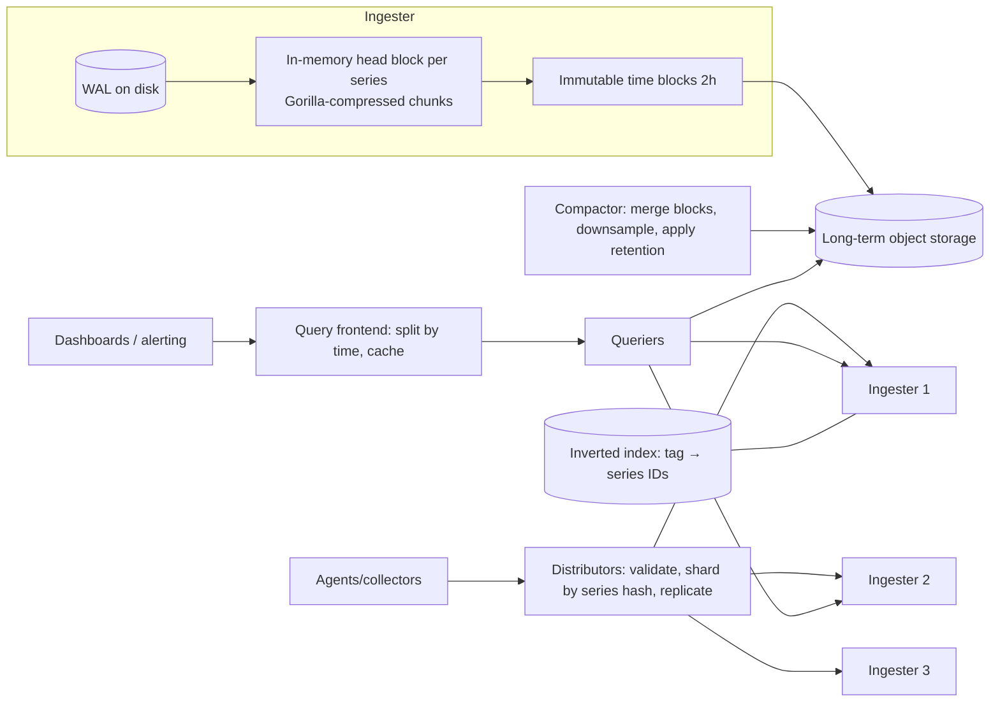

# ⏱️ Design a Time Series Database — High Level Design

<!-- nav:start -->
🏷️ **Priority:** Low · **Difficulty:** Advanced

⬅️ Previous: [Design Messaging Queue](../Messaging-Queue/README.md) · 🏠 [Distributed Infrastructure](../README.md) · ➡️ Next: [Design Locking Service](../Locking-Service/README.md)

> 📚 **Credit:** Chapter selection, ordering and question choice follow the [AlgoMaster.io System Design Interviews course](https://algomaster.io/learn/system-design-interviews/course-roadmap). This write-up was created with Claude for personal interview prep. The premium lesson text was **not** accessed or reproduced. See [CREDITS](../../CREDITS.md).
<!-- nav:end -->

> Metrics, IoT and financial ticks share a shape: **append-mostly writes of (series, timestamp, value)**, queried by time range and tags.
> A TSDB exploits that shape with time-partitioned storage, aggressive compression and rollups.

## 1. Clarifying Requirements

| Candidate asks | Interviewer answers | Design impact |
|---|---|---|
| Data? | Numeric samples with labels/tags (host, region, metric). | Series identity. |
| Ingest? | 10M samples/s, out-of-order tolerated within minutes. | Write path design. |
| Queries? | Range scans, aggregations (avg, p99, rate), group by tags, downsampled long ranges. | Index + rollups. |
| Retention? | 15 days raw, 1 year downsampled. | Tiers/TTL. |
| Latency? | Dashboard queries < 1 s over recent data. | Recent data in memory. |
| Durability? | Don't lose acknowledged writes. | WAL + replication. |
| Cardinality? | 100M active series. | Index scaling. |

**Functional:** write samples, query ranges with aggregation/filters, downsampling, retention, multi-tenancy, alert evaluation support.
**Non-functional:** very high write throughput, efficient storage, fast recent-range queries, horizontal scalability, high availability.

## 2. Back-of-the-Envelope Estimation

| Quantity | Working | Result |
|---|---|---|
| Ingest | 10M samples/s | 864B samples/day |
| Raw size | 16 B/sample (8 B ts + 8 B value) | **13.8 TB/day** raw |
| Compressed | Gorilla-style ~1.4 B/sample | **~1.2 TB/day** (10×+) |
| 15-day raw retention | 1.2 TB × 15 | ~18 TB (replicated ×3 = 54 TB) |
| Series | 100M active | Index in memory ~ 100M × 200 B = 20 GB per replica set (shard it) |
| Query fan-out | 5k dashboards/30 s | ~170 qps, each scanning a few thousand series |

## 3. Core APIs

```text
Write:  POST /v1/write  [ {metric:"cpu", tags:{host:"a1",dc:"eu"}, ts: 1735689600000, value: 0.73}, ... ]   (batched, snappy/gzip)
Query:  GET /v1/query?expr=avg by(dc)(rate(cpu{env="prod"}[5m]))&start=..&end=..&step=60
        or SQL-like: SELECT mean(value) FROM cpu WHERE dc='eu' AND time > now()-1h GROUP BY time(1m), host
Admin:  retention policies, downsampling rules, series delete, cardinality stats
```

## 4. High-Level Design



### 4.1 Write path
Distributor hashes the series identity `(metric + sorted tags)` to choose ingesters (replication factor 3), fan-out writes; each ingester appends to a **WAL** (durability), then updates the **head block** (in-memory
compressed chunks per series). Every ~2 hours the head is cut into an immutable **block** (chunks + index) and uploaded to object storage.

### 4.2 Read path
Query frontend splits long ranges into sub-queries by time, uses a results cache; queriers resolve label matchers via the **inverted index** to series IDs, read chunks from ingesters (recent) and blocks in object storage (older),
decode, aggregate (rate, avg, quantiles) and merge.

## 5. Database Design

```text
Series identity: series_id = hash(metric, sorted(tag_k=tag_v ...)); labels stored once per series
Inverted index:  (tag_key=tag_value) → sorted list of series_ids (roaring bitmaps / delta encoded); intersect for multi-tag filters
Chunk (per series, ~120 samples): timestamps delta-of-delta encoded; values XOR-with-previous (Gorilla) → ~1–2 bytes/sample
Block (time window, e.g. 2h):  chunks + index + metadata (min/max time, series count), immutable, checksummed
WAL: sequential log of samples/series creation for crash recovery; truncated after block cut
Downsampled blocks: (series, 5m/1h buckets) → min, max, sum, count (mergeable aggregates); histograms as sketches
Retention: drop whole blocks older than policy (cheap since time-partitioned)
```

## 6. Design Deep Dive

### 6.1 Compression (why TSDBs are small)
Timestamps arrive at regular intervals: store **delta-of-delta** (mostly 0, encoded in 1 bit). Values change little between samples: **XOR with the previous value**, encode only meaningful bits (leading/trailing zeros).
Gorilla reports ~12× reduction (1.37 B/sample). Columnar per-series chunks make scans of one series sequential.

### 6.2 Storage engine: LSM-like but time-partitioned
Writes go to memory + WAL; data becomes immutable time blocks; compaction merges adjacent blocks (bigger, fewer files, tombstones applied) and downsamples older data. Time partitioning makes **retention O(1)**
(delete whole block) and queries prune by time range using block metadata.

### 6.3 High cardinality
Series count = product of tag value counts. Labels like `user_id`/`request_id` explode memory (the head index) and slow queries. Controls: per-tenant series limits, reject/aggregate offenders, cardinality dashboards, drop high-cardinality tags,
use logs/traces for those dimensions. Index structure: postings lists compressed; shard by series hash so each shard's index fits in memory.

### 6.4 Out-of-order and late data
Accept out-of-order within a window by buffering in the head block (sort on flush) or writing separate small out-of-order chunks merged at compaction; reject/limit samples older than the head's window. Idempotency: same `(series, ts)` overwrite/ignore.

### 6.5 Downsampling and rollups
Precompute aggregates per bucket (min/max/sum/count) so queries over weeks read 1/60th–1/3600th of the data; **mergeable sketches** for percentiles (t-digest/DDSketch/histograms) since averaging percentiles is wrong; continuous queries or compaction-time downsampling;
choose resolution per query range (step-aware).

### 6.6 Replication, sharding and consistency
Shard by series hash (consistent hashing ring) with RF=3; writes need quorum (2/3); reads may consult replicas and dedupe. AP-leaning: prefer availability (a missed sample is tolerable). Query results may differ slightly between replicas; merge by union with dedupe.
Rebalancing by moving series ranges via ring changes.

### 6.7 Query engine
Parse expression → plan → select series via index → fetch chunks → stream-process operators (rate, sum by, histogram_quantile) with bounded memory; parallelise across shards/time splits; push down aggregations to storage nodes when possible;
limits on series/points per query; caching of results and chunks.

### 6.8 Multi-tenancy and cost
Tenant IDs partition data and limits (ingestion rate, series, query cost); per-tenant retention; object-storage tiering (hot recent on SSD, cold in S3) with block-level caching; compaction throttling; monitoring lag between ingest and queryability.

## 7. Follow-ups (with answers)

**7.1 How would you handle 100M active series?** Shard the index and head by series hash across many ingesters, cap per-tenant series, use compressed postings lists, and offload old blocks to object storage so only the active window is in memory.

**7.2 Why not use a relational database for time series?** Row-store B-trees suffer high write amplification and poor compression for append-heavy numeric data; TSDB layouts (time partitions, columnar chunks, delta encodings) give 10–100× better ingest and storage efficiency.

**7.3 How do you compute p99 across many hosts?** Store latency as histograms/sketches (mergeable) and aggregate them before computing the quantile; never average per-host p99s.

**7.4 What happens if an ingester crashes?** Replay its WAL on restart; replicas hold the data meanwhile; queries are served by other replicas; in-flight writes reach quorum via other ingesters.

**7.5 How do you delete data for a specific series/tenant?** Mark tombstones and apply at compaction, or drop whole blocks; for compliance, rewrite affected blocks then delete originals.

**7.6 How do you support long-range queries fast?** Choose downsampled tiers automatically based on range/step, cache subquery results, and parallelise over time splits and shards.

## 🧪 Practice Round

<details><summary>Why is retention cheap in a TSDB?</summary>
Data is partitioned into time blocks; expiry deletes whole blocks/files instead of individual rows.
</details>

<details><summary>What's the biggest operational risk?</summary>
Cardinality explosions: uncontrolled label values blow up index memory and query time; enforce limits and monitor.
</details>

## 📝 Last-Minute Revision

Series = metric + tags; distributor → ingesters (WAL + in-memory head) → immutable **time blocks** → object storage; **Gorilla compression** (delta-of-delta + XOR); inverted tag index; compaction + downsampling (mergeable sketches); retention by dropping blocks; guard **cardinality**; RF=3 quorum writes, AP-leaning.

Related: [Monitoring and Alerting](../../17-Asynchronous-Systems/Monitoring-and-Alerting/README.md) · [Data Structures](../../02-Must-Know-Topics/04-data-structures.md) · [Cassandra](../../04-Technology-Deep-Dives/05-cassandra.md)
