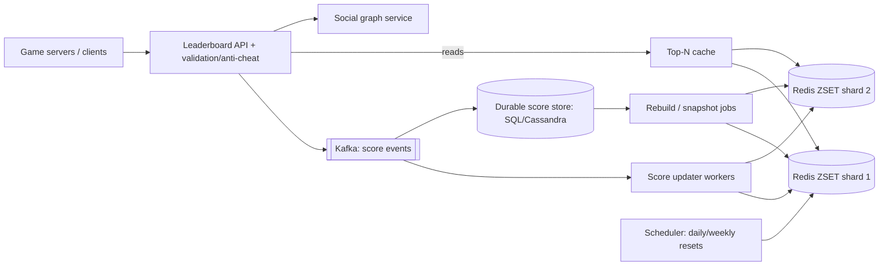

# 🏆 Design a Real-Time Leaderboard — High Level Design

<!-- nav:start -->
🏷️ **Priority:** Medium · **Difficulty:** Intermediate

⬅️ Previous: [Design Likes Counting System](../Likes-Counting-System/README.md) · 🏠 [Counting & Ranking Systems](../README.md) · ➡️ Next: [Design Top K](../Top-K/README.md)

> 📚 **Credit:** Chapter selection, ordering and question choice follow the [AlgoMaster.io System Design Interviews course](https://algomaster.io/learn/system-design-interviews/course-roadmap). This write-up was created with Claude for personal interview prep. The premium lesson text was **not** accessed or reproduced. See [CREDITS](../../CREDITS.md).
<!-- nav:end -->

> Games, contests and apps need to show **top-N and "what is my rank?"** while scores change constantly. The canonical answer is a
> Redis sorted set; the interview is about what happens when it stops fitting on one node.

## 1. Clarifying Requirements

| Candidate asks | Interviewer answers | Design impact |
|---|---|---|
| Scope? | Global leaderboard plus friends/regional, daily/weekly/all-time. | Multiple boards. |
| Users? | 100M players, 5M concurrent, score updates ~50k/s. | Write-heavy. |
| Queries? | Top 100, my rank, neighbours around me (±5), friends' ranks. | Rank queries. |
| Freshness? | Within a second or two. | Near real time. |
| Ties? | Same score ⇒ earlier achiever ranks higher. | Composite score. |
| Accuracy? | Exact for top-K; approximate rank acceptable for the long tail. | Tiered approach. |
| Reset? | Daily/weekly/season resets. | Time-bucketed boards. |

**Functional:** submit/increment score, get top-K, get rank of a user, get users around a rank, friends leaderboard, periodic resets, history.
**Non-functional:** low latency reads (<50 ms), high write throughput, correctness of rank/order, resilience to node failures, scalability to 100M+ players.

## 2. Back-of-the-Envelope Estimation

| Quantity | Working | Result |
|---|---|---|
| Players | 100M | — |
| Sorted set memory | 100M × (member 8–16 B + score 8 B + skiplist overhead ~64 B) | **~10 GB** ⇒ fits one big Redis node (but risky) |
| Update rate | 50k/s | Redis `ZADD` handles ~100k ops/s per node |
| Reads | top-100: 20k/s (cache); rank lookups 30k/s | `ZREVRANK` O(log n) |
| Boards | daily + weekly + all-time + per-region | ×N sorted sets |
| Scale-out threshold | ~200M–1B members or >80k ops/s | shard by score range |

## 3. Core APIs

```http
POST /v1/leaderboards/{lb}/scores   {user_id, score | delta, ts}          → {rank, score}
GET  /v1/leaderboards/{lb}/top?limit=100&offset=0                         → [{rank, user_id, score}]
GET  /v1/leaderboards/{lb}/users/{id}                                     → {rank, score, percentile}
GET  /v1/leaderboards/{lb}/users/{id}/neighbours?range=5                  → users ranked r-5..r+5
GET  /v1/leaderboards/{lb}/friends?user_id=..                             → friends ordered by score
```

## 4. High-Level Design



### 4.1 Update path
Validate the score (server-authoritative; reject cheats), publish event; workers apply `ZADD lb score user` (or `ZINCRBY`) to the correct board(s) (all-time, daily, weekly) and persist to the durable store.
Idempotency by event id / max-score semantics (`ZADD GT` keeps the highest).

### 4.2 Read path
`ZREVRANGE lb 0 99 WITHSCORES` for top-N (cache 1–2 s), `ZREVRANK lb user` for rank (O(log n)), `ZREVRANGE lb r-5 r+5` for neighbours. Friends board: fetch friends' scores with `ZMSCORE` and sort in memory (bounded list).

## 5. Database Design

```text
Redis ZSET  lb:{board}:{period}  member=user_id  score=composite_score      (skip list + hash: O(log n) insert/rank)
   composite score to break ties: score * 2^k + (MAX_TS - achieved_ts)   -- earlier achievers rank higher
Durable store  scores(board, period, user_id) → score, achieved_at, updated_at     (source of truth; rebuild Redis from it)
History        Kafka → lake: every score event for audits/analytics
Metadata       leaderboards(lb_id, type, reset_schedule, sort_order, visibility)
```

## 6. Design Deep Dive

### 6.1 Why a sorted set
Skip list ordered by score with a hash map member→score: `ZADD` O(log n), `ZRANK` O(log n), range by rank O(log n + m). Perfect fit for rank and top-K. A SQL alternative (`ORDER BY score DESC LIMIT`, `COUNT(*) WHERE score > x`)
works for small data but rank queries become O(n) without order-statistic indexes.

### 6.2 Scaling beyond one node
| Approach | How | Trade-off |
|---|---|---|
| **Vertical + replicas** | Big memory node, read replicas for top-N | Simple; single-writer limit |
| **Shard by user_id** | Each shard has a subset; global top-K = merge of shard top-Ks | Rank requires summing counts across shards |
| **Shard by score range** | Partition ranges (e.g. 0–1k, 1k–10k, …): rank = (players in higher ranges) + local rank | Exact rank; needs rebalancing for skew |
| **Approximate rank for the tail** | Histogram/percentile buckets (t-digest) for non-top users | Exact only for top-K, approximate elsewhere |
For **global top-K with user-sharding**: each shard returns its top K; merge K×S candidates (correct because global top-K ⊆ union of shard top-Ks).
For **rank with user-sharding**: sum over shards `ZCOUNT(score > my_score)` (parallel, O(S log n)); cache or use approximate percentile for very large scale.

### 6.3 Ties and ordering
Encode tie-breaker into the score (`score` high bits, inverse timestamp low bits) so equal scores order by who reached it first; keep within double precision (53 bits) or use lexicographic members. Rank = `ZREVRANK + 1`.

### 6.4 Time-windowed boards and resets
Separate ZSET per period (`lb:{board}:2026-W40`, `:daily:2026-10-01`); new events write to current keys; old keys expire (`EXPIRE`) or archive; all-time board persistent. Reset = start using new key (no mass delete).
Season rollover with snapshot for rewards, then archive.

### 6.5 Durability and recovery
Redis is a serving layer, not the only copy: persist scores to a durable store (or rely on the event log); on failure rebuild by replaying from snapshots/log; AOF everysec + replicas reduce loss; replication lag means small loss acceptable if events replay.

### 6.6 Friends/regional boards
Friends: at read time, fetch scores for the friend list (≤ few hundred) using `ZMSCORE` and sort; for large friend lists cap or precompute per-user friend boards via streams. Regional/country boards: separate ZSETs per region updated by the same event (fan-out to k boards).

### 6.7 Hot keys and throughput
The global ZSET is a single hot key; shard as above, batch updates (`pipeline`), coalesce per-user updates within a small window, use `ZADD GT` semantic for best-score boards, and separate write and read paths (top-N cached in a small snapshot updated every 1–2 s).

### 6.8 Anti-cheat and integrity
Server-authoritative scoring, signed events, anomaly detection (impossible scores, velocity), rate limits, moderation removal (`ZREM`) with audit, replays to verify suspicious top entries.

## 7. Follow-ups (with answers)

**7.1 How do you get exact global rank with sharded Redis?** Query each shard for the count of members with a higher score and sum them (`ZCOUNT`), plus local rank within the user's shard; or partition by score ranges so only one shard holds the relevant slice.

**7.2 How would you handle 1B players?** Shard by user or score range across many nodes; keep exact ranks only for the top (e.g. top 1M); use approximate percentiles (buckets/t-digest) for others, showing "top 5%" instead of an exact rank.

**7.3 How do you avoid recomputing top-100 for millions of readers?** Compute once per second (or on change) and cache the JSON; readers hit CDN/cache; only rank-of-me queries touch Redis.

**7.4 What if Redis loses data?** Rebuild from the durable scores table/event log into a new ZSET (bulk load, sorted), switch over; during rebuild serve stale cache.

**7.5 How do you implement a rolling "last 24h" leaderboard?** Use hourly buckets (24 ZSETs) and combine with `ZUNIONSTORE` periodically into a materialised board; or maintain time-decayed scores; avoid per-event expiry of individual scores.

**7.6 How do you support "neighbours around me" cheaply?** `ZREVRANK` to get r then `ZREVRANGE r-5 r+5` (both O(log n)); results cached briefly.

## 🧪 Practice Round

<details><summary>Why is merging shard top-Ks correct?</summary>
Any member of the global top-K must be in the top-K of its own shard, so the union of shard top-Ks contains the global top-K; sort that small union.
</details>

<details><summary>Why does a database `ORDER BY` struggle for rank?</summary>
Rank needs the count of rows with a greater score; without order-statistic structures it is O(n) or requires an index scan for every request.
</details>

## 📝 Last-Minute Revision

Redis **ZSET** (`ZADD`, `ZREVRANK`, `ZREVRANGE`) for O(log n) rank/top-K; composite score for ties; per-period keys for resets; durable store/event log for rebuild; scale via shard-by-user (merge top-Ks, sum `ZCOUNT` for rank) or by score range; approximate ranks for the tail; cache top-N.

Related: [Redis](../../04-Technology-Deep-Dives/03-redis.md) · [Top K](../Top-K/README.md) · [Counting at Scale](../../05-Interview-Patterns/20-counting-at-scale.md)
