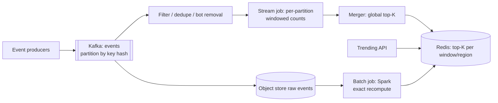

# 📈 Design Trending Topics / Top-K — High Level Design

<!-- nav:start -->
🏷️ **Priority:** Medium · **Difficulty:** Advanced

⬅️ Previous: [Design Real Time Leaderboard](../Real-Time-Leaderboard/README.md) · 🏠 [Counting & Ranking Systems](../README.md) · ➡️ Next: [Design Notification Service](../../17-Asynchronous-Systems/Notification-Service/README.md)

> 📚 **Credit:** Chapter selection, ordering and question choice follow the [AlgoMaster.io System Design Interviews course](https://algomaster.io/learn/system-design-interviews/course-roadmap). This write-up was created with Claude for personal interview prep. The premium lesson text was **not** accessed or reproduced. See [CREDITS](../../CREDITS.md).
<!-- nav:end -->


> "Show the top 10 hashtags right now" needs counting billions of events, forgetting old ones, and
> not melting when one topic goes viral. The trick is accepting *approximate* answers on purpose.

---

## 📑 On this page

1. [Clarifying Requirements](#1-clarifying-requirements) · 2. [Estimation](#2-back-of-the-envelope-estimation) ·
3. [Core APIs](#3-core-apis) · 4. [High-Level Design](#4-high-level-design) · 5. [Database Design](#5-database-design) ·
6. [Deep Dive](#6-design-deep-dive) · 7. [Follow-ups](#7-follow-ups-with-answers)

---

## 1. Clarifying Requirements

| Candidate asks | Interviewer answers | Design impact |
|---|---|---|
| What is counted? | Hashtag mentions / video views / searches. | Generic event key. |
| Windows? | Last 5 min, 1 hour, 24 hours. | Sliding windows. |
| K? | 10 to 100. | Small result set. |
| Accuracy? | Approximate is fine; ordering near the top matters. | Sketches allowed. |
| Freshness? | Within ~1 minute. | Stream processing. |
| Segmentation? | Per country and global. | Key includes region. |
| Abuse? | Ignore bots and spam. | Filtering stage. |

**Functional:** ingest events, return top-K for a window (optionally per region/category).
**Non-functional:** 200k events/s, read latency < 50 ms, freshness ≤ 1 min, bounded memory.

---

## 2. Back-of-the-Envelope Estimation

| Quantity | Working | Result |
|---|---|---|
| Event rate | given | **200k/s**, ~17B/day |
| Raw event storage | 17B × 100 B | **~1.7 TB/day** (keep in cheap storage for batch) |
| Distinct keys | 100M+ | Exact per-key counters are memory heavy |
| Count-Min Sketch | width 2^20 × depth 5 × 4 B | **~20 MB** per window per partition |
| Read QPS | dashboards/clients ~5k/s | Serve from cache, tiny payload |

---

## 3. Core APIs

```http
GET /v1/trending?window=1h&region=IN&category=tech&k=20
→ 200 { "as_of": "2026-09-30T10:04:00Z",
        "items": [ {"key":"#launch","count":184203,"rank":1,"delta":"+340%"}, ... ] }

# Ingestion (internal): events published to Kafka
{ "key": "#launch", "ts": 1735689600123, "region": "IN", "user_id_hash": "..." }
```

---

## 4. High-Level Design



### 4.1 Requirement 1: Counting
Events are partitioned by key so **all events for one key land on the same worker**, making that
worker's count for the key exact. Each worker keeps rolling counts per window and its own local
top-K.

### 4.2 Requirement 2: Serving top-K
A merger combines each worker's local top-K into a global top-K every few seconds (correct because
a key lives on exactly one partition), writes the result to Redis, and the API only reads a small
list.

---

## 5. Database Design

| Data | Store | Shape |
|---|---|---|
| Live window counts | Flink state (RocksDB) | `(key, minute_bucket) -> count` |
| Serving results | Redis | `top:{window}:{region}` → JSON or ZSET, TTL a few minutes |
| History / batch | Object storage (Parquet) + OLAP | Exact recompute, backfill, audits |

```text
Redis ZSET  top:1h:IN   member="#launch"  score=184203
```

---

## 6. Design Deep Dive

### 6.1 Approaches to counting

| Approach | Memory | Accuracy | Notes |
|---|---|---|---|
| Exact hash map + sort | O(distinct keys) | Exact | Fine for < few million keys |
| Redis `ZINCRBY` | O(distinct) | Exact | Hot key + memory limits |
| **Count-Min Sketch + min-heap of K** | Fixed | Overcounts slightly | Heavy hitters in tiny memory; sketches merge |
| Space-Saving / Misra-Gries | O(K/ε) | Bounded error | Deterministic guarantees |

CMS error: with width `w=e/ε` and depth `d=ln(1/δ)`, estimate ≤ true + ε·N with probability 1−δ.

### 6.2 Sliding windows
Keep **one-minute buckets**. A 1-hour window = sum of the last 60 buckets; slide by dropping the
oldest bucket. Longer windows use coarser rollups (5-min, 1-hour buckets). Use **event time** with
watermarks so late events land in the right bucket.

### 6.3 Trending vs popular
Raw counts favour perennial giants ("#music"). Score **velocity**: `current_rate / baseline_rate`
(baseline = same hour over past weeks) or z-score; require a minimum count to avoid noise.

### 6.4 Hot keys
A viral tag overloads its partition. Pre-aggregate locally at producers/first stage (combine
counts per second), or split the key `k#0..#7`, count each, merge before ranking.

### 6.5 Correctness vs freshness (lambda-style)
Stream path gives fast approximate results; a batch job recomputes exactly (hourly/daily) and
overwrites, fixing drift from sketches and late data.

---

## 7. Follow-ups (with answers)

### 7.1 How do you support top-K per country as well as globally?
Add region to the key `(region, key)` and produce both; global = merge of region sketches (CMS are
mergeable by adding tables). More partitions and more Redis keys, but same architecture.

### 7.2 How do you answer arbitrary time ranges ("last 37 minutes")?
Store minute-level rollups (or mergeable sketches per minute) in a time-series/OLAP store; sum the
needed buckets on demand. Cache popular ranges.

### 7.3 How do you filter spam and manipulation?
Dedupe `(user, key)` per window, drop known bots, cap per-user contribution, anomaly detection
(sudden spikes from few accounts), and human-review queue for top trending items.

### 7.4 What is the error of Count-Min Sketch and how do you reduce it?
Overestimates due to collisions. Increase width to reduce error, depth to reduce failure
probability, or use conservative update. Since only the top entries matter, verify candidates with
exact counts in a small side store.

### 7.5 What if the stream processor crashes?
State checkpointed to durable storage with Kafka offsets (exactly-once state semantics in Flink);
on restart, restore checkpoint and replay from offset; idempotent sink writes to Redis.

### 7.6 How do you avoid the API being a bottleneck?
Precomputed, tiny payloads in Redis, CDN cache with a few seconds TTL; the API does no computation.

---

## 🧪 Practice Round

<details><summary>1. Why partition by key?</summary>
So each key's events meet on one worker, making per-key counts exact locally and letting local
top-Ks merge into a correct global top-K.
</details>

<details><summary>2. Why not `SELECT key, COUNT(*) ... ORDER BY 2 DESC LIMIT 10`?</summary>
It scans a huge table repeatedly; cost grows with data, not with K. Streaming keeps incremental state.
</details>

---

## 📝 Last-Minute Revision

- Kafka by key → windowed counts (1-min buckets) → local top-K → merge → Redis → API.
- **Approximate on purpose**: Count-Min Sketch/Space-Saving; batch corrects.
- Trending = **velocity vs baseline**, not raw count. Handle hot keys by splitting.
- Concepts: [messaging](../../_Reference/messaging-and-streaming.md) ·
  [probabilistic structures / stream processing](../../04-Technology-Deep-Dives/12-zookeeper.md) ·
  [hot keys](../../_Reference/fanout-and-hot-keys.md)

---

## 📚 References & Credits

| Resource | Use |
|---|---|
| Cormode & Muthukrishnan, "Count-Min Sketch" | Public error bounds |
| Metwally et al., "Space-Saving" | Public heavy-hitter algorithm |

Original work; personal learning project, not affiliated with AlgoMaster.io.
